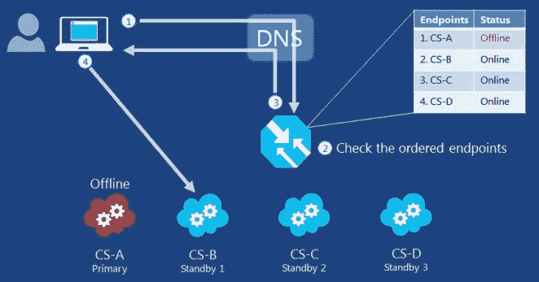

# Azure 流量管理器

> 原文：<https://dev.to/funkysi1701/azure-traffic-manager-3k9k>

我花了一整天的时间来调整我的 Azure 网站。非常有趣！

不幸的是，上周 Azure 出现了一些问题，许多在北欧数据中心运行的网站在几个小时内不可用。你猜对了，我的网站就在这里。

所有的主机提供商都会时不时的停机，这是你必须面对的。在这种时候，最重要的事情是与你的客户沟通，告诉他们正在发生什么，你会尽一切努力恢复服务。

然而，Azure 有一些令人惊讶的功能，你可以配置这些功能来帮助管理停机时间。

Azure 是微软的全球云平台。它确实是全球性的，在北欧、西欧、巴西、日本有数据中心，在亚洲还有两个，在美国有五个。一旦出现问题，一个以上的系统同时瘫痪的可能性极小。如果所有这些都不可用，我预计地球正面临着某种灾难性的事件，而我的网站关闭的事实并不是当务之急。

 为了利用这些多个数据中心，Azure 有一种叫做流量管理器的东西。

Traffic Manager 有各种设置，但我是在故障转移模式下使用的。这意味着如果一个网站关闭了，下一个就会被使用。

你需要做的只是创建一个流量管理器，添加两个或更多的网站(称为端点)并选择一个需要监控的页面，这样 Azure 就知道哪些网站在运行，哪些网站在关闭。

如果您使用 SSL 或自定义域名，您需要执行一些额外的步骤。你的自定义域名需要指向流量经理，而不是个别网站。网站本身有三个域名，流量经理地址、azure 地址和自定义域名。然后，SSL 证书可以分配给您添加到流量管理器中的每个网站。

这很容易，不是吗？现在，如果一个网站关闭，流量经理将使用下一个。在测试这个的时候，几乎立刻就转换到了下一个网站。我确实注意到，如果你有一个浏览器显示网站在问题期间打开，你有时会得到一个错误页面，我认为这可能是由于浏览器缓存，重新打开标签或浏览器修复了这个问题。