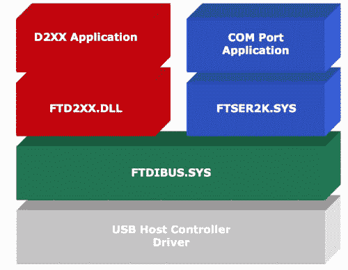
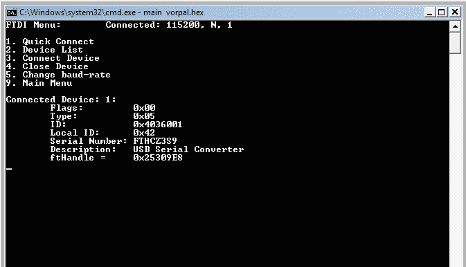

# C 语言中的 FTDI

> 原文::t0【https://dev . to/ladvien/ftd I-in-c-1 厕所】

我的 C 日志的一部分——编写 LPC1114 引导程序

[ ](https://res.cloudinary.com/practicaldev/image/fetch/s--MbcXKRbE--/c_limit%2Cf_auto%2Cfl_progressive%2Cq_auto%2Cw_880/https://ladvien.cimg/GCCLogo.png) 设置 GCC 编译器

我尽可能地设置了一个 C 环境。也许有更简单的方法，但是我想用 GCC 来编译。

要设置环境:

1.  我下载并设置了 [MinGW32](http://www.mingw.org/wiki/HOWTO_Install_the_MinGW_GCC_Compiler_Suite) 。

2.  然后我下载了 [FTD2XX 库](http://www.ftdichip.com/Drivers/D2XX.htm)。**这包括 ftd2xx.h 文件和 ftd2xx.lib** 。

3.  然后我从 Hack-a-Day 的一篇关于用 FTDI 进行位碰撞的文章中窃取了测试代码。

4.  我按照他们的建议修改了代码，按照这个顺序加入了 Windows 兼容性文件:

```
#include <stdio.h> #include <stdarg.h> #include <stdlib.h> #include <windows.h> #include <windef.h> #include <winnt.h> #include <winbase.h> #include <string.h> #include <math.h> #include <stdbool.h> #include <stdint.h> #include "ftd2xx.h" #include <sys/time.h> 
```

<svg width="20px" height="20px" viewBox="0 0 24 24" class="highlight-action crayons-icon highlight-action--fullscreen-on"><title>Enter fullscreen mode</title></svg> <svg width="20px" height="20px" viewBox="0 0 24 24" class="highlight-action crayons-icon highlight-action--fullscreen-off"><title>Exit fullscreen mode</title></svg>

我用这一行来建造它:

**$ gcc-o main main . c-l ./-lft D2 xx**

当您尝试构建时，必须将 ftd2xx.h 和 ftd2xx.lib 放在同一个目录中。

至于剪辑，我真的越来越喜欢崇高的文本 2。

如果你有* *的问题，确保包含你的文件的目录在你的 PATH 环境变量** 中(我在这篇[文章](http://letsmakerobots.com/content/lpc1114-setup-bare-metal-arm)中讲述了如何将目录添加到你的环境变量中)。

**D2XX - FTDI 支持**

在嵌入式领域，FTDI 芯片是极具争议的芯片。我不会就它们的功效展开辩论。我选择了这个特殊的串行器，因为我觉得大多数机器人专家至少会有一个，使使用芯片发布的软件能够到达从业余爱好者到专业人士的更大范围。

此外，支持工具与这个项目的一个设计目标:简单性非常契合。我想让代码尽可能接近机器代码，这样我就可以轻松地编写代码。Bdk6 向我描述 C 是“一种高级汇编语言。”

[T2】](https://res.cloudinary.com/practicaldev/image/fetch/s--JtI6xCSo--/c_limit%2Cf_auto%2Cfl_progressive%2Cq_auto%2Cw_880/https://ladvien.cimg/Screenshot_2015-03-04_00_01_56.png)

FTDI 芯片有两种基本接口

1.  虚拟 COM 端口。
2.  FTD2XX.DLL

我将使用 DLL。这就是我们编译命令的“**-l ./-lft D2 xx”**部分所指的。它包括工作目录中的 ftd2xx 库。

D2XX 库相当漂亮。它提供了一组 C++函数来与 FTDI 芯片交互，从而与任何使用 UART 的东西交互。

命令和 C 代码示例的完整列表可在中找到

*   [D2XX 程序员指南](http://www.ftdichip.com/Support/Documents/ProgramGuides/D2XX_Programmer's_Guide(FT_000071).pdf)

关于我选择使用 D2XX 库而不是使用芯片作为虚拟 COM 端口的原因，最后一个警告。我想尽可能多地控制芯片的金属。最初，我已经开始编写一个下载器，它将使用[已经存在的 Sparkfun FTDI breakout](http://letsmakerobots.com/lpc1114-usb-serial-solution-rerolling-boot-uploader) ，这意味着对 Arduino Pro Mini 和 LilyPad 进行编程，作为我的 LPC1114 板的无需修改的程序员。为了实现这一点，我需要对 FTDI 芯片的所有引脚进行位级控制，**D2XX 有，但 COM 端口没有。**因此，这是使用 D2XX 库的决定性因素。**另外，当我开始的时候，我不知道有什么不同，所以整个解释都是胡扯**。但是，即使我事后意识到这一点，这也是我没有切换到 COM 端口的原因。

[T2】](https://res.cloudinary.com/practicaldev/image/fetch/s--pa_PKIPU--/c_limit%2Cf_auto%2Cfl_progressive%2Cq_auto%2Cw_880/https://ladvien.cimg/FTDI_main_menu.png)

**设置菜单**

我发现使用 D2XX 最简单的方法是设置一个菜单。

*   [命令行菜单](http://letsmakerobots.com/content/command-line-menu)

**你的 _ 代码。C**

我写这篇文章的时候，好像有人正在导入我的 FTDI_HELPER 模块，以便在他们的代码中使用。几个重要的注意事项:首先，我们将使用的变量实际上是在 YOUR_CODE.C 中声明的，它们是全局变量。然后我们在 FTDI_HELPER.H 中将它们重新声明为 **extern** 变量。这告诉编译器它将使用几个全局变量，但它们实际上是在 YOUR_CODE.C 中声明的。这允许 FTDI_HELPER 模块设置 FTDI 设备，但您的代码将能够作用于所有主要变量，如 RxBuffer、ftHandle 等。

```
YOUR_CODE.C

FT_DEVICE_LIST_INFO_NODE *devInfo;
bool FTDI_open_flag;

uint8_t RawRxBuffer[2048];

FT_STATUS ftSvtatus;
DWORD EventDWord;
DWORD TxBytes;
DWORD BytesWritten;
DWORD RxBytes;
DWORD BytesReceived; 
```

<svg width="20px" height="20px" viewBox="0 0 24 24" class="highlight-action crayons-icon highlight-action--fullscreen-on"><title>Enter fullscreen mode</title></svg> <svg width="20px" height="20px" viewBox="0 0 24 24" class="highlight-action crayons-icon highlight-action--fullscreen-off"><title>Exit fullscreen mode</title></svg>

*   3:一个指针变量，将存储所有连接的设备信息。
*   4:每当我们实际连接到 FTDI 设备时设置的标志。这允许您的程序检测连接。
*   7:一个接收缓冲器。当我们收到数据时，它会自动填充。如果需要，您可以调整大小；我认为 FTDI 芯片每次只发送 20 个字节，但我很懒。
*   10:存储 D2XX 命令是否成功的布尔标志的变量。
*   12:用于存储要发送的字节。
*   13: BytesWritten 用于存储 FT_Write 命令实际写入了多少字节。
*   14: RxBytes 存储等待读取的字节数。
*   15:FT _ Read 使用 BytesReceived 来存储已从 RX 缓冲器中读出的字节数。

**FTDI_HELPER。H**

```
FTDI_HELPER.H

#ifndef FTDI_HELPER
#define FTDI_HELPER 
#include <stdio.h> #include <stdarg.h> #include <stdlib.h> #include <windows.h> #include <windef.h> #include <winnt.h> #include <winbase.h> #include <string.h> #include <math.h> #include <stdbool.h> #include <stdint.h> #include "ftd2xx.h" #include <sys/time.h>  
extern uint8_t ParsedRxBuffer[2048];
extern uint8_t RawRxBuffer[2048];

extern FT_HANDLE handle;
extern FT_Status ftStatus;
extern DWORD EventDWord;
extern DWORD TxBytes;
extern DWORD BytesWritten;
extern DWORD RxBytes;
extern DWORD BytesReceived;

int connected_device_num;

// Lists FTDI commands.
void ftdi_menu();

void quick_connect();

// Lists FTDI devices connected.
bool get_device_list();
bool connect_device(int * local_baud_rate);
bool close_device(int * local_baud_rate);
bool reset_device(int * local_baud_rate);
bool set_baud_rate(int * local_baud_rate);
bool set_baud_rate_auto(int * local_baud_rate);

#endif /* FTDI_helper.h */ 
```

<svg width="20px" height="20px" viewBox="0 0 24 24" class="highlight-action crayons-icon highlight-action--fullscreen-on"><title>Enter fullscreen mode</title></svg> <svg width="20px" height="20px" viewBox="0 0 24 24" class="highlight-action crayons-icon highlight-action--fullscreen-off"><title>Exit fullscreen mode</title></svg>

同样，外部变量是为了让编译器知道我们将使用在 YOUR_CODE.C. 中找到的同名变量

**主菜单**

```
FTDI_HELPER.C

void ftdi_menu()
{
    int baud_rate = 0;
    char char_choice[3];
    int int_choice = 0;

    bool got_list = false;
    bool connected_flag = false;
    bool close_device_flag = false;
    bool set_baud_flag = false;

    // FTDI Menu
    do
    {
        system("cls");
        printf("FTDI Menu: ");
        if (connected_flag == true)
        {
            printf("       Connected: %lu, N, 1 \n\n", baud_rate);
        }
        else
        {
            printf("       Not Connected: \n\n");
        }
        printf("1\. Quick Connect\n");
        printf("2\. Device List\n");
        if (got_list == true) // Only display option if devices list.
        {
        printf("3\. Connect Device\n");
        }
        if (connected_flag == true) // Only give display if connected.
        {
        printf("4\. Close Device\n");
        }
        if (connected_flag == true) // Only give display if connected.
        {
        printf("5\. Change baud-rate\n");
        }

        printf("9\. Main Menu\n");

        // If connected, display the connected device info.
        if (connected_flag == true)
        {
            printf("\n");
            printf("Connected Device: %d:\n", connected_device_num);
            printf("    Flags:         0x%02X\n",devInfo[connected_device_num].Flags);
            printf("    Type:          0x%02X\n",devInfo[connected_device_num].Type);
            printf("    ID:            0x%02X\n",devInfo[connected_device_num].ID);
            printf("    Local ID:      0x%02X\n",devInfo[connected_device_num].LocId);
            printf("    Serial Number: %s\n",devInfo[connected_device_num].SerialNumber);
            printf("    Description:   %s\n",devInfo[connected_device_num].Description);
            printf("    ftHandle =     0x%02X\n",devInfo[connected_device_num].ftHandle);
        }

        // Get user choice.
        scanf("%s", char_choice);

        // Convert string to int for switch statement.
        int_choice = atoi(char_choice);

        switch (int_choice)
        {
            case 1:
                quick_connect();
                baud_rate = 115200;
                connected_flag = true;
            case 2:
                got_list = get_device_list();
                break;
            case 3:
                if (got_list == true) // Only display option if devices listed.
                {
                    connected_flag = connect_device(&baud_rate);
                }
                break;
            case 4:
                if (connected_flag == true) // Only give display if connected.
                {
                    close_device_flag = close_device();
                    if(close_device_flag == true){connected_flag = false;}
                    close_device_flag = false;
                }
                break;
            case 5:
                if (connected_flag == true) // Only give display if connected.
                {
                    set_baud_flag = set_baud_rate(&baud_rate);
                    // set_baud_flag is not used, yet.

}
                break;
            case 9:
                main_menu();
                break;
            default:printf("""Bad choice. Hot glue!""");
                break;
        }
    }while(int_choice !=99);
} 
```

<svg width="20px" height="20px" viewBox="0 0 24 24" class="highlight-action crayons-icon highlight-action--fullscreen-on"><title>Enter fullscreen mode</title></svg> <svg width="20px" height="20px" viewBox="0 0 24 24" class="highlight-action crayons-icon highlight-action--fullscreen-off"><title>Exit fullscreen mode</title></svg>

我发现在 C 中设置 FTDI 设备最简单的方法是使用菜单。我提供了五个选项:(1)快速连接，(2)设备列表，(3)连接设备，(4)关闭设备，(5)设置波特率。有几个选项需要先运行其他选项。例如，在显示“连接设备”之前，您必须运行“设备列表”让我们浏览一下代码，

*   5-7:衍生菜单的 scanf 和 switch 语句的变量。
*   9-12:用于控制菜单流程的布尔标志。
*   15:我们想要一个持久的菜单，因此，我们使用 do-while 循环。
*   19-22:让我们显示连接信息，但前提是我们连接了设备。
*   27-42:我们打印菜单的其余部分。某些项目仅在布尔标志设置为 true 时打印。
*   44-56:打印出设备详细信息(如果已连接)。
*   58-64:获取用户输入，将其转换为 int，存储它，然后根据输入选择开关盒。
*   67:函数的作用是:根据默认属性创建一个 FTDI 连接。
*   68:将本地波特率变量设置为 quick_connect()波特率。
*   71:我们运行 get_list()函数，它列出了当前连接到 USB 端口的所有 FTDI 设备。
*   74:在允许用户连接到设备之前，我们检查 get_list()是否已经运行。
*   76: Connect_device()将一个指针指向保存用户选择的波特率值的。然后，它会尝试连接到该设备。如果成功，该函数返回 true。
*   80:仅允许关闭一个设备(如果已连接)。
*   82: Close_device()试图关闭当前连接的 FTDI 设备。如果成功，则返回 true。
*   83-84:如果 close_device()函数成功，则 connected_flag 被设置为 false，以显示没有连接设备。然后，close_device 标志被重置为 false，以准备下一个 close_device()调用。
*   90:set _ baud()将一个指针指向所需波特率的值。该函数尝试设置波特率，如果成功，则返回 true。

快速连接

这个功能是为懒惰的用户准备的。他或她不想选择设备或波特率，他们会简单地选择你的程序给你的。在我的例子中，我编写了快速连接来打开设备“0 ”,并将波特率设置为 115，200。

```
FTDI_HELPER.C

void quick_connect()
{
    int local_baud_rate = 115200;
    // Create the device information list
    ftStatus = FT_CreateDeviceInfoList(&numDevs);
    // get the device information list
    ftStatus = FT_GetDeviceInfoList(devInfo,&numDevs);
    // Open user's selection.
    // Allocate storage for list based on numDevs.
    devInfo =
    (FT_DEVICE_LIST_INFO_NODE*)malloc(sizeof(FT_DEVICE_LIST_INFO_NODE)*numDevs);
    FT_Open(0, &devInfo[0].ftHandle);
    FT_SetBaudRate(devInfo[0].ftHandle, local_baud_rate);
} 
```

<svg width="20px" height="20px" viewBox="0 0 24 24" class="highlight-action crayons-icon highlight-action--fullscreen-on"><title>Enter fullscreen mode</title></svg> <svg width="20px" height="20px" viewBox="0 0 24 24" class="highlight-action crayons-icon highlight-action--fullscreen-off"><title>Exit fullscreen mode</title></svg>

*   5:将波特率放入要设置的变量中。
*   7:我们创建一个设备列表，将它们放在我们的全局 InfoList 变量中。
*   9:我们在创建的设备列表中获取设备信息。
*   12-13:我们为每个枚举的设备上的信息分配足够的空间。
*   14:打开设备列表中“0”处的设备。
*   15:将波特率设置为 115，200。

设备列表

get_device_list()函数是为更谨慎的用户准备的。首先，生成一个 FTDI 设备列表。之后，在一个数组中为每个设备的信息分配足够的空间。最后，收集的设备详细信息放在该列表中。如果生成和存储设备详细信息的过程成功，则该函数返回 true。

```
FTDI_HELPER.C

bool get_device_list()
{
    // Create the device information list.
    ftStatus = FT_CreateDeviceInfoList(&numDevs);

    if (ftStatus == FT_OK) {
        printf("Number of devices is %d\n",numDevs);
    }
    else {
        printf("Failed to get FTDI device list.\n");
    }

    if (numDevs > 0) {

        // Allocate storage for list based on numDevs.
        devInfo =
        (FT_DEVICE_LIST_INFO_NODE*)malloc(sizeof(FT_DEVICE_LIST_INFO_NODE)*numDevs);

        // Get the device information list.
        ftStatus = FT_GetDeviceInfoList(devInfo,&numDevs);
        if (ftStatus == FT_OK) {
                printf("Got Devices\n");
            }
        else
            {
                printf("Failed to get device list.\n");
                Sleep(3000);
            }
            // Set flag if we got at least on device.
            return true;
        }
    return false;
} 
```

<svg width="20px" height="20px" viewBox="0 0 24 24" class="highlight-action crayons-icon highlight-action--fullscreen-on"><title>Enter fullscreen mode</title></svg> <svg width="20px" height="20px" viewBox="0 0 24 24" class="highlight-action crayons-icon highlight-action--fullscreen-off"><title>Exit fullscreen mode</title></svg>

*   6:创建设备列表。
*   8-13:如果创建设备列表的尝试失败，我们会告诉用户。否则，我们列出当前连接的 FTDI 设备的数量。
*   15:如果至少检测到一个设备，我们将继续列出设备。
*   18-19:我们分配足够的内存空间来存储每个连接设备的设备信息。
*   22:我们读取每个设备，获取信息，并将信息分别放入列表中。
*   23-30:如果我们得到了设备信息，我们告诉用户，“我们得到了设备。”否则，我们告诉用户我们失败了。失败，失败，失败！
*   32:由于我们收集了一些设备信息，该函数返回 true。
*   34:如果没有收集到设备信息，该函数返回 false。

从列表中连接设备

一旦 get_device_list()函数运行，我们就可以自由地连接到列出的设备之一。函数的作用是:获取一个指向连接所需波特率值的指针。此函数要求用户输入一个数字 0-8，该数字与从 get_device_list()函数收集的设备相关。然后，connect_device()函数以传递给它的波特率连接到相应的 FTDI 设备。

```
FTDI_HELPER.C

bool connect_device(int * local_baud_rate)
{

    char char_choice[3];
    int int_choice = 0;

    bool connected_flag = false;

    system("cls");
    printf("Which device # (0-8)?\n\n");
    printf("9\. Return\n");

    printf("\n\nConnected FTDI:");
    for (int i = 0; i < numDevs && i < 8; i++) {
        printf("\nDevice: %d:\n",i);
        printf("    Flags:         0x%02X\n",devInfo[i].Flags);
        printf("    Type:          0x%02X\n",devInfo[i].Type);
        printf("    ID:            0x%02X\n",devInfo[i].ID);
        printf("    Local ID:      0x%02X\n",devInfo[i].LocId);
        printf("    Serial Number: %s\n",devInfo[i].SerialNumber);
        printf("    Description:   %s\n",devInfo[i].Description);
        printf("    ftHandle =     0x%02X\n",devInfo[i].ftHandle);
    }

    scanf("%s", char_choice);
    int_choice = atoi(char_choice);

    // Limit list to 9 devices.  Really, who has more connected at once?
    if (int_choice == 9)
    {
        return false;
    }
    else if (int_choice > -1 && int_choice < 9 && int_choice <= numDevs)
    {
        // Open user's selection.
        FT_Open(int_choice, &devInfo[int_choice].ftHandle);

        // Set default baud rate.
        *local_baud_rate = 115200;

        FT_SetBaudRate(devInfo[connected_device_num].ftHandle, *local_baud_rate);

        if (FT_status != FT_OK)
        {
            printf("Could not open FTDI device #%i.\n", int_choice);
            Sleep(3000);
        }
        else
        {
            connected_device_num = int_choice;
            return true;
        }
    }
    else
    {
        return false;
    }
    return false;
} 
```

<svg width="20px" height="20px" viewBox="0 0 24 24" class="highlight-action crayons-icon highlight-action--fullscreen-on"><title>Enter fullscreen mode</title></svg> <svg width="20px" height="20px" viewBox="0 0 24 24" class="highlight-action crayons-icon highlight-action--fullscreen-off"><title>Exit fullscreen mode</title></svg>

*   6-28:显示用户和设备信息。然后，请求用户输入。用户必须输入 0-8，选择才有效。
*   31:如果用户选择选项“9”，我们返回 false，因为没有连接任何设备。
*   35:否则，如果用户选择 0-8，则该函数将尝试我们在前面的函数中生成的列表中的相应设备。
*   38:这里我们实际打开的是用户选择对应的设备。
*   41:我们将默认波特率加载到波特率变量中。
*   43:我们将波特率设置为 115，200。这是默认速度。

关闭装置

```
FTDI_HELPER.C

bool close_device()
{
    FT_Close(devInfo[connected_device_num].ftHandle);

    if (FT_status != FT_OK)
    {
        printf("Could not close FTDI device.\n");
        Sleep(3000);
        return false;
    }
    else
    {
        return true;
    }
    return false;
} 
```

<svg width="20px" height="20px" viewBox="0 0 24 24" class="highlight-action crayons-icon highlight-action--fullscreen-on"><title>Enter fullscreen mode</title></svg> <svg width="20px" height="20px" viewBox="0 0 24 24" class="highlight-action crayons-icon highlight-action--fullscreen-off"><title>Exit fullscreen mode</title></svg>

复位装置

复位功能非常简单。它只是重置连接的 FTDI 设备。重置后，显然必须再次设置波特率。

```
FTDI_HELPER.C

bool reset_device(int * local_baud_rate)
{
    FT_ResetPort(devInfo[connected_device_num].ftHandle);
    Sleep(50);
    FT_SetBaudRate(devInfo[connected_device_num].ftHandle, *local_baud_rate);
    Sleep(50);

    if (FT_status != FT_OK)
    {
        printf("Could not reset FTDI device.\n");
        Sleep(3000);
        return false;
    }
    else
    {
        // Device reset a success.
        return true;
    }
    return false; // Just in case.
} 
```

<svg width="20px" height="20px" viewBox="0 0 24 24" class="highlight-action crayons-icon highlight-action--fullscreen-on"><title>Enter fullscreen mode</title></svg> <svg width="20px" height="20px" viewBox="0 0 24 24" class="highlight-action crayons-icon highlight-action--fullscreen-off"><title>Exit fullscreen mode</title></svg>

*   5:连接的 FTDI 设备复位。
*   7:重新应用波特率。

设置波特

set_baud()函数将连接的设备设置为用户选择的任何值。

```
FTDI_HELPER.C

bool set_baud_rate(int * local_baud_rate)
{

    char char_choice[3];
    int int_choice = 0;

    system("cls");
    printf("Set baud: \n");
    printf("1\. 9600\n");
    printf("2\. 19200\n");
    printf("3\. 38400\n");
    printf("4\. 57600\n");
    printf("5\. 115200\n");
    printf("6\. 230400\n");
    printf("9\. Exit\n");

    scanf("%s", char_choice);
    int_choice = atoi(char_choice);

    switch (int_choice)
    {
        case 1:
            *local_baud_rate = 9600;
            break;
        case 2:
            *local_baud_rate = 19200;
            break;
        case 3:
            *local_baud_rate = 38400;
            break;
        case 4:
            *local_baud_rate = 57600;
            break;
        case 5:
            *local_baud_rate = 115200;
            break;
        case 6:
            *local_baud_rate = 230400;
            break;
        case 9:
            return false;
            break;
        default:printf("""Bad choice. Hot glue!""");
            break;
    }

    FT_SetBaudRate(devInfo[connected_device_num].ftHandle, *local_baud_rate);
    if (FT_OK != FT_OK)
     {
        printf("Unable to change baud-rate\n");
        Sleep(3000);
        return false;
     }
     else
     {
        return true;
     }
     return false;
} 
```

<svg width="20px" height="20px" viewBox="0 0 24 24" class="highlight-action crayons-icon highlight-action--fullscreen-on"><title>Enter fullscreen mode</title></svg> <svg width="20px" height="20px" viewBox="0 0 24 24" class="highlight-action crayons-icon highlight-action--fullscreen-off"><title>Exit fullscreen mode</title></svg>

*   6-47:菜单。每个选项对应一个预定义的波特率值。
*   49:连接设备的波特率被更改为用户选择的值。
*   58:如果波特率更改成功，该函数返回 true。否则，它返回 false。

自动设置波特率

set_baud_rate_auto()用于以编程方式更改波特率，而不是让用户定义波特率。命令调用是相同的。

```
FTDI_HELPER.C

bool set_baud_rate_auto(int * local_baud_rate)
{
    FT_SetBaudRate(devInfo[connected_device_num].ftHandle, *local_baud_rate);

    if (FT_OK != FT_OK)
     {
        printf("Unable to change baud-rate\n");
        Sleep(3000);
        return false;
     }
     else
     {
        return true;
     }
     return false;
} 
```

<svg width="20px" height="20px" viewBox="0 0 24 24" class="highlight-action crayons-icon highlight-action--fullscreen-on"><title>Enter fullscreen mode</title></svg> <svg width="20px" height="20px" viewBox="0 0 24 24" class="highlight-action crayons-icon highlight-action--fullscreen-off"><title>Exit fullscreen mode</title></svg>

**我们终于通过了设置函数，我们得到了我们真正感兴趣的函数。这是 rx()。当您想从 RX 缓冲区获取用户时，就会调用它。顺便说一下，有两个缓冲器。FTDI 上有一个缓冲区，可以容纳 20 个字符(我相信)。但是，在你的电脑上有一个缓冲区，这个缓冲区很大程度上受限于你电脑的内存容量。T3】**

**接收功能**

我们终于通过了设置功能！现在，对于我们真正感兴趣的函数。这是 rx()。当你想使用接收缓冲器时，它被调用。顺便说一下，有两个 RX 缓冲器。FTDI 上有一个缓冲区，可以容纳 20 个字符(我相信)。

但是，在你的电脑上有一个缓冲区，这个缓冲区很大程度上受限于你的电脑的内存容量。记住，这是 c，如果你把你的 PC 的 RxBuffer 限制为 256 个字符，你得到的是字符 257，它不会抱怨。相反，您将只是有一个缓冲区溢出，并试图调试它。

一旦调用了 D2XX 函数 FT_Read，PC 缓冲区就会被清除。因此，获取想要的数据归结为在适当的时候调用 rx()。

我们声明支持这个模块的大多数变量都在 rx()和 tx()函数中使用。

1.  **RxBytes** 保存等待读取的字节数。
2.  **RawRXBuffer** 是实际的计算机接收缓冲区。同样，我们将这个缓冲区设置为 2048 个字符，但是如果您收到的字符数是 2049，它不会抱怨。您将只是有一个缓冲区溢出。播放邪恶的音乐。
3.  **BytesReceived** 是已经接收要读取的字节数。

```
FTDI_HELPER.C

bool rx(bool print_or_not)
{
    // We need to get the status to see if we have characters in buffer.
    FT_GetStatus(devInfo[connected_device_num].ftHandle, &RxBytes, &TxBytes, &EventDWord);
    // We turn the buffer into a string; this is for easy parsing.
    RawRxBuffer[RxBytes+1] = '\0';
    // We only want to read the FTDI if there are bytes to read.
    if (RxBytes > 0) {
        // Read the bytes.  They are stored in the RawRxBuffer, BytesReceived is how many bytes we got
        // instead of how many bytes we should get.
        FT_status = FT_Read(devInfo[connected_device_num].ftHandle,RawRxBuffer,RxBytes,&BytesReceived);
        if (FT_status == FT_OK) {
            if(print_or_not)
            {
                printf("%s\n", RawRxBuffer);
            }
            // Put code here to copy string out of function.
            return true;
        }
        else {
            printf("RX FAILED \n");
            return false;
        }
    }
    return false;
} 
```

<svg width="20px" height="20px" viewBox="0 0 24 24" class="highlight-action crayons-icon highlight-action--fullscreen-on"><title>Enter fullscreen mode</title></svg> <svg width="20px" height="20px" viewBox="0 0 24 24" class="highlight-action crayons-icon highlight-action--fullscreen-off"><title>Exit fullscreen mode</title></svg>

*   3:rx()函数有一个打印到屏幕的选项。也就是说，如果我们获取数据并通过传递 true 来调用 rx()函数，那么它会将接收到的数据打印到屏幕上。
*   6:我们获得设备的状态。这将告诉我们有多少字节等待读取(RxBytes)。
*   8: At 是一种将接收到的数据转换成字符串的简单方法，便于解析。
*   10:如果我们真的得到了一些字节，让我们用它们做点什么。
*   13:实际上将接收到的数据加载到我们的**RawRxBuffer 中。* *它还会获取自上次 FT_GetStatus 调用以来已读取的字节数。
*   15:如果我们得到了一些字节，我们想打印，那么让我们打印它们。
*   19: **这是一个重要的地点**。这里是您希望将数据从 RawRxBuffer 复制到一个更永久的主目录的地方。
*   20:如果我们得到了一些数据，那么返回 true。
*   27:如果我们没有得到任何数据，返回 false。

你可以像这样调用 rx()函数，

```
rx(true); 
```

<svg width="20px" height="20px" viewBox="0 0 24 24" class="highlight-action crayons-icon highlight-action--fullscreen-on"><title>Enter fullscreen mode</title></svg> <svg width="20px" height="20px" viewBox="0 0 24 24" class="highlight-action crayons-icon highlight-action--fullscreen-off"><title>Exit fullscreen mode</title></svg>

这将把 rx 缓冲区中的任何数据打印到屏幕上。

**TX 功能**

我们把最好的函数留到了最后:tx()。

这个函数有两个主要变量。一个指向字符数组的指针和一个指示在数据数组中找到多少字符的整数。此外，它需要一个布尔值来表示您是否希望该函数回显发送到屏幕的数据。

函数的核心是一个循环，它一次向 FTDI 设备写入一个字符。循环继续，直到计数等于传递给指示在数组中找到多少字符的函数的整数。然后，如果所有字符都已写入，则返回 true。否则，它返回 false。

```
FTDI_HELPER.C

bool tx(char data[], int tx_data_size, bool print_or_not)
{
    uint8_t FTWrite_Check;
    int char_tx_count = 0;

    while(char_tx_count != tx_data_size)
    {
        //This should print just data (ie, no Start Code, Byte Count, Address, Record type, or Checksum).
        FTWrite_Check = FT_Write(devInfo[connected_device_num].ftHandle, &data[char_tx_count], (DWORD)sizeof(data[char_tx_count]), &BytesWritten);
        if (FTWrite_Check != FT_OK)
        {
            printf("Bad write!\n");
        }
        if(print_or_not)
        {
            printf("%C", data[char_tx_count]);
        }
        char_tx_count++;
    }

    if (char_tx_count == tx_data_size)
    {
        return true;
    }
    return false;
} 
```

<svg width="20px" height="20px" viewBox="0 0 24 24" class="highlight-action crayons-icon highlight-action--fullscreen-on"><title>Enter fullscreen mode</title></svg> <svg width="20px" height="20px" viewBox="0 0 24 24" class="highlight-action crayons-icon highlight-action--fullscreen-off"><title>Exit fullscreen mode</title></svg>

*   11:实际将数据写入 FTDI 设备。

你可以像这样从你的代码中调用这个函数，

```
char data[] = "ALABTU!"

tx(data, sizeof(data), true); 
```

<svg width="20px" height="20px" viewBox="0 0 24 24" class="highlight-action crayons-icon highlight-action--fullscreen-on"><title>Enter fullscreen mode</title></svg> <svg width="20px" height="20px" viewBox="0 0 24 24" class="highlight-action crayons-icon highlight-action--fullscreen-off"><title>Exit fullscreen mode</title></svg>

这将导致 FTDI 写入“ALABTU！”它也会显示在屏幕上。