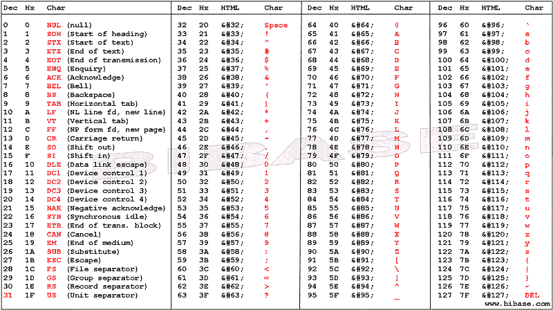
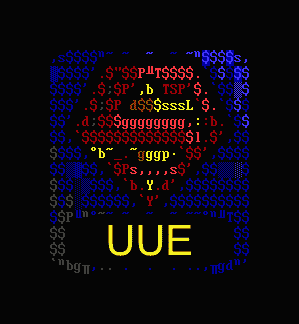

# C 中的 UUEncode

> 原文:# t0]https://dev . to/ladvien/uuenco-in-c-2l 75

**我想花点时间感谢 [Bdk6](http://smalltimeelectronics.com/) 。这个人是个行尸走肉，对愚蠢更有耐心。如果没有他的指导，我怀疑我能理解这些。**

我想我应该花些时间远离编码我的 [LPC1114 上传器](http://letsmakerobots.com/lpc1114-usb-serial-solution-rerolling-boot-uploader)并且口头处理一些我学到的东西。像往常一样，请随意批评它；它最终只会让我的代码更加健壮。

这篇文章是一系列的文章，是我写上传者的大文章的前奏。所有职位将依赖于 GCC 编译器。

[](https://res.cloudinary.com/practicaldev/image/fetch/s--MbcXKRbE--/c_limit%2Cf_auto%2Cfl_progressive%2Cq_auto%2Cw_880/https://ladvien.cimg/GCCLogo.png) 设置 GCC 编译器

我尽可能地设置了一个 C 环境。也许有更简单的方法，但是我想用 GCC 来编译。

要设置环境:

1.  我下载并设置了 [MinGW32](http://www.mingw.org/wiki/HOWTO_Install_the_MinGW_GCC_Compiler_Suite) 。

2.  我添加了这些 **includes** 来使代码运行。

```
#include <stdio.h> #include <stdarg.h> #include <stdlib.h> #include <windows.h> #include <windef.h> #include <winnt.h> #include <winbase.h> #include <string.h> #include <math.h> #include <stdbool.h> #include <stdint.h> #include <sys/time.h> 
```

<svg width="20px" height="20px" viewBox="0 0 24 24" class="highlight-action crayons-icon highlight-action--fullscreen-on"><title>Enter fullscreen mode</title></svg> <svg width="20px" height="20px" viewBox="0 0 24 24" class="highlight-action crayons-icon highlight-action--fullscreen-off"><title>Exit fullscreen mode</title></svg>

我用这一行来建造它:

**$ gcc -o main main.c**

至于剪辑，我真的越来越喜欢崇高的文本 2。

如果你有* *的问题，确保包含你的文件的目录在你的 PATH 环境变量** 中(我在这篇[文章](http://letsmakerobots.com/content/lpc1114-setup-bare-metal-arm)中讲述了如何将目录添加到你的环境变量中)。

**如何将十六进制数据转换成 UUE**

**“什么是‘UUEncoding’？”**

Unix 到 Unix 编码(UUE)是将**二进制数据转换成可以用从空格(32)到下划线(95)** 的 ASCII 字符值表示的形式的过程。这 64 个字符允许我们表达任何二进制数据流。

我不会花太多时间解释 **UUEncoding** ，因为[维基百科的文章很棒](http://en.wikipedia.org/wiki/Uuencoding)。

**“为什么要 UUEncode？”**

你写了一个程序来寻找一个特定的值吗？像这样，

```
int i;
char tCollection[32];
char c;``

if( c == 'T')
{
    Serial.print("I found a T!");
    tCollection[i] = c;
else if (c == '\r')
{
    exit();
} 
```

<svg width="20px" height="20px" viewBox="0 0 24 24" class="highlight-action crayons-icon highlight-action--fullscreen-on"><title>Enter fullscreen mode</title></svg> <svg width="20px" height="20px" viewBox="0 0 24 24" class="highlight-action crayons-icon highlight-action--fullscreen-off"><title>Exit fullscreen mode</title></svg>

你开始运行你的程序，一切看起来都很好。它正在检查数据寻找字母 T (0x54)，但是，突然你的程序无缘无故地退出。你很沮丧，因为发送数据给你的传感器没有发送退出代码，这是一个回车符(' \r '，或 0x13)，但你的程序仍然结束了。

真的，我们知道原因，你的程序遇到了一个随机的 0x13，它解释为退出命令。也许是不同的特殊角色？

[T2】](https://res.cloudinary.com/practicaldev/image/fetch/s--ezdbDvGD--/c_limit%2Cf_auto%2Cfl_progressive%2Cq_66%2Cw_880/https://ladvien.cimg/ascii.gif)

但是你要意识到，如果你正在处理一个 8 位数据流，任何 ASCII 字符*都可能在输入流中找到。那么，通信设备如何知道它何时获取数据，何时接收命令呢？*

[T2】](https://res.cloudinary.com/practicaldev/image/fetch/s--jiK8BNZx--/c_limit%2Cf_auto%2Cfl_progressive%2Cq_auto%2Cw_880/https://ladvien.cimg/Super_Style_ASCII_by_buddhascii.png)

这就是 UUE 的用武之地。如前所述，UUE 是一种仅使用十六进制值 0x32 到 0x95(上面 ASCII 图表中的两个中间列)来表示相同的 8 位数据的方法。这意味着字符 0x00 至 0x1F 和 0x60 至 0x7F 可自由用于命令功能。

回到上面的例子，这意味着我们现在可以使用 CR 值来表示传输结束，因为 CR 是 0x13。

好了，我希望我已经向你介绍了 UUE 的实用程序，让我来解释一下十六进制数据是如何转换成只有 64 个值的形式的。

UUE 转换一次处理三个字节的数据，并遵循此算法。

1.  3 个十六进制字节的各个位被放入一个序列中。
2.  然后，24 位序列被分成 4 个 6 位字节。
3.  然后，将代表每个 6 位字节的十进制值加上 32。
4.  产生的四个值是 UUEncoded 字节。

迷茫得要命？我也是。图片不错。让我们按照 Wiki 的例子来使用: **Cat**

第一步是获取每个 ASCII 字符的二进制值。

*   C' = 01000011
*   a' = 01100001
*   t' = 01110100

这意味着产生的 24 位二进制序列是，

24 位:010000110110000101110100

然后这被分成四个 6 位字节，

*   6 位字节:1 2 3 4
*   二进制:010000 110110 000101 110100

新的十进制值是，

*   6 位字节:1 2 3 4
*   十进制:16 54 5 52

在这一点上，6 位(六进制)字节给我带来了一点麻烦。我不明白我放入的 8 位变量是如何处理 6 位的。例如，我如何让一个 **int 变量**只取 6 位，而不是 8 位？诀窍是理解 8 位变量只是寄存器中提供的分配空间的宽度，它对你放入什么没有影响。我终于明白了，我不需要担心寄存器中的空位。

例子很好:

十进制 010000 = 16

十进制 00010000 = 16

010000 = 00010000

无论如何，这是我最终理解它的方式。只要当我进行位操作时，我将寄存器中未使用的位放在“左侧”,我的 6 位值就可以放入 8 位寄存器中，并且该值保持不变。

好吧，回到我们的例子。

我们的下一步是给新的四个字节的每个十进制值加 32。

*   6 位字节:1 2 3 4
*   十进制:16 54 5 52
*   加 32 +32 +32 +32 +32
*   新的第 48 86 37 84 号决定
*   **UUE 字符:0 V % T**

[](https://res.cloudinary.com/practicaldev/image/fetch/s--rgYujrkr--/c_limit%2Cf_auto%2Cfl_progressive%2Cq_auto%2Cw_880/https://ladvien.cimg/schrodingers_cat.jpg) 和...就是这样。您的数据现在是未编码的。当它通过任何传输媒介发送时，它不会受到特殊字符协议的干扰。对于我们的猫，我们把它改造成: **0V%T**

看在猫的份上，希望有解码算法。

那些比我更敏锐的人可能已经注意到了一些问题。例如，如果我们的数据不是以 3 为增量，该怎么办？比如，我们怎么送**猫？**

答案？我们什么都不编造。在猫的例子中，我们简单地在字符序列的末尾填充两个空字符。举个例子，

*   C' = 01000011
*   a' = 01100001
*   t' = 01110100
*   s' = 01110011
*   null = 00000000
*   null = 00000000

48 位:010000110110000101101000111001100000000000000

*   6 位字节:1 2 3 4 5 6 7 8
*   二进制:010000 110110 000101 110100 011100 110000 0000000 000000

新的十进制值是，

*   6 位字节:1 2 3 4 5 6 7 8
*   十进制:16 54 5 52 28 48 0 0

*   6 位字节:1 2 3 4 5 6 7 8

*   十进制:16 54 5 52 28 48 0 0

*   加 32 +32 +32 +32 +32 +32 +32 +32 +32

*   新的第 48 86 37 84 60 80 32 32 号决定

*   **UUE char: 0 V % T < P SPC SPC**

我们已经把“猫”变成了“* *0V%T < P ** ”好了，差不多了，我们这里还没有完成。

啊哦。另一个问题。UUE 的要点是远离像空格字符(0x32)这样的特殊字符。但是现在我们的传输中有两个。UUE 议定书解决了这个问题。它指出，

*   如果 6 位编码过程的结果是空格字符，我们把它转换成[重字符](http://en.wikipedia.org/wiki/Grave_accent) r，* *' ` '。** (重音符字符是十六进制的 0x60，对了)。

因此，我们的“猫”实际上变成了。

*   **差点 UUE char: 0 V % T < P SPC SPC**
*   **UUE char:0v % T<PT2】**

终于！我们已经编码了“猫”

我们已经转向:

[](https://res.cloudinary.com/practicaldev/image/fetch/s--pq_vreY8--/c_limit%2Cf_auto%2Cfl_progressive%2Cq_auto%2Cw_880/https://ladvien.cimg/fivekittems1.jpg) 成- > ** 0V%T < P `现在，*那就是*理科乡亲们！**`

 `**嗯，你还需要知道什么？* *哦，对了，UUE 的数据是如何存储的。** **

UUE 用线存储和发送数据。一行 UUE 数据由一个起始字符组成，该字符使用一个存储为 ASCII 字符的 6 位数字来表示该行中编码了多少字节(**而不是**该行中有多少 UUE 字符)。UUE 数据行以一个新行字符结束(即' \n ')。最后，UUE 线被限制为 45 字节的数据。这意味着，UUE 的一行中的最大数据字符数不应超过 60 个。或者，62，如果算上起始字符和结束字符。

还是那句话，例子很好。对于我们的猫，这条线看起来像这样，

*   $ **0V%T < P `\n`**

 `[T2】](https://res.cloudinary.com/practicaldev/image/fetch/s--UxCEXzoT--/c_limit%2Cf_auto%2Cfl_progressive%2Cq_auto%2Cw_880/https://ladvien.cimg/UUE_dump.png)

让我花点时间来描述一下我们是如何得到起始字符的。基本上，我们计算我们发送了多少字节，在我们的例子中是 4，然后我们加上 32。这给了我们 ASCII 字符的十进制表示，我们将使用它作为我们的开始字符。因此，

*   4 + 32 = 36 as ASCII = $

迷惑？当我们查看代码时，可能会更有意义。

说到这里，我想我已经介绍了基础知识，是时候开始实现了。

**在 C 语言中实现 UUEncoding**

嗯，在这里。我用 c 语言拙劣地实现了一个 UUEncoder。

该函数有几个变量。

1.  **UUE _ 数据 _ 数组**是一个指向 uint8_t 数组的指针，编码后的字符将存储在该数组中。
2.  **hex_data_array** 是一个指向 uint8_t 数组的指针，该数组包含要编码的十六进制值(要了解我从哪里获得十六进制数据，请查看这篇不光彩的帖子的另一篇:[英特尔十六进制文件到数组](http://letsmakerobots.com/content/intel-hexfile-array))。
3.  **十六进制数据数组** size 是一个整数，表示在**十六进制数据数组**中可以找到多少字节的数据。
4.  该函数完成后，它返回创建了多少个 ASCII UUE 字符。这是为了以后解析 UUE 数组。

`` CPP
int UUEncode(uint8_t * UUE _ 数据 _ 数组，uint 8 _ t *十六进制 _ 数据 _ 数组，int 十六进制 _ 数据 _ 数组 _ 大小)
{
// 1。为每行字符添加字符。
// 2。将 3 个字节加载到数组中。
// 3。编码数组。
// 4。添加填充。
// 5。将“”替换为“”
// 6。返回 UUE 数据数组(隐式)和大小。
uint 8 _ t byte _ to _ encode[3]；
uint 8 _ t uue _ char[4]；`

 ````
int UUEncoded_array_index = 0;
int uue_length_char_index = 45;
int padded_index = 0;
int bytes_left = 0;

// 1\. Add char for characters per line.
if(hex_data_array_size < 45)
{
     UUE_data_array[UUEncoded_array_index] = ((hex_data_array_size & 0x3f) + ' ');
}
else
{
    UUE_data_array[UUEncoded_array_index] = 'M';
}

UUEncoded_array_index++;

// Encode loop.
for (int hex_data_array_index = 0; hex_data_array_index < hex_data_array_size; hex_data_array_index)
{
    // 2\. Load 3 bytes into an array.
    for (int i = 0; i < 3; ++i)
    {
        // Load bytes into array
        if (hex_data_array_index < hex_data_array_size)
        {
            byte_to_encode[i] = hex_data_array[hex_data_array_index];
            hex_data_array_index++;
        }
        else
        {
            // 4\. Add padding.
            byte_to_encode[i] = 0;
            padded_index++;
        }
        uue_length_char_index--;
    }

    // 3\. Encode array.
    uue_char[0] = ((byte_to_encode[0] >> 2) & 0x3f);
    uue_char[1] = (((byte_to_encode[0] << 4) | ((byte_to_encode[1] >> 4) & 0x0f)) & 0x3f);
    uue_char[2] = (((byte_to_encode[1] << 2) | ((byte_to_encode[2] >> 6) & 0x03)) & 0x3f);
    uue_char[3] = (byte_to_encode[2] & 0x3f);

    for (int i = 0; i < 4; i++)
    {
        // 5\. Replace ' ' with '''
        if (uue_char[i] == 0x00)
        {
            UUE_data_array[UUEncoded_array_index] = 0x60;
        }
        else
        {
            UUE_data_array[UUEncoded_array_index] = (uue_char[i] + ' ');
        }

        UUEncoded_array_index++;
    }

    // Data bytes left.
    bytes_left = (hex_data_array_size - hex_data_array_index);

    if (uue_length_char_index == 0 && bytes_left > 0)
    {
        // NOTE: Could be simplified to include first char
        // and additional characters, using a positive index.
        // 1\. Add char for characters per line.
        UUE_data_array[UUEncoded_array_index] = '\n';
        UUEncoded_array_index++;

        if(bytes_left < 45)
        {
            // Find how many characters are left.
            UUE_data_array[UUEncoded_array_index] = ((bytes_left & 0x3f) + ' ');
        }
        else
        {
            UUE_data_array[UUEncoded_array_index] = 'M';
        }
        UUEncoded_array_index++;
        uue_length_char_index = 45;
    }

} // End UUE loop
UUE_data_array[UUEncoded_array_index] = '\n';

// 6\. Return UUE data array (implicit) and size.
return UUEncoded_array_index; 
```

<svg width="20px" height="20px" viewBox="0 0 24 24" class="highlight-action crayons-icon highlight-action--fullscreen-on"><title>Enter fullscreen mode</title></svg> <svg width="20px" height="20px" viewBox="0 0 24 24" class="highlight-action crayons-icon highlight-action--fullscreen-off"><title>Exit fullscreen mode</title></svg>

}

int check _ sum(uint 8 _ t * hex _ data _ array，int hex _ data _ array _ size)
{
int check _ sum = 0；
int char _ index = 0；

```
while(char_index < hex_data_array_size)
{
    check_sum += hex_data_array[char_index];
    char_index++;
}
return check_sum; 
```

<svg width="20px" height="20px" viewBox="0 0 24 24" class="highlight-action crayons-icon highlight-action--fullscreen-on"><title>Enter fullscreen mode</title></svg> <svg width="20px" height="20px" viewBox="0 0 24 24" class="highlight-action crayons-icon highlight-action--fullscreen-off"><title>Exit fullscreen mode</title></svg>

}
`

 `*   3-8:这里，我用伪代码概述了我想在这个函数中完成的工作。
*   17-25:我处理第一行的开始字符。我通过检查我们收到的十六进制数据是否超过 UUE 线的限制(45 字节)来做到这一点。如果是，我放置一个 M 作为开始字符(45 + 32 = 77 = ASCII **M** )。如果我们得到的数据少于 45 字节，让我们计算开始字符。我们取 8 位数字中的 65 位来表示这里有多少字节，然后加上 32，这将给出我们的起始字符。
*   30-96:这是完成工作的主循环。我们遍历提供给我们的所有十六进制数据，边走边编码。
*   33-48:这里的循环一次处理 3 个字节的数据。它还会检查剩余的字节是否少于 3 个，如果是，它会用 0 (null)填充剩余的空间。
*   47:该索引与第 82-90 行的 if 语句结合使用。它实际上是在重复开头的 if 语句，在那里我们决定了这一行的起始字符是什么。
*   51-54:这就是奇迹发生的地方。这里，我们将 8 位的 3 个字节转换为 6 位的 4 个字节。我们将结果位存储在一个 8 位变量中。但是请记住，我们可以将 6 位数据放入 8 位的 jar 中，只要我们记得小心放置这些位。
*   56-69:检查得到的 6 位字符，看它们是否是空格字符(0x20)，如果是，我们把它们变成一个坟墓' ' '字符(0x60)。如果它们不是空格，我们将十进制值加上 32(' =十进制的 32)，这就完成了编码过程。
*   72:我们计算剩下多少数据字节，为计算下一行的开始字符做准备。
*   74-96:这个循环有两个目的。第一，在最后一个编码行的末尾放置一个新行字符(' \n ')。第二，计算并加载下一行的开始字符。
*   96:当我们到达数据的结尾时，我们放置一个新的字符来标记结尾。
*   112:我们返回用于表示编码数据的 ASCII 字符数。

给你。 **UUE！**

这里有一些我认为有用的附加资源，

1.  [维基百科关于 UUEncoding 的文章](http://en.wikipedia.org/wiki/Uuencoding)
2.  [恩智浦针对其 uCs 的 UUEncoded 应用笔记](https://ladvien.cimg/UUE__app_note.pdf)
3.  [Bdk6](http://letsmakerobots.com/users/bdk6)````