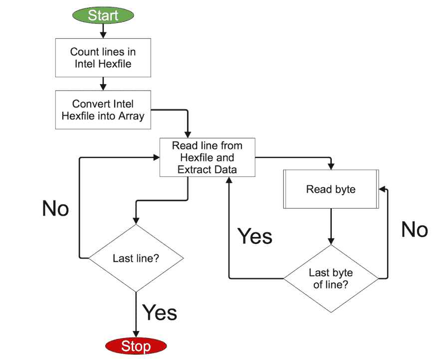
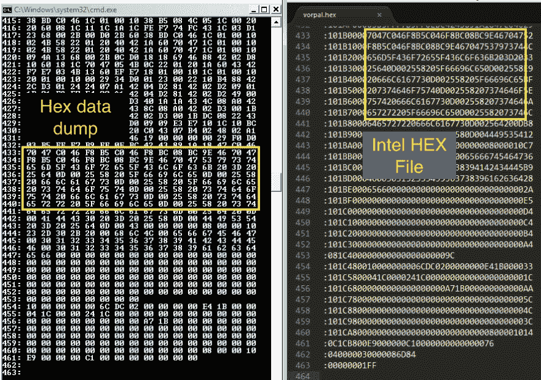

# 英特尔 Hexfile 到阵列

> 原文:[https://dev.to/ladvien/intel-hexfile-to-array-17kp](https://dev.to/ladvien/intel-hexfile-to-array-17kp)

我是 uC_icon_5_300x300。png

**不是所有流浪的人都迷失了(但我是)**

我想我应该花些时间远离编码我的 [LPC1114 上传器](http://letsmakerobots.com/lpc1114-usb-serial-solution-rerolling-boot-uploader)并且口头处理一些我学到的东西。像往常一样，请随意批评它；它最终只会让我的代码更加健壮。

这篇文章是一系列的文章，是我写上传者的大文章的前奏。所有职位将依赖于 GCC 编译器。

[](https://res.cloudinary.com/practicaldev/image/fetch/s--MbcXKRbE--/c_limit%2Cf_auto%2Cfl_progressive%2Cq_auto%2Cw_880/https://ladvien.cimg/GCCLogo.png) 设置 GCC 编译器

我尽可能地设置了一个 C 环境。也许有更简单的方法，但是我想用 GCC 来编译。

要设置环境:

1.  我下载并设置了 [MinGW32](http://www.mingw.org/wiki/HOWTO_Install_the_MinGW_GCC_Compiler_Suite) 。

2.  我添加了这些 **includes** 来使代码运行。

```
#include <stdio.h> #include <stdarg.h> #include <stdlib.h> #include <windows.h> #include <windef.h> #include <winnt.h> #include <winbase.h> #include <string.h> #include <math.h> #include <stdbool.h> #include <stdint.h> #include <sys/time.h> 
```

<svg width="20px" height="20px" viewBox="0 0 24 24" class="highlight-action crayons-icon highlight-action--fullscreen-on"><title>Enter fullscreen mode</title></svg> <svg width="20px" height="20px" viewBox="0 0 24 24" class="highlight-action crayons-icon highlight-action--fullscreen-off"><title>Exit fullscreen mode</title></svg>

我用这一行来建造它:

**$ gcc -o main main.c**

至于剪辑，我真的越来越喜欢崇高的文本 2。

如果你有* *的问题，确保包含你的文件的目录在你的 PATH 环境变量* *(我在这篇[文章](http://letsmakerobots.com/content/lpc1114-setup-bare-metal-arm)中讲述了如何将目录添加到你的环境变量中)。

**英特尔 Hexfile 到基于数据地址的数组**

为了从一个[英特尔十六进制格式文件](http://en.wikipedia.org/wiki/Intel_HEX)中加载数据，我使用了几个函数 open_file()来创建一个数据流，通常被称为一个[文件指针](http://www.gnu.org/software/libc/manual/html_node/Streams.html#Streams)，来自我想要读取的文件。和 hex_file_to_array()，解析十六进制文件并提取数据。

[T2】](https://res.cloudinary.com/practicaldev/image/fetch/s--qeZwmIbC--/c_limit%2Cf_auto%2Cfl_progressive%2Cq_auto%2Cw_880/https://ladvien.cimg/hexfile2.png)

**main . c**T2】

```
MAIN.C

int main(int argc, char *argv[])
{
    //If the user fails to give us two arguments yell at him.
    if ( argc != 2 ) {
        fprintf ( stderr, "Usage: %s <readfile1>\n", argv[0] );
        exit ( EXIT_FAILURE );
    }
    // Data array
    uint8_t HEX_array[32768];

    // Bytes read into array.
    int HEX_array_size;

    //File to be loaded.
    FILE *hex_file;

    //Open file using command-line info; for reading.
    hex_file = open_file (argv[0], "rb" );

    // Load the data from file
    HEX_array_size = hex_file_to_array(hex_file, HEX_array);

} // END PROGRAM 
```

<svg width="20px" height="20px" viewBox="0 0 24 24" class="highlight-action crayons-icon highlight-action--fullscreen-on"><title>Enter fullscreen mode</title></svg> <svg width="20px" height="20px" viewBox="0 0 24 24" class="highlight-action crayons-icon highlight-action--fullscreen-off"><title>Exit fullscreen mode</title></svg>

*   6:让我们检查用户传入的参数数量。如果没有文件名，那么我们退出。
*   11:为数据声明一个无符号数组。我已经随意地设置了它，但是它需要足够大以容纳从 hexfile 中提取的数据量。
*   17:这里我们创建一个指向文件数据流的指针。
*   20:我们将指向数据流的指针传递给 **open_file** 函数。我们设置只读取二进制文件。我们把想要打开的文件传递给它，它返回打开的文件。
*   23:我们传递给 **hex_file_to_array** 一个文件指针和一个数组指针。这个函数读取 hex 文件，解析它，提取数据，并根据在 hex file 中找到的数据地址将它们放入 uint8_t 数组。然后，该函数返回在十六进制文件中找到的数据字节数。

**open_file()**

这个函数获取一个文件名和打开它的[模式](http://www.c4learn.com/c-programming/c-file-open-modes/)，然后尝试打开一个指向这个文件的文件指针。如果成功，它返回指向现在打开的文件的指针。如果失败，程序将退出并显示一个错误代码。

```
MAIN.C

//Open file for reading, function.
FILE *open_file ( uint8_t *file, uint8_t *mode )
{
  FILE *fileOpen = fopen ( file, mode );

  if ( fileOpen == NULL ) {
    perror ( "Unable to open file" );
    exit (EXIT_FAILURE);
  }

  return fileOpen;
} 
```

<svg width="20px" height="20px" viewBox="0 0 24 24" class="highlight-action crayons-icon highlight-action--fullscreen-on"><title>Enter fullscreen mode</title></svg> <svg width="20px" height="20px" viewBox="0 0 24 24" class="highlight-action crayons-icon highlight-action--fullscreen-off"><title>Exit fullscreen mode</title></svg>

要理解这一功能，最好先理解英特尔十六进制文件格式。

**解析的十六进制文件:**

让我们看看原始数据，

```
:10010000214601360121470136007EFE09D2190140

:100110002146017E17C20001FF5F16002148011928

:10012000194E79234623965778239EDA3F01B2CAA7

:100130003F0156702B5E712B722B732146013421C7

:00000001FF
```

**解析的十六进制文件:**

```
: 11 2222 33 44444444444444444444444444444444 55 \n
```

1.  **:** ' =开始代码。
2.  11 =字节计数
3.  2222 =地址
4.  33 =数据类型
5.  44 = **数据**
6.  55 =校验和
7.  \n' =结束代码

文件中的所有信息都很重要，但是我们只希望将数据**放到数组中。为了提取这些数据，我们将使用三个子例程:**

1.  从文件中读取字节()
2.  Ascii2Hex()
3.  clear_special_char()

**从文件中读取字节()**

关于十六进制文件需要理解的一点是，数据实际上是作为 ASCII 字符存储的。当我们打开一个指向这些 ASCII 字符的文件指针时，我们不能只读取字节，因为它们只是一个代表[半字节](http://en.wikipedia.org/wiki/Nibble)读取的 ASCII 字符。为了进行转换，我们获取一个字符，将其存储为二进制半字节 A，获取另一个字符，将其存储为二进制半字节 B，然后我们将半字节 A 和 B 组合成一个字节。

这个函数有三个参数:文件指针，一个用于存储完整字节的 uint8_t 指针，以及 total_chars_read，它允许我们跟踪文件的进度。

```
DATA.C

uint8_t read_byte_from_file(FILE * file, uint8_t * char_to_put, int * total_chars_read)
{
    //Holds combined nibbles.
    uint8_t hexValue;
    //Get first nibble.
    *char_to_put = fgetc (file);
    clear_special_char(file, char_to_put, total_chars_read);
    //Put first nibble in.
    hexValue = (Ascii2Hex(*char_to_put));
    //Slide the nibble.
    hexValue = ((hexValue << 4) & 0xF0);
    //Put second nibble in.
    *char_to_put = fgetc (file);
    clear_special_char(file, char_to_put, total_chars_read);
    //Put the nibbles together.
    hexValue |= (Ascii2Hex(*char_to_put));
    //Return the byte.
    *total_chars_read += 2;

    return hexValue;
} 
```

<svg width="20px" height="20px" viewBox="0 0 24 24" class="highlight-action crayons-icon highlight-action--fullscreen-on"><title>Enter fullscreen mode</title></svg> <svg width="20px" height="20px" viewBox="0 0 24 24" class="highlight-action crayons-icon highlight-action--fullscreen-off"><title>Exit fullscreen mode</title></svg>

*   6:声明一个 8 位无符号整数来保存完成的字节。
*   8:从文件指针中获取一个 ASCII 字符。
*   9:这里我们调用 cleaer_special_char 函数来删除十六进制文件中的' \n '和' \r '。
*   11:然后我们将 ASCII 字符转换成真正的二进制半字节。结果存储在字符串中。(我将在下面介绍 Ascii2Hex 函数。)
*   对半字节 b 重复上述步骤。
*   18:我们将一串半字节组合成一个字节。
*   26:我们增加从文件指针中读取的两个 ASCII 字符。

**clear_special_char()**

清除特殊字符功能只是为了从数据流中删除':'、' \n '和' \r '字符。它只是浏览从数据流中提取的字符。如果不是特殊字符，它什么也不做。如果是，它增加字符计数器并丢弃该字符。

```
DATA.C

void clear_special_char(FILE * file, uint8_t * charToPut, int * totalCharsRead)
{
    //Removes CR, LF, ':'  --Bdk6's
    while (*charToPut == '\n' || *charToPut == '\r' || *charToPut ==':'){
        (*charToPut = fgetc (file));
        *totalCharsRead++;
    }
} 
```

<svg width="20px" height="20px" viewBox="0 0 24 24" class="highlight-action crayons-icon highlight-action--fullscreen-on"><title>Enter fullscreen mode</title></svg> <svg width="20px" height="20px" viewBox="0 0 24 24" class="highlight-action crayons-icon highlight-action--fullscreen-off"><title>Exit fullscreen mode</title></svg>

**Ascii2Hex()**

另一个相当简单的函数。在这里，我们只需找到 ASCII 字符的数值，并将其转换为等价的二进制值。

```
DATA.C

//Copied in from lpc21isp.c
uint8_t Ascii2Hex(uint8_t c)
{
    if (c >= '0' && c <= '9')
    {
        return (uint8_t)(c - '0');
    }
    if (c >= 'A' && c <= 'F')
    {
        return (uint8_t)(c - 'A' + 10);
    }
    if (c >= 'a' && c <= 'f')
    {
        return (uint8_t)(c - 'a' + 10);
    }

    return 0;  // this "return" will never be reached, but some compilers give a warning if it is not present
} 
```

<svg width="20px" height="20px" viewBox="0 0 24 24" class="highlight-action crayons-icon highlight-action--fullscreen-on"><title>Enter fullscreen mode</title></svg> <svg width="20px" height="20px" viewBox="0 0 24 24" class="highlight-action crayons-icon highlight-action--fullscreen-off"><title>Exit fullscreen mode</title></svg>

这个函数非常简单，如果你记住每个字符实际上是一个整数。例如，if 语句可以重写如下，

```
if (c >= 0 && c <= 9)
   { return (uint8_t)(c - 0) }

if (c >= 65 && c <= 70)
   { return (uint8_t)(c - 65 + 10)}

if (c >= 97 && c <= 102)
   {return (uint8_t)(c - 97 + 10)} 
```

<svg width="20px" height="20px" viewBox="0 0 24 24" class="highlight-action crayons-icon highlight-action--fullscreen-on"><title>Enter fullscreen mode</title></svg> <svg width="20px" height="20px" viewBox="0 0 24 24" class="highlight-action crayons-icon highlight-action--fullscreen-off"><title>Exit fullscreen mode</title></svg>

你可以使用一个 [ASCII 参考表](http://www.bibase.comhttps://ladvien.cimg/ascii.gif)来决定如何解释一个字符。例如，“D”或“D”将是 68 或 100。68 - 65 + 10 = 13.我们知道 D 是 13 的十六进制数(0 = 0，1 = 1，1 = 2，等等)...A = 10，B，= 11，C = 12， **D = 13** ，E = 14，F = 15)。

这就把我们带到了主函数，

**read _ line _ from _ hex _ file()**

```
DATA.C

bool read_line_from_hex_file(FILE * file, uint8_t line_of_data[], long int * combined_address, int * bytes_this_line)
{
        int data_index = 0;
        uint8_t char_to_put;
        int total_chars_read = 0;

        //To hold file hex values.
        uint8_t byte_count;
        uint8_t datum_address1;
        uint8_t datum_address2;
        uint8_t datum_record_type;
        uint8_t datum_check_sum;

        //BYTE COUNT
        byte_count = read_byte_from_file(file, &char_to_put, &total_chars_read);

        // No need to read, if no data.
        if (byte_count == 0){return false;}

        //ADDRESS1 //Will create an 8 bit shift. --Bdk6's
        datum_address1 = read_byte_from_file(file, &char_to_put, &total_chars_read);

        //ADDRESS2
        datum_address2 = read_byte_from_file(file, &char_to_put, &total_chars_read);

        //RECORD TYPE
        datum_record_type = read_byte_from_file(file, &char_to_put, &total_chars_read);

        // No need to read, if not data.
        if (datum_record_type != 0){return false;}

        *combined_address = ((uint16_t)datum_address1 << 8) | datum_address2;

        // DATA
        while(data_index < byte_count)
        {
            line_of_data[data_index] = read_byte_from_file(file, &char_to_put, &total_chars_read);
            data_index++;
        }
        *bytes_this_line = data_index;

        // CHECKSUM
        datum_check_sum = read_byte_from_file(file, &char_to_put, &total_chars_read);

        return true;
} 
```

<svg width="20px" height="20px" viewBox="0 0 24 24" class="highlight-action crayons-icon highlight-action--fullscreen-on"><title>Enter fullscreen mode</title></svg> <svg width="20px" height="20px" viewBox="0 0 24 24" class="highlight-action crayons-icon highlight-action--fullscreen-off"><title>Exit fullscreen mode</title></svg>

上面的代码从文件指针中解析一行十六进制数据。

*   17:我们读取一行的第一个字节。这应该是':'字符，但是记住我们的 clear_special_char()应该跳过这一步，读取接下来的两个字节' 1 '和' 0 '(绿色)。“10”是在这一行找到的数据(蓝色)的字节数。注意，10 不是十进制数，是十六进制数。也就是说，这一行应该有 16 个字节的数据。
*   20:我们检查这一行是否有任何数据。如果没有数据，我们返回 false。
*   23:取数据地址的第一个字节(紫色)。
*   26:取数据地址的第二个字节(紫色)。
*   29:获取标识该行信息类型的字节(红色)。我们只寻找数据(' 00 ')。其他类型在 ole’Wiki 文章中有很好的解释: [Intel HEX 记录类型](http://en.wikipedia.org/wiki/Intel_HEX#Record_types)。
*   32:如果记录类型不是数据，我们就不要。我们返回 false。
*   34:将两个 8 位地址字节合并成一个 16 位地址。
*   37:让我们获取在这一行找到的所有数据，并将其放入我们提供的函数数组中。
*   42:我们必须跟踪每行有多少字节，以完成我们的数据地址。因此，我们将其传递回 hex_file_to_array()。
*   45:我读取了校验和，但我没有对它做任何事情。我可能应该。

**hex_file_line_count()**

为了正确解析 hexfile，我们需要知道在文件中找到了多少行。我们可以通过几种方式找到这些信息，但是我计算了行开始字符的数量':'。

```
MAIN.C

int hex_file_line_count(FILE * file_to_count)
{
    int line_count = 0;
    char got_char;

    while(got_char != EOF)
    {
        got_char = fgetc(file_to_count);
        if (got_char == ':'){line_count++;}
    }
    rewind(file_to_count);
    return line_count;
} 
```

<svg width="20px" height="20px" viewBox="0 0 24 24" class="highlight-action crayons-icon highlight-action--fullscreen-on"><title>Enter fullscreen mode</title></svg> <svg width="20px" height="20px" viewBox="0 0 24 24" class="highlight-action crayons-icon highlight-action--fullscreen-off"><title>Exit fullscreen mode</title></svg>

*   8:循环直到到达文件结尾字符。
*   10:从文件指针获取 ASCII 字符。
*   11:我们检查我们进入的字符是否是行首字符':'。
*   13:这个函数遍历整个文件，但是我们想从文件的开头开始提取数据，所以我们[将文件倒回](http://www.tutorialspoint.com/c_standard_library/c_function_rewind.htm)到第一个字符。
*   14:我们返回行数。

**hex_file_to_array()**

```
DATA.C

int hex_file_to_array(FILE * file, uint8_t hex_data[])
{
    // 1\. Get line count.
    // 2\. Read a line. From ':' to '\n'
    // 3\. Parse a line.
    //   Repeat for all lines.

    // Data per line.
    uint8_t line_of_data[32];
    long int combined_address[4096];

    // Indices and counters
    int hex_line_index = 0;
    int chars_this_line = 0;
    int total_chars_read = 0;
    // How many lines in the hexfile?
    int hex_lines_in_file = 0;
    int bytes_this_line[4096];

    // Let's count how many lines are in this file.
    hex_lines_in_file = hex_file_line_count(file);

    // Indices for parsing.
    int line_index = 0;
    int byte_index = 0;
    bool read_line_ok = false;

    // Parse all lines in file.
    while(line_index < hex_lines_in_file)
    {
        read_line_ok = read_line_from_hex_file(file, line_of_data, &combined_address[line_index], &bytes_this_line[line_index]);
        if (!read_line_ok)
        {
            printf("Line#: %i. Dude, that's not data!\n", line_index);
            read_line_ok = true;
        }
        while(byte_index < bytes_this_line[line_index])
        {
            hex_data[combined_address[line_index] + byte_index] = line_of_data[byte_index];
            line_of_data[byte_index] = '\0';
            byte_index++;
        }
        byte_index = 0;
        line_index++;
    }

    // Print out parsed data.
    int k = 0;
    int j = 0;
    int printed_bytes = 0;
    while (k < hex_lines_in_file)
    {
        while(j < bytes_this_line[k])
        {
            printf("%02X ", hex_data[j+(printed_bytes)]);
            j++;
        }
        printed_bytes += bytes_this_line[k];
        j=0;
        printf("\n");
        k++;
    }

    return total_chars_read;
} // End hex_file_to_array 
```

<svg width="20px" height="20px" viewBox="0 0 24 24" class="highlight-action crayons-icon highlight-action--fullscreen-on"><title>Enter fullscreen mode</title></svg> <svg width="20px" height="20px" viewBox="0 0 24 24" class="highlight-action crayons-icon highlight-action--fullscreen-off"><title>Exit fullscreen mode</title></svg>

*   23:我们计算想要提取数据的文件中的行数。
*   31:这是工作马循环。我们循环，直到我们读完所有我们数过的行。
*   33:我们传递 read_line_from_hex()我们希望填充的变量。我们要解析的十六进制文件(file)，保存行数据的缓冲区，用来保存这一行数据的地址的 int 数组，保存这一行数据的字节数的变量。如果函数得到了数据，它将返回 true。否则，它将返回 false。我们存储这个标志，以确保我们有所收获。
*   34:我们检查是否确实从我们的尝试中获得了数据。
*   39:这里，我们将数据行从缓冲区移到最终数组中。
*   41:我们根据从行中提取的地址(地址 1 +地址 2)和字节数将数据放入数组。
*   42:将缓冲区重置为零。
*   49-64:最后，我们打印出数据。k-loop 遍历我们提取的每一行；j 循环遍历在相应行上找到的每个字节。

仅此而已。**注意，49-64 意在证明数据被正确提取。这些行可以被移动到另一个函数，在该函数中数据可以根据需要被使用。**

[T2】](https://res.cloudinary.com/practicaldev/image/fetch/s--4oV5IQJc--/c_limit%2Cf_auto%2Cfl_progressive%2Cq_auto%2Cw_880/https://ladvien.cimg/Hex_file_data_dump1.png)