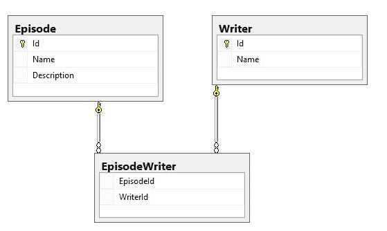

# 大胆尝试 SQL 未曾涉足的领域

> 原文:[https://dev . to/funky si1701/to-boldly-go-where-no-SQL-has-go-before-4fe 7](https://dev.to/funkysi1701/to-boldly-go-where-no-sql-has-gone-before-4fe7)

我的上一篇帖子非常受欢迎，所以我想知道我是否可以将它和《星际迷航》结合起来。

几年前，我有《星际迷航》剧集的列表，其中包括原始播出日期、制作编号、剧集标题和简要描述等信息。

有一件事很难跟踪，那就是有多少集是由一个特定的人写的。这是因为剧集是多人写的。一个名为 writer 的列将需要包含多个人，另一个选项是拥有名为 writer1、writer2 等的列。这也没有用，因为你不知道某个作者被保存在哪一栏。

[T2】](https://res.cloudinary.com/practicaldev/image/fetch/s--pWsDwust--/c_limit%2Cf_auto%2Cfl_progressive%2Cq_auto%2Cw_880/https://storageaccountblog9f5d.blob.core.windows.net/blazor/wp-content/uploads/2014/10/manytomany.jpg%3Fw%3D559%26ssl%3D1)

作者和剧集之间的关系被称为多对多关系。一集可以有很多编剧，一个编剧可以写很多集。要在 SQL 数据库中实现这种结构，您需要三个数据库表，因为不可能在两个表之间创建多对多连接。第一个表将包含所有剧集，第二个表将包含所有作者，第三个表称为连接表，将包含两者之间的关系。

让我们做一个例子，看看这是如何工作的。《星际迷航》的创作者吉恩·罗登伯里创作了试播集《囚笼》。因此，Gene 将被添加到 writers 表中，id 为 1，而 Cage 将被添加到 eption 表中，id 为 1。在连接表中，它有两列“剧集”和“作者”,因此我们将在这两列中输入 1 和 1。

```
Select * from Episode e
Join EpisodeWriter ew on e.id = ew.EpisodeId
Join Writer w on w.id = ew.WriterId 
```

<svg width="20px" height="20px" viewBox="0 0 24 24" class="highlight-action crayons-icon highlight-action--fullscreen-on"><title>Enter fullscreen mode</title></svg> <svg width="20px" height="20px" viewBox="0 0 24 24" class="highlight-action crayons-icon highlight-action--fullscreen-off"><title>Exit fullscreen mode</title></svg>

但是，如果吉恩·库恩和吉恩·罗登伯里在笼子上有写作学分，我们就需要把吉恩·库恩添加到写作表中，并在 episodewriter 表中添加一个额外的条目。

当我扩展数据库结构以包含其他信息时，我将在此基础上发表更多文章，我可能会继续创建存储过程以返回某些信息，或者我可能会以此为例来讨论用户界面的编码。