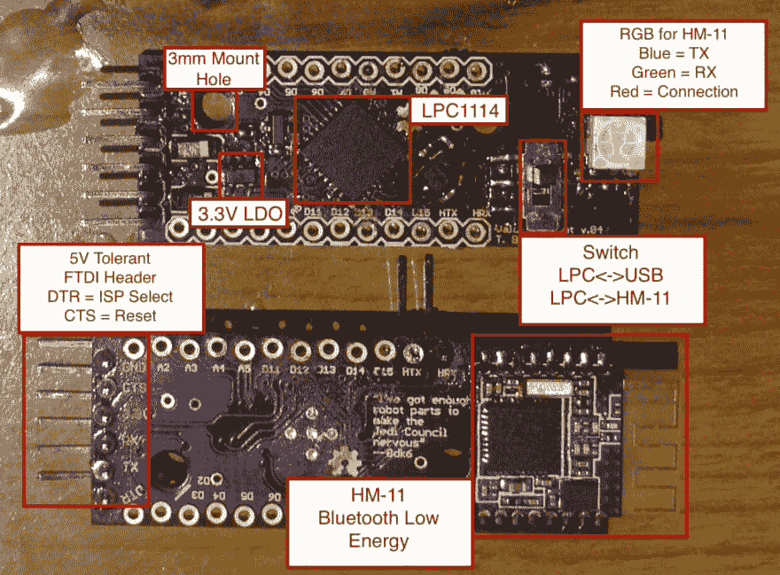
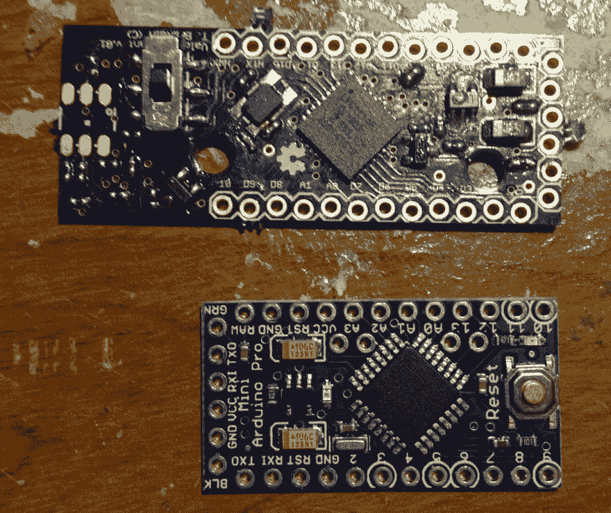
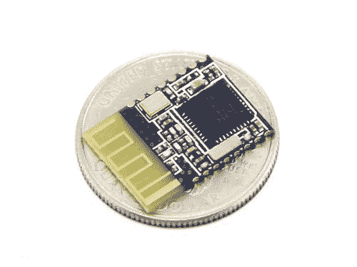
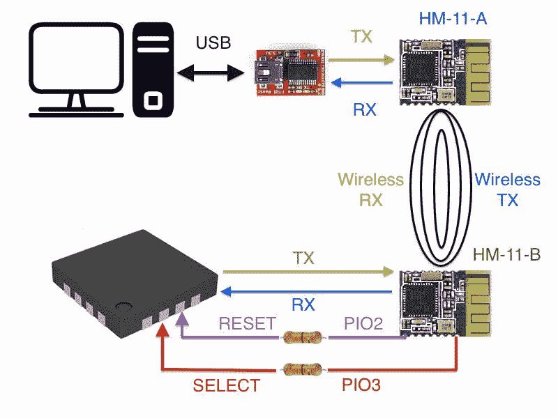
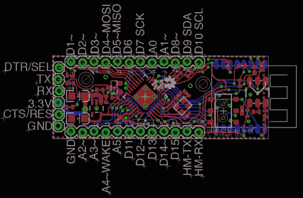

# 瓦尔迪兹突变株 LPC1114 QFN

> 原文：<https://dev.to/ladvien/the-valdez-mutant-lpc1114-qfn-39h8>

[瓦尔迪兹变异人档案](///files/Kobold_Working_1.zip)

这是我为 Bdk6 先生的 LPC1114 工具链做的一个小板子。

*   [Bdkdev](http://smalltimeelectronics.com/projectss/lpcdev/lpcdev.html)

这个工具链太神奇了。事实上，如果你想脱离 Arduino / AVR，进入 ARM 芯片，Bdk6 的 LPC1114 工具链是正确的选择。

**瓦尔迪兹突变体 v04**

[T2】](https://res.cloudinary.com/practicaldev/image/fetch/s--Uk4ajKoR--/c_limit%2Cf_auto%2Cfl_progressive%2Cq_auto%2Cw_880/https://ladvien.cimg/Valdez_Mutant_v04_Explained_1.jpg)

该芯片有 ROM 引导加载程序。这使您可以对开箱即用的芯片进行编程。编程是通过传统的串行线路完成的。大多数 ARM 芯片需要一个 JTAG 程序员，这通常是 50 美元的投资。这引出了我的一些设计目标。

**A-1。便宜，便宜的武器入口。**

物料清单:

1.  [PCB](https://www.oshpark.com/shared_projectss/H9t41RiC):2.18 美元(最低 3 个)。
2.  3.3V LDO 稳压器 : .56
3.  [12.5 MHZ 晶振](http://www.digikey.com/product-detail/en/7V-12.500MAAV-T/887-1794-1-ND/3586054) : .74
4.  LPC1114 FHN302:5 (QFN): 2.80
5.  贴片 DPDT 开关 : .44
6.  2 x [10uF SMD 如此 cap](https://dev.to478-8192-1-ND)::74
7.  [50-50 RGB 贴片发光二极管](http://www.ebay.com/itm/50-pcs-RGB-PLCC-6-5050-3-CHIPS-SMT-SMD-LED-Light-/230802137241?pt=LH_DefaultDomain_0&hash=item35bce12099) : .10
8.  BSS138 : .22
9.  HM-11: 7.20

被动句是 0402:

1.  2 个 22pF
2.  3 x 1uF
3.  6 x 330 欧姆
4.  1 x 1k
5.  3 x 10k
6.  1 x 20k
7.  3 x 470 欧姆
8.  2 个 4.7k
9.  被动部分总计:～0 . 22

**HM-11 板的总成本:8 美元**

**HM-11 的总成本:15.20 美元**

**一-** **二。Arduino Pro Mini (APM) FTDI 编程器对 LPC1114 进行编程**

在做了一点 AVR 编程之后，我想到了进入 Atmel ARM 芯片。进入的一个障碍是成本，现在我们下降到一个收入，这是一个汉尼拔到罗马的等级障碍。不仅大多数芯片的价格在 6-20 美元之间，它们还需要一个 JTAG 连接器来编程。最终，普莱斯阻止了我围绕 Atmel ARM 芯片构建电路板。

但是后来，Bdk6 先生向我介绍了 LPC1114。芯片[不仅单个价格低于 3 美元](http://www.digikey.com/product-search/en/integrated-circuits-ics/embedded-microcontrollers/2556109?k=lpc1114)(比 Atmega328P 便宜)，而且它还可以通过典型的串行 USB 接口进行编程。我想，如果它可以通过串行编程，那么我可以用我很久以前从 SparkFun 购买的 Arduino Pro Mini FTDI Breakout 对它进行编程。我这么做是自私的，但我认为这里的许多 Arduino 机器人专家也已经将 APM 作为他们的首选。我进一步假设大多数可能会有一个 APM FTDI 连接器。我考虑到这一点，因为我的目标是尽可能减少从 Arduino 切换到 LPC1114 的障碍，而不是编写简单和不透明的支持库。

我将花点时间解释一下 LPC1114 的 ISP ROM。LPC1114 有一个内置的 bootloader，它位于芯片上的 ROM 模块中。当芯片通电时，无论是初始还是复位，它都会运行这个引导加载程序。引导加载程序轮询端口 0 上的引脚 1(Pio 0 _ 1)，如果该引脚为高电平或浮动，则引导加载程序执行程序内存块中的任何内容。如果 PIO0_1 为低电平，则 LPC1114 进入[系统内编程模式](http://en.wikipedia.org/wiki/In-system_programming)。

当我发现这一点时，我很兴奋。为什么不使用 DTR/CTS 引脚来控制 ISP？我把它添加到我的设计目标中。

几个问题:

**1。LPC1114 在 3.3v** 电压下工作。不要让你的“3.3V”FTDI 突破欺骗你。他们仍然吐出 5V 的 VCC，接收和发射，至少直到你跳线底部的焊料跳线。没问题，我会添加一个[逻辑级翻译器](http://www.instructables.com/id/A-bidirectional-logic-level-converter-for-I2C/)。

**2。目前没有控制 DTR/电流互感器的 LPC1114 编程软件。** [FlashMagic](http://www.flashmagictool.com) 和 [lpc21isp](http://sourceforge.net/projectss/lpc21isp/) 都用 **DTR/RTS，**而我拥有的 APM FTDI 突围用的是 DTR/CTS。美中不足的蠢蜣螂。我致力于使用 APM FTDI 连接器作为编程 LPC 的“无修改”方式。就这样，我的辛苦开始了。

我首先尝试更改 lpc21isp 的源代码。我成功地操纵了源，但 lpc21isp 依赖于 Windows 通信协议驱动程序，这些驱动程序*不允许*对 CTS 引脚进行位级控制。该死的。

仍然致力于。

我开始使用 FTDI 驱动程序[重新启动我自己的引导程序](http://letsmakerobots.com/lpc1114-usb-serial-solution-rerolling-boot-uploader)，这些驱动程序*允许对所有管脚进行位级控制( [FTDI 位碰撞](http://www.letsmakerobots.com/content/ftdi-bitbanging-c))。可悲的是，我被[为](http://letsmakerobots.com/content/connect-arduino-your-iphone) [HM-10](http://letsmakerobots.com/content/bluetooth-40-arduino) 写一个 iPhone 应用分散了注意力。当我完成这个应用的时候，Bdk6 在如何重新使用程序员方面给了我很大的指导，他说他正在写一个，并将尝试包含我要求的功能。我想，“我认为这一次偷懒对每个人都有好处。”我让 Bdk6 写程序员。:)*

**A-3。_ 几乎与 Arduino Pro Mini 尺寸相同，但带有安装孔。**

 我喜欢机器人建造用的 Arduino Pro Mini (APM)。它小巧、功能强大、坚固耐用，到处都是好东西。当我决定建立一个 LPC 板，我希望它在设计中复制它。

以下是我提取的特征:

1.  所有组件都在一侧(HM-11 除外)。这允许容易的回流。

2.  小。瓦尔迪兹突变体的尺寸与 Arduino Pro Mini 相同，除了 HM-11 所在的“跳板”区域。APM 是 18×33 毫米，瓦尔迪兹突变体是 18×46.97 毫米

失去的功能:

1.  我没有装重置开关。我指望着 BLE 能够连续重置 HM-11(我稍后会谈到这一点)。

2.  电源指示灯。我决定 HM-11 的 RGB LED 闪烁可以兼作电源 LED，因为 HM-11 和 LPC1114 的电源轨是相同的

我添加了一个我一直觉得 APM 缺少的功能:**安装孔。**不久前，我意识到，随着我不断挑战自己，制造越来越小的 PCB 解决方案，总会有一天电路板会变得太小，不容易使用。连接线把它固定在空中，或者把它从你设定的地方拉下来。**我决定增加 3 毫米的安装孔来固定我的主板。**

**A-4。BLE 无线编程。**

我一直梦想将蓝牙模块连接到 Arduino 上，并无线上传草图。当我发现 HM-10 时，我认为我有一个真正的机会(我还没有完全放弃这个想法)，但它需要编辑 Arduino IDE 源代码。我可以调整和编译它，但是如果任何人看过 Arduino IDE 源代码，就会告诉你，这简直是一团糟。但当我检查 LPC 编程器接口的设计时，我意识到使用 FTDI 翻转 ISP 选择和复位线上的位的过程可以由 HM-10 使用 PIO 引脚远程完成。嗯。灯泡。

因此，我开始设计一个可以无线上传程序的板。

[T2】](https://res.cloudinary.com/practicaldev/image/fetch/s--iV-prd57--/c_limit%2Cf_auto%2Cfl_progressive%2Cq_auto%2Cw_880/https://ladvien.cimg/HM-11_BLE_Module_03.jpg)

我没有使用我传统的定位工具 [HM-10](http://letsmakerobots.com/content/bluetooth-40-arduino) ，而是决定将其升级，尝试使用 [HM-11](http://www.fasttech.com/products/0/10008268/1740900-hm-11-bluetooth-v4-0-transceiver-ble-module) 。

HM-11 与 HM-11 几乎是相同的板，但它没有 8 个左右的 IO 引脚，而是只有 2 个。完美。一个用于复位，一个用于选择。

我认为 HM-11 可以让我保持与设计目标#3 的一致性:很小很小。

理论上，这就是无线上传的工作方式。

1.  HM-11- **A** 发送“AT+PIO30”
2.  HM-11- **B** PIO3 将变低，从而将 LPC1114 ISP 模式设置为低。
3.  HM-11-* * A * *发送“AT+PIO20”
4.  然后，HM-11- **B** PIO2 降低约 5uS。这将重置 LPC。
5.  当 LPC 恢复工作时，它检查 ISP MODE 引脚，发现它为低电平。
6.  HM-11-* * A * *发送“AT+PIO31”等待约 100 毫秒，然后发送“AT+PIO21”
7.  HM-11- **B** PIO3 和 PIO2 将变高。
8.  LPC 进入 ISP 模式。
9.  HM-11 PIO2 和 PIO3 变高。
10.  程序被上传到 LPC。
11.  HM-11-* * A * *发送“AT+PIO20”
12.  HM-11- **B** PIO2 变低，重置 LPC。
13.  HM-11-* * A * *发送“AT+PIO21”
14.  HM-11-**B **PIO2 变高，LPC 运行上传的程序。

[T2】](https://res.cloudinary.com/practicaldev/image/fetch/s--aMkTSo9k--/c_limit%2Cf_auto%2Cfl_progressive%2Cq_auto%2Cw_880/https://ladvien.cimg/FTDI_HM-11_LPC_Layout_2.jpg)

B-1。测试

[T2】](https://res.cloudinary.com/practicaldev/image/fetch/s--KFMb4EmM--/c_limit%2Cf_auto%2Cfl_progressive%2Cq_auto%2Cw_880/https://ladvien.cimg/Valdez_Mutant_--_Board_v04.png)

测试这块板有点麻烦。我打印的第一个版本(v02)有几个主要缺陷:

第一次迭代中的错误:

1.  RX/TX 线颠倒了(我发誓，我从来没有得到正确的)。
2.  HM-11 上的连接器是错的。
3.  我将 CTS 引脚连接到引脚 PIO0_2，它是*而不是*复位引脚。
4.  有一个 N-Chan 翻转 HM-11 翻转 LPC 电源。我去掉了它，简单地运行了一行到 reset(咄)。

我很快纠正了这些问题，并再次发送板。当第二次迭代到来时，我无法测试它。无论我怎么做，我都无法让它进入 ISP 模式。我对自己相当苛刻，责怪自己“蹩脚的焊接技术和能力的缺失”然后我突然想到，我加了 10uF，这需要一点时间来排出。我把万用表放在上面，果然，当我从 LPC 上拔下电源，然后重新加电(我用的是这种方法而不是复位线)花了足足 30 秒，电压才下降到接近标称值。我很快在重置线路上挂了一个瞬时开关，第一次我按下按钮，它就进入 ISP 模式。**狗娘养的**！

因此，我认为第二次迭代是硬件上的成功。

但是有一个很大的失望。我尝试了 FlashMagic 和 lpc21isp，让它们通过 BLE 连接上传，但都超时了。唉。我猜没有无线下载？

测试的功能:

1.  FTDI 引脚排列- **工作- 50%测试** -(工作以提供电源和 RX/TX 工作，复位和选择模式的能力尚未测试。这将需要客户软件)。
2.  5v/3.3v RX/TX 转换器- **100%测试-工作**
3.  DPDT 开关选择 HM-11 或 USB - **100%测试-工作**
4.  晶体- **尚未测试 0%**
5.  HM-11 - RX/TX - **100%测试-工作**
6.  RGB 发送/接收/连接- **33%测试-连接工作**
7.  LPC 重置 HM-11 - **尚未测试 0%**
8.  HM-11 控制复位和 ISP 模式- **尚未测试 0%**

**电路板测试和工作:48%**

B-2。支持和设计文件

我是个黑客。如果不是 Bdk6 先生放在一起的支持工具，我甚至不会用 LPC1114 进行黑客攻击。

Bdk6 在 LPC1114 上的工作

1.  Bdkdev - [Bdk6 的 LPC1114 工具链和上传器。](http://smalltimeelectronics.com/projectss/lpcdev/lpcdev.html)
2.  [瓦尔迪兹家族](http://letsmakerobots.com/node/39035) - LPC1114 机器人
3.  [Bdkdev LMR 线程](http://letsmakerobots.com/blog/bdk6/bdkdev-010-windows-released)(用于错误报告)。

我在 LPC1114 上的一些工作

1.  [为 LPC 设置 GCC ARM 编译器](http://letsmakerobots.com/content/lpc1114-setup-bare-metal-arm)。
2.  [使用 FTDI 进行位碰撞](http://letsmakerobots.com/content/ftdi-bitbanging-c)。
3.  [重新滚动 LPC 上传器](http://letsmakerobots.com/lpc1114-usb-serial-solution-rerolling-boot-uploader)(不完整)。

以下是一些关于瓦尔迪兹变种人的文件:

1.  [瓦尔迪兹突变体示意图 v04](http://letsmakerobots.comhttps://ladvien.cimg/Valdez_Mutant_v04_Schematic.pdf)
2.  [雄鹰档案-瓦尔迪兹突变体 v04](http://letsmakerobots.com/files/Valdez_Mutant_v04.zip)
3.  引脚排列 Valdez_Mutant_Pins.h(工作中)。

B-3。未来

好吧，现在怎么办？嗯，让我们用它造一个机器人。为此，我将利用 DRV8837 设计一个电机 PCB。我希望 Bdk6 先生不介意增加 FTDI 重置功能和 HM-11 上传功能。如果他没有时间，那么我可能会继续尝试编写自己的引导程序。

我确实注意到一些问题。首先，我没有考虑到车辆识别号。这意味着我要在“护盾”板和变种人之间有一个跳线。此外，我担心在像突变体一样小的 PCB 上安装两个 H 桥，DRV8837 非常小，但它的走线需要很大的面积。

嗯，就是这样。

非常感谢 Bdk6 先生。这些工具很神奇；终于逃出阿杜伊诺了！