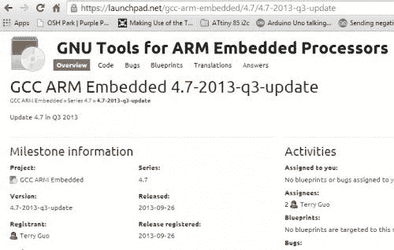
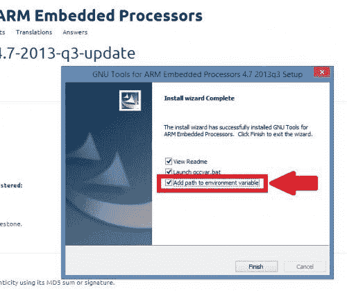
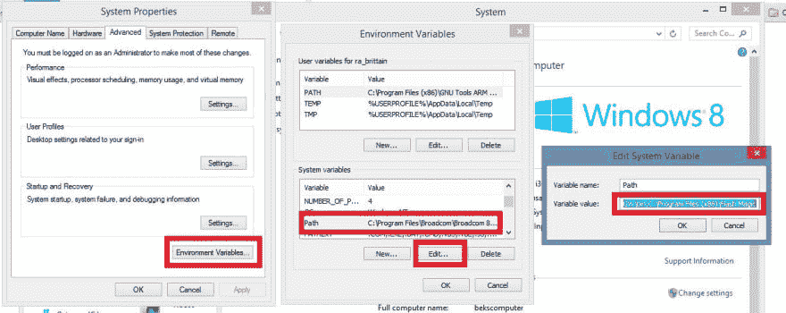
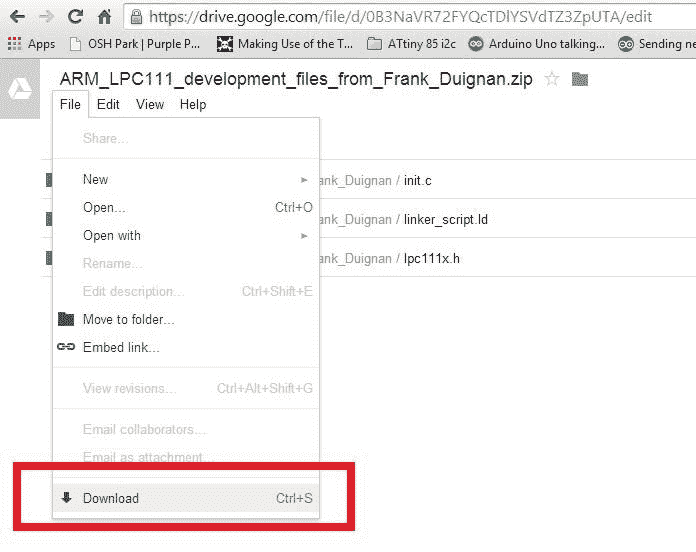
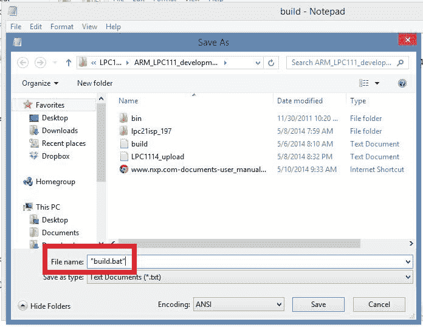
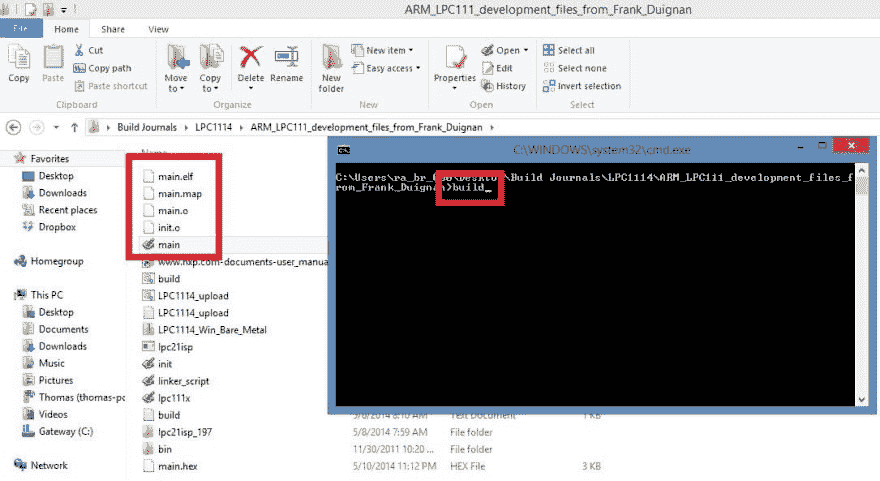
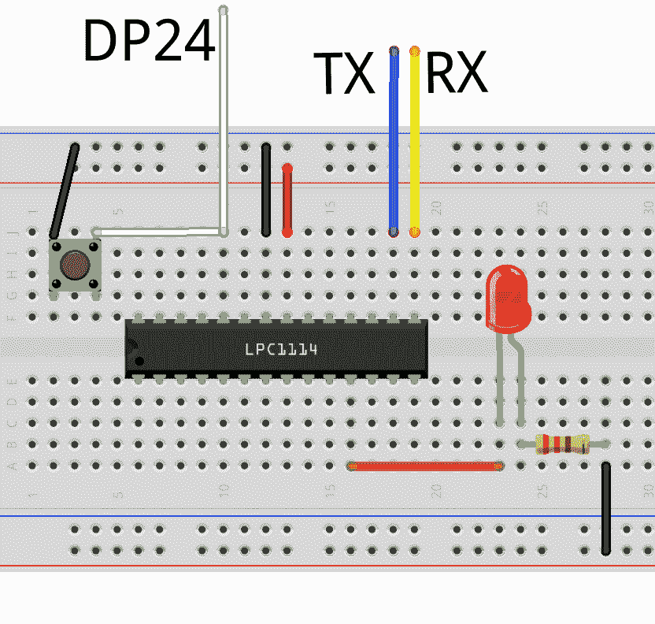

# LPC1114 - GCC 工具链设置

> 原文:[https://dev.to/ladvien/lpc1114-gcc-toolchain-setup-1bpg](https://dev.to/ladvien/lpc1114-gcc-toolchain-setup-1bpg)

更新:我调整了源代码并重新构建了 lpc21isp，以允许从 FTDI 分支进行自动模式切换、引导加载程序和程序。

几个月前 Bdk6 送了我一个 LPC1114 ARM 处理器。不打算说谎，我不知道如何使用芯片。

Bdk6 和他的孩子用芯片创造了瓦尔迪兹家族:

*   瓦尔迪兹家族

我试了几种方法让芯片运转起来。我对他们中的任何一个都不满意。

LPCXpresso 令人困惑和恐惧。因为我正在努力学习芯片*和*一个新的 IDE。此外，恩智浦没有芯片库，所以我试图集成 [LPC1114 代码库](http://www.microbuilder.eu/Projects/LPC1114ReferenceDesign/LPC1114CodeBase.aspx)。他们似乎是不完整和不被接受的。没关系，我似乎无法将库集成到 LPCExpresso 中。

然后我开始使用 Mbed。运气好得多。但是很不舒服。我敢打赌，大多数读者都熟悉 Mbed，因此，我不会像往常一样夸夸其谈地说它是基于网络的和闭源的。

Mbed 还有其他问题。

首先，它不是一个完整的开发解决方案。你需要一个闪存工具来上传代码到 LPC1114 芯片。最容易使用的工具是 [FlashMagic](http://www.flashmagictool.com/) ，它为您提供了一个与 LPC1114 交互的良好 GUI。有一个小问题，Mbed 产生了一个**。bin** 文件，LPC1114 需要一个**。hex** 文件，随后，FlashMagic 只允许上传。十六进制文件。因此，您必须使用第三个工具来转换文件。绑定到。上传前十六进制。叹气。很麻烦。

不管怎样，我最终让它闪了一下光

[视频](http://youtu.be/1tB5sTNYe20)

我渴望更多的自由，所以我开始寻找允许我自由编写 LPC1114 代码的工具。裸机解决方案。只有我，一个编译器，和 [LPC1114 用户手册](http://www.nxp.com/documents/user_manual/UM10398.pdf)(数据表)。幸运的是，大部分工作已经为我完成了。Frank Duignan、Ted Burke 和 Bdk6 已经为我小小的大脑预编译了几乎所有的答案。下面是我用来设置命令行编程环境的步骤。

[T2】](https://res.cloudinary.com/practicaldev/image/fetch/s--c92JUUHO--/c_limit%2Cf_auto%2Cfl_progressive%2Cq_auto%2Cw_880/https://ladvien.cimg/GCC_Download2.jpg)

**1。[下载并安装](https://launchpad.net/gcc-arm-embedded/4.7/4.7-2013-q3-update/+download/gcc-arm-none-eabi-4_7-2013q3-20130916-win32.exe)面向 ARM 嵌入式处理器的 GNU 工具(Win32 Release - 2013，第 3 季度)。在安装过程中，确保选中“添加环境变量的路径”框**

[T2】](https://res.cloudinary.com/practicaldev/image/fetch/s--sE8DC6E1--/c_limit%2Cf_auto%2Cfl_progressive%2Cq_auto%2Cw_880/https://ladvien.cimg/GCC_Download3.jpg)

**选中“添加环境变量”**

如果您错过了这一部分，您可以通过以下方式添加环境变量的路径:

右击这台电脑/我的电脑->属性->高级系统设置->环境变量->选择“系统变量->编辑”下的“路径”。转到路径列表的末尾，添加一个分号，然后放置 GNU tools bin 的路径。

对我来说，这是"**C:\ Program Files(x86)\ GNU Tools ARM Embedded \ 4.7 2013 Q3 \ bin**"

[T2】](https://res.cloudinary.com/practicaldev/image/fetch/s--mzYmw-1c--/c_limit%2Cf_auto%2Cfl_progressive%2Cq_auto%2Cw_880/https://ladvien.cimg/PATH_Variable2.jpg)

我们将向路径系统变量添加几个路径。因此，如果需要，请回头参考这些步骤。

[T2】](https://res.cloudinary.com/practicaldev/image/fetch/s--V6CX6tgG--/c_limit%2Cf_auto%2Cfl_progressive%2Cq_auto%2Cw_880/https://ladvien.cimg/Download_Batch.jpg)

**2。下载 [Frank Duignan 的](http://eleceng.dit.ie/frank/arm/BareMetalLPC1114/) Windows [链接器脚本](https://web.eecs.umich.edu/~prabal/teaching/eecs373-f11/readings/Linker.pdf)， [LPC1114 头文件](http://www.keil.com/dd/docs/arm/nxp/lpc11xx/lpc11xx.h)，构建批处理文件。**

[杜伊南的 LPC1114 工具](https://drive.google.com/file/d/0B3NaVR72FYQcTDlYSVdTZ3ZpUTA/edit)

Ted Burke 很好心地为我们张贴了这些照片。然而，我们使用这些神奇的工具还缺少两个部分。

**3。创建工作空间文件夹。如“C:\ Users \ lad vien \ Documents \ LPC 1114 _ Bare _ Metal”。**

**4。安装 [binutils](http://www.gnu.org/software/binutils/) 进行文件转换。** Binutils 必须为 Windows 编译，不过我可以找到预编译的版本。

下载为 Windows 编译的 [Binutils](http://sourceforge.net/projects/mingw/files/MinGW/Base/binutils/binutils-2.22/binutils-2.22-1-mingw32-bin.tar.lzma/download)

实际上，我们只对 **objcopy** 使用 Binutils，它位于批处理文件的末尾。这就翻译成了**。elf** 由 ARM 编译成一个**。十六进制**文件。为了解压 Binutils 文件，我推荐使用 [7zip](http://www.7-zip.org/download.html) 。安装后，将 bin 文件夹添加到您的环境变量中(参见步骤 1)。我呢，加了“**C:\ Users \ lad vien \ Documents \ LPC 1114 _ Bare _ Metal \ Ming 32 \ bin”。**

**5。在批处理文件中创建构建脚本。**

创建 Duignan 和 Burke 推荐构建批处理文件。打开你的工作区文件夹，创建一个新的文本文件，输入如下:

```
arm-none-eabi-gcc -mcpu=0 -mthumb -v -g -c init.c -o init.o
arm-none-eabi-gcc -mcpu=0 -mthumb -v -g -c main.c -o main.o
arm-none-eabi-ld init.o main.o -v -L "C:\Program Files (x86)\GNU Tools ARM Embedded\4.7 2013q3\lib\gcc\arm-none-eabi\4.7.4\armv6-m" -lgcc -T linker_script.ld --cref -Map main.map -nostartfiles -o main.elf
objcopy -O ihex main.elf main.hex 
```

<svg width="20px" height="20px" viewBox="0 0 24 24" class="highlight-action crayons-icon highlight-action--fullscreen-on"><title>Enter fullscreen mode</title></svg> <svg width="20px" height="20px" viewBox="0 0 24 24" class="highlight-action crayons-icon highlight-action--fullscreen-off"><title>Exit fullscreen mode</title></svg>

**将工作区中的文本文件另存为“build . bat”**确保包含引号，因为这会将文件从文本文件转换为批处理文件。这是 Duignan 放在一起的相同的构建命令，但是我添加了“-v”选项。这是详细模式，在编译过程中会出现错误。

[T2】](https://res.cloudinary.com/practicaldev/image/fetch/s--Z80EhJcX--/c_limit%2Cf_auto%2Cfl_progressive%2Cq_auto%2Cw_880/https://ladvien.cimg/Build_bat.jpg)

**6。设置一个 C++友好的文本编辑器，比如[程序员记事本](http://www.pnotepad.org/)。**

**7。在您的工作区目录中创建一个名为 main.c 的文件。输入以下文字:**

```
/* Simple PWM demonstrator program
 * The program simply ramps the duty of pin 10
 * from 0% to 100%  and then resets back to 0%
 *
 */

#include "lpc111x.h"  
void ConfigPins()
{
    SYSAHBCLKCTRL |= BIT6 + BIT16; // Turn on clock for GPIO and IOCON

    // Begin Port 0 setup.
    // Make Port 0 bit 5 behave as a generic output port (open drain)
    IOCON_PIO0_5 |= BIT8;
    // Make Port 0 bit 10 behave as a generic I/O port
    IOCON_SWCLK_PIO0_10  = 1;
    // Make Port 0 bit 11 behave as a generic I/O port
    IOCON_R_PIO0_11  = 1;
    // End Port 0 setup.

    // Make pin 10 behave as a PWM output CT32B1_MAT0
    IOCON_R_PIO1_1 |= BIT1 + BIT0;
}
void initPWM()
{
    // will use counter/timer CT32B1
    // Turn on CT32B1
    SYSAHBCLKCTRL |= BIT10;
    // Use match register 3 as period register because its output
    // is not pinned out.  A value of 48000000 produces a frequency of 1Hz
    // so, to generate a 30kHz pwm signal, set MR3 = 48000000/30000 = 1600
    TMR32B1MR3 = 1600;
    TMR32B1MR0 = 1600; // Zero output to begin with
    TMR32B1MCR = BIT10; // Reset TC on match with MR3
    TMR32B1TC = 0 ; // Zero the counter to begin with
    TMR32B1PWMC = BIT0; // Enable PWM on channel 0
    TMR32B1TCR = 1; // Enable the timer

}
void setDuty(int Duty)
{
    // sets the duty to the percent specified.
    // Need to 'invert' the requested duty as the PWM mechanism
    // resets the output at the start of each PWM cycle and then
    // sets it on match.
    TMR32B1MR0 = (100-Duty) << 4;
}
void delay(int dly)
{
    while(dly--);
}
int main()
{
    int Duty=50;
    ConfigPins();
    initPWM();
    while(1)
    {
        setDuty(Duty++);
        if (Duty > 100){
            for (Duty > 1; Duty--;){
                setDuty(Duty);
                delay(100000);
            }
        }
        delay(100000);
    }
} 
```

<svg width="20px" height="20px" viewBox="0 0 24 24" class="highlight-action crayons-icon highlight-action--fullscreen-on"><title>Enter fullscreen mode</title></svg> <svg width="20px" height="20px" viewBox="0 0 24 24" class="highlight-action crayons-icon highlight-action--fullscreen-off"><title>Exit fullscreen mode</title></svg>

保存主. c 文件。

我修改了 Duignan 的代码，使其与 Arduino 示例中的 **Fade** 草图相类似。

**8。在您的工作区目录中打开命令提示符。运行 build.bat 文件。**

[T2】](https://res.cloudinary.com/practicaldev/image/fetch/s--7UzLb7p6--/c_limit%2Cf_auto%2Cfl_progressive%2Cq_auto%2Cw_880/https://ladvien.cimg/Build_bat_2.jpg)

运行 build.bat 后，它应该构建五个文件:* * main.o，int.o，main.map，main.elf，main.hex. * *如果构建不正确，请仔细检查编译器和 binutils 的路径变量。

我们仍然存在将 main.hex 上传到 LPC1114 的问题。你可以使用 FlashMagic，就像上面一样，但我试图坚持使用命令行，这就是 **lpc21isp** 的用武之地。

我已经为 Windows 预建了 lpc21isp。

[下载 LPC21ISP](https://github.com/Ladvien/LPC21ISP_Win) (现在带自动模式切换！:)

但是如果这对你不起作用，那么你就必须[自己建造它](http://sourceforge.net/projects/lpc21isp/?source=dlp)。

10。创建另一个名为**LPC 1114 _ upload . bat**的批处理文件

这次只有一句台词:

**LPC 21 ISP-wipe-local echo-hex main . hex com 3 57600 12000**

您必须将 COM 端口调整到您正在使用的端口。下面是使用 lpc21isp **的一点** [指南。此外，您需要将 lpc21isp 文件放在 path 变量中添加的一个文件夹中。或者，确保 LPC1114_upload.bat 和 lpc21isp 文件与您的 main.hex 在同一个目录中。](http://pygmy.utoh.org/riscy/bootloader.html)

**11。给你的 LPC1114 接线。**

[T2】](https://res.cloudinary.com/practicaldev/image/fetch/s--CmqFx1UF--/c_limit%2Cf_auto%2Cfl_progressive%2Cq_auto%2Cw_880/https://ladvien.cimg/LPC1114_Wires.png)

我应该指出的最后一点是，当“DP24”接地，然后向 LPC1114 提供电压时，它将进入硬件引导程序。但是，如果 DP24 开路，或者(最好)在向 LPC1114 提供电压时用电阻上拉，那么它将运行已经上传到闪存的任何代码。

“DP24”实际上是端口 0 上的引脚 1。

[T2】](https://res.cloudinary.com/practicaldev/image/fetch/s--JkM-6PO5--/c_limit%2Cf_auto%2Cfl_progressive%2Cq_auto%2Cw_880/https://ladvien.cimg/pinout_dip28_detail-20131006-2.png)

**12。**将 LPC1114 的 RX/TX 连接到串行连接器，通过将 DP24 接地使其进入引导加载程序模式，然后给 LPC1114 通电。最后，运行 LPC1114_upload.bat 文件。这将导致连接到“SWDIO”引脚的 LED 逐渐变亮和变暗。

这就是我得到的。我现在要开始写代码了，所以我会把更多的内容加入到这篇文章中，因为我有更多的东西要分享。我计划在 6 月 1 日左右在我的实验室机器上尝试这些步骤，以确保它们有效。但是如果任何人在他们之前使用它们，请让我知道是否有需要改正的地方。一如既往，我重视反馈和批评。

**更新:FTDI 模式切换**

lpc21isp 允许[自动模式切换](http://letsmakerobots.com/looking-lpc1114-usb-serial-solution)，也就是说，您可以使用如下 FTDI 电缆:

[T2】](https://res.cloudinary.com/practicaldev/image/fetch/s--WXqSDLU_--/c_limit%2Cf_auto%2Cfl_progressive%2Cq_auto%2Cw_880/https://ladvien.cimg/FTDI_Reset.jpg)

然后将 LPC1114_upload.bat 文件中的行替换为

**LPC 21 ISP-wipe-local echo-control-hex main . hex com 3 57600 12000**

这将自动使 LPC1114 进入程序模式，上传您的代码，然后复位运行您新上传的程序。就像 Arduino 一样！ (Bdk6，你没看到那句话吧？:)

当然，lpc21isp 是一个结块，并且有一个错误(？)下载新代码后不会重置芯片。我简单地注释了一个 if 语句，它现在“正在工作”我肯定我已经失去了一些鲁棒性，但地狱，它做我想要的，没有明显的副作用。如果你想知道更多关于我如何“破坏”lpc21isp 的信息，请查看我在这个问题上的 Github [自述文件](https://github.com/Ladvien/LPC21ISP_Win/blob/master/README.md)。

[T2】](https://res.cloudinary.com/practicaldev/image/fetch/s--yseV1bi4--/c_limit%2Cf_auto%2Cfl_progressive%2Cq_auto%2Cw_880/https://ladvien.cimg/LPC1114_Bare_Metal_ARM2.jpg)