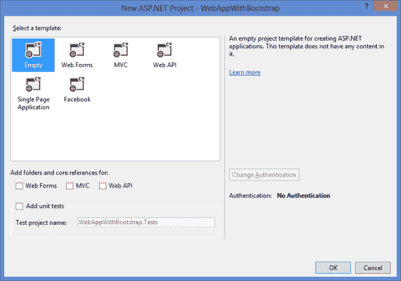
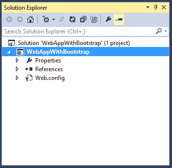
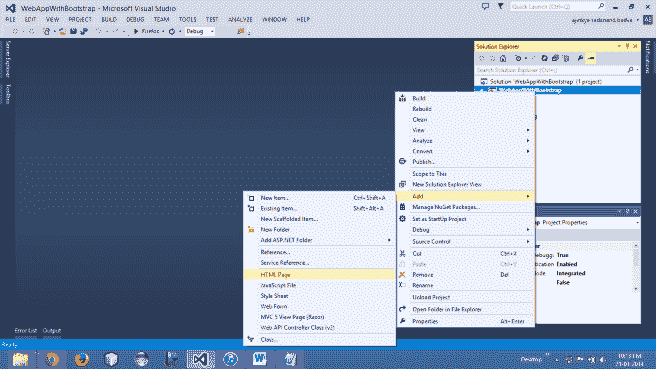
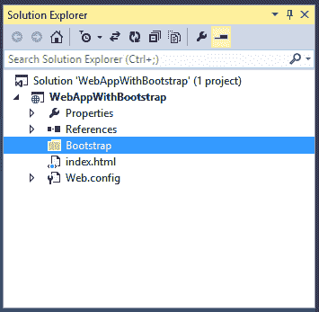
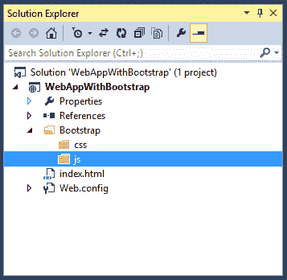
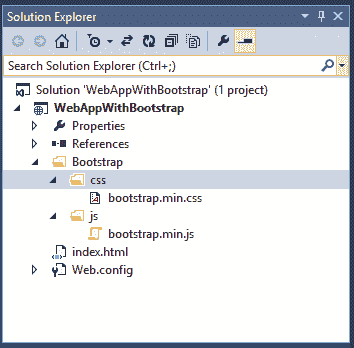
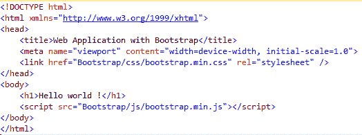
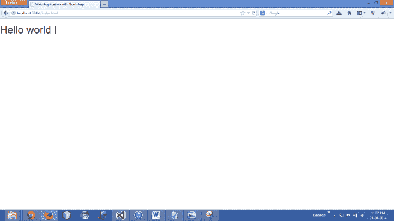

# 使用 Bootstrap UI 框架丰富您的 web 应用程序的用户界面

> 原文:[https://dev . to/mandarbadve/enrich-user-interface-of-your-web-application-with-bootstrap-ui-framework-4 hhj](https://dev.to/mandarbadve/enrich-user-interface-of-your-web-application-with-bootstrap-ui-framework--4hhj)

Bootstrap 是一个非常灵活、响应迅速的 UI 框架。它由 Twitter 制作，托管在 github 上。

你可以在 http://getbootstrap.com/找到更多细节

让我们开始将这个框架集成到您的 web 应用程序中。

首先你需要从上面提到的引导网站下载框架文件。下载将包含 ZIP 文件(bootstrap-x.x.x-dist。ZIP)

解压缩下载的 ZIP 文件后，您将获得三个文件夹:

*   css:这个文件夹包含了引导框架和主题的样式表文件
*   字体:该文件夹包含字体所需的文件
*   js:这个文件夹包含引导框架的 JavaScript 文件。

对于进一步的过程，我使用 Visual Studio 来创建和管理 web 应用程序。您可以使用任何编辑器来代替 Visual Studio。

在 Visual Studio 中，转到菜单:文件->新建->项目。它会打开新项目对话框。选择“ASP.NET Web 应用程序”并给出解决方案的名称。

 点击确定然后选择空项目类型。

[T2】](https://i1.wp.com/blog.mandarbadve.com/wp-content/uploads/2014/01/EmptyProject.png)

单击“确定”创建项目。

您将看到创建的解决方案如下。

[T2】](https://i0.wp.com/blog.mandarbadve.com/wp-content/uploads/2014/01/Solution1.png)

右键单击“WebAppWithBootstrap ”,选择“添加”,然后选择“HTML 页面”。

 赐名为 index.html

[T2】](https://i0.wp.com/blog.mandarbadve.com/wp-content/uploads/2014/01/Solution3.png)

Index.html 文件被创建并在编辑器中打开。

现在，通过右键单击解决方案并选择添加，然后选择新建文件夹来添加文件夹' Bootstrap'。

[T2】](https://i1.wp.com/blog.mandarbadve.com/wp-content/uploads/2014/01/Solution4.png)

然后在“Bootstrap”文件夹中创建两个名为“css”和“js”的文件夹

[T2】](https://i0.wp.com/blog.mandarbadve.com/wp-content/uploads/2014/01/Solution5.png)

现在，将“bootstrap.min.css”文件从提取的引导 zip 文件的 css 文件夹复制到解决方案的 css 文件夹中。另外，将“Bootstrap . min . js”JavaScript 文件从提取的 Bootstrap zip 文件的 js 文件夹复制到解决方案的 js 文件夹中。

[T2】](https://i2.wp.com/blog.mandarbadve.com/wp-content/uploads/2014/01/Solution6.png)

现在我们需要将添加的 css 和 js 文件引用到 index.html 文件中，如下所示。

[T2】](https://i0.wp.com/blog.mandarbadve.com/wp-content/uploads/2014/01/Solution7.png)

这里，我们添加了带有 viewport 的 meta 标签，并设置内容宽度=设备宽度。这使得你的页面反应灵敏。

我们已经完成了 Bootstrap 框架与 web 应用程序的集成。

现在在浏览器中打开页面。

[T2】](https://i1.wp.com/blog.mandarbadve.com/wp-content/uploads/2014/01/Solution8.png)

*本帖最初发表于[blog.mandarbadve.com](http://blog.mandarbadve.com/2014/01/21/enrich-user-interface-web-application-bootstrap-ui-framework/)T3】*