# 冶金 101 - AVR 课程日志

> 原文:[https://dev . to/lad vien/metallurgy-101-AVR-lesson-journal-3d5a](https://dev.to/ladvien/metallurgy-101-avr-lesson-journal-3d5a)

这是我的[机器人冶金 101 - AVR 课日志](http://letsmakerobots.com/node/39996)的延续

*   [usrt _ 1634 码运行库](https://github.com/Ladvien/ATtiny1634_AVR_Code)

**更新:现在用 UART(ish)！(2014 年 3 月 2 日)**

1.  **机器人冶金 101:[PWM](http://letsmakerobots.com/node/40483)T3】**
2.  **机器人冶金 101:[UART](http://letsmakerobots.com/node/40501)T3】**

当我开始从 Arduino C 和 IDE 的舒适操场上冒险时，我想我会记录我的工作。

我尝试了其他一些 ide 和 C++来处理不同的芯片。但是每次我意识到我对 C/C++、工具链和工作空间的了解还不足以用它们来制造机器人。

Bdk6 给了我一个 LCP1114，我可以让一个 blink 程序在上面运行，但它来自一个别人编译的. bin 文件，我只是上传了它。我尝试通过两次演练来设置编程环境(mbed 和 LPC1114)。两样都要。

我花了一些时间谷歌，试图找出我做错了什么。我得出的结论是，对于像我这样无知的人来说，没有足够的信息来弄清楚如何设置工作空间；LPC1114 是中级芯片，我是初学者。

我决定拉起 AVR 编程教程。我知道围绕 Atmel 芯片有一个完整的社区，一个除了 Arduino 社区之外的社区，一个裸机社区。我认为这是一个“初学者”环境，因为有足够的文档供我学习

所以，这让我们想起了我的日记。我写这个不是为了给任何人留下深刻印象。我只是发现，如果我强迫自己记录我正在做的事情，我会学得更好。它鼓励我理解信息，因为我必须向别人解释它。通过语言加工学习。话虽如此，我邀请批评。我写的任何不正确的地方，都可以对我大喊大叫；它会了解我。此外，已经写了很多这样的东西；我知道我不是原创。我也不妄想相信我解释得更好，但我确实计划让这篇日志流向 AVR 编程如何帮助我建造更好的机器人。好的。免责声明完成。

我在纽约订购了一些样品。

[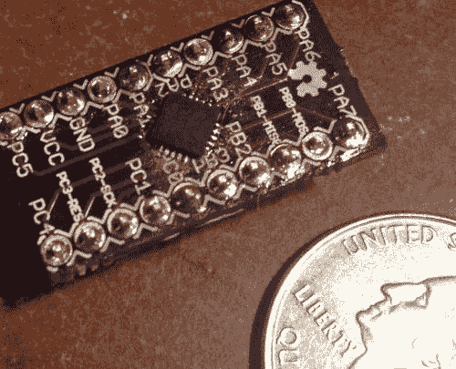T2】](https://res.cloudinary.com/practicaldev/image/fetch/s--1N7P_Ori--/c_limit%2Cf_auto%2Cfl_progressive%2Cq_auto%2Cw_880/https://ladvien.cimg/ATtiny_1634.jpg)

很久以前，我买了一台 AVR ISP MKII T1 来给 T2 的这些主板 T3 编程

[T2】](https://res.cloudinary.com/practicaldev/image/fetch/s--fP8N0OWA--/c_limit%2Cf_auto%2Cfl_progressive%2Cq_auto%2Cw_880/https://ladvien.cimg/AVR_ISP_MKII.jpg)

我这样连接了 1634 和 ISP，

[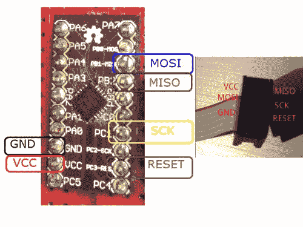T2】](https://res.cloudinary.com/practicaldev/image/fetch/s---WE0Xzrb--/c_limit%2Cf_auto%2Cfl_progressive%2Cq_auto%2Cw_880/https://ladvien.cimg/1634_to_ISP.jpg)

你说丝网印刷贴错了是什么意思...嘘。

在我弄清楚所有的引脚之后，我下载了 Atmel Studio 6.1。我知道对于使用什么样的 IDE 有很多不同的意见，其中很多人似乎更喜欢文本编辑器和 AVRDude，因为我想用商业 IDE 来改变一下。此外，似乎 AVRFreaks 组中的许多人实际上*喜欢* Atmel Studio。

这很容易设置。你安装它。插入你的 AVR ISP MKII。然后，文件->新建项目。选择“GCC C 可执行项目”并命名您的项目。点击“确定”Atmel Studio 将显示支持的芯片列表。我向下滚动直到找到我的芯片，“ATtiny1634。”你会注意到[数据表](http://www.atmel.comhttps://ladvien.cimg/Atmel-8303-8-bit-AVR-Microcontroller-tinyAVR-ATtiny1634_Datasheet.pdf)和支持的程序员在旁边。

好吧，所以，我在这里。IDE 全部设置完毕...嗯，现在我该怎么办？

我开始谷歌，直到我发现了一个 AVR 教程系列，看起来它会带我从基础，嗯，到串行通信。真的，我想如果我能学会下面的东西，我就能造出我想要的任何东西:

1.  数字引脚控制(高/低)。
2.  ADC。
3.  [脉宽调制](http://letsmakerobots.com/node/40483)
4.  图书馆创建。
5.  [UART](http://letsmakerobots.com/node/40501) 。
6.  I2C。

幸运的是，我找到了由[新手 Hack 的](http://www.newbiehack.com/)系列拼凑的系列。

*   [Newbiehack](http://www.newbiehack.com/)

因此，我决定尝试浏览一下他的所有教程，看看能否将它们应用到 ATtiny1634 上。注意:这个系列的作者似乎是[帕特里克·胡德-丹尼尔](http://www.newbiehack.com/aboutus.aspx)，一个德克萨斯人(不要因此而反对我们:P)。

**1。Blinkin LED**

新手 Hack 的 [MCU 第一个程序](http://www.newbiehack.com/MicrocontrollerWritingthefirstprogramandtransfer.aspx)。

我开始新手黑客的 AVR 系列后，他有他的程序员设置，他的“第一个程序。”uC 版本的“hello world”，LED 闪烁。在 Arduino 中，我会这样做，

```
int led = 13;

void setup() {
  pinMode(led, OUTPUT);
}

void loop() {
  digitalWrite(led, HIGH);   // turn the LED on (HIGH is the voltage level)
  delay(1000);               // wait for a second
  digitalWrite(led, LOW);    // turn the LED off by making the voltage LOW
  delay(1000);               // wait for a second
} 
```

<svg width="20px" height="20px" viewBox="0 0 24 24" class="highlight-action crayons-icon highlight-action--fullscreen-on"><title>Enter fullscreen mode</title></svg> <svg width="20px" height="20px" viewBox="0 0 24 24" class="highlight-action crayons-icon highlight-action--fullscreen-off"><title>Exit fullscreen mode</title></svg>

我让新手黑客的代码在 3 分钟内运行

我低头看了看我的分线板，我有一些“PBx”引脚，所以我想我有一个端口 b。我找到引脚 PB0(上图中标有“1”的引脚)，并在其上放置了 LED 和电阻。

[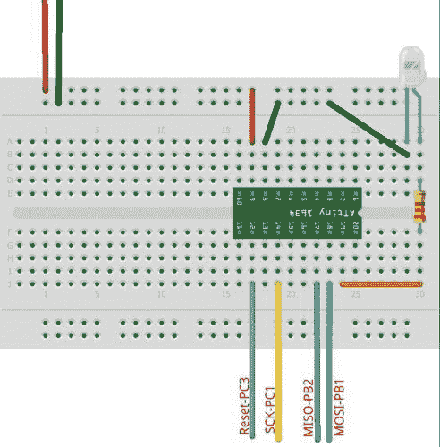T2】](https://res.cloudinary.com/practicaldev/image/fetch/s--S2JHjFV7--/c_limit%2Cf_auto%2Cfl_progressive%2Cq_auto%2Cw_880/https://ladvien.cimg/Fritz_1634_LED_img1.jpg)

我上传了程序，得到了这个:

[T2】](https://res.cloudinary.com/practicaldev/image/fetch/s--O5e2yHgk--/c_limit%2Cf_auto%2Cfl_progressive%2Cq_66%2Cw_880/https://ladvien.cimg/6rxg5.gif)

但是这篇日志的目的是让*了解*我在做什么，而不仅仅是复制它。所以，以下是对我自己的解释，以防我忘记东西。

**Blinkin LED 代码中发生了什么**

Atmel 芯片太神奇了。它们是多功能的小 UC，编程中利用这种多功能性的方式是通过改变一个[字节](http://en.wikipedia.org/wiki/Byte)内的[位](http://en.wikipedia.org/wiki/Bit)。例如，一个管脚既可以作为输入也可以作为输出，但是芯片怎么知道是哪一个呢？更改引脚的数字方向寄存器(DDR)位。DDR 位是一个小开关，可以通过编程打开或关闭。当它关闭(0)时，引脚作为输入，当它设置为开时，它作为输出。

现在，Atmel 芯片分为**端口**，这三个端口有 8 个管脚(或更少)。这允许一个字节控制一个端口的许多功能。

《新手黑客》很好地解释了这一点。他甚至画了一幅画；我喜欢图片。

我喜欢用图像来思考，所以我把每一点都看成一个 LED。有道理，一个 LED 有开/关两种状态；一个位有两种状态 0 或 1。因此，对我来说，一个字节就是 8 个编号为 0-7 的 led。

[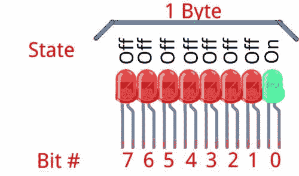T2】](https://res.cloudinary.com/practicaldev/image/fetch/s--AeDdW3_V--/c_limit%2Cf_auto%2Cfl_progressive%2Cq_auto%2Cw_880/https://ladvien.cimg/LED_Bitwise_2_bb.jpg)

上面的图像可以代表下面的代码:

```
DDRB = 0B00000001; 
```

<svg width="20px" height="20px" viewBox="0 0 24 24" class="highlight-action crayons-icon highlight-action--fullscreen-on"><title>Enter fullscreen mode</title></svg> <svg width="20px" height="20px" viewBox="0 0 24 24" class="highlight-action crayons-icon highlight-action--fullscreen-off"><title>Exit fullscreen mode</title></svg>

Atmel 芯片有不同的端口，这些端口通常有一排管脚。因此，DDR 代表端口 B 的数字方向寄存器。然后，我们通过将某个位设为 0 或 1，为端口 B (PB0-PB7)上的每个引脚分配一个状态。因此，根据图像和我们的代码，我们将端口 B1-7 设置为输入(0 =输入)，PB0 设置为输出。

但是不要迷惑，我们连接的 LED 还没有打开。PB0 上的电压仍然等于 0。但是，我们现在可以将电压从 0 变为 5。我们通过更改另一个注册表来做到这一点。港口国注册处。

```
PORTB = 0B00000001; 
```

<svg width="20px" height="20px" viewBox="0 0 24 24" class="highlight-action crayons-icon highlight-action--fullscreen-on"><title>Enter fullscreen mode</title></svg> <svg width="20px" height="20px" viewBox="0 0 24 24" class="highlight-action crayons-icon highlight-action--fullscreen-off"><title>Exit fullscreen mode</title></svg>

实际上将端口 B 上的引脚 0 (PB0)设置为 5 伏。其他引脚仍然设置为输入，因此您不能更改电压。

简单的人？嗯，我们还必须插入一个延迟。延迟实际上只是告诉 uC 有多少个周期不做任何事情。这涉及到一些数学问题，即划分时钟速度，以获得您想要的有限数字形式的精确时间延迟。这个数学作为一个函数被锁在文件中。因此，为了我们的缘故，这是一个简单的添加:

```
_delay_ms(500); 
```

<svg width="20px" height="20px" viewBox="0 0 24 24" class="highlight-action crayons-icon highlight-action--fullscreen-on"><title>Enter fullscreen mode</title></svg> <svg width="20px" height="20px" viewBox="0 0 24 24" class="highlight-action crayons-icon highlight-action--fullscreen-off"><title>Exit fullscreen mode</title></svg>

这告诉我们的 Tiny 闲置半秒钟，然后继续。还有一个 _delay_us()函数，会延迟微秒。

好的。这是我的学习笔记

**注意#1:调整时钟保险丝。**

我确实对 NH 的程序做了一个修改。他用 AVRDude 上传他的程序。Atmel Studio 实际上有专门针对 Tiny1634 的库，这些库包含在您的项目设置中。其中一个库要求你告诉程序 CPU 的运行速度。ATtiny 有一个内部 8mhz 振荡器，但有一个 [Atmel 保险丝](http://www.ladyada.net/learn/avr/fuses.html)在工厂烧成 8mhz，给你 1mhz 的运行速度。我想让我的 1634 以 8mhz 的最高频率工作。

于是，我去**工具- >设备编程**。然后你必须为我选择你的“工具”AVR ISP MKII 你的设备，ATtiny1634 给我；接口，ISP。然后点击“应用”现在，在“设备签名”下点击“阅读”这将弹出设备编程器窗口。现在，确保您的编程器正确连接到您的芯片，并且您有一个稳定的连接(可能会在 Tiny1634 上的 VCC 和 GND 之间放置一个 0 . 1 uf 的径向电容器)。单击“保险丝”选项卡。

[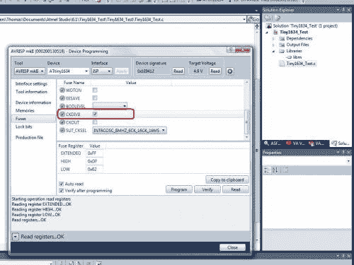T2】](https://res.cloudinary.com/practicaldev/image/fetch/s--v-WIkVHT--/c_limit%2Cf_auto%2Cfl_progressive%2Cq_auto%2Cw_880/https://ladvien.cimg/ATtiny1634_Lesson_1_img2.jpg)

取消选中“CKDIV8”正是保险丝做到了它所说的，将时钟除以 8，将芯片从 8mhz 降低到 1mhz。 **此时不要更换其他任何保险丝。**点击“程序”按钮。这将设置保险丝。如果一切顺利，我们没有砖你的芯片。

当我们在器件编程窗口下时，点击“存储器”选项卡。这是你将编译好的程序上传到芯片上的地方。在这里，如果您点击省略号，您可以选择您想要上传的代码。这个结尾是”。elf”(除非你用的是除了 Tiny 之外的芯片，那么它会以。巨魔，呵呵)。所以，选择你的代码，然后点击“程序”

[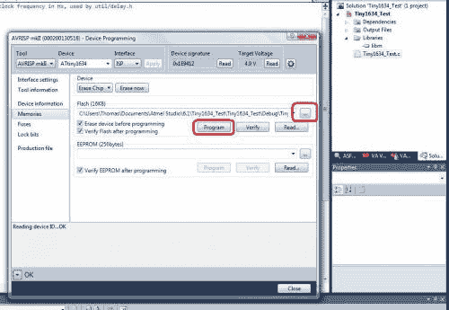T2】](https://res.cloudinary.com/practicaldev/image/fetch/s--DMlS3PZV--/c_limit%2Cf_auto%2Cfl_progressive%2Cq_auto%2Cw_880/https://ladvien.cimg/ATtiny1634_Lesson_1_img3.jpg)

现在，Atmel Studio 设置为每当您点击“F5”时，使用最后选择的设备自动编程您的代码可悲的是，我发现这很少正常工作。但我敢打赌，这是因为我没有去耦电容——是的，我证实了这一点。我在 VCC 和 GND 之间放置了一个 1uF 的径向电容，现在“F5”编程按预期工作。我不知道。不过，如果我手动编程的话，似乎可以。耸肩。

好的。现在我们有了 8mhz 的微处理器，我们需要在代码中对此进行调整。

```
#define F_CPU 8000000 // AVR clock frequency in Hz, used by util/delay.h</pre> 
```

<svg width="20px" height="20px" viewBox="0 0 24 24" class="highlight-action crayons-icon highlight-action--fullscreen-on"><title>Enter fullscreen mode</title></svg> <svg width="20px" height="20px" viewBox="0 0 24 24" class="highlight-action crayons-icon highlight-action--fullscreen-off"><title>Exit fullscreen mode</title></svg>

这里我们告诉程序我们的芯片运行在 8mhz (8，000，000 [赫兹](http://en.wikipedia.org/wiki/Hertz))上。

在这之后，我上传了代码，它正如我所希望的那样运行。LED 会亮半秒钟，然后熄灭半秒钟。

好吧，再来几个音符。

**注意#2:引脚快捷键和[位运算符](http://en.wikipedia.org/wiki/Bitwise_operations_in_C)。**

按位运算符是可以对二进制数执行的算术运算。主要有四种:

1.  [和](http://en.wikipedia.org/wiki/Bitwise_operations_in_C#Bitwise_AND_.22.26.22) ( &)
2.  [或](http://en.wikipedia.org/wiki/Bitwise_operations_in_C#Bitwise_OR_.22.7C.22) (|)
3.  [异或](http://en.wikipedia.org/wiki/Bitwise_operations_in_C#Bitwise_XOR_.22.5E.22) (^)
4.  [不是](http://en.wikipedia.org/wiki/Bitwise_operations_in_C#Bitwise_NOT_.22.7E.22_.2F_One.27s_Complement_.28Unary.29) (~)

我不会详细介绍按位运算符，因为新手 Hacks 很好地解释了它们。而且网上到处都是。但是对于我们的目的，建造机器人，知道它们看起来像什么以及它们会对我们的位做什么是很好的(记住，您的 pin 的输出是由位注册表控制的)。

因此，我将介绍两个适用于我们示例的助手和一个按位助手: **OR、** **XOR、**和 **< <** (左移)。

**OR 运算符:**

我们了解到，下面将引脚 PB0 设置为输出。

```
DDRB = 0b00000001; 
```

<svg width="20px" height="20px" viewBox="0 0 24 24" class="highlight-action crayons-icon highlight-action--fullscreen-on"><title>Enter fullscreen mode</title></svg> <svg width="20px" height="20px" viewBox="0 0 24 24" class="highlight-action crayons-icon highlight-action--fullscreen-off"><title>Exit fullscreen mode</title></svg>

但是我们可以使用按位运算符，或者，做同样的事情，

```
DDRB |= 0b00000001; 
```

<svg width="20px" height="20px" viewBox="0 0 24 24" class="highlight-action crayons-icon highlight-action--fullscreen-on"><title>Enter fullscreen mode</title></svg> <svg width="20px" height="20px" viewBox="0 0 24 24" class="highlight-action crayons-icon highlight-action--fullscreen-off"><title>Exit fullscreen mode</title></svg>

“|=”是一个缩写操作，表示以下内容，

```
DDRB = DDRB | 0b0000001; 
```

<svg width="20px" height="20px" viewBox="0 0 24 24" class="highlight-action crayons-icon highlight-action--fullscreen-on"><title>Enter fullscreen mode</title></svg> <svg width="20px" height="20px" viewBox="0 0 24 24" class="highlight-action crayons-icon highlight-action--fullscreen-off"><title>Exit fullscreen mode</title></svg>

在英语中，“在 DDRB 的东西等同于在 DDRB 的东西”

看起来像这样，

[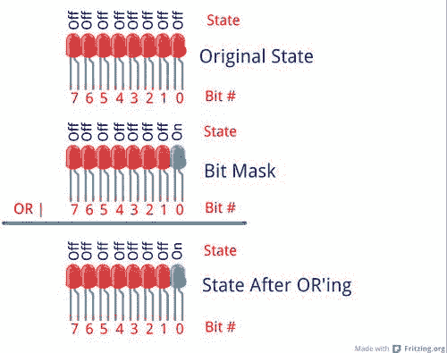T2】](https://res.cloudinary.com/practicaldev/image/fetch/s--mwnSrgkX--/c_limit%2Cf_auto%2Cfl_progressive%2Cq_auto%2Cw_880/https://ladvien.cimg/LED_Bitwise_3_OR_bb.jpg)

像 OR'ing 这样的按位运算符是在整个字节上完成的。也就是说，0-7 的每一位都是“或”运算，所以你必须记住，在你想要改变的位上，操作不是只在*完成。这就是真值表的用武之地。下表描述了 OR 运算的输出。*

**或(|)**

[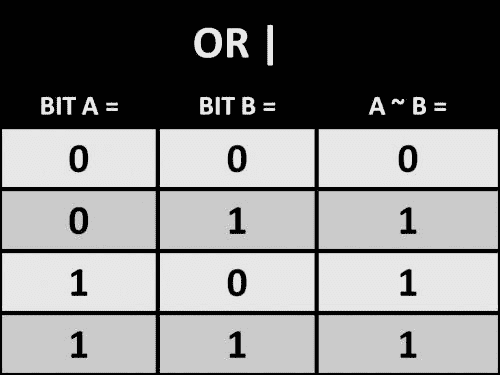T2】](https://res.cloudinary.com/practicaldev/image/fetch/s--FFJYUDuh--/c_limit%2Cf_auto%2Cfl_progressive%2Cq_auto%2Cw_880/https://ladvien.cimg/Bitwise_Operators_OR_2.jpg)

**左移< < :**

**(注:我最初犯了一些关于左移运算符的错误； [6677 已经在评论里对左移运算符](http://letsmakerobots.com/node/39996#comment-114517)进行了非常清晰的描述。)**

在电子学中，寄存器通常有固定的宽度。例如，PORTB 注册表的宽度为 8 位(0-7)。左移运算符(<

```
PORTB = DDRB | 1 << 3; 
```

<svg width="20px" height="20px" viewBox="0 0 24 24" class="highlight-action crayons-icon highlight-action--fullscreen-on"><title>Enter fullscreen mode</title></svg> <svg width="20px" height="20px" viewBox="0 0 24 24" class="highlight-action crayons-icon highlight-action--fullscreen-off"><title>Exit fullscreen mode</title></svg>

上面采用了在 DDRB 分配的二进制数，并将其与完全相同的位掩码进行“或”运算，除了第三个引脚，该引脚等于 1。因此， **PORTB** 在操作后看起来应该是这样的，

[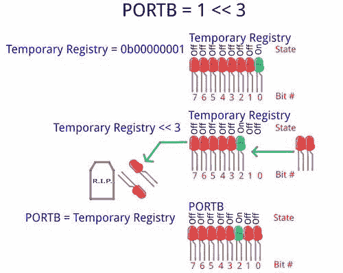T2】](https://res.cloudinary.com/practicaldev/image/fetch/s--psiYpL90--/c_limit%2Cf_auto%2Cfl_progressive%2Cq_auto%2Cw_880/https://ladvien.cimg/LED_Bitwise_ShiftLeft_bb.jpg)

这对我来说似乎更复杂，但我知道当你开始拆开 AVR 的金属时，这变得非常重要。

最后一点，包含定义的引脚常数。所以，这个操作，

```
DDRB |= 0b00000001; 
```

<svg width="20px" height="20px" viewBox="0 0 24 24" class="highlight-action crayons-icon highlight-action--fullscreen-on"><title>Enter fullscreen mode</title></svg> <svg width="20px" height="20px" viewBox="0 0 24 24" class="highlight-action crayons-icon highlight-action--fullscreen-off"><title>Exit fullscreen mode</title></svg>

可以这样写，

```
DDRB |= 1 << PINB0; 
```

<svg width="20px" height="20px" viewBox="0 0 24 24" class="highlight-action crayons-icon highlight-action--fullscreen-on"><title>Enter fullscreen mode</title></svg> <svg width="20px" height="20px" viewBox="0 0 24 24" class="highlight-action crayons-icon highlight-action--fullscreen-off"><title>Exit fullscreen mode</title></svg>

他们做完全相同的事情-我猜后者更容易阅读。Pfft。

**异或运算符:**

XOR (^)运算符非常类似于 OR 运算。除非 A 和 B 相等，否则结果为 0。它们不相等，结果是 1。这是异或真值表。

**异或(^)**

[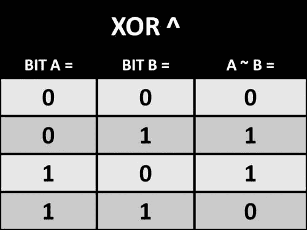T2】](https://res.cloudinary.com/practicaldev/image/fetch/s--DxqvLDFg--/c_limit%2Cf_auto%2Cfl_progressive%2Cq_auto%2Cw_880/https://ladvien.cimg/Bitwise_Operators_XOR.jpg)

回到 LED 的例子，这里是异或运算。

[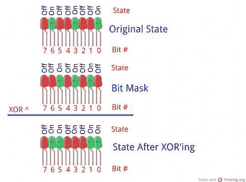T2】](https://res.cloudinary.com/practicaldev/image/fetch/s--AqMUmfny--/c_limit%2Cf_auto%2Cfl_progressive%2Cq_auto%2Cw_880/https://ladvien.cimg/LED_Bitwise_7_XOR_bb.jpg)

我们使用 XOR 运算来关闭和打开 LED。因为对一个位的 XOR 运算基本上是将它设置到它所在的相反位置。因此，如果是 0，它就变成 1，如果是 1，它就变成 0。这意味着我们实际上可以使用操作来缩短或闪烁代码。

因此，我们对 Blinkin LED 的简化代码是，

```
#define F_CPU 8000000    // AVR clock frequency in Hz, used by util/delay.h
#include <avr/io.h> #include <util/delay.h>  
int main(void)
{
    DDRB = 0b00000001;

    while(1)
    {
        PORTB = 0b00000001;
        _delay_ms(500);
        PORTB = 0b00000000;
        _delay_ms(500);
    }
} 
```

<svg width="20px" height="20px" viewBox="0 0 24 24" class="highlight-action crayons-icon highlight-action--fullscreen-on"><title>Enter fullscreen mode</title></svg> <svg width="20px" height="20px" viewBox="0 0 24 24" class="highlight-action crayons-icon highlight-action--fullscreen-off"><title>Exit fullscreen mode</title></svg>

仅此而已。这是我目前所知的。现在，在我继续前进之前，我计划尝试连接一个 [SN754410](http://www.ti.com/lit/ds/symlink/sn754410.pdf) 和两个小电机。我想，我们知道如何执行数字引脚控制，这应该允许使用控制电机方向，即使我们还不能控制速度。

机器人应用说明#1: **SN754410 和 ATtiny1634**

首先要做的是连接 H 桥。

[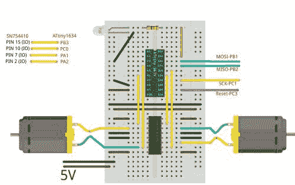T2】](https://res.cloudinary.com/practicaldev/image/fetch/s--AKgxIx5r--/c_limit%2Cf_auto%2Cfl_progressive%2Cq_auto%2Cw_880/https://ladvien.cimg/ATtiny1634_SN754410_7.jpg)

您可能会注意到，我们将两个“EN”引脚都连接到 5v，我还不知道如何用 AVR 产生 PWM(但我希望能实现这一点，所以我将再次讨论这一点)。此外，我使用 5v 作为我的电机源和 Tiny1634 源。我用的马达是这些小家伙。我认为，由于 SN754410 的压降约为 1.4-2v，因此我将非常接近我的电机的目标电压(5v - 1.4v = 3.6v)。我保持一切接近极小的额定电压；我想如果我接错了线，保持低电压会更安全。

说得好，这就是我最后遇到的布线混乱...我想我会从一个马达开始，然后转向两个。

[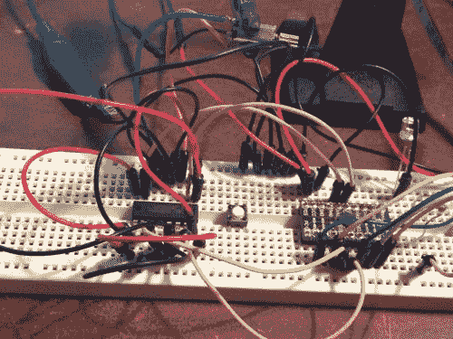T2】](https://res.cloudinary.com/practicaldev/image/fetch/s--uCcy39sA--/c_limit%2Cf_auto%2Cfl_progressive%2Cq_auto%2Cw_880/https://ladvien.cimg/IMG_0388.jpg)

我开始思考代码。我知道 SN754410 的基本知识，我希望能够触及它的真值表的所有功能。

[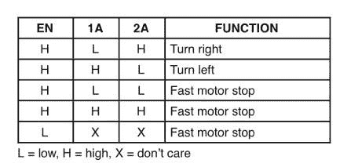T2】](https://res.cloudinary.com/practicaldev/image/fetch/s--GQJLTWEx--/c_limit%2Cf_auto%2Cfl_progressive%2Cq_auto%2Cw_880/https://ladvien.cimg/hbridge_labpinout.jpg)

因此，我想我需要做的就是让我的两个 IO 引脚变为高电平和低电平，以转向一个方向，然后将它们切换到相反的方向。这让我想起了 XOR (^)算子，因为它确实是这样做的，向它的反面转了一点。这是我们用来闪烁 LED 的同一个操作员。我以下面的代码结束:

```
#define F_CPU 8000000    // AVR clock frequency in Hz, used by util/delay.h
#include <avr/io.h> #include <util/delay.h>  
int x;
int main(void)
{
    DDRB |= 1 << PINB0; //We set the LED pin to output.
    DDRA |= 1 << PINA1; //Setup motor A IO 1
    DDRA |= 1 << PINA2; //Setup motor A IO 2

    PORTA |= 1 << PINA1; //Set motor A IO 1 high.  Motor A IO 2 will default low.

    while(1)
    {
        // "^=" changes the state of the bit to the opposite of its current.
        PORTB ^= 1 << PINB0;  //LED ON/OFF.
        PORTA ^= 1 << PINA1;  //Motor A starts HIGH, this flips it low, or back again.
        PORTA ^= 1 << PINA2;  //Motor A starts LOW, this flips it high, or back again.
        _delay_ms(500);
    }
} 
```

<svg width="20px" height="20px" viewBox="0 0 24 24" class="highlight-action crayons-icon highlight-action--fullscreen-on"><title>Enter fullscreen mode</title></svg> <svg width="20px" height="20px" viewBox="0 0 24 24" class="highlight-action crayons-icon highlight-action--fullscreen-off"><title>Exit fullscreen mode</title></svg>

这个代码移动我的马达一个方向，然后另一个方向。但是在方向的变化之间没有停顿。我拉它的一部分很快，因为我通常有坏运气与电感瞬间逆转。

[视频](http://youtu.be/YVd9ZZdimIw)

嗯，那可不行。但我意识到了另一个问题。XOR 运算符会将引脚从高电平翻转到低电平，然后再翻转回来。但是我如何将两个引脚都设置为低电平呢？还是两者都太高了？现在，在 Arduino C 中这很简单，你只需写 digitalWrite(pin#，高电平)，但在 AVR 中我们控制位。

我知道我可以用手写完成，就像这样:

```
#define F_CPU 8000000    // AVR clock frequency in Hz, used by util/delay.h
#include <avr/io.h> #include <util/delay.h>  
int main(void)
{
    DDRB |= 1 << PINB0; //We set the LED pin to output.
    DDRA |= 1 << PINA1; //Setup motor A IO 1
    DDRA |= 1 << PINA2; //Setup motor A IO 2

    while(1)
    {
        //This will set the pins high or low, but it does not maintain other pin states.
        PORTB ^= 1 << PINB0; //LED ON/OFF.
        PORTA = 0b00000010;  //This sets PINA1 HIGH, and PINA2 LOW.
        _delay_ms(1500);     //Wait 1.5 seconds.

        PORTB ^= 1 << PINB0; //LED ON/OFF.
        PORTA = 0b00000000;  //This sets PINA1 LOW, and PINA2 LOW.
        _delay_ms(1500);     //Wait 1.5 seconds.

        PORTB ^= 1 << PINB0;  //LED ON/OFF.
        PORTA = 0b00000100;  //This sets PINA1 HIGH, and PINA2 LOW.
        _delay_ms(1500);     //Wait 1.5 seconds.

        PORTB ^= 1 << PINB0;  //LED ON/OFF.
        PORTA = 0b00000000;  //This sets PINA1 HIGH, and PINA2 LOW.
        _delay_ms(1500);     //Wait 1.5 seconds.
    }
} 
```

<svg width="20px" height="20px" viewBox="0 0 24 24" class="highlight-action crayons-icon highlight-action--fullscreen-on"><title>Enter fullscreen mode</title></svg> <svg width="20px" height="20px" viewBox="0 0 24 24" class="highlight-action crayons-icon highlight-action--fullscreen-off"><title>Exit fullscreen mode</title></svg>

这给了我想要的输出。马达将向一个方向转动 1.5 秒，然后停止，向另一个方向转动，然后停止，并重新开始。像这样:

[视频](http://youtu.be/WAiDQo9F8Yk)

我觉得这段代码有些臃肿。另一个问题出现了:如果我的 LED 在 PORTA 上呢？这意味着我需要跟踪三个位的状态(1)控制电机连接 A 的位，(2)控制电机连接 B 的位，以及(3) LED。这意味着我需要跟踪 9 个可能的状态(3 个引脚^ 2 个状态= 9 个引脚状态)。现在，我也许可以在心里做到这一点，但这会很费力，尤其是当我的代码动态修改 PORTA 注册表时。但是如果全部 8 个引脚都被使用了呢？8 引脚^ 2 状态= 64 引脚状态。嗯...不。我做不到。

它击中了我。这就是位掩码和位运算符如此重要的原因；它们动态地改变一个位的状态，同时保留注册表其余部分的状态。俏皮。

我花了一些时间在新手 Hack 的教程: [MCU LED 闪烁](http://www.newbiehack.com/MicrocontrollerLEDblink.aspx)教程。确切地说，[那边的视频](http://youtu.be/GSuynyy5MTc?t=56s)。在书中，他解释了如何使用按位运算符和位掩码来改变一个管脚的状态，同时保持所有其他管脚的状态。

现在我们在做饭。

我们已经知道了设置一位高的按位运算符(和掩码): **OR。**

**或(|)** 运算符将 a 引脚设为高电平:

[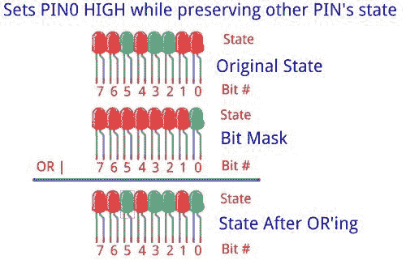T2】](https://res.cloudinary.com/practicaldev/image/fetch/s--lxvrG87---/c_limit%2Cf_auto%2Cfl_progressive%2Cq_auto%2Cw_880/https://ladvien.cimg/LED_Bitwise_5_OR_bb.jpg)

遗憾的是，在保留注册表的同时清除一点会稍微复杂一些。为了清除一个位，我们仍然使用一个位掩码，但是我们使用两个操作符:**和(& )** 和 **NOT (~)** 。他们的真值表如下所示:

**和(& )**

[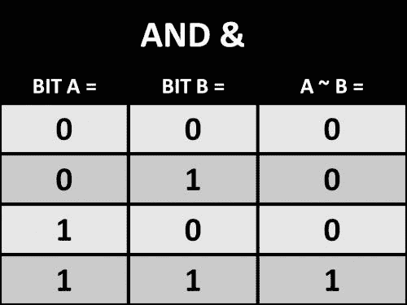T2】](https://res.cloudinary.com/practicaldev/image/fetch/s--aPJU-CHr--/c_limit%2Cf_auto%2Cfl_progressive%2Cq_auto%2Cw_880/https://ladvien.cimg/Bitwise_Operators_AND_2_0.jpg)

**NOT (~)** 与其他运算符不同，它很简单。它反转该位。如果是 0，就变成 1，如果是 1，就变成 0。

[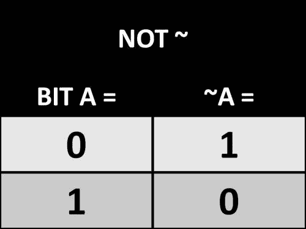T2】](https://res.cloudinary.com/practicaldev/image/fetch/s--5HdGpkYN--/c_limit%2Cf_auto%2Cfl_progressive%2Cq_auto%2Cw_880/https://ladvien.cimg/Bitwise_Operators_NOT.jpg)

我们不是立即修改端口状态，而是用 NOT 操作符修改我们的位掩码。这给了我们相反的掩码(00000001 变成 11111110)。然后，我们将反转的掩码与端口的原始状态进行 AND (&)运算，以清除 PIN0，同时保留其他位的状态。下面以**而不是**、**和**的 LED 操作为例来说明一下:

[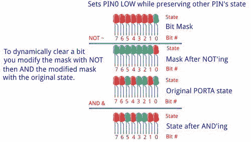T2】](https://res.cloudinary.com/practicaldev/image/fetch/s--FOdAji2u--/c_limit%2Cf_auto%2Cfl_progressive%2Cq_auto%2Cw_880/https://ladvien.cimg/LED_Bitwise_1_AND_NOT_bb_2.jpg)

好的。我能理解这件事。我开发了下面的代码做我想要的:

```
#define F_CPU 8000000    // AVR clock frequency in Hz, used by util/delay.h
#include <avr/io.h> #include <util/delay.h>  
int main(void)
{
    DDRB |= 1 << PINB0; //We set the LED pin to output.
    DDRA |= 1 << PINA1; //Setup motor A IO 1
    DDRA |= 1 << PINA2; //Setup motor A IO 2

    while(1)
    {
        //Sets motor input A LOW, B HIGH.
        PORTB ^= 1 << PINB0;        //LED ON/OFF.
        PORTA |= 1 << PINA1;        //This sets PINA1 HIGH.
        PORTA &= ~ (1 << PINA2);    //This sets PINA2 LOW.
        _delay_ms(1500);            //Wait 1.5 seconds.

        //Sets both motor inputs to low.
        PORTB ^= 1 << PINB0;        //LED ON/OFF.
        PORTA &= ~ (1 << PINA1);    //This sets PINA1 LOW.
        PORTA &= ~ (1 << PINA2);    //This sets PINA2 LOW.
        _delay_ms(1500);            //Wait 1.5 seconds.

        //Sets motor input A HIGH, B LOW.
        PORTB ^= 1 << PINB0;        //LED ON/OFF.
        PORTA &= ~ (1 << PINA1);    //This sets PINA1 LOW.
        PORTA |= 1 << PINA2;        //This sets PINA2 HIGH.
        _delay_ms(1500);            //Wait 1.5 seconds.

        //Sets both motor inputs to low.
        PORTB ^= 1 << PINB0;        //LED ON/OFF.
        PORTA &= ~ (1 << PINA1);    //This sets PINA1 LOW.
        PORTA &= ~ (1 << PINA2);    //This sets PINA2 LOW.
        _delay_ms(1500);            //Wait 1.5 seconds.
        }

} 
```

<svg width="20px" height="20px" viewBox="0 0 24 24" class="highlight-action crayons-icon highlight-action--fullscreen-on"><title>Enter fullscreen mode</title></svg> <svg width="20px" height="20px" viewBox="0 0 24 24" class="highlight-action crayons-icon highlight-action--fullscreen-off"><title>Exit fullscreen mode</title></svg>

代码到非 PIN 看起来像这样`PORTA &= ~ (1 << PINA1);.`用简单的英语和操作顺序，“设置 PORTA PIN1 为高，创建 PORTA 的位掩码，然后不是那个位掩码。之后，取未加的位掩码，并将其与 PORTA 的原始状态相加。

**咻。**我不确定自己写完之后还能理解。但我理解。真的，`PORTA &= ~ (1 << PINA1) = Set PA1 LOW.`

但这很好。我们现在可以动态地改变一个引脚的状态，而不会破坏同一端口上其他引脚的状态。Booyah！

好吧，让我们孤注一掷；现在，我知道如何设置引脚高或低，我想一个简单的方法来控制与 AVR 电机。我写了五个函数。四个控制电机的状态(HH、LL、LH、HL)，一个是接受变量的延迟功能。这些函数可以从主循环中调用。每个函数都需要三个参数，两个 pin 号和您希望函数运行的毫秒数。

```
#define F_CPU 8000000    // AVR clock frequency in Hz, used by util/delay.h
#include <avr/io.h> #include <util/delay.h>  
void delay_ms(int ms)
{
    //We make our own millisecond delay function because
    //the _delay_ms does not like dynamic variables.  Meaning
    //you cannot pass it a variable.  By making our own, we can.
    while (ms--) {
        _delay_us(1000);  // one millisecond
    }
}

int forward(int motPinA, int motPinB, int motorFireDuration)
{
    //Sets motor input A LOW, B HIGH.
    PORTB ^= 1 << PINB0;        //LED ON/OFF.
    PORTA |= 1 << motPinA;      //This sets PINA1 HIGH.
    PORTA &= ~ (1 << motPinB);  //This sets PINA2 LOW.
    delay_ms(motorFireDuration);            //Wait 1.5 seconds.
}

int backward(int motPinA, int motPinB, int motorFireDuration)
{
    //Sets motor input A HIGH, B LOW.
    PORTB ^= 1 << PINB0;        //LED ON/OFF.
    PORTA &= ~ (1 << motPinA);  //This sets PINA1 LOW.
    PORTA |= 1 << motPinB;      //This sets PINA2 HIGH.
    delay_ms(motorFireDuration);            //Wait 1.5 seconds.
}

int coast(int motPinA, int motPinB, int motorFireDuration)
{
    //Sets both motor inputs to low.
    PORTB ^= 1 << PINB0;        //LED ON/OFF.
    PORTA &= ~ (1 << motPinA);  //This sets PINA1 LOW.
    PORTA &= ~ (1 << motPinB);  //This sets PINA2 LOW.
    delay_ms(motorFireDuration);            //Wait 1.5 seconds.
}

int brake(int motPinA, int motPinB, int motorFireDuration)
{
    //Sets both motor inputs to HIGH.
    PORTB ^= 1 << PINB0;    //LED ON/OFF.
    PORTA |= 1 << motPinA;  //This sets PINA1 HIGH.
    PORTA |= 1 << motPinB;  //This sets PINA2 HIGH.
    delay_ms(motorFireDuration);            //Wait 1.5 seconds.
}

int main()
{
    DDRB |= 1 << PINB0; //We set the LED pin to output.
    DDRA |= 1 << PINA1; //Setup motor A IO 1
    DDRA |= 1 << PINA2; //Setup motor A IO 2

    while(1)
    {
        //This function spins the motor in one direction for X milliseconds. (L, H)
        forward(PINA1, PINA2, 750);
        //This function lets the motor free spin for X milliseconds (L, L).
        coast(PINA1, PINA2, 1500);
        //This function spins the motor in the other direction for X milliseconds. (H, L)
        backward(PINA1, PINA2, 800);
        //This function brakes the motor for X milliseconds (H, H).
        brake(PINA1, PINA2, 500);
    }

} 
```

<svg width="20px" height="20px" viewBox="0 0 24 24" class="highlight-action crayons-icon highlight-action--fullscreen-on"><title>Enter fullscreen mode</title></svg> <svg width="20px" height="20px" viewBox="0 0 24 24" class="highlight-action crayons-icon highlight-action--fullscreen-off"><title>Exit fullscreen mode</title></svg>

漂亮吧。现在，我们需要做的就是添加第二个电机，然后我们可以将功能传递给第二个电机引脚，我们可以使用同一组代码来控制两个电机。我们是不是很有效率！

一段时间后...

嗯，这并不像我希望的那样。我累了，没有想通延迟将如何在函数中工作。将为电机 A 调用该函数，但在 A 完成之前不会调用电机 B。Doh。

是的，这可以重写一百种方法来挽救它。但是！现在我累了，所以这是我们的工作代码。

```
#define F_CPU 8000000    // AVR clock frequency in Hz, used by util/delay.h
#include <avr/io.h> #include <util/delay.h>  
void delay_ms(int ms)
{
    //We make our own millisecond delay function because
    //the _delay_ms does not like dynamic variables.  Meaning
    //you cannot pass it a variable.  By making our own, we can.
    while (ms--) {
        _delay_us(1000);  // one millisecond
    }
}

int forward(int motPinA, int motPinB)
{
    //Sets motor input A LOW, B HIGH.
    PORTA |= 1 << motPinA;      //This sets PINA1 HIGH.
    PORTA &= ~ (1 << motPinB);  //This sets PINA2 LOW.
}

int backward(int motPinA, int motPinB)
{
    //Sets motor input A HIGH, B LOW.
    PORTB ^= 1 << PINB0;        //LED ON/OFF.
    PORTA &= ~ (1 << motPinA);  //This sets PINA1 LOW.
    PORTA |= 1 << motPinB;      //This sets PINA2 HIGH.
}

int coast(int motPinA, int motPinB)
{
    PORTA &= ~ (1 << motPinA);  //This sets PINA1 LOW.
    PORTA &= ~ (1 << motPinB);  //This sets PINA2 LOW.
}

int brake(int motPinA, int motPinB)
{
    //Sets both motor inputs to HIGH.
    PORTA |= 1 << motPinA;  //This sets PINA1 HIGH.
    PORTA |= 1 << motPinB;  //This sets PINA2 HIGH.
}

int main()
{
    DDRB |= 1 << PINB0; //We set the LED pin to output.
    DDRA |= 1 << PINA1; //Setup motor A IO 1
    DDRA |= 1 << PINA2; //Setup motor A IO 2
    DDRA |= 1 << PINB3; //Setup motor A IO 1
    DDRA |= 1 << PINC4; //Setup motor A IO 1

    while(1)
    {
        //This function spins the motor in one direction for X milliseconds. (L, H)
        forward(PINA1, PINA2);
        forward(PINA4, PINA3);
        delay_ms(1000);

        //This function lets the motor free spin for X milliseconds (L, L).
        coast(PINA1, PINA2);
        coast(PINA4, PINA3);
        delay_ms(1000);

        //This function spins the motor in the other direction for X milliseconds. (H, L)
        backward(PINA1, PINA2);
        backward(PINA4, PINA3);
        delay_ms(1000);

        //This function brakes the motor for X milliseconds (H, H).
        brake(PINA1, PINA2);
        brake(PINA4, PINA3);
        delay_ms(1000);
    }

} 
```

<svg width="20px" height="20px" viewBox="0 0 24 24" class="highlight-action crayons-icon highlight-action--fullscreen-on"><title>Enter fullscreen mode</title></svg> <svg width="20px" height="20px" viewBox="0 0 24 24" class="highlight-action crayons-icon highlight-action--fullscreen-off"><title>Exit fullscreen mode</title></svg>

我意识到的另一件事。我不能将电机连接到不同的端口(我的原理图显示的是 PB3 和 PC0 ),因为我的函数专门调用 PORTA。呃，好吧。我累了。我确定我会在接下来的几天里清理干净。

所以！以下是我们的总结:

[视频](http://youtu.be/N3AGEWW3jHU)

下一个！输入...哦哦...