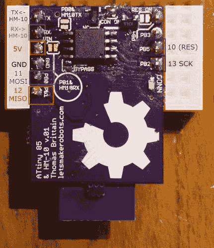
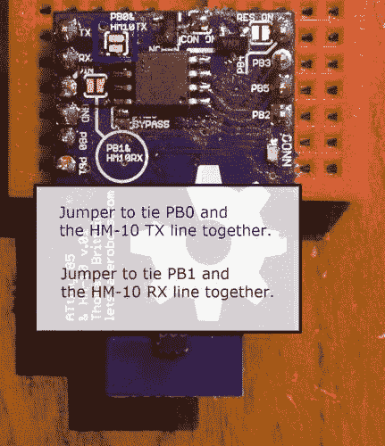
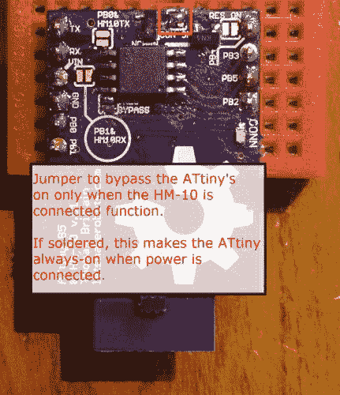
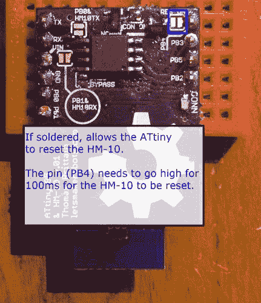
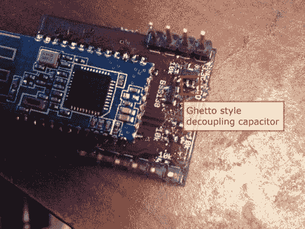

# 小蜘蛛

> 原文:# t0]https://dev . to/ladvien/at tiy-bitsy-spider-2 nkb

阿蒂尼·比西蜘蛛

[https://www.youtube.com/embed/wQFeiCescf0](https://www.youtube.com/embed/wQFeiCescf0)

更新:添加了 BOM 更正。(抱歉飘了。)

好的。这是我做了一段时间的成品板。

本质上，它是一个 BLE 节点板。它结合了 HM-10 板和 ATtiny 85。该板基于:

1.  [蓝牙 4.0 (HM-10)](http://letsmakerobots.com/node/38009)
2.  [姿态 85](http://letsmakerobots.com/node/39130) 姿态

Bitsy Spider 板的概念是小型控制器节点。我希望它足够便宜和通用，可以用作节点，但我认为最终价格是每个 11 美元左右。

这是老 GitHub:

*   阿提尼·比西蜘蛛(02 节)

物料清单:

1.  OSHPark Board :每个 1.68 美元(最低 5.05 美元)。
2.  1 个 20k 电阻器-0402:0.04 美元
3.  3 个 10k 电阻器-0402:0.04 美元
4.  2 个 1uF 0402 美元 20 美分
5.  3 个[BSS 138](https://www.google.com/#q=bss138):0.60 美元
6.  1x[attainy 85](http://www.mouser.com/ProductDetail/Atmel/ATtiny85-20SU/?qs=8jWQYweyg6N/GXnwAe4Icw==)soic:$ . 80
7.  1 x[HM-10](http://imall.iteadstudio.com/im130614001.html):6.50 美元
8.  1 个 0603 LED 0.11 美元
9.  1 个 [3.3V LDO](http://www.mouser.com/Search/ProductDetail.aspx?R=MCP1802T-3302I/OTvirtualkey57940000virtualkey579-MCP1802T-3302IOT) 300mA - SOT-23-5 -电压调节器:0.58 美元

总计(近似值):**:10.55 美元**

这块板上有许多焊料跳线，因为它是多功能的。

这是将 Arduino 用作 ISP 的编程引脚排列

[T2】](https://res.cloudinary.com/practicaldev/image/fetch/s--yo_NzDoH--/c_limit%2Cf_auto%2Cfl_progressive%2Cq_auto%2Cw_880/https://ladvien.cimg/Incy_Blue.jpg)

 该板旨在利用 HM-10 的串行连接。在这个版本中，我做得很直接，你让 HM-10 的 RX/TX 线和 ATtiny 之间的跳线不焊接，尽可能多次编程 ATtiny。要测试 ATtiny 和 HM-10 之间的串行连接，只需在 PCB 上进行试验，并按如下方式放置跳线:

**PB0 < - > TX**

** PB1 RX**

这将允许你测试你的代码，而不必焊接和解焊。然后，在你的代码完善后，焊接标有“PB1 & HM10 RX”和“PB0 & HM10 TX”的跳线，然后嵌入 Bitsy 蜘蛛。

 这个选项可能会在不同版本的棋盘中继续出现。我通过 N-Chan MOSFET 运行 ATtiny 的 GND 连接，并将 FET 的栅极连接到 PIO1。HM-10 功能的 PIO1 引脚用于连接状态 LED。但是可以在 HM-10 上设置的选项之一是 PIO1 保持低电平，除非 HM-10 有连接。这可以在 HM-10 处于 AT 模式时通过键入以下命令进行设置:

1.  类型: **AT+PIO11**
2.  回应:OK+PIO11

完成后，ATtiny 85 只有在 HM-10 有连接的情况下才会通电。当然，焊接跳线是为了绕过这一特点。

 最后一个跳线控制 HM-10 的复位。如果焊接，ATtiny 85 可以通过发送 PB4 高电平约 100 毫秒来复位 HM-10。我加了这个，因为我希望用 ATtiny Bitsy 蜘蛛创建一个星形网络。

这里有一个简要的解释。HM-10 在失去与一台 HM-10 的连接后有一个超时功能，可以在大约 10 秒钟内阻止它连接到另一台 HM-10。到目前为止，还没有绕过这个“失去连接”超时的选项。但是重置 HM-10 ( <150mS power-cycle) bypasses this time-out. I'll update more on this setup when I've completely tested it. If there are questions, I've written a lot in the comments of my original [HM-10 后](http://letsmakerobots.com/node/38009))。但也可以更自由地联系我。

[T2】](https://res.cloudinary.com/practicaldev/image/fetch/s--TnBPRWYT--/c_limit%2Cf_auto%2Cfl_progressive%2Cq_auto%2Cw_880/https://ladvien.cimg/ATtiny_Bitsy_Spider_--_No_Decoupling.jpg)

我应该提到的最后一件事。

我预计在我发出的每块板子的第一次运行中会有一个大错误和两个小错误。这个董事会也不例外。我忘了稳压器和 HM-10 上的去耦电容。我已经在 v.02 版上添加了它们。当然，这不应该是一个主要的缺陷，但稳压器上的电容会导致它吐出 3.6v 而不是 3.3v。主要问题。我通过在 SOT-23-5 稳压器的引脚之间焊接一个 0402 1uF 来保存这组电路板。不花哨，但节省了 5 美元。