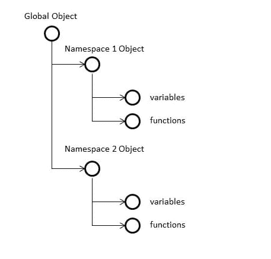

# JavaScript 全局对象、名称空间和对象构造函数

> 原文：<https://dev.to/forforeach/javascript-global-object-namespaces-and-object-constructors-431i>

#### 全局对象

全局对象是在应用程序运行时创建的对象。我们不能再创造它或以任何方式影响他的创作。创建后，全局对象将用作应用程序的全局范围。实际上，在 JavaScript 中，我们没有全局变量和函数。全局定义的所有变量和函数都成为全局对象的属性。因此，JavaScript 中的所有变量都放在全局对象下。ECMA-262 没有指出直接访问全局对象的方法，但是我们可以通过使用这个来实现对他的访问。

下面的例子告诉你如何去做:

```
var globalObject = (function(){
 return this;
})(); 
```

[在 jsFiddle 上查看](http://jsfiddle.net/dima_k/2Apbb/2/)

在 web 应用程序中，ECMA-262 的浏览器实现有一个名为 window 的对象，该对象用作全局对象的委托，因此我们可以非常简单地访问它:

```
var globalObject = window; 
```

在上面的例子中，我们创建了保存全局对象引用的变量。如前所述，所有的全局变量都变成了全局对象的属性，所以我们只是在全局对象上创建了引用它们自己的属性。

因为所有新的变量和函数都放在全局对象下，所以名称冲突的几率非常高。正如我们所知，JavaScript 是一种松散类型的语言，因此他不会为创建的变量保留类型。因此，所有变量都可以通过使用相同的名称来开销其他变量。这是我们之前讲过的名字冲突。

为了防止名称冲突，我们可以使用许多技术，比如使用名称空间、使用模块等等。

#### 命名空间

名称空间是在全局对象下创建的对象，保存变量和函数。把它想象成一棵树。树有根(全局对象)和分支。每个分支都是一个新的名称空间。

[T2】](https://res.cloudinary.com/practicaldev/image/fetch/s--jRLu_Z5j--/c_limit%2Cf_auto%2Cfl_progressive%2Cq_auto%2Cw_880/https://dev-to-uploads.s3.amazonaws.com/i/q6pyi9z2qpt9iai9foqx.png)

为了用 JavaScript 实现它，我们使用下面的代码:

```
var myNamespace = myNamespace || {}; 
```

上面例子的左边只是为我们的名称空间声明了一个变量。右侧稍微复杂一点。首先，如果在应用程序中的某个地方声明了名称空间，我们试图获得一个同名的名称空间。这种技术防止了相同名称空间的重新创建，并且不允许我们忽略他的逻辑。这项技术的另一个优点是我们可以在几个文件中使用同一个名称空间。无论如何，如果在 application 中没有声明名称空间，我们只需将空对象赋给变量，从而创建一个新的名称空间。

#### 对象构造函数

正如我们所知，在 JavaScript 中，我们可以用两种方法创建一个新对象。第一种方法是使用*新的*关键字:

```
var rectangle = new Object();
rectangle.a = 10;
rectangle.b = 5;
rectangle.getPerimeter = function() {
 return 2\*(this.a + this.b);
} 
```

第二种方法是使用常用的对象文字。这种方法的最大好处是你可以封装一个对象的创建。前面的例子可以改写如下:

```
var rectangle = {
 a: 10,
 b: 5,
 getPerimeter: function() {
 return 2\*(this.a + this.b);
 }
} 
```

上面的两种方法向我们展示了如何创建一个简单的 JavaScript 对象。这很好，但如果我想在我的应用程序中创建多个矩形，该怎么办呢？是否需要为每个矩形实例复制该代码？答案当然是否定的，我们可以使用构造函数。前面两个例子可以用构造函数重写如下:

```
function Rectangle(a, b) {
 this.a = a;
 this.b = b;
 this.getPerimeter = function() {
 return 2\*(this.a + this.b);
 };
}
var rectangle = new Rectangle(10,5); 
```

ECMAScript 中的构造函数用于创建特定类型的对象。构造函数为我们提供了以简单的方式创建新对象实例的能力。更重要的是，每个用构造函数创建的实例都可以被识别出是哪种类型。

```
function Rectangle(a, b) {
 this.a = a;
 this.b = b;
 this.getPerimeter = function() {
 return 2\*(this.a + this.b);
 };
}
var rectangle = new Rectangle(10,5);
alert(rectangle.constructor == Rectangle); // alerts true
alert(rectangle instanceof Rectangle); //alerts true 
```

[在 jsFiddle 中试试](http://jsfiddle.net/dima_k/z97cn/2/)

上面的例子表明，我们可以用两种方法识别对象的类型。通过检查他的构造函数属性和使用操作符的*实例。在对象创建过程中，constructor 属性被自动分配一个对构造函数的引用。但是构造函数并不放在对象本身上。它被放在物体的原型上。我们可以通过使用开发工具检查对象或者在 Chrome、Safari 和 Firefox 中访问对象的 __proto__ 属性来检查对象原型。*

所以到目前为止，我们可以理解 3 件重要的事情:

1.  所有变量和函数都放在全局对象上
2.  为了防止名称冲突，我们可以使用名称空间
3.  我们需要使用构造函数来创建特定类型的对象

但是当我们看构造函数时，我们可以理解它只是普通的 JavaScript 函数，因此，当放在全局范围内时，很容易被另一个同名的函数覆盖。所以我们也想把它放在名称空间下。它可能如下所示:

```
var namespace = namespace || {};
namespace.Rectangle = function(a, b) {
 this.a = a;
 this.b = b;
 this.getPerimeter = function() {
 return 2\*(this.a + this.b);
 };
}
var rectangle = new namespace.Rectangle(10,5); 
```

这很好，但是当我们期待一个矩形的构造函数时，我们会看到有一个匿名函数，所以原型将是常规的对象类型。

[T2】](https://res.cloudinary.com/practicaldev/image/fetch/s--leqE8rbr--/c_limit%2Cf_auto%2Cfl_progressive%2Cq_auto%2Cw_880/https://dev-to-uploads.s3.amazonaws.com/i/jypwx6bghnd0n1cx8kyy.png)

我们想要的，是能够用一个名称空间来查看原型，并确定这个对象是矩形的实例。我仍然可以使用操作符的*实例，它足够聪明地告诉我这是一个矩形，但是作为一个开发人员，我也希望在我的 DevTools 中看到它，并且知道对象原型是矩形。为了实现这一点，我们可以使用下一个技巧:* 

```
var namespace = namespace || {};
namespace.Rectangle = function <strong>Rectangle</strong>(a, b) {
 this.a = a;
 this.b = b;
 this.getPerimeter = function() {
 return 2\*(this.a + this.b);
 };
}
var rectangle = new namespace.Rectangle(10,5); 
```

我只是给了构造函数一个名字。现在我们可以看到我们的对象构造函数在名称空间下，我们还可以看到对象原型是矩形:

[T2】](https://res.cloudinary.com/practicaldev/image/fetch/s--HlcFmqbs--/c_limit%2Cf_auto%2Cfl_progressive%2Cq_auto%2Cw_880/https://dev-to-uploads.s3.amazonaws.com/i/hat21dlygmp7us7kj20v.png)

使用这种方式注意 IE <= 8。

谢谢

* * *