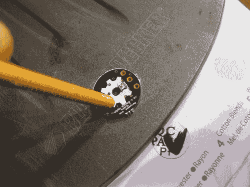
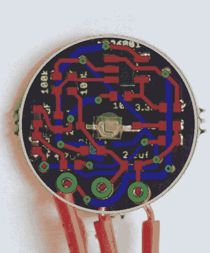

# 自制脉搏传感器

> 原文：<https://dev.to/ladvien/homemade-pulse-sensor-1iob>

我一直在重新制作[开放式硬件脉冲传感器](http://pulsesensor.com/open-hardware/)，这样就可以很容易地送到 OSHPark 并在家里制作。我不确定，但我想我是在三月份开始这个项目的，现在刚刚完成。

我需要的一点鼓励是当 hackaday.com 把它作为他们本周的失败。“我以为我会对此变得成熟。但是那四个红字开始折磨我，所以我又试了一次。奇怪的是，我成功了。

我认为有三个问题:

1.  我又把运算放大器*搞混了*。在我看来，我有 5 个不同的 IC 与运算放大器放在同一个封装中。
2.  我插入的 Arduino 位于一个表面上，该表面具有足够的导电性，可以在底面的 3.3v 引脚和 A0 之间产生噪声，我在中使用 A0 作为运算放大器。
3.  每次我接触传感器时，暴露的过孔都会因我自己的导电性而短路。愚蠢的矿泉水。

[https://www.youtube.com/embed/llYuknlc3uk](https://www.youtube.com/embed/llYuknlc3uk)

[制作视频](http://www.youtube.com/watch?v=llYuknlc3uk&feature=share&list=UUKodYd0Fj3TSHzXg7aOJYYQ)

我已经详细描述了我是如何着手制作它的。所以，我会尽量坚持可重复性。

**1。订购零件。**

*   运放: **.29** ( [**数码键**](http://www.digikey.com/product-detail/en/MCP6001T-I%2FOT/MCP6001T-I%2FOTCT-ND/697158) )
*   光传感器: **1.23 ( [数码键](http://www.digikey.com/product-detail/en/APDS-9008-020/516-2662-1-ND/3909167) )**
*   LED: **.79 ( [数码键](http://www.digikey.com/product-detail/en/AM2520ZGC09/754-1423-1-ND/2163781) )**
*   0603 肖特基二极管* *: .50 ( [数码钥匙](http://www.digikey.com/product-detail/en/CD0603-B0130L/CD0603-B0130LCT-ND/3438043?WT.mc_id=PLA_3438043) )* *
*   无源:~ **2.50** **-电阻:1 x 470k，1 x 12k，2 x 100k，1 x 10k，1 x 3.3 兆欧-电容:3 x 4.7uF，2 x 2.2uF**
*   [Osh park Boards](http://www.oshpark.com/shared_projectss/e3W0qHzw)**:* * $**. 67 * *(最少 3 块，价值 2.00 美元。3/2.00 = ~.67)

**总计(近似值):5.98 美元**

1.  确保你有这些工具。

*   衣服熨斗。
*   焊接至少 0.022 英寸
*   通量。
*   [尖端“精密”的烙铁](http://www.amazon.com/ZITRADE-5pcs-Soldering-tips-ZITRADES/dp/B009YSPGAS/ref=sr_1_2?s=hi&ie=UTF8&qid=1375550915&sr=1-2&keywords=soldering+tip+.5)。
*   [粘性油灰](http://www.amazon.com/Scotch-Adhesive-Putty-Removable-860/dp/B000AN7EW4)。
*   [精密镊子。](http://www.fasttech.com/products/0/10002626/1195600-precision-tweezers-3-piece-set)

1.  焊接光传感器。

光传感器是最难的部分，所以慢慢来。我用烙铁在每个焊盘上放了一点焊料，然后，用焊剂覆盖焊盘。接下来，我试图将光传感器与衬垫尽可能紧密地对齐。之后，我把板子的背面放在翻转的熨斗上。让烙铁加热，直到焊料回流，传感器连接。

[T2】](https://res.cloudinary.com/practicaldev/image/fetch/s--NB2Ak-ii--/c_limit%2Cf_auto%2Cfl_progressive%2Cq_auto%2Cw_880/https://ladvien.cimg/IMG_0673.jpg)

1.  翻转传感器，用粘性油灰将其固定在表面，焊接 LED、无源器件和运算放大器。这个我就不细说了，因为我的[视频](http://www.youtube.com/watch?v=llYuknlc3uk&feature=share&list=UUKodYd0Fj3TSHzXg7aOJYYQ)展示了整个过程。

1.  用胶带把它包起来，剪一个小洞给 LED 和光传感器。(下一次迭代，我会想出更好的解决方案，以及把它夹在你身上的方法)。

2.  * *将其连接到 Arduino **

左-中-右

A0-3.3v-全球导航卫星系统

1.  **运行 [Arduino](https://pulse-sensor.googlecode.com/files/PulseSensorAmped_Arduino_1dot2.zip) 和[处理](http://pulse-sensor.googlecode.com/files/PulseSensorAmpd_Processing_1dot1.zip)草图这些[神奇的家伙](http://pulsesensor.myshopify.com/pages/about-us)提供。**

2.  有问题就冲我吼。