# 少量

> 原文:[https://dev.to/ladvien/jot-472k](https://dev.to/ladvien/jot-472k)

**视频:**

[https://www.youtube.com/embed/jiU4ZEwfStc](https://www.youtube.com/embed/jiU4ZEwfStc)

[https://www.youtube.com/embed/WNtI78fFOlk](https://www.youtube.com/embed/WNtI78fFOlk)

**更新日期:2013 年 1 月 5 日**

新角度。我完成了我的[at tiny Bitsy Spider](http://letsmakerobots.com/node/39795)(**ABS**)板，想用它做点什么。当把它串在一起时，我曾想过用 ABS 替换 Arduino Pro Mini 和伺服辅助板。就成本而言，它会稍微贵一点(1.5 美元左右？)但是 T4 要小得多，麻烦也少得多。

我读到过一些人在尝试控制伺服系统时有不同的结果。当然，我也好不到哪里去。但我能够从它们身上获得可接受的功能(例如，控制连续旋转伺服速度、方向、制动)。无论如何，这是我如何接近 ATtiny 85 的伺服系统。

我找到了几个关于让 Servo 在 ATtiny 上工作的博客，但最终我使用了 [Servo8Bit 库](http://www.cunningturtle.com/servo8bit-library-version-0-6-released/)(注意，为了方便使用，我在下面链接了“Arduino 版本”，而不是 AVR)。

*   [Servo8Bit Arduino 库及实例](http://www.cunningturtle.com/wordpress/wp-content/uploads/2011/11/servo8bit_arduino_example.zip)

[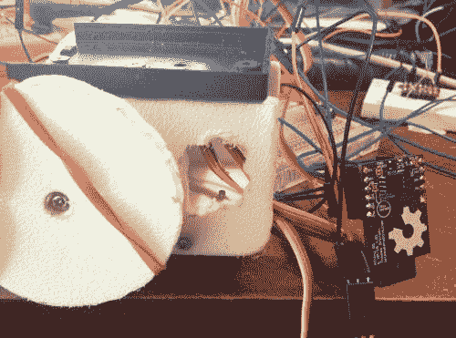T2】](https://res.cloudinary.com/practicaldev/image/fetch/s--LlLvGoc3--/c_limit%2Cf_auto%2Cfl_progressive%2Cq_auto%2Cw_880/https://ladvien.cimg/Jot_and_ABS.jpg)

这看起来不太友好，但在一个黑客看来，这似乎是不完整的伟大代码——希望有人纠正我的错误。我遇到的问题，我相信其他人也会遇到，是库使用定时器 1 进行伺服计时。微小的内核(至少我正在使用的内核)使用定时器 1 来实现基本功能，这就产生了冲突。这使我无法使用 delay()函数。这简直就像它没有效果。那时我打开了图书馆的盖子。在[头文件](https://github.com/fri000/Servo8Bit/blob/master/Servo8Bit.h)中，有一个使用哪个定时器的选项。所以，我把它从定时器 1 切换到定时器 0。我又试了一遍密码。很好，延迟()现在似乎起作用了，*但是*控制伺服系统的能力消失了。一旦调用 myServo.attach(3 ),伺服系统就会以全速朝一个方向旋转。该死的。

我不想在库的其他地方翻来翻去，试图调试一些我只理解了一半的东西。所以，我开始研究。过了一会儿，我发现了这个线程。似乎这个家伙 WireJunky 试图找出如何做同样的事情，控制连续旋转伺服与 ATtiny。最后，Nick Gammon 告诉他应该创建自己的定时器功能。

无论如何，我在读完这个帖子后破解了这段代码，并惊讶地发现它做了我想要的事情。我是一个用钢锯砍人的黑客！

```
//Basic Jot movement using ATtiny Spider

#include "Servo8Bit.h"  void mydelay(uint16_t milliseconds);  //forward declaration to the delay function

Servo8Bit myServoA;  //create a servo object.
Servo8Bit myServoB;

void setup()
{
  myServoA.attach(3);  //attach the servo to pin PB3
  myServoB.attach(4);
    mydelay(1);
}

void loop(){

            myServoA.write(160);             // tell servo to go to position in variable 'pos'
            myServoB.write(50);             // tell servo to go to position in variable 'pos'
            mydelay(2000);                      // waits 15ms for the servo to reach the position
            myServoA.write(90);             // tell servo to go to position in variable 'pos'
            myServoB.write(90);             // tell servo to go to position in variable 'pos'
            mydelay(2000);                      // waits 15ms for the servo to reach the position
            myServoA.write(50);             // tell servo to go to position in variable 'pos'
            myServoB.write(160);             // tell servo to go to position in variable 'pos'
            mydelay(5000);                      // waits 15ms for the servo to reach the position
    }

void mydelay(uint16_t milliseconds)
{
    for(uint16_t i = 0; i < milliseconds; i++)
    {
        delayMicroseconds(1000);
    }
}//end delay 
```

<svg width="20px" height="20px" viewBox="0 0 24 24" class="highlight-action crayons-icon highlight-action--fullscreen-on"><title>Enter fullscreen mode</title></svg> <svg width="20px" height="20px" viewBox="0 0 24 24" class="highlight-action crayons-icon highlight-action--fullscreen-off"><title>Exit fullscreen mode</title></svg>

有几个问题。似乎我的 B 伺服有一些抖动。它不喜欢停在 myServoB.write(90)。我尝试调用 myServoB.detach()，然后调用 myServoB.attach(3)，试图停止伺服。它会停止，但不会重新连接。

无论如何，即使故障排除不工作，我有一些工作。例如，通过 ATtiny 控制的 P-Chan 运行伺服系统的 VCC，这需要一个额外的引脚，但可以让我准确地控制停止它们。不过，我认为这种“居中”的缺乏是由于我在转换中使用的廉价 0805 或 PB4 引脚上的其他噪声。

当然，要使用 ABS 作为临时的替代大脑，我需要用 ABS 创建一个星形网络，编写一个库来从 ATtiny 控制 HMC5883L，确保没有其他计时问题，并将其全部安装在 8k 闪存中。唉。现在的代码大小是 3k 左右，有伺服和串行库。

**更新:12/24/13**

[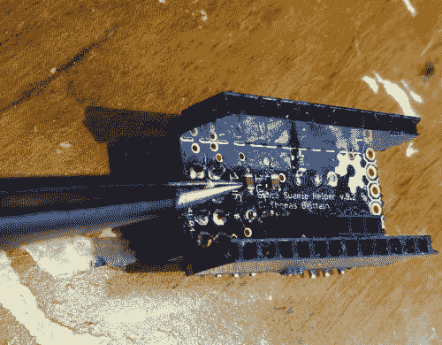](https://res.cloudinary.com/practicaldev/image/fetch/s--nlDDxNEy--/c_limit%2Cf_auto%2Cfl_progressive%2Cq_auto%2Cw_880/https://ladvien.cimg/Burnt_Cap.jpg) 嗯，我不知道该说什么。我想我要从这个构建中休息一会儿，专注于完成 Dot Muncher 的霸王项目。

我发现了导致 NRF24L01 出现问题的原因。不是电压调节器的问题。是 1uF 0805s 过滤调节器。我用一些 Digi-Key 的额定 25v 的电容替换了未知的电容(从易贝买的)。这解决了问题，我有了我所希望的很好的交流。

当然，这并不是问题的结束。我发现 HCM5883L 板短路，我相信，每次我编程板。这让我很生气。在这个问题上，我已经烧掉了四个指南针板和两个 Arduino Pro(部分冒烟约 15 美元)。这与每当 Arduino 变低时 HCM53883L I2C 线通过电路板反馈有关。它会导致 HCM5883L 板上的电压调节器几乎立即弹出。当然，它会对连接板的其他部分造成轻微损坏。我当时并不知道，但是，我相信这就是滤波电容损坏的原因，反向电流。

[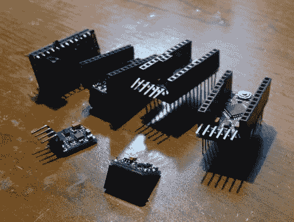T2】](https://res.cloudinary.com/practicaldev/image/fetch/s--JLRXEXgp--/c_limit%2Cf_auto%2Cfl_progressive%2Cq_auto%2Cw_880/https://ladvien.cimg/IMG_0248.jpg)

**在愚蠢的柴堆上燃烧的东西->T1】**

这不是唯一的问题。我为 NRF24L01 收集的代码与 HCM5338L 库不兼容。

但我不知道如何在 f'in 板不断燃烧的情况下，以一种他们都满意的方式重写代码。叹气。

尽管如此，我认为我的下一步，当我的兴趣回来时，将是制作 Arduino Pro Mini、小助手板和 HCM5338L 的完整原理图。我认为前两个我已经有原理图，我有足够的 HCM5883L 板拉下元件和反向工程的 PCB。

尽管如此，我还是有点沮丧。我觉得我最好还是自己做冲浪板。至少到那时，我会确切地知道它们是如何串在一起的，并且只能责怪我自己。

我也觉得 Frits 需要组织一个“机器人失败周”，这样我就可以成为它的第一个亮点。伙计，现在甚至看着那张照片都让我觉得自己活得很糟糕。哦，好吧，我要列出我从中学到的好东西。

1.  反向电流是一个婊子-低压降二极管是你的朋友。
2.  我已经整理了代码，使 NRF24L01 更接近蓝牙功能。但是，它不喜欢与 Wire 库在同一个代码中。
3.  便宜的零件需要你有充足的时间。
4.  NRF24L01 并不真正适用于流数据。我知道这要开始了，但是我不明白它在代码中是如何实现的。NRF 需要大量的代码管理。与其他硬件管理或 SoC 设备不同。这使得 NRF 对您的代码正在做的其他事情高度敏感。在我的情况下，运行伺服系统，通过 I2C 通信，做浮点数学。随着我在这个版本中的进展，我感觉我对 NRF 的功能征税超过了它的能力。
5.  最好了解所有连接到您的电路板的电路。最初可能会花更多的时间，但最终会节省时间和金钱。
6.  如果我失败了，虽然看起来很可笑并不好玩，但记录失败会让我感觉更好。好像这意味着什么。即使那件事是，“嘿，世界，我是个白痴。”:)

**更新:一点小麻烦**

我不想发布这个帖子，直到我有工作要更新，但我错过了改变写作。在过去的几个月里，我一直在做一些小事情。然而，我不断遇到问题。NRF24L01s 表现得很傻。他们一天工作，一天不工作。我想既然罗克珊娜在这里，我们就不能开女人的玩笑了？(如果你看到这篇文章，我只想让你知道，我必须确保我的妻子不会看到这篇文章，因为我的房子就像地狱一样)。

[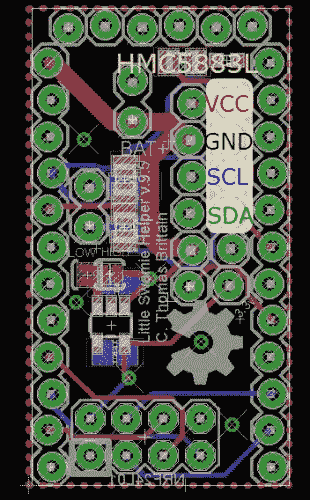T2】](https://res.cloudinary.com/practicaldev/image/fetch/s--ulzR2Jil--/c_limit%2Cf_auto%2Cfl_progressive%2Cq_auto%2Cw_880/https://ladvien.cimg/Little_Warmie_Board_Compass_Highlight.jpg)

我已经重新制作了伺服板(v.9.5)以包括一个双 [90 度头](http://www.ebay.com/itm/261099178357?ssPageName=STRK:MEWNX:IT&_trksid=p3984.m1439.l2649) r。一组是连接伺服系统，另一组是连接 **[罗盘(HMC5883L)](http://www.ebay.com/itm/NEW-HMC5883L-Power-supply-3V-5V-Triple-Axis-Compass-Magnetometer-Sensor-Module-/370878407287?pt=LH_DefaultDomain_0&hash=item565a136277) 。**这意味着使硬件更加紧凑、模块化，并保持罗盘水平，以便更好地读数。哦，是的，我烧了一些 HMC5883Ls 试图用蹩脚的编织线连接它们。

此外，我还添加了焊接跳线，以便将 3.3 SOT-23-5 稳压器的使能引脚连接到高电平或低电平，这取决于我错误购买的引脚。

在顶部，我包括了一个 SMD 分压器，直接连入模拟引脚 A3。我的意图是让 Jot 能够关注它的电池电压，以此来感知它有多“饥饿”。

我在新的双 90 接头上添加了一个 3.3v 引脚，以防我在机器人的其他地方有一个 3.3v 传感器。我不知道，我试着用所有多余的别针。

当然，既然我已经学会了如何搭建过孔，我也在板上搭建过孔，希望可以节省一两个致命的短路。

[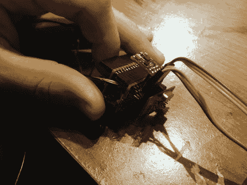T2】](https://res.cloudinary.com/practicaldev/image/fetch/s--4Gq4rpA1--/c_limit%2Cf_auto%2Cfl_progressive%2Cq_auto%2Cw_880/https://ladvien.cimg/IMG_0241.jpg)

我最终会试着用我已经开始称之为“[那些短而圆的头](http://www.ebay.com/itm/170881393882?ru=http%3A%2F%2Fwww.ebay.com%2Fsch%2Fi.html%3F_sacat%3D0%26_from%3DR40%26_nkw%3D170881393882%26_rdc%3D1)来代替那些笨重的头我喜欢这些小标题，因为它们非常小。当然，它们很小，但是它们身体的大部分无法穿过较厚的 PCB。这是因为该点靠近塑料集管。这种喇叭口可以防止短路穿过大多数电路板上的典型头部孔。

但是，我有卡尺、Eagle CAD 和 OSHPark，所以我做了一个小的标题孔库，允许这些引脚整齐地穿过电路板，并与另一侧的短圆配合。我派人去 OSHPark 取了一份样本，所以当我测试了它们的效果后，我会回来报告的。

[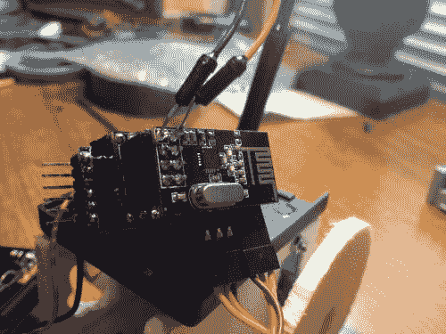T2】](https://res.cloudinary.com/practicaldev/image/fetch/s--UjYNd10S--/c_limit%2Cf_auto%2Cfl_progressive%2Cq_auto%2Cw_880/https://ladvien.cimg/IMG_0247.jpg)

现在，是什么让我无法继续使用这个小机器人:[一个便宜的电压调节器](http://www.digikey.com/product-detail/en/AAT3221IGV-3.3-T1/863-1491-1-ND/4240225)。

在我最初版本的伺服板(顺便说一下，我称它为小瓦米助手板或 LWH 板)上，我使用了一个[不同的电压调节器](http://www.digikey.com/product-detail/en/TLV70033DDCT/296-25276-1-ND/2176454)，价格更高。我发现它们之间唯一的区别是输出，第一个输出 200 毫安，第二个输出 150 毫安。根据我在数据手册中找到的信息，我真的不认为这有什么不同。我知道有无源器件影响功耗，但这是我能找到的唯一信息([数据表](http://www.nordicsemi.com/eng/content/download/2726/34069/file/nRF24L01P_Product_Specification_1_0.pdf)，第。8)NRF 24l 01 的发射器使用约 11.3 毫安，接收器使用约 13.5 毫安。尽管我不知道无源器件的功耗，但我相信我完全可以使用便宜的 150mA 电压调节器。但是，经验证明并非如此。

这就是我请专业人士来取笑我遗漏了一些简单的东西的地方。

鉴于我对电子学的有限了解，我能发明的唯一理论是，NRF24L01 在一安培小时内仅使用 11.3/13.5mA，但突发使用超过了廉价调节器的恒定 150mA？我不知道。我不知所措。

当然，这纯属猜测。我目前没有更高输出电压调节器(我应该有更多的周末)。但是，我可以将 NRF24L01 留在我的 LWH 板上，并将跳线焊接到 3.3v 和 GND 引脚，使 NRF24L01 正常工作。这使我相信故障直接在于电压调节器的不足，而不是我的电路板设计(虽然，我敢肯定这是明显的不足)。

不管怎样，这就是我的小故事。

几个音符。我有一个 Jot 的备份设计，我正在努力使它便宜于 25 美元，它使用 BLE(是的，那些 [HM-10](http://letsmakerobots.com/node/38009) s 我在恋爱中)。此外，我决定如果我要认真对待[霸王](http://letsmakerobots.com/node/38208)项目，我可能会做得更好，把它变成一个 Python 模块，这是我一直在默默做的，大约完成了 90%。我将设法在年底前把它建成。我需要完成几个功能。

**更新:用于 PC、中枢和机器人之间工作的 NRF24L01 代码的进展。**

所以，这是我尝试建造一个蜂群。这里还没有多少，只是一个个人的构建日志，直到我得到一个足够便宜的迭代，然后，我将开始把它们合并到[霸王](http://letsmakerobots.com/node/38208)项目中。

我得向[巴杰迪](http://www.bajdi.com/tag/nrf24l01/)低头；那些小 NRF24L01 比简单的蓝牙技术需要**更多的脑力。我花了一段时间编写自己的代码，向另一个节点发送**和**接收字节。经过一番折腾后，我放弃了，开始阅读别人的代码。我在 Arduino 论坛上遇到了 [Robvio](http://forum.arduino.cc//index.php?PHPSESSID=1uva8aiedtimb3i765lf01j907&action=profile;u=115717) ，他有一些相当漂亮的代码，我几乎原封不动地保留了下来。** 

```
#include <SPI.h> #include "nRF24L01.h" #include "RF24.h"  
RF24 radio(8,7);
// Radio pipe addresses for the 2 nodes to communicate.
const uint64_t pipes[2] = {0xF0F0F0F0E1LL, 0xF0F0F0F0D2LL };

//for Serial input
String inputString = "";         // a string to hold incoming data
boolean stringComplete = false;  // whether the string is complete

//NRF Packages
byte SendPackage[32];
byte ReceivePackage[32];
boolean sending=0;

void setup(void)
{
  //
  // Print preamble
  //

  Serial.begin(9600);
  radio.begin();
  // optionally, increase the delay between retries & # of retries
  radio.setRetries(15,15);
  radio.setPayloadSize(32);
  radio.openWritingPipe(pipes[1]);
  radio.openReadingPipe(1,pipes[0]);
  radio.startListening();
  //radio.printDetails();
}

void loop(void)
{
  //check for NRF received
  NRFreceive();
  //check for Serial received (or filled by NRF)
  Serialreceive();  
}

void serialEvent() {
    Serial.println("Event");
  while (Serial.available()) {
    char inChar = (char)Serial.read();
    inputString += inChar;
    if (inChar == '\n') {
      stringComplete = true;
    }
  }
}

byte NRFsend(String NRFPack = ""){
  NRFPack.getBytes(SendPackage, 32);
  radio.stopListening();
  radio.openWritingPipe(pipes[0]);
  radio.openReadingPipe(1,pipes[1]);
  bool ok = radio.write(SendPackage,sizeof(SendPackage));
  if (!ok) Serial.println("NRFerror");
  radio.startListening();
  unsigned long started_waiting_at = millis();
  bool timeout = false;
  while ( ! radio.available() && ! timeout )
    if (millis() - started_waiting_at > 200 )
      timeout = true;
  if ( timeout )
  {
    Serial.println("NRFerror");
  }
  radio.openWritingPipe(pipes[1]);
  radio.openReadingPipe(1,pipes[0]);
}

void NRFreceive(){
  if ( radio.available() )
  {
    //byte ReceivePackage[32];
    bool done = false;
    while (!done)
    {
      done = radio.read( &ReceivePackage, sizeof(ReceivePackage) );
      delay(5);
    }
    radio.stopListening();
    inputString = ((char *)ReceivePackage);
    stringComplete = true;
    radio.write( "1", 1 );
    radio.startListening();
  }
}

void Serialreceive(){

  if (stringComplete) {
    if (inputString.startsWith("T:")) {
      NRFsend(inputString.substring(2));
    }
    if (inputString.startsWith("S:")) {
      Serial.print(inputString.substring(2));
    }

    inputString = "";
    stringComplete = false;
  }
} 
```

<svg width="20px" height="20px" viewBox="0 0 24 24" class="highlight-action crayons-icon highlight-action--fullscreen-on"><title>Enter fullscreen mode</title></svg> <svg width="20px" height="20px" viewBox="0 0 24 24" class="highlight-action crayons-icon highlight-action--fullscreen-off"><title>Exit fullscreen mode</title></svg>

这段代码的工作方式很像一个软件和串行模拟蓝牙模块。

要发送串行数据，它是这样的，你键入带有前缀码的东西，T 代表传输，S 代表串行打印，并以换行符(\n)结尾。

例如，在**模块 A** 的终端中键入以下内容:

*   **T:S:我的消息\n**

将“我的消息”发送到另一个**模块 B** ，然后，将“我的消息”打印到**模块 B** 的串行线上。

如果你打字，

*   **T:我的消息\n**

这将把“我的消息”从**模块 A** 传送到**模块 B** ，但不会打印到**模块 B**上的串行线上

我会让你们检查代码，并告诉我是否可以为我正在做的事情改进它。现在，我已经用一些基本的 Python 代码对它进行了测试，以向我的 **hub** (Arduino Uno 和 NRF24L01)发送一条串行消息，后者将它转发给**机器人** (Arduino Pro Mini 和 NRF24L01)。

[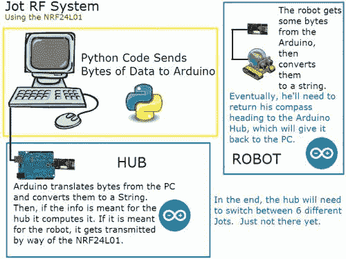T2】](https://res.cloudinary.com/practicaldev/image/fetch/s--yctscb9u--/c_limit%2Cf_auto%2Cfl_progressive%2Cq_auto%2Cw_880/https://ladvien.cimg/Jot_NRF_2.jpg)

[公共补锅匠 cad 设计](https://tinkercad.com/things/l7IGEve8m4n-jot-i8/)

建造成本

1.  **[塔微 9g 伺服 x2](http://www.fasttech.com/products/0/10002348/1170304-mystery-9g-mini-servo):5.22 美元**
2.  **[球形脚轮 1/2 英寸金属 x1](http://www.pololu.com/catalog/product/953):3.65 美元**
3.  **[Funduino(早期 Arduino Pro Mini):](http://www.fasttech.com/products/0/10004915/1380906-pro-mini-microcontroller-circuit-board-module-for-) $4.89**
4.  **[AAA x 4:](http://www.ebay.com/itm/4x-AAA-1800mAh-1-2V-Ni-MH-Rechargeable-battery-3A-Yellow-Cell-for-MP3-RC-Toys-/160692223026?pt=US_Rechargeable_Batteries&hash=item256a00bc32) $1.44**
5.  **[NRF24L01 x 1:](http://www.fasttech.com/products/1005/10002877/1215201-nrf24l01-enhanced-24ghz-wireless-transceiver-modul) $1.31**
6.  **[指南针(HMC 5883 l)](http://www.ebay.com/itm/NEW-HMC5883L-Power-supply-3V-5V-Triple-Axis-Compass-Magnetometer-Sensor-Module-/370878407287?pt=LH_DefaultDomain_0&hash=item565a136277):2.37 美元**
7.  **[2-56 螺纹 2”螺柱 x 2:](http://www.mcmaster.com/#catalog/119/3140/=oj5hz0) $1.00**
8.  **[2-56 1 1/2 "螺丝 x 2:$ 0.17](http://www.ebay.com/itm/170642767090?ssPageName=STRK:MEWAX:IT&_trksid=p3984.m1423.l2649)T3】**
9.  **[2-56 六角螺母 x 6:$ . 23](http://www.mcmaster.com/#catalog/119/3159/=oj5ies)T3】**
10.  **[AAA x 电池盒带开关:](http://www.ebay.com/itm/310617655649?ssPageName=STRK:MEWNX:IT&_trksid=p3984.m1439.l2649) 1.05**
11.  **助手板:1.53 美元**
12.  3.3v 0.30 毫安 LDO 稳压器 x 1:$ 0.57
13.  [1uF 0805 陶瓷电容器 x 2:](http://www.digikey.com/product-detail/en/CL21F105ZOCNNNC/1276-1246-1-ND/3889332)$ 0.20
14.  [0805 4.7k 电阻器 x 2:](http://www.digikey.com/product-detail/en/RMCF0805JT4K70/RMCF0805JT4K70CT-ND/1942570)$ 0.03
15.  [0805 330-860 欧姆电阻 x 1:](http://www.digikey.com/product-detail/en/RMCF0805JT330R/RMCF0805JT330RCT-ND/1942547)$ 0.03
16.  0603 LED ( [红色](http://www.digikey.com/product-detail/en/LS%20Q971-KN-1/475-3016-1-ND/3837594)、[绿色](http://www.digikey.com/product-detail/en/LG%20Q971-KN-1/475-1409-1-ND/1802597)、[黄色](http://www.digikey.com/product-detail/en/LY%20Q976-P1S2-36/475-2558-1-ND/1802685))x1:$ 0.09
17.  [直角割台 x 8](http://www.ebay.com/itm/310673046300?ssPageName=STRK:MEWNX:IT&_trksid=p3984.m1439.l2649):0.05 美元
18.  [直割台 x 26:$ 0.08](http://www.ebay.com/itm/10x-40Pin-2-54-Single-Row-Pin-Male-Header-Strip-for-Arduino-Prototype-Shield-DIY-/400344863620?pt=LH_DefaultDomain_0&hash=item5d3669d384)

**总计(近似值):23.95 美元**

[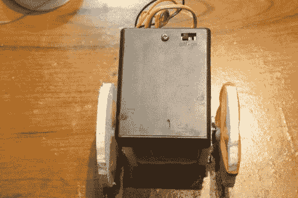T2】](https://res.cloudinary.com/practicaldev/image/fetch/s--ZC8gyUVk--/c_limit%2Cf_auto%2Cfl_progressive%2Cq_auto%2Cw_880/https://ladvien.cimg/IMG_9160.jpg)

[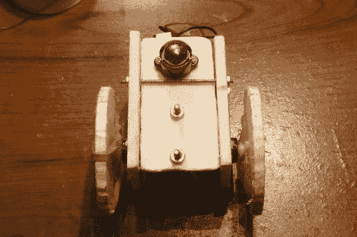T2】](https://res.cloudinary.com/practicaldev/image/fetch/s--Jd0eBVqZ--/c_limit%2Cf_auto%2Cfl_progressive%2Cq_auto%2Cw_880/https://ladvien.cimg/IMG_9159.jpg)

[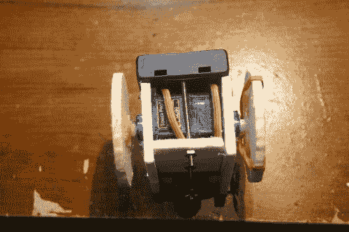T2】](https://res.cloudinary.com/practicaldev/image/fetch/s--K5QG2UrB--/c_limit%2Cf_auto%2Cfl_progressive%2Cq_auto%2Cw_880/https://ladvien.cimg/IMG_9144.jpg)

[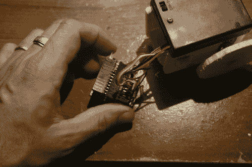T2】](https://res.cloudinary.com/practicaldev/image/fetch/s--m-N9hHU_--/c_limit%2Cf_auto%2Cfl_progressive%2Cq_auto%2Cw_880/https://ladvien.cimg/IMG_9147.jpg)

[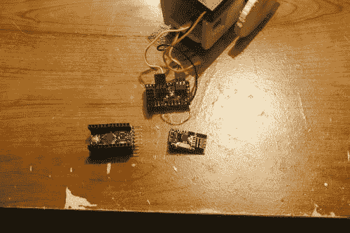T2】](https://res.cloudinary.com/practicaldev/image/fetch/s--PEQr9Xzy--/c_limit%2Cf_auto%2Cfl_progressive%2Cq_auto%2Cw_880/https://ladvien.cimg/IMG_9156.jpg)

录像

**在 Tinkercad 中设计构件:**

[https://www.youtube.com/embed/2Ygoz4O6GsY](https://www.youtube.com/embed/2Ygoz4O6GsY)

**将 Tower Pro 9g 伺服转换为电机全旋转:**

[https://www.youtube.com/embed/sG3Cx3PJiyY](https://www.youtube.com/embed/sG3Cx3PJiyY)

**裁剪构建:**

[https://www.youtube.com/embed/lDOTqbaHIfU](https://www.youtube.com/embed/lDOTqbaHIfU)

**把碎片拼在一起:**

[https://www.youtube.com/embed/c0AYFFcty_I](https://www.youtube.com/embed/c0AYFFcty_I)

**制作小暖男助手:**

[https://www.youtube.com/embed/XVDfMpXEbPg](https://www.youtube.com/embed/XVDfMpXEbPg)