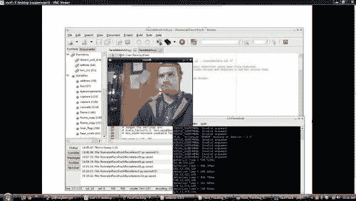
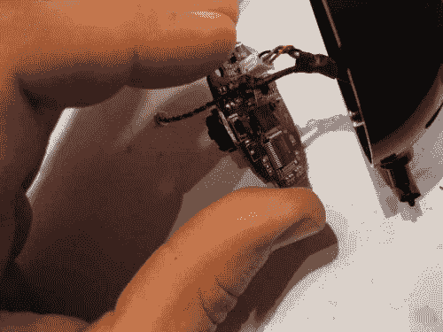

# 树莓 Pi 上的 OpenCV

> 原文：<https://dev.to/ladvien/opencv-on-a-raspberry-pi-2jbh>

[代码](///files/facedetectv10.zip)

[https://www.youtube.com/embed/Uo0NFRkdIWc](https://www.youtube.com/embed/Uo0NFRkdIWc)

不再害怕炸了我的圆周率，我已经开始尝试实现我的一些机器人目标。像许多人一样，我希望我的机器人能够与人互动，但我没有意识到我会偶然发现这种能力。

我看过许多视觉处理板，比如 CMU cam v4 T1，但我不会花 100 美元买任何一块板。我研究过做一个，看起来可能，但是不会太便宜。所以，我很好奇有什么选择。无意中发现了 Hack-a-Day 的推荐文章: [OpenCV on Raspberry Pi](http://www.technolabsz.com/2013/03/how-to-easily-install-opencv-on.html) 。

反正他提供了在 Raspberry Pi 上设置 OpenCV(开源计算机视觉)的说明。当然，大约 20 分钟后，我的 Pi 代码开始工作了。

我一直怀疑 Pi 运行任何计算机视觉软件的能力，更重要的是，考虑到 Pi 的处理限制，它的有用性。但是当我让它运行起来后，我发现它实际上比我希望的运行得更顺畅。不要误会我的意思，我认为它不到 10FPS，但我可以告诉你，它对许多机器人应用程序来说会比这更好，如果 Raspberry Pi 只用于计算机视觉，那么它仍然比许多其他硬件驱动的 CV 板便宜。

基本的树莓派和 WiFi 加密狗

*   WiFi 加密狗:6.17 美元
*   树莓派:35.00 美元
*   SD 卡(4g):2.50 美元
*   网络摄像头:8.00 美元
*   基本 RPi 合计:51.67 美元

因此，我开始破解他的代码。

几个小时后，我用一个非常粗糙的 Raspberry Pi、Ardy、相机和伺服协调来跟踪我的脸。请注意，这只是一个概念验证，仅此而已。但我希望最终能让我的机器人四处寻找面孔。

派·VNC 的形象。通过 [i2c](http://letsmakerobots.com/node/36847) 写入盒子轮廓。

[T2】](https://res.cloudinary.com/practicaldev/image/fetch/s--RUz6NvkH--/c_limit%2Cf_auto%2Cfl_progressive%2Cq_auto%2Cw_880/https://ladvien.cimg/FaceTracking_1355x768.jpg)

拆开一个 8 美元的小易贝相机。

[T2】](https://res.cloudinary.com/practicaldev/image/fetch/s--dqzOQAMg--/c_limit%2Cf_auto%2Cfl_progressive%2Cq_auto%2Cw_880/https://ladvien.cimg/IMG_0634_1024x768.jpg)

**设置树莓 Pi:**

如果你是从 sratch 设置的，从这些[指令](http://letsmakerobots.com/node/36884)开始。

但是如果你已经设置好了，我想你只需要 OpenCV。

$ sudo apt-get 安装 python-opencv

**代码:**

Arduino 代码从 i2c 读取字节，将其转换为字符，然后将字符放入一个整数数组中。Pi 发送 4 个数字，2 个坐标，x1，y1，x2，y2。

Python 代码是 Roman Stanchak 和 James Bowman 编写的“facetracker.py ”,我只添加了第 101-105 行，它将你脸部周围方框的坐标加载到一个字符串中，然后将它转换成一个字符串数组。我还添加了函数 txrx_i2c()。该函数将字符串数组转换为字节，并将其发送到 i2c 总线。

要将此设置从 i2c 更改为 UART，请关注 Python 代码中的 txrx_i2c()和 Arduino 代码中的 onRead()。我向你保证，UART 会容易得多。

如果有人有任何问题，请向我提问。哦！如果有人能告诉我优化代码的方法，我会洗耳恭听

```
#include <Wire.h> #define SLAVE_ADDRESS 0x2A
#include <Servo.h>  
Servo CamServoX; //Attach the pan servo.
Servo CamServoY; //Attach the tilt servo.

int ServoTimer = 250; // Change to adjust how quickly the servos respond.

int SmallXJump = 3; //Sets the movement amount for small pan jumps
int LargeXJump = 7; //Sets the movement amount for large pan jumps

int SmallYJump = 1; //Sets the movement amount for small pan jumps
int LargeYJump = 2; //Sets the movement amount for large pan jumps

//How close your face is to the edge to trigger a jump.
int SmallYLimit = 40;
int LargeYLimit = 20;

int SmallXLimit = 40;
int LargeXLimit = 20;

//Set servos to initial position.
int posX = 90; //Servo position.
int posY = 90; //Servo position.

int x1; int y1;int x2; int y2; //Holders for frame dimesions.

// Indexes for getting i2c bytes, then, converting them to integers.
int i = 0;
int varI = 0;

//Sets flag to trigger ServoWrite() from the main loop.
//I tried to put this under 'onRequest' call, but the Raspberry Pi kept giving me errors.
//This flagging was a work around.
int NoServoData = 0;

int dim[12]; //Char array for char[] ---> int conversion.
char d[8]; // Char holder array for byte-->char conversion.

void setup() {
    // initialize i2c as slave
    Wire.begin(SLAVE_ADDRESS);
    Wire.onRequest(sendData);
    Wire.onReceive(readData);
    Serial.begin(9600);

    //Attach servos
    CamServoX.attach(10); //Tilt (Y)
    CamServoY.attach(9); //Pan (X)

    //Write initial servo position.
    CamServoX.write(posX);
    CamServoY.write(posY);
}

void loop() {

//Again, this is the work around.  The flag "NoServoData" is set under the i2c onReceive.
if (NoServoData==1){
  ServoWrite();
}

}

//This is just to show the RPi can be written to. 
//Replace with stuff you want to write to the Pi.
char data[] = "Pasta";  
int index = 0;

// callback for sending data
void sendData() {
    Wire.write(data[index]);
    ++index;
    if (index >= 5) {
         index = 0;
    }
 }

// callback for receiving data.
void readData(int numbytes) {

//Holds the chars
int c;

if (Wire.available() > 0){
  while(Wire.available())    // slave may send less than requested
    c = Wire.read();
}
  //Add each integer to a char array.
  //Skip commas ',' and keep adding the integers until char '\0' is received.
  //Then print out the complete string.

  if (c != ','){
    if(c != '\0'){
      d[i] = d[i] + c;  //Appends the characters to an array.
      i++;
    }
  }
  else{
    i=0; //Reset the d char array index.
    if(varI < 7){  //We only want to get integers until we get all four numbers (x1, y1, x2, y2) plus
      dim[varI]=atoi(d); //Convert the d int into ASCII and store it in the dim array.
      d[0]=0;d[1]=0;d[2]=0;d[3]=0;d[4]=0;d[5]=0; //Clear the d array (i2c doesn't like for loops in this function
      varI++; //Increase dim index.
    }
    else{
      //We now have all four numbers, load them into the variables.
      x1=int(dim[4]);
      y1=int(dim[1]);
      x2=int(dim[2]);
      y2=int(dim[3]);

      NoServoData = 1;  //Set the WriteServo() call flag.
      varI=0; //Reset the dim index to prepare for next set of numbers.
      }
   i=0; //Reset some
  }
}

void ServoWrite(){
  int x3 = 160 - x2; // Calculate the distance from the right edge of the screen
  int y3 = 120 - y2; // Calcualte the distance

  //For X Axis
  if(x1 < SmallXLimit ){  //Only do small jumps, since not too far away from the edge.
        if(posX>1){ //If the pan servo is at its edge, do nothing.
          for (int i = 0; i < LargeXJump; i++){
            posX++;  // Set the new position
            CamServoX.write(posX); //Make the adjustment.
            delay(ServoTimer); //Delay between servo increments.
          }
      }
  }

  if(x3 < SmallXLimit){
      if(posX<180){
          for (int i = 0; i < LargeXJump; i++){
            posX--;
            CamServoX.write(posX);
            Serial.println(posX);
            delay(ServoTimer);
          }  
      }
  }

  if(x1 < LargeXLimit){
        if(posX>1){
          for (int i = 0; i < SmallXJump; i++){
            posX++;
            CamServoX.write(posX);
            Serial.println(posX);
            delay(ServoTimer);
          }
      }
  }

  if(x3 < LargeXLimit){
      if(posX<180){
        for (int i = 0; i < SmallXJump; i++){
            posX--;
            CamServoX.write(posX);
            Serial.println(posX);
            delay(ServoTimer);
        }
     }
  }

  //For Y Axis
  if(y1 < SmallYLimit ){
        if(posY>1){
          for (int i = 0; i < SmallYJump; i++){
            posY--;
            CamServoY.write(posY);
            Serial.println(posY);
            delay(ServoTimer);
          }
        }
  }

  if(y3 < SmallYLimit){
      if(posY<180){
        for (int i = 0; i < SmallYJump; i++){
          posY++;
          CamServoY.write(posY);
          Serial.println(posY);
          delay(ServoTimer);
        }
     }
  }

  if(y1 < LargeYLimit){
        if(posY>1){
          for (int i = 0; i < LargeYJump; i++){
            posY--;
            Serial.println(posY);
            CamServoY.write(posY);
            delay(ServoTimer);
          }
      }
  }

  if(y3 < LargeYLimit){
      if(posY<180){
        for (int i = 0; i < LargeYJump; i++){
          posY++;
          CamServoY.write(posY);
          Serial.println(posY);
          delay(ServoTimer);
        }
      }
  }

//Reset servo write flag.
NoServoData=0;
} 
```

Enter fullscreen mode Exit fullscreen mode

**现在为 Python 代码:**

```
#!/usr/bin/python """
Have to execute using "sudo python facedetect.py --cascade=face.xml 0"
(Normal build sudo python "%f")
This program is demonstration for face and object detection using haar-like features.
The program finds faces in a camera image or video stream and displays a red box around them.

Original C implementation by:  ?
Python implementation by: Roman Stanchak, James Bowman
"""
import sys
import cv2.cv as cv
from optparse import OptionParser
import time
import threading
import readline
import pygame
from pygame.locals import *
import sys
import smbus

# Parameters for haar detection
# From the API:
# The default parameters (scale_factor=2, min_neighbors=3, flags=0) are tuned
# for accurate yet slow object detection. For a faster operation on real video
# images the settings are:
# scale_factor=1.2, min_neighbors=2, flags=CV_HAAR_DO_CANNY_PRUNING,
# min_size=<minimum possible face size 
min_size = (20, 20)
image_scale = 2
haar_scale = 1.2
min_neighbors = 2
haar_flags = 0

"""i2c Code"""
bus = smbus.SMBus(1) # Open up a i@C bus. address = 0x2a # Setup Arduino address 
sendstring = "" # This will be my send variable (RPI-to-Arduino) bytearraytowrite = [] #Actual array for holding bytes after conversion from string. 
#This function actually does the writing to the I2C bus. def toWrite(a):
    global sendstring
    global bytearraytowrite
    bytearraytowrite = map(ord, sendstring) #This rewrites the string as bytes.
    for i in a:
        bus.write_byte(address, i)

def txrx_i2c():
    global sendstring
    #while True:
    sdata = ""
    rdata = ""
    for i in range(0, 5):
            rdata += chr(bus.read_byte(address));
    #print rdata
    #print bytearraytowrite
    #print "".join(map(chr, bytearraytowrite)) #Will convert bytearray to string. 
    #Writes the key commands to the i2c bus.
    toWrite(bytearraytowrite)

    #time.sleep(.6); 
def detect_and_draw(img, cascade):
    global sendstring

    # allocate temporary images
    gray = cv.CreateImage((img.width,img.height), 8, 1)
    small_img = cv.CreateImage((cv.Round(img.width / image_scale),
                   cv.Round (img.height / image_scale)), 8, 1)

    # convert color input image to grayscale
    cv.CvtColor(img, gray, cv.CV_BGR2GRAY)

    # scale input image for faster processing
    cv.Resize(gray, small_img, cv.CV_INTER_LINEAR)

    cv.EqualizeHist(small_img, small_img)

    if(cascade):
        t = cv.GetTickCount()
        faces = cv.HaarDetectObjects(small_img, cascade, cv.CreateMemStorage(0),
                                     haar_scale, min_neighbors, haar_flags, min_size)
        t = cv.GetTickCount() - t
        print "detection time = %gms" % (t/(cv.GetTickFrequency()*1000.))
        if faces:
            for ((x, y, w, h), n) in faces:
                # the input to cv.HaarDetectObjects was resized, so scale the
                # bounding box of each face and convert it to two CvPoints
                pt1 = (int(x * image_scale), int(y * image_scale))
                pt2 = (int((x + w) * image_scale), int((y + h) * image_scale))
                cv.Rectangle(img, pt1, pt2, cv.RGB(255, 0, 0), 3, 8, 0)
                x1 = int(x * image_scale)
                y1 = int(y * image_scale)
                x2 = int((x + w) * image_scale)
                y2 = int((y + h) * image_scale)
                sendstring = str(x1) + "," + str(y1) + "," + str(x2) + "," + str(y2) + ","
                sendstring = sendstring.translate(None, '() ')
                print sendstring
                txrx_i2c()
                sendstring = ""
    cv.ShowImage("result", img)

if __name__ == '__main__':

    parser = OptionParser(usage = "usage: %prog [options] [filename|camera_index]")
    parser.add_option("-c", "--cascade", action="store", dest="cascade", type="str", help="Haar cascade file, default %default", default = "../data/haarcascades/haarcascade_frontalface_alt.xml")
    (options, args) = parser.parse_args()

    cascade = cv.Load(options.cascade)

    if len(args) != 1:
        parser.print_help()
        sys.exit(1)

    input_name = args[0]
    if input_name.isdigit():
        #Where the image is actually captured from camera. "capture" is the variable holding image.
        capture = cv.CreateCameraCapture(int(input_name))
    else:
        capture = None

    cv.NamedWindow("result", 1)

    width = 160 #leave None for auto-detection
    height = 120 #leave None for auto-detection 
    if width is None:
        width = int(cv.GetCaptureProperty(capture, cv.CV_CAP_PROP_FRAME_WIDTH)) #Gets the width of the image.
    else:
        cv.SetCaptureProperty(capture,cv.CV_CAP_PROP_FRAME_WIDTH,width) #Gets the width of the image. 
    if height is None:
    height = int(cv.GetCaptureProperty(capture, cv.CV_CAP_PROP_FRAME_HEIGHT))
    else:
    cv.SetCaptureProperty(capture,cv.CV_CAP_PROP_FRAME_HEIGHT,height)

    if capture: #If "capture" actually got an image.
        frame_copy = None
        while True:

            frame = cv.QueryFrame(capture)
            if not frame:
                cv.WaitKey(0)
                break
            if not frame_copy:
                frame_copy = cv.CreateImage((frame.width,frame.height),
                                            cv.IPL_DEPTH_8U, frame.nChannels)

#                frame_copy = cv.CreateImage((frame.width,frame.height),
#                                            cv.IPL_DEPTH_8U, frame.nChannels) 
            if frame.origin == cv.IPL_ORIGIN_TL:
                cv.Copy(frame, frame_copy)
            else:
                cv.Flip(frame, frame_copy, 0)

            detect_and_draw(frame_copy, cascade)

            if cv.WaitKey(10) >= 0:
                break
    else:
        image = cv.LoadImage(input_name, 1)
        detect_and_draw(image, cascade)
        cv.WaitKey(0)

    cv.DestroyWindow("result") 
```

Enter fullscreen mode Exit fullscreen mode