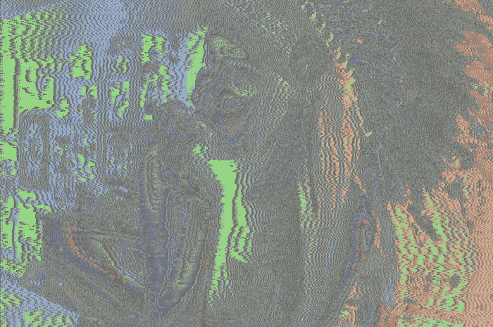
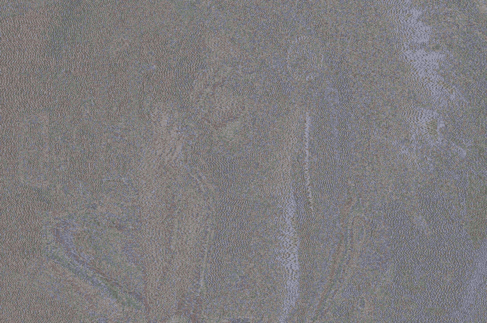

# 影像学实验#5

> 原文：<https://dev.to/senior_sigan/imagemagick-5-29d6>

专为敏锐感爱好者设计。您现在将看到每个“像素”以不同的比率影响下一个。

为了简单起见，在本实验中，前一像素的颜色值简单地与下一个以一些系数相加。

<figure>

[T2】](https://res.cloudinary.com/practicaldev/image/fetch/s--or_1UXWw--/c_limit%2Cf_auto%2Cfl_progressive%2Cq_auto%2Cw_880/https://dev-to-uploads.s3.amazonaws.com/i/ebg2b8tcd487z4j66mdm.jpeg)

<figcaption>Коэффициент 0.5 — это только начало.</figcaption>

</figure>

<figure>

[T2】](https://res.cloudinary.com/practicaldev/image/fetch/s--KRJy-SEb--/c_limit%2Cf_auto%2Cfl_progressive%2Cq_auto%2Cw_880/https://dev-to-uploads.s3.amazonaws.com/i/3hpe29jwkyr8nnhzqbbu.jpeg)

<figcaption>Коэффициент 0.7</figcaption>

</figure>

<figure>

[T2】](https://res.cloudinary.com/practicaldev/image/fetch/s--qfjJF5s1--/c_limit%2Cf_auto%2Cfl_progressive%2Cq_auto%2Cw_880/https://dev-to-uploads.s3.amazonaws.com/i/mnns10ld8i6w6qi74dka.jpeg)

<figcaption>Коэффициент 0.8</figcaption>

</figure>

<figure>

[T2】](https://res.cloudinary.com/practicaldev/image/fetch/s--GgJzCB6k--/c_limit%2Cf_auto%2Cfl_progressive%2Cq_auto%2Cw_880/https://dev-to-uploads.s3.amazonaws.com/i/z3ztngzwb2s0acopl55e.jpeg)

<figcaption>Коэффициент 0.9</figcaption>

</figure>

和最重的 1.1。几乎是白色的噪音。就好像电视显示不好一样。

<figure>

[T2】](https://res.cloudinary.com/practicaldev/image/fetch/s--P0cENCM0--/c_limit%2Cf_auto%2Cfl_progressive%2Cq_auto%2Cw_880/https://dev-to-uploads.s3.amazonaws.com/i/jpph1wq06ctxldsqcvgb.jpeg)

<figcaption>Коэффициент 1.1</figcaption>

</figure>

在下一部分中，我们从像素坐标及其在图像上方的值应用一些函数。

# t0t 1 号机组人员

[https://github . com/senior-sigan/magick/blob/master/dependency . h](https://github.com/senior-sigan/magick/blob/master/dependence.h)