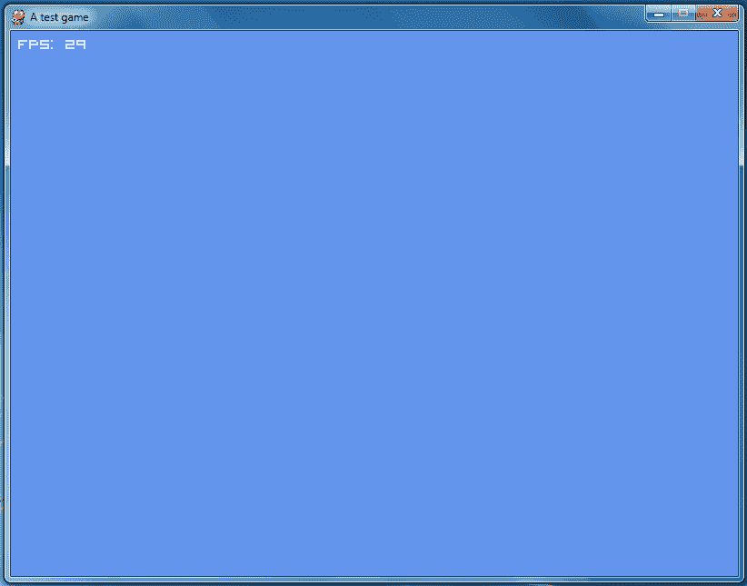

# 用 Python/Pygame 实现的 XNA 风格游戏类

> 原文：<https://dev.to/adamkdean/xna-style-game-class-with-python-pygame-1ki>

XNA/一夫一妻制很棒。你有如此丰富的课程可以选择。已经有一些很棒的游戏是用它制作的；其中有[土鳖](http://www.terraria.org/)和[魔法师](http://en.wikipedia.org/wiki/Magicka)。但是当你只是想想象你正在编写的东西时，嗯，这似乎*太费力了*。

以我的 XNA/一夫一妻制的 [Circle 原始类为例。仅仅渲染一个圆就需要整个类。你会认为 XNA 会随之而来，但不，不是圈子。好吧，让我们来做线吧，这很简单，不是吗？*其实不是*。看起来他们并不想给你提供一个简单的解决方案，而是把这些事情留给你自己。如果你正在制作一个大的应用程序/游戏，这是很好的，但是当你只是想在屏幕上显示一些东西时，必须有一个更简单的方法。](http://www.adamkdean.co.uk/blog/read/54/circle-primitive-class-for-xna-monogame)

而且还有: [Pygames for Python](http://www.pygame.org/) 。我知道，这只是令人作呕的高级伪语言对吧。*他们甚至不用牙套！*不过其实挺好的。很容易，很快，也很简单。

我喜欢 XNA 的一点是游戏类的布局方式。我觉得它真的很直观，很好。所以我继续尝试使用 Pygames 在 Python 中实现这一点。

请记住，这是我第一个真正的 Python 脚本，所以可能有一些禁忌。另外，如果你想运行这个，你可能需要[这个字体](http://www.dafont.com/visitor.font)。要么这样，要么把`"../fonts/visitor1.ttf"`改成`None`。

```
import sys
import pygame
from pygame.locals import * #@UnusedWildImport

class Game:
    def __init__(self, width, height, caption="Game"):
        self.width = width
        self.height = height
        self.caption = caption
        self.framerate = 30        
        self.foreground_color = (255, 255, 255)
        self.background_color = (100, 149, 237)
        self.initialize()
        self.loop()

    def initialize(self):
        pygame.init()
        pygame.display.set_caption(self.caption)
        self.screen = pygame.display.set_mode((self.width, self.height))        
        self.font = pygame.font.Font("../fonts/visitor1.ttf", 20)

    def loop(self):
        self.clock = pygame.time.Clock()
        while 1:
            gametime = self.clock.get_time()
            self.update(gametime)
            self.render(gametime)
            self.clock.tick(self.framerate)

    def update(self, gametime):        
        self.text = self.font.render("FPS: %d" % self.clock.get_fps(), 
                                     1, self.foreground_color)
        self.handle_input(pygame.event.get())

    def render(self, gametime):
        surface = pygame.Surface(self.screen.get_size())
        surface.convert()
        surface.fill(self.background_color)
        surface.blit(self.text, (8, 6))        
        self.screen.blit(surface, (0, 0))
        pygame.display.flip()

    def handle_input(self, events):
        for event in events:
            if event.type == pygame.QUIT: 
                sys.exit()
            if event.type == pygame.KEYUP:
                if event.key == pygame.K_ESCAPE:
                    sys.exit()

if __name__ == "__main__":
    game = Game(800, 600, "A test game") 
```

Enter fullscreen mode Exit fullscreen mode

在我看来是合法的！

[T2】](https://res.cloudinary.com/practicaldev/image/fetch/s--ulx6b8dg--/c_limit%2Cf_auto%2Cfl_progressive%2Cq_auto%2Cw_880/http://i.imgur.com/Bx27iKL.png)