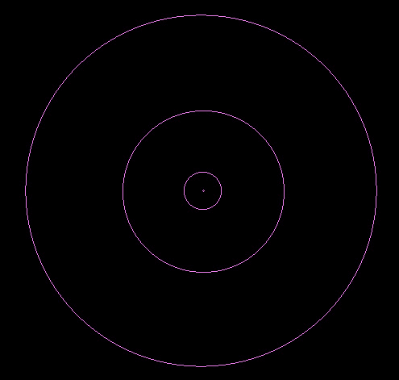

# XNA/一夫一妻制的圆原始类

> 原文:[https://dev . to/adamkdean/circle-primitive-class-for-xna-one-2pkh](https://dev.to/adamkdean/circle-primitive-class-for-xna-monogame-2pkh)

我刚刚玩了一点 XNA(或者现在所谓的一夫一妻制),需要画些圈。如果你使用过 XNA，那么你会知道没有类似的东西提供给你。画圆其实并不太难，它们基本上只是许多不同角度的小线条。

我想出了下面这个类。它有默认的点数，但是你可以重载它，允许你创建三角形、矩形、五边形、六边形等等。

**更新:**现在点数是由圆的半径决定的。当前对`Radius * Math.PI`的计算似乎工作得很好。我不知道是否有“黄金”比例，但我对这个很满意。

注意，我已经采用了我的新风格，将字段放在类的底部。我喜欢，你能更快地找到代码。

```
public class Circle
{
    public Circle(float x, float y, int radius,
        GraphicsDeviceManager graphics)
        : this(x, y, radius, Color.White, graphics) { }

    public Circle(float x, float y, int radius,
        Color color, GraphicsDeviceManager graphics)
    {
        this.x = x;
        this.y = y;
        this.radius = radius;
        this.color = color;
        this.graphics = graphics;

        Initialize();
    }

    public void Draw()
    {
        effect.CurrentTechnique.Passes[0].Apply();
        graphics.GraphicsDevice.DrawUserPrimitives
            (PrimitiveType.LineStrip, vertices, 0, vertices.Length - 1);
    }

    private void Initialize()
    {
        InitializeBasicEffect();
        InitializeVertices();
    }

    private void InitializeBasicEffect()
    {
        effect = new BasicEffect(graphics.GraphicsDevice);
        effect.VertexColorEnabled = true;
        effect.Projection = Matrix.CreateOrthographicOffCenter
            (0, graphics.GraphicsDevice.Viewport.Width,
             graphics.GraphicsDevice.Viewport.Height, 0,
             0, 1);
    }

    private void InitializeVertices()
    {
        vertices = new VertexPositionColor[CalculatePointCount()];
        var pointTheta = ((float)Math.PI * 2) / (vertices.Length - 1);
        for (int i = 0; i < vertices.Length; i++)
        {
            var theta = pointTheta * i;
            var x = X + ((float)Math.Sin(theta) * Radius);
            var y = Y + ((float)Math.Cos(theta) * Radius);
            vertices[i].Position = new Vector3(x, y, 0);
            vertices[i].Color = Color;
        }
        vertices[vertices.Length - 1] = vertices[0];
    }

    private int CalculatePointCount()
    {
        return (int)Math.Ceiling(Radius * Math.PI);
    }

    private GraphicsDeviceManager graphics;
    private VertexPositionColor[] vertices;
    private BasicEffect effect;

    private float x;
    public float X
    {
        get { return x; }
        set { x = value; InitializeVertices(); }
    }
    private float y;
    public float Y
    {
        get { return y; }
        set { y = value; InitializeVertices(); }
    }
    private float radius;
    public float Radius
    {
        get { return radius; }
        set { radius = (value < 1) ? 1 : value; InitializeVertices(); }
    }
    private Color color;
    public Color Color
    {
        get { return color; }
        set { color = value; InitializeVertices(); }
    }
    public int Points
    {
        get { return CalculatePointCount(); }
    }
} 
```

<svg width="20px" height="20px" viewBox="0 0 24 24" class="highlight-action crayons-icon highlight-action--fullscreen-on"><title>Enter fullscreen mode</title></svg> <svg width="20px" height="20px" viewBox="0 0 24 24" class="highlight-action crayons-icon highlight-action--fullscreen-off"><title>Exit fullscreen mode</title></svg>

使用它真的很简单*。创建一个`Circle`，调用`circleObject.Draw()`。*

```
Circle circle;

protected override void Initialize()
{
    // X, Y, Radius, Color (optional), GraphicsDeviceManager
    circle = new Circle(100f, 100f, 50f, Color.Violet, graphics);

    base.Initialize();
}

protected override void Draw(GameTime gameTime)
{
    GraphicsDevice.Clear(Color.Black);

    circle.Draw();

    base.Draw(gameTime);
} 
```

<svg width="20px" height="20px" viewBox="0 0 24 24" class="highlight-action crayons-icon highlight-action--fullscreen-on"><title>Enter fullscreen mode</title></svg> <svg width="20px" height="20px" viewBox="0 0 24 24" class="highlight-action crayons-icon highlight-action--fullscreen-off"><title>Exit fullscreen mode</title></svg>

您可以通过属性更改圆的半径和位置。我可能会添加旋转它的功能。

我可能会将这个和其他基本助手类添加到类库中。如果是的话，我以后会把它链接到这里。

下图:四个不同大小和点数的圆。

[T2】](https://res.cloudinary.com/practicaldev/image/fetch/s--SmnOavsq--/c_limit%2Cf_auto%2Cfl_progressive%2Cq_auto%2Cw_880/http://i.imgur.com/XdgKFkN.jpg)

*更新日期:2013 年 3 月 25 日*