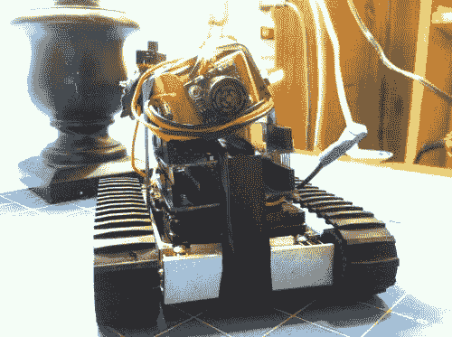
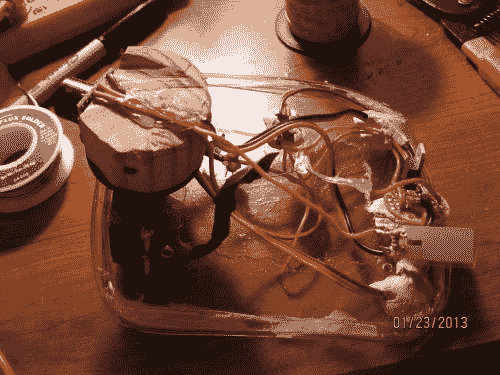
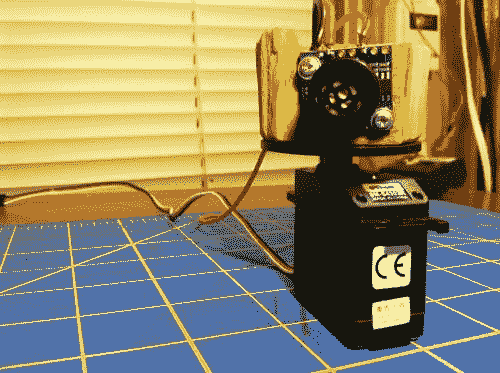
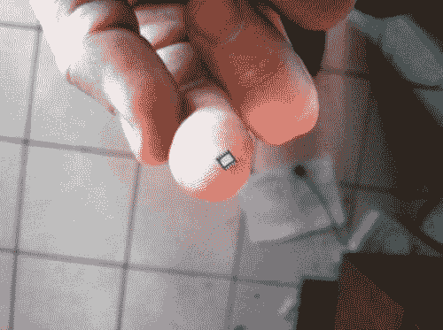
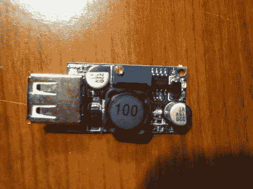

# 第一个机器人

> [https://dev . to/ladvien/first-robot-2ped〖t1〗](https://dev.to/ladvien/first-robot-2ped)

[第一个 Bot 文件](///files/First_Bot.tar.gz)

[https://www.youtube.com/embed/FmJV9werCjQ](https://www.youtube.com/embed/FmJV9werCjQ)

我将用“4.x”版本更新。但是想用视频来演示这个概念。宋承宪- > RPi - > I2C 光隔离器- > Arduino Mini Pro - >自行设计电机屏蔽- >轨道:)

这是我的第一个机器人。当然，他非常模块化。我对此没有意见——我是一名无家可归者救助工作者，这整个项目只是为了让我暂时忘掉那些不好的事情。

虽然我真的很喜欢这个小家伙，但他那普通的霍奇-波德奇外观让我想起了《坦克女孩》这部怪物电影。

**目标:**

1.  通过机器人禅保持精神健康。

2.  帮我两岁的儿子克服对机器人与生俱来的恐惧。

3.  为了设计一个平台，我最终可以用我对心理学和统计学的理解创造出漂亮的行为。

**版本 v1.x:**

在这次迭代中，我有一个 Interia 实验室的基本套件([http://www.robotmarketplace.com/products/IL-ANTKIT2.html](http://www.robotmarketplace.com/products/IL-ANTKIT2.html))。我不会再买这个套件了——胎面轮毂太薄，而且胎面很快就脱落了(虽然，这些胎面的抓地力很惊人，感觉就像这个家伙可以直接爬上一堵墙)。不过，我喜欢的小马达。当我建造我的下一个机器人时，我会设计我自己的底座，但我确定我会使用这些马达(【http://www.robotmarketplace.com/products/IL-GMS100.html】T2)。如此小的封装中的强大功能。

电池是一架旧的大炮相机遗留下来的。我让他们并联 8.4v 和 2900 毫安。

接下来，我有一个 Arduino Uno。

然后，我有一个 Arduino 马达护罩。我最初决定建立自己的发动机防护罩。我了解了铁转移、家用 PCB 蚀刻、Eagle 和不同种类的 H 桥 IC，所有这些我将在后面写，但我得出的结论是，我对自己目前的能力水平产生了错觉。因此，我买了一个电机屏蔽，并继续建设。

[http://cthomasbrittain . WordPress . com/2013/01/27/design-a-motor-driver-for-lsn-bot/](http://cthomasbrittain.wordpress.com/2013/01/27/design-a-motor-driver-for-lsn-bot/)

[T2】](https://res.cloudinary.com/practicaldev/image/fetch/s--LXyR7LYH--/c_limit%2Cf_auto%2Cfl_progressive%2Cq_auto%2Cw_880/https://ladvien.cimg/IMG_1035.jpg)

接下来，我有一个 5v 线性稳压器(我发现，如果通过 vin 向 Arduino 提供电压，当您试图从 5v 引脚汲取电流，通过传感器发送电流，并将其反馈到模拟引脚时，显然会产生短路。Pfft。还有来自 Arduino 的魔法烟雾。它相当蓝。)

最重要的是，我有一块木头，是用我们车库里的锯子锯下来的。别急，车库还站着:嗯，目前为止。我在上面放了一个 MaxSonar 传感器([https://www.sparkfun.com/products/639](https://www.sparkfun.com/products/639))。我喜欢这个坚固的传感器；我们甚至一起熬过了 vin 短路的场景。

我还有一个振动传感器，用 1 兆电阻器([https://www.sparkfun.com/products/9196](https://www.sparkfun.com/products/9196))连接到模拟引脚。

当然，还有一个反馈 LED。

**1.x 视频**

[https://www.youtube.com/embed/jElQulP4eYY](https://www.youtube.com/embed/jElQulP4eYY)

**Build v2 . x:**

我觉得我终于组装好了“工具箱”但是我想拥有它。我想去掉固定整个东西的绝缘胶带。我制造了这个小混乱。我拿了一些树脂，在中间切了一个洞，然后在一些聚乙烯软管上开了一条缝，然后用热胶把边缘粘起来作为保险杠。我用了一个中等伺服和线程通过最大声纳孔。我找到了一些有足够弹性的金属丝，可以防止金属丝断裂。最后，热胶和半坚固的油灰把其他部分固定住。我觉得我现在“拥有”它多一点了——整个事情工作得很好，除了我如何选择安装伺服。MaxSonar 传感器卡在边缘，会先撞到东西。

[T2】](https://res.cloudinary.com/practicaldev/image/fetch/s--MDLBh8WF--/c_limit%2Cf_auto%2Cfl_progressive%2Cq_auto%2Cw_880/https://ladvien.cimg/IMG_0980.jpg)

我注意到的另一件事是，我制作的平台很适合作为我儿子塞拉斯的把手。这导致他更多地玩机器人——甚至“救”了他几次。

2.x 视频(注意，穿尿布的宝宝。)

[https://www.youtube.com/embed/XshoH3vyt7g](https://www.youtube.com/embed/XshoH3vyt7g)

**Build 3 . x**

我想拥有更多我的体型；我使用家得宝级有机玻璃切割板材，很久以前我买了一对 Xbees 用于一个项目。我决定，在我的平台上解决这些问题之前，我将使用 Processing 2.0 制作一个简单的 Xbee 控制器。我去掉了所有的绝缘胶带，取出了 LSN 的内脏。我切了几块有机玻璃板作为部件支架。

[T2】](https://res.cloudinary.com/practicaldev/image/fetch/s--k-B_R8Xa--/c_limit%2Cf_auto%2Cfl_progressive%2Cq_auto%2Cw_880/https://ladvien.cimg/IMG_1502.jpg)

一块板盖住底座，我用胶水粘上了两个 3 号 AA 电池盒。我把这些放在并行，使用 3 节 LiFePo4 600 mAh 电池。我最后在 1200 mAh 的 LiFePo4 上 9.6v。我在沃尔玛发现了打折的电池，买下它们的目的是学习如何制作自己的电池组。不幸的是，这比我预期的更具挑战性；没有简单的充电器设置，所以我找到了一些芯片来串联充电，我买了这些芯片，认为我可以很容易地蚀刻电路板，并制作自己的可充电包。嗯，我没有检查我得到的是什么芯片，最终得到了一个大小接近奇点的 DFN([http://ww1.microchip.com/downloads/en/AppNotes/01276a.pdf](http://ww1.microchip.com/downloads/en/AppNotes/01276a.pdf))。我没有放弃充电器板——但我知道这将花费我比我想要的更长的时间(我已经包括了我当前的板 verzion，还有一点工作，我会把它送到 OshPark)。

[T2】](https://res.cloudinary.com/practicaldev/image/fetch/s--9L3dsD0_--/c_limit%2Cf_auto%2Cfl_progressive%2Cq_auto%2Cw_880/https://ladvien.cimg/IMG_1507.jpg)

接下来，我为 Arduino 和电机屏蔽切割了一个有机玻璃模板，最后，我切割了一个有机玻璃模板，并在 Arduino 无线屏蔽的引脚可以插入电机屏蔽的地方进行了切割。我用一些 3 英寸的铝支架和一些塑料螺丝旋钮(从 Alliedelec.com 获得)将所有这些固定下来。我把支架拧进封闭安装孔。

正如我之前提到的，我移除了伺服和最大传感器；在适当的位置，我放了一个试验板来测试传感器。

[T4】](https://res.cloudinary.com/practicaldev/image/fetch/s--OlMoN50n--/c_limit%2Cf_auto%2Cfl_progressive%2Cq_auto%2Cw_880/https://ladvien.cimg/IMG_1503.jpg)

为了给传感器供电，我用这个小巧的 DC-DC 稳压器(LM2596)取代了 5v 线性稳压器。小微调壶让你设置输出 1.5v 至 35v，2A(输入是 4.5v-40v)。易贝的 1.56 美元让我很开心。我还切掉了 plexi，并放了一个小的双态开关来打开和关闭机器人。

当然，我在这个版本的代码中实际使用的传感器只是一个插在试验板上的 HC-SR04。(我不想把 MaxSonar 从我用螺丝固定的相当稳定的木块中拔出来。)

**Build 4 . x**

[https://www.youtube.com/embed/FmJV9werCjQ](https://www.youtube.com/embed/FmJV9werCjQ)

**代码 v1.x:**

基本代码告诉小家伙跑来跑去到处射击他的声纳。如果他检测到小于 12 英寸的东西，他停下来，向右转，读取读数，向左转，读取，然后比较三个读数。前面，左边，中间，哪个更清楚他就开始往那个方向走。他这样做了。如果小家伙读不到，或者声纳的波束不够宽，他会碰到什么东西，激活爆震传感器。如果发生这种情况，他会后退，来个 180 度大转弯，然后重新开始。

我确实有先见之明，设计了围绕函数调用的代码(例如，“Forward()”)，以便我最终可以使用某种 RF 连接给他一个大大脑(后来，我认为会是 PC 和 Python)。

**代码 2.x**

这段代码非常接近原始代码；我添加了伺服功能，我想还有一些其他的小调整(大部分我试图在我的代码中标注)。

**代码 3.x**

正如我在文章中提到的——我买了一双 Xbees，把它整合到我妻子的示意驱动肚皮舞裙中。幸运的是，我找到了一种更好的方法来构建它，所以我留下了两个 Xbees Ser1。经过一点思考，我意识到我终于可以开始在一些处理单元上编写代码，并开始用这个小家伙做一些漂亮的事情。因此，我选择从处理开始，因为它接近我熟悉的代码。过了一会儿，我用 PC、Processing 和 Xbees(Zombie _ Processing _ 3 _ 6 _ RC . zip)写了一个简单 RC 控制器的草图。

但是，这对我来说还不够好。我买了一个树莓派，非常想把它添加到机器人上。我算过了。我算了一下，用 WiFi 加密狗安装一个 RPi 和买一个 WiFi 差不多。

WiFly setup:

1.  来自 SparkFun 的 wifi Xbee:42.95 美元
2.  arduino WiFi Shield:6.98 美元 WiFi 版:49.93 美元

基本的树莓派和 WiFi 加密狗

WiFi 加密狗:6.17 美元
树莓 Pi:35.00 美元
SD 卡(4g):2.50 美元
基本 RPi:43.67 美元

我的错觉，显然超越了我的能力，开始运行通过这个 RPi 设置会是什么样子。我开始认为我的小机器人的存在有两个独立的部分。RPi 是中枢神经系统，Arduino 是外围设备。Arduino 将负责执行运动和感知功能，RPi 将负责计算和分析。因此，在我看不到我的无能的情况下，在编写充当控制器的处理代码的最后，我意识到这将是开始测试我的小机器人的外围神经系统(Arduino 代码)的一个好地方。此外，当我最终达到足以编写智能代码的水平时，这些代码将取代我在处理过程中发出的命令。

当然，一个问题击中了我的头——“默认情况下，我们将支持 Python 作为教育语言。”该死的 RPi 制造商。哦，我需要学习另一种编程语言。嗯，经过几天对脚本语言的钻研(这就像试图说晚期帝国的 Koiné)我终于拼凑出工作(？)Python 代码。我想要的 Python 代码相当于我的处理代码，令我惊讶的是，它确实如此。因此，我能够让我的 Arduino 草图保持原样，也就是说，我的 Python 脚本和处理代码都将在同一版本的 Arduino 草图上工作。

我确实注意到了 Python 的潜力。我能够整合线程和 Tkinter 的 gui。

我想提出一个警告。这些代码一点也不完整——我只是在等待需要完成的组件时，把我的注意力放在一些机械项目上。

**代码 4.x**

这个版本的代码可能看起来有点复杂，但是在你的引擎盖下(或者引擎盖，对于我的欧洲朋友来说)，它实际上比我的 Xbee 版本简单得多。

信息流可以总结如下:

SSH ->树莓 Pi - > I2C 光隔离器- > Arduino Pro Mini - > M3 电机护罩

本质上是树莓 Pi WiFi 加密狗。

我以这种方式设计流程，以便我可以在 Raspberry Pi 上编程更高级的功能(例如，传感器数据计算)，从而允许我通过用它自己的选择(我希望它们是好的选择)替换我的按键来使它自治。当然，这仍然允许我 SSH 到 RPi 上的 Python 代码中，根据需要进行调整。

因此，最终的信息流将是这样的:

树莓派- > I2C 光隔离器- > Arduino Pro Mini - > M3 电机屏蔽。

我会尽我所能，用我的代码和资源来让代码工作。

首先，设置 RPi。

我没有包含在这个版本中，而是单独走了一遍。

**[蓝莓派](http://ladvien.github.io/robots/blueberry-pi-robot-base/)**

代码现在实际上非常简单。Python 想出要做的事情(现在由击键产生)并告诉 Arduino 去做。它通过捕捉击键，将它们转换成字节，通过 I2C 总线发送，Arduino 捕捉它们，将它们从字节翻译回人类可读的东西。每一次击键都与一个例程相关联。如果它捕获了“W”键码，就把它转换成字节，通过 I2C，Ardy 抓取它，把它转换回“W”，然后运行 Forward()函数。同样，Arduino 可以通过总线将信息发送回 Pi，Pi 将信息从字节转换成字符，然后将字符编译成字符串，直到它达到预定义的分隔符。简单。

击键最终将被树莓 Pi 计算取代——因此，它是中枢神经系统。Arduino 将负责执行功能；在这个比喻中，它是自主神经系统。这个想法是，即使 Pi 下降，Ardy 将保持一些基本的功能。这允许高功能(例如语音合成)和系统稳定性(Arduino 的“生存代码”)的协同作用。当然，还没有完成。:)

**讨论 v1.x:**

所以，实际上我现在和这个人更进一步了。但我觉得我应该回去，口头上处理我的构建；为了我自己，也许也为了像我一样不幸读到这篇文章的任何其他黑客，保持对它的跟踪。

所以，我准备把我学到的东西列出来(无聊的欢迎悄悄离开)。

*   LMR 的集体是非常宝贵的——(虽然，他们可能是一个不称职的小安 Randish，**“你没有在张贴前'谷歌'这个问题！棍子-小猪-小猪！贴！”* *尤其是那个木匠克里斯托。
*   SparkFun 很贵。
*   易趣便宜。
*   魔法烟闻起来很香。
*   设计电路很容易；设计一个好的电路是深奥的。尽管如此，我仍然相信我尝试设计自己的电机电路是正确的。我从数据表和在线教程中学到了很多东西，尽管沮丧情绪很高，但我获得的知识是值得的。
*   蚀刻你自己的电路板是相当容易的。试图在木板上蚀刻出细小的痕迹是一种愚蠢的行为。
*   自制 PCB 时，要有好的烙铁。便宜的熨斗似乎不够热。最后发生在我身上的是，当尖端变得有点脏时，我会去焊接一个引脚，当我把我的铁拉开时，迹线会从电路板上脱落。有趣的是，这很可能发生在你焊接的最后一个引脚上。不知道为什么。
*   虽然我现在觉得用原始组件构建自己的机器人很舒服，但我并不为我用模块化组件构建这个迭代而感到羞愧。它教会了我很多。
*   电子产品充斥着你的大脑。机器人的禅意对我的精神健康非常有益。
*   妄想是制造者的最大利益。梦想它，开始建造，当细节击中你的脸时，用大量的创造力回击。请记住，你总是有奶奶谷歌解释你可能需要知道的任何事情。
*   遥控汽车是给运动员用的；机器人是给牛人的。

**讨论 v2.x**

回过头来看，我不确定我还会继续使用伺服系统。我没有分析它所消耗的电流，但我很确定这并不比启动马达和让整个机器人移动少多少。胎面抓地力很好，所以我不觉得我会牺牲任何精度。我会简单地让机器人零点转向右，左，而不是伺服。不知道为什么，我的肚子更高兴与更少的移动部件-在伺服建设有一个更坚实的感觉。但是，从好的方面来看，我确实在这个过程中学会了使用伺服系统。我也学到了一个角度旋转伺服和全旋转伺服之间的区别。

吸取的教训:

*   Dremel 工具是机器人制造的必需品。尤其是切割钻头。
*   台虎钳不错。真正的工作台也是如此(即使它是从垃圾箱里出来的)。
*   全旋转伺服系统并不精确(我知道角度伺服系统也不精确，但我不是在寻找荒谬的简化)。
*   孩子们认为伺服系统发出令人毛骨悚然噪音。
*   有机玻璃非常适合做原型。结合一个 dremel，切割钻头，和一个速度平方，快速原型从来没有如此独特。

**讨论 3.x:**

我非常兴奋地开始接近推杆，在那里我可以把一些真正的大脑放进这个小家伙。回过头来看，我会后悔没有用 Python 开始编写 Xbee 控制器代码，而不是用 Processing 编写，然后用 Python 重写。不管怎样，这是很好的练习。此外，我知道我需要为这个 Xbee 控制器的稳定版本解决的问题。目前，处理代码几乎没有错误控制——当接收数据时，它只是从 Arduino 中提取数据并显示出来。它不担心丢失的比特或不可用的数据。Python 代码有复杂的错误检查，就像变形虫一样。现在，它只是检查 readline 的位数是否超过 8 或 9 位。如果是，它打印数据，如果不是，它跳过并等待一个更完整的读取行。这些都可以大幅改善。但是，这根本不是我的本意。最终，我计划将 Raspberry Pi 放在 Arduino 上，用 USB 线连接。所以，我真的指望没有数据丢失给以太。我写这些代码只是想看看我能不能。就像穴居人向机器人展示自己的能力。

**讨论 4.x**

我觉得我创造了可能是互联网上最复杂的遥控车之一。我累了。

吸取的教训:

*   Raspberry Pi 的 I2C 线上有上拉电阻。
*   数据手册中的“典型应用”原理图*令人惊叹。*
*   不要依赖抄袭别人的作品。创造你自己的，那就满足多了。
*   错觉是好事。
*   我不聪明，我有强迫症。
*   I2C 比连环简单？
*   那些快线的家伙都是忍者。
*   设计 OSHPark 电路板还有一个额外的好处，就是鼓励你提高 PCB 设计的效率，因为你是按平方英寸收费的。学习利用 SMD 器件设计紧凑型电路板是值得的。
*   让我恼火的不是 Python，而是缺乏管理 Python 版本兼容性的方法。

**销货成本明细 1.x:**

*   Interia 的底座(4 个马达、踏板、轮毂和数控铝):109.00 美元
*   arduino Uno:34 美元
*   Arduino 电机护罩:28 美元
*   爆震传感器:2.95 美元
*   最大声纳:25.95 美元
*   电池:已经有了。估计的$12.95
*   中型伺服 10.95 美元
*   **总计:223.80 美元**

**销货成本明细 2.x:**

*   Interia 的底座(4 个马达、踏板、轮毂和数控铝):109.00 美元
*   arduino Uno:34 美元
*   Arduino 电机护罩:28 美元
*   爆震传感器:2.95 美元
*   最大声纳:25.95 美元
*   电池:已经有了。估计的$12.95
*   中型伺服 10.95 美元
*   无线屏蔽:22.95 美元
*   xbee X2:45.90 美元
*   xbee Explorer:10.95 美元
*   有机玻璃:12.98 美元
*   **总计:316.58 美元**