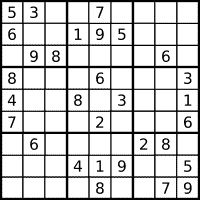

# 视角和谜题

> 原文:[https://dev.to/briannipper/perspective-and-puzzles-476a](https://dev.to/briannipper/perspective-and-puzzles-476a)

|  |
| [可翻转的人物和花瓶。来自维基共享资源](http://en.wikipedia.org/wiki/File:Two_silhouette_profile_or_a_white_vase.jpg) |

我最近想起了不久前的一个 ted 演讲，关于 T2 的视错觉，以及我们的眼睛是如何被他们所看到的环境严重影响的，或者正如演讲中提到的，“击中我们眼睛的光并不重要，重要的是一旦信息击中我们的大脑，我们如何处理它。”为了帮助说明这一点，这里的图像显示了一个著名的“错觉”，根据你的视角，黑色区域是两张脸的轮廓，或者白色区域形成一个花瓶，实际上两者都是真实的，这是一个视角问题，在这个视角上哪个观点是“正确的”。仅供参考，我相信这取决于我的一天过得如何。:)

我也重新发现了玩数独游戏的乐趣。有趣的是，根据规则将数字组织成模式可以培养成就感。大概是通知我的职业选择“职业极客”(又名程序员)。

|  |
| [数独拼图。来自维基共享资源](http://en.wikipedia.org/wiki/File:Sudoku-by-L2G-20050714.svg) |

这并不是说享受解谜游戏和成为一名优秀的程序员有着千丝万缕的联系，事实上，我敢说在某种意义上，着迷于解谜对成为一名优秀的程序员是有害的。例如，解决数独难题需要非常严格地遵守游戏规则，以便您可以“预测”正确顺序的数字组合来解决难题。这种对编程“规则”的严格遵守会导致这样一种想法，即给定一种特定的情况，只有一种解决方案是可行的；然而，正如在软件世界中一次又一次被证明的那样，解决任何给定的问题都有大量的选择，而且“正确的”选择通常更受观点的影响。

我经常发现，在某种程度上，程序员是个傻瓜。如果愿意，您可以连接管道和/或管子。(你不知道互联网是一系列的管子吗？)然后打开信息水龙头，让数据从 a 点流向 b 点，然后就全没了。从这个角度来看，编程似乎只是一个难题，如果所有的问题都这么简单就好了。事实是，问题不在于通过管道传输信息，而在于首先弄清楚你是否拥有正确的信息。

这就是视角发挥作用的地方。你必须能够获得一个问题的背景，并欣赏进入黑白编程世界的微妙的灰色阴影。你的用户是谁？他们的目标是什么？你希望他们使用你的软件后有什么感觉？当我想到试图回答除了最简单的问题以外的所有问题时，还有一百个其他的问题甚至让我畏缩。

如果你真的找到了正确的“视角”，那么你就可以投入到“有趣的东西”中，在那里你可以享受编程的直接挑战，并享受“以正确的方式解决难题”的感觉。