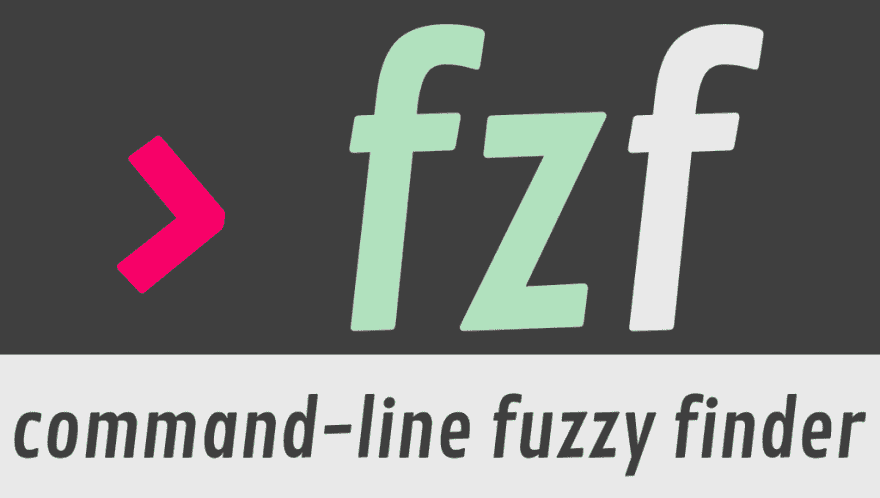

# 成名 8 分钟— fzf 访谈

> 原文：<https://dev.to/gimlet2/8-minutes-of-fame--fzf-talk-2bce>

[T2】](https://res.cloudinary.com/practicaldev/image/fetch/s--7uLy-38Q--/c_limit%2Cf_auto%2Cfl_progressive%2Cq_auto%2Cw_880/https://cdn-images-1.medium.com/max/1024/1%2ABY3Uq4WgzyvruHuCl4o_Hw.png)

今天我们公司开始了一件新的事情(以防你怀疑它是 Outfittery Gmbh)——“成名 8 分钟”。这个东西背后有一个想法——小闪电每个讲 8 分钟。它应该是定期的。现在，我们已经同意每月做一次，但将看看它会如何发展。每个会话包含 4 个时间段。不允许幻灯片* —展示代码或现场演示，或者你可以只讲 8 分钟(* —在一些特殊的话题上可以有)。

但是在这里我想总结一下我的演讲。

首先，什么是 [**fzf**](https://github.com/junegunn/fzf) ？这是命令行工具，应该简化您的日常生活与模糊查找的权力。这就是它的发音——模糊发现者。这是用 **Go** lang 写的，在 **Github** 上很容易找到。**安装** it 的推荐方式——将 repo 签出到~/。fzf 文件夹并运行安装脚本。它会问你几个问题，你已经准备好了！(不要忘记用 source 命令应用 shell 配置修改)

它有什么酷的？嗯，就是做一件事但是做好。每个 Unix 工具都应该如此。它获取一个到 STD/IN 的行列表，并生成一个到 STD/OUT 的过滤行列表。但是魔法就发生在中间=)。在引擎盖下，它支持几个过滤器选项:默认选项—模糊查找—您键入并试图理解您实际的意思，严格匹配，从行首开始的严格匹配和行尾的严格匹配。忘了说，也有可能过滤掉一些东西——只需在查询前加上！(砰)。

当你找到你需要的东西后(通过查询或用光标按钮手动导航),只需点击回车，甚至只需点击鼠标选择你需要的东西。通过 **-m** 标志，允许从列表中选择几个项目(只需使用 Tab 或 Shift+Tab)。

有了这个功能，这个工具对于集成到你的交互式脚本变得很有用。但是它提供了更多——许多很酷的按键绑定(并且你可以扩展它)。这是我最喜欢的:

1.  Ctrl+R —对您的终端历史进行模糊搜索；
2.  Ctrl+T —在当前目录和深层目录中查找文件，并将结果返回到命令行。超级有用，当你输入一些命令(让我们说少)，然后你按 Ctrl+T，选择你想要的文件；
3.  Alt+C — cd 到选定的目录；
4.  ssh **然后按 Tab 键—从您的主机文件或 ssh 配置中选择主机；
5.  kill -9 和 Tab 键—选择要终止的进程；

还有更多，这些只是我每天使用的清单。

还有几个更不好说的:Vim 集成和新特性——预览。但是，我希望，如果你没有尝试过(或者也许你已经使用 fzf 很多年了…)，就检查一下吧。更多详细信息，您可以在自述文件中找到。我将为我的下一个演讲“成名 8 分钟”做准备。