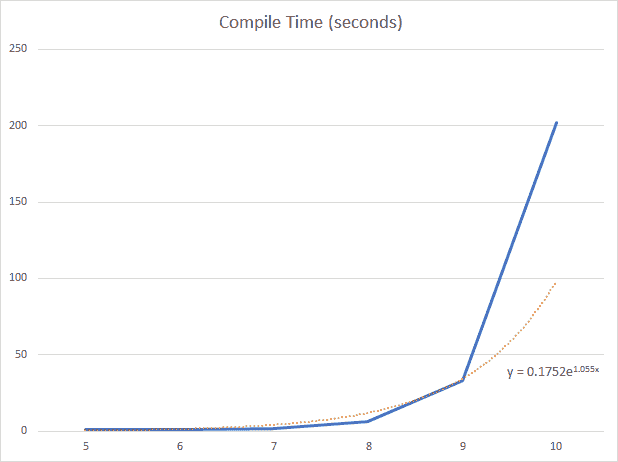
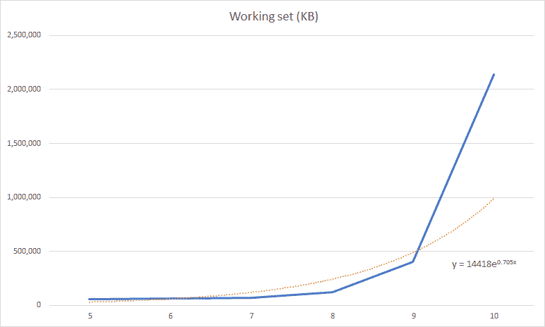
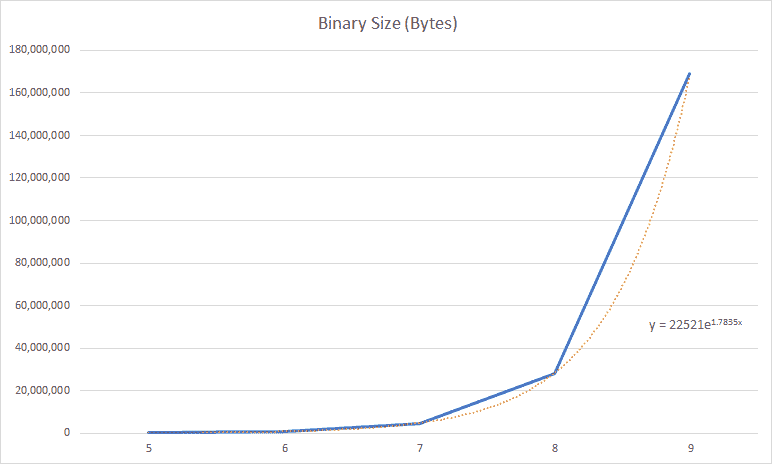
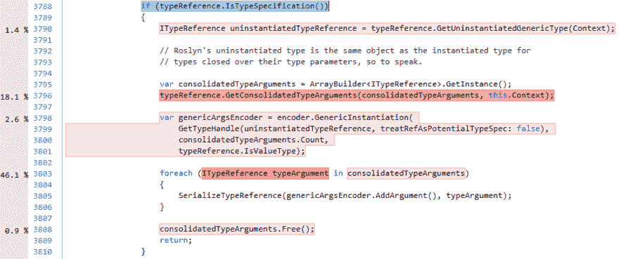

# 针对 C#编译器的 DoS 攻击

> 原文：<https://dev.to/mattwarren/a-dos-attack-against-the-c-compiler-35c>

这篇文章最初出现在我的博客上

* * *

C#中的泛型当然非常有用，我发现令人惊讶的是[我们几乎没有得到它们](https://blogs.msdn.microsoft.com/dsyme/2011/03/15/netc-generics-history-some-photos-from-feb-1999/):

> 不作为的代价会是什么？失败的代价是什么？C# 2.0 中没有泛型？C# 3.0 中没有 LINQ？C# 4.0 中没有 TPL？C# 5.0 中没有异步？没有 F#？最终，泛型的擦除模型将会被采用，就像 Java 一样，因为如果没有外部的帮助，CLR 团队永远不会追求 VM 中的泛型设计。

因此，非常感谢剑桥微软研究院的唐·赛姆和其他团队成员！

但是除了有用之外，我还发现了一些令人困惑的泛型用法，例如，我仍然不确定这个代码*实际上是什么意思，或者如何用语言解释它:*

```
class Blah<T> where T : Blah<T> 
```

和往常一样，阅读 Eric Lippert 的帖子[很有帮助](https://blogs.msdn.microsoft.com/ericlippert/2011/02/03/curiouser-and-curiouser/)，但即使是他也建议不要使用这种特殊的“循环”模式。

* * *

最近，我在布拉格的 CORESTART 2.0 会议上发表了演讲，主题是[“微软和开源——一个‘美丽新世界’](https://www.corestart.cz/#page-speeches)。当我在那里的时候，我遇到了非常博学的[吉里·辛库拉](https://twitter.com/cincura_net)，他在 [tabs 的](https://www.tabsoverspaces.com/)空间上写博客。他做了一个关于“C# 7.1 和 7.2 特性”的精彩演讲，还和我分享了一个他称之为“疯狂的类”的优秀代码片段:

```
class Class<A, B, C, D, E, F>
{
    class Inner : Class<Inner, Inner, Inner, Inner, Inner, Inner>
    {
        Inner.Inner.Inner.Inner.Inner.Inner.Inner.Inner.Inner inner;
    }
} 
```

他说:

> 这是一个需要花费大量时间来编译的类。您可以添加更多的`Inner.Inner.Inner...`使其更长(以及通用参数)。

经过一番挖掘，我发现其他人已经注意到了这一点，参见 StackOverflow 问题[为什么泛型类中重复嵌套类型的字段声明会导致大量源代码增加？](https://stackoverflow.com/questions/14177225/why-does-field-declaration-with-duplicated-nested-type-in-generic-class-results/14178014)有益的是,“公认答案”解释了正在发生的事情:

> 当你把这两者结合起来，就像你所做的那样，有趣的事情就会发生。类型`Outer<T>.Inner`与`Outer<T>.Inner.Inner`不是同一类型。`Outer<T>.Inner`是`Outer<Outer<T>.Inner>`的一个子类，`Outer<T>.Inner.Inner`是`Outer<Outer<Outer<T>.Inner>.Inner>`的一个子类，这是我们之前建立的，与`Outer<T>.Inner`不同。所以`Outer<T>.Inner.Inner`和`Outer<T>.Inner` **指的是不同的类型**。
> 
> 生成 IL 时，编译器总是使用类型的完全限定名。你已经巧妙地找到了一种方法来引用那些名字长度以**指数速率**增长的类型。这就是为什么当您增加`Outer`的泛型 arity 或者向`Inner`中的字段`field`添加额外的级别`.Y`时，输出 IL 大小和编译时间增长如此之快。

**清楚了吗？很好！！**

你可能必须是 Jon Skeet、Eric Lippert 或 C#语言设计团队的一员才能真正理解这里发生了什么，但这并不妨碍我们其他人享受代码带来的乐趣！！

我想不出任何理由让你真的想写这样的代码，所以请不要！！(或者至少如果你做了，不要怪我！！)

为了简单了解实际发生的情况，让我们看一下这段代码(只有两个“级别”):

```
class Class<A, B, C, D, E, F>
{
    class Inner : Class<Inner, Inner, Inner, Inner, Inner, Inner>
    {
        Inner.Inner inner;
    }
} 
```

“反编译”版本实际上是这样的:

```
internal class Class<A, B, C, D, E, F>
{
    private class Inner : Class<Class<A, B, C, D, E, F>.Inner, 
                                Class<A, B, C, D, E, F>.Inner, 
                                Class<A, B, C, D, E, F>.Inner, 
                                Class<A, B, C, D, E, F>.Inner, 
                                Class<A, B, C, D, E, F>.Inner, 
                                Class<A, B, C, D, E, F>.Inner>
    {
        private Class<Class<Class<A, B, C, D, E, F>.Inner, 
                            Class<A, B, C, D, E, F>.Inner, 
                            Class<A, B, C, D, E, F>.Inner, 
                            Class<A, B, C, D, E, F>.Inner, 
                            Class<A, B, C, D, E, F>.Inner, 
                            Class<A, B, C, D, E, F>.Inner>.Inner, 
                        Class<Class<A, B, C, D, E, F>.Inner, 
                            Class<A, B, C, D, E, F>.Inner, 
                            Class<A, B, C, D, E, F>.Inner, 
                            Class<A, B, C, D, E, F>.Inner, 
                            Class<A, B, C, D, E, F>.Inner, 
                            Class<A, B, C, D, E, F>.Inner>.Inner, 
                        Class<Class<A, B, C, D, E, F>.Inner, 
                            Class<A, B, C, D, E, F>.Inner, 
                            Class<A, B, C, D, E, F>.Inner, 
                            Class<A, B, C, D, E, F>.Inner, 
                            Class<A, B, C, D, E, F>.Inner, 
                            Class<A, B, C, D, E, F>.Inner>.Inner, 
                        Class<Class<A, B, C, D, E, F>.Inner, 
                            Class<A, B, C, D, E, F>.Inner, 
                            Class<A, B, C, D, E, F>.Inner, 
                            Class<A, B, C, D, E, F>.Inner, 
                            Class<A, B, C, D, E, F>.Inner, 
                            Class<A, B, C, D, E, F>.Inner>.Inner, 
                        Class<Class<A, B, C, D, E, F>.Inner, 
                            Class<A, B, C, D, E, F>.Inner, 
                            Class<A, B, C, D, E, F>.Inner, 
                            Class<A, B, C, D, E, F>.Inner, 
                            Class<A, B, C, D, E, F>.Inner, 
                            Class<A, B, C, D, E, F>.Inner>.Inner, 
                        Class<Class<A, B, C, D, E, F>.Inner, 
                            Class<A, B, C, D, E, F>.Inner, 
                            Class<A, B, C, D, E, F>.Inner, 
                            Class<A, B, C, D, E, F>.Inner, 
                            Class<A, B, C, D, E, F>.Inner, 
                            Class<A, B, C, D, E, F>.Inner>.Inner>.Inner inner;
    }
} 
```

哇，难怪事情会很快出错！！

* * *

### 指数增长

首先让我们检查一下关于**指数增长**的说法，如果你不记得你的[大 O 符号](https://en.wikipedia.org/wiki/Big_O_notation)你也可以把它想成`O(very, very bad)`！！

为了测试这一点，我将编译上面的代码，但每次都会通过添加一个新的`.Inner`来改变“级别”，因此“级别 5”如下所示:

```
Inner.Inner.Inner.Inner.Inner inner; 
```

像这样的‘六级’等等

```
Inner.Inner.Inner.Inner.Inner.Inner inner; 
```

然后我们得到以下结果:

| 水平 | 编译时间(秒) | 工作集(KB) | 二进制大小(字节) |
| --- | --- | --- | --- |
| five | One point one five | Fifty-four thousand two hundred and eighty-eight | One hundred and thirty-five thousand six hundred and eighty |
| six | One point two two | Fifty-nine thousand five hundred | Seven hundred and eighty-eight thousand nine hundred and ninety-two |
| seven | Two | Seventy thousand seven hundred and twenty-eight | Four million seven hundred and seven thousand eight hundred and forty |
| eight | Six point four three | One hundred and twenty-one thousand eight hundred and fifty-two | Twenty-eight million two hundred and twenty-two thousand four hundred and sixty-four |
| nine | Thirty-three point two three | Four hundred and five thousand four hundred and seventy-two | One hundred and sixty-nine million three hundred and ten thousand two hundred and eight |
| Ten | Two hundred and two point one | Two million one hundred and forty-one thousand two hundred and seventy-two | **崩溃** |

如果我们以图表的形式来看这些结果，就会很清楚发生了什么

[T2】](http://mattwarren.oimg/2017/11/Crazy%20Class%20-%20Compile%20Time.png)

[T2】](http://mattwarren.oimg/2017/11/Crazy%20Class%20-%20Working%20Set.png)

[T2】](http://mattwarren.oimg/2017/11/Crazy%20Class%20-%20Binary%20Size.png)

(虚线是“最佳拟合”趋势线，它们是指数型的)

如果我用`dotnet build`(版本 2.0.0)编译代码，事情真的在‘第 10 级’出错，编译器抛出一个错误([全栈跟踪](https://gist.github.com/mattwarren/d6fd747792cf1e98cba4679bf1398041)):

```
System.ArgumentOutOfRangeException: Specified argument was out of the range of valid values. 
```

这看起来类似于[创建可移植 PDB 文件时的内部编译器错误#3866](https://github.com/Microsoft/visualfsharp/issues/3866) 。

然而，你的里程数可能会有所不同，当我在 Visual Studio 2015 中运行代码时，它抛出了一个`OutOfMemoryException`，然后迅速重新启动！！我认为这是因为 [VS 是一个 32 位的应用程序](https://blogs.msdn.microsoft.com/ricom/2009/06/10/visual-studio-why-is-there-no-64-bit-version-yet/)，它会在真正出错之前耗尽内存！

* * *

### 剖析编译器

最后，我想看看编译器花了多少时间。从上面的结果我们看到，编译一个简单的程序花费了**超过 3 分钟**，内存使用峰值为 **2.14 GB** ，那么它实际上在做什么呢？？

很明显，这里涉及到很多`Types`，编译器似乎很乐意让你写这段代码，所以我想它需要把所有的事情都搞清楚。一旦完成，它就需要将所有的`Type`元数据写到一个. dll 或者。exe，大小可以是 **100 的 MB** 。

在较高层次上，VS 生成的概要如下所示(单击查看完整大小的图像):

[T2】](http://mattwarren.oimg/2017/11/Profiling%20Report.png)

然而，如果我们仔细观察，我们会发现“热路径”在[编译器/Core/Portable/PE writer/metadata writer . cs](https://github.com/dotnet/roslyn/blob/master/src/Compilers/Core/Portable/PEWriter/MetadataWriter.cs#L3788-L3810)的`SerializeTypeReference(..)`方法中

[T2】](http://mattwarren.oimg/2017/11/Profiling%20-%20Hot%20Path.png)

* * *

### 总结

对此我有点撕，这分明是对仿制药的‘滥用’！！

在某些方面，我认为它不应该被修复，编译器鼓励你不要像这样写代码，而不是让它成为可能！！

因此，如果编译代码花了 3 分钟，分配了 2GB 的内存，然后崩溃了，把这当成一个警告吧！！