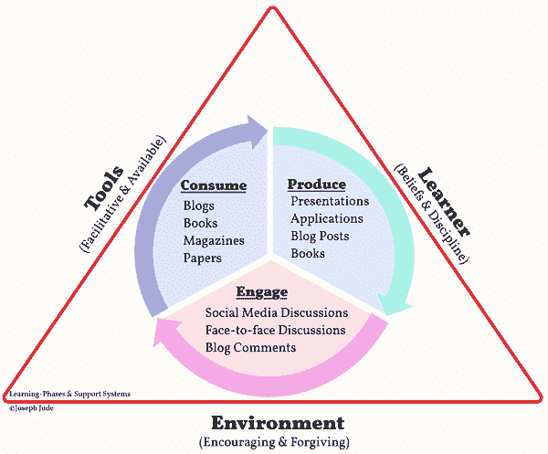

# 程序员学习的框架

> 原文：<https://dev.to/jjude/a-framework-for-learning-for-programmers>

我 1994 年毕业。COBOL 是当时流行的编程语言。

*   然后是 DBase
*   然后是 FoxPro
*   然后权力建设者
*   然后是 Visual Basic

每一次新语言的出现，都会带来相关的技术，比如 ODBC、COM、ATL 等等。

在 90 年代，像 Vantive 和 Peoplesoft 这样的打包解决方案开始出现。SAP 是当时另一个流行的打包解决方案。

在过去的几年里，新的编程语言开始浮出水面——Swift、Go、Scala 等等。

为什么我要讲述历史？

在软件行业，只有一个原则是成立的:**如果你不更新，你就会过时**。

我经历了一次又一次学习新技术的循环。当我重复这个循环时，我注意到一个模式。我对这种模式进行了微调，并开发了一种系统的方法来学习新的语言或技术。

[T2】](https://res.cloudinary.com/practicaldev/image/fetch/s--vX3F8SDK--/c_limit%2Cf_auto%2Cfl_progressive%2Cq_auto%2Cw_880/https://cdn.jjude.com/biz/learning.png)

## 学习

这个系统的第一部分是学习。你通过阅读书籍、博客和他人的代码来学习。

### 书籍

一般来说，我会避开编程语言方面的书籍，除非是我[写的](https://jjude.com/books/)😀。我阅读建筑、设计和流程方面的书籍。最近，我订阅了 [Safari Books Online](https://www.safaribooksonline.com/) ，里面有大量的科技书籍。以下是我的一些推荐(你可以看看我读过的所有的书):

*   Gene Kim、Patrick Debois 等人编写的 DevOps 手册
*   乔尔·斯波尔斯基的软件
*   乔尔·斯波尔斯基的《最好的软件写作》
*   软技能:软件开发人员的生活手册
*   赖以生存的算法:人类决策的计算机科学

### 博客&网站

书籍是学习既定思想的好工具。他们不够好，跟不上像软件这样快速变化的行业。为了跟上软件领域的最新思想，我关注以下**网站**:

*   [高可扩展性](http://highscalability.com/)
*   [优步工程博客](https://eng.uber.com/)
*   [奥莱利的想法](https://www.oreilly.com/ideas)
*   [Thoughtworks 雷达](https://www.thoughtworks.com/radar)
*   [黑客新闻](https://news.ycombinator.com/)
*   马丁·福勒

我订阅了它们，并和 [Feedly](http://feedly.com/) 一起阅读。

### 时事通讯

如果你没有时间访问这些网站，你可以订阅精心策划的时事通讯。我订阅了两份这样的简讯:[节点周刊](http://nodeweekly.com/)和[软件导读周刊](http://softwareleadweekly.com/)。SLW 是一个可怕的策划通讯软件行业的每一个人。对于其他每周简讯，请参考 [Awesome-Weekly](https://github.com/jondot/awesome-weekly) 知识库。

### 代码库

在互联网变得无处不在之前，过去不可能找到写得很好的代码来阅读。现在很容易了。您可以浏览 GitHub，您会发现为任何类型的软件——服务器、编译器、语言和应用程序——编写得很好的代码。

这些天我专注于 [nodejs](https://jjude.com/tags/nodejs/) 。这里有一些与 nodejs 相关的存储库:

*   [Node.js](https://github.com/nodejs/node) -一个服务器端 Javascript 运行时
*   [Typescript](https://github.com/Microsoft/TypeScript)-JavaScript 的超集，由微软编译以清理 JavaScript
*   Hapijs -沃尔玛基于 nodejs 的网络应用框架
*   D3 . js——一个用于可视化数据的 JavaScript 库
*   一个 HTML、CSS 和 JavaScript 框架，用于开发快速响应的移动优先项目
*   Hexo -一个静态博客生成器
*   [Punch](https://github.com/laktek/punch) -另一个静态博客生成器
*   一个博客平台

你也可以浏览很多“牛逼”的库，这些库都是策展的库。以下是一些例子:

*   [适合初学者的项目](https://github.com/MunGell/awesome-for-beginners)
*   [牛逼的机器学习](https://github.com/josephmisiti/awesome-machine-learning)
*   [Docker 资源和项目](https://github.com/jjude/awesome-docker)
*   [牛逼榜单](https://github.com/sindresorhus/awesome)

## 实验附带项目(用于学习)

学习只是学习的一个方面。如果你想掌握概念并内化它们，那么你应该尝试它们。

有一个项目来尝试这些概念。保持它足够小，你可以在几周内完成，但足够大，你可以学习。这些兼职项目的目的不是创建一个完整的应用程序或赚钱。只是为了学习。

以下是让你开始学习辅助项目的一些想法:

看看 [52 周 52 项技术](https://github.com/shekhargulati/52-technologies-in-2016)。Shekar 在 2016 年每周都尝试一个新概念(他只做了 43 个项目，但仍然是值得称赞的连胜)。您可以用自己选择的语言尝试相同的概念。

如果你是初学者，那么你可以试着用你选择的语言解决[欧拉](https://jjude.com/tags/euler/)问题。这样，你将学习算法和编程语言。

[贾斯廷·杰克逊](https://justinjackson.ca/)疯了[做了 2016 年 100 件事](https://docs.google.com/document/d/16gVonXDjdvlj6yBP-hOmbktugZ3-QkLOw_nhRN9xlUs/)。

如果这些太多，你可以每月创建[一个项目](https://blog.1ppm.club/)。

所有这些都是达到目的的手段。选择任何公式——100 个项目，解决欧拉问题，每个月一个项目，但是要坚持做一段时间。通过这些实验锻炼你的精神肌肉。

如果你认为你没有足够的想法，浏览[想法观察](http://www.ideaswatch.com/)和[想法空间](http://ideaspace.in50hrs.com/problems/)。他们都是关于创业的，但是你仍然可以从他们那里获得足够的想法来做一个副业。

正如我前面说过的，你的副业的目的是学习。所以不用太担心质量。当你在学习的时候，[数量胜过质量](https://jjude.com/quantity-vs-quality/)。

## 分享&从事

分享一下。分享你所学到的。分享使用 Github，或使用媒体，或使用自己的博客。而是向前付出。而且它还能帮助你与其他做过或正在做这件事的人接触。第一种会让你知道是否有比你已经做的更好的方法。另一种人会问你澄清问题。两者都会帮助你强化知识。

## 不断学习

我们都知道，软件正在吞噬世界。随着它范围的扩大，我们将不得不了解越来越多。如果你制定了一个系统，你可以学得很快。

不断学习。