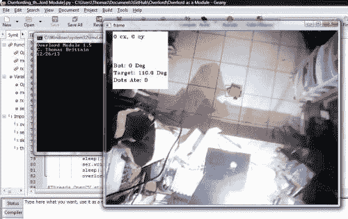

# 友好的君主

> 原文：<https://dev.to/ladvien/a-friendly-overlord-3f64>

我已经默默地研究了一段时间。

不久前我突然想到，在我开始增加我的[霸王项目](http://letsmakerobots.com/node/38208)的复杂性之前，我想改进它以便于使用。因此，我开始将我的霸王项目转换成我可以构建的 Python 模块。

一个友好的霸主

我想，这会让任何人都更容易使用。这包括我自己，我没有忘记我作为一个黑客的身份，也不会忘记任何在这个模块上打开引擎盖的人:)

但是，在其核心，有几个重要的投入:

1.  要跟踪的颜色。
2.  罗盘读数。

所以，我花了一些时间将代码翻译成一个可调用的模块。这个实验主要是为我自己使用，但我知道如果我有 LMR 的反馈，不管是老的还是不老的，它会变得更健康。

当我开始*的时候，我实际上已经计划好了*(喘气)如何让这段代码更加用户友好。我没想多久；为了让这段代码变得有用，需要花费最多时间的两件事是:

1.  调整罗盘航向。
2.  选择要跟踪的颜色。

为了解决第一个问题，我开发了一个“自动罗盘校准功能”

```
def mapper(x, in_min, in_max, out_min, out_max):
    #This will map numbers onto others.
    return ((x-in_min)*(out_max -out_min)/(in_max - in_min) + out_min)

def compass(headingDegrees):
    global compassInitFlag
    global initialRawHeading
    global intRx

    #This sets the first compass reading to our 0*.
    if compassInitFlag == False:
       initialRawHeading = headingDegrees
       compassInitFlag = True
       print initialRawHeading
       exit

    #This is the function that actually maps offsets the compass reading.
    global intialRawHeading
    if headingDegrees >= initialRawHeading:
        adjHeading = mapper(headingDegrees, initialRawHeading, 360, 0, (360-initialRawHeading))
    elif headingDegrees <= initialRawHeading:
        adjHeading = mapper(headingDegrees, 0, (initialRawHeading-1),(360-initialRawHeading), 360)

    #Here, our compass reading is loaded into intRx
    intRx = adjHeading 
```

Enter fullscreen mode Exit fullscreen mode

基本上，该功能采用第一个罗盘读数，并调整所有其他读数。所以，你所要做的就是把你的机器人放在你希望它认为是“北”的方向上，启动你的代码，这个函数将转换所有其他读数。

[T2】](https://res.cloudinary.com/practicaldev/image/fetch/s--M37Y0rTt--/c_limit%2Cf_auto%2Cfl_progressive%2Cq_auto%2Cw_880/https://ladvien.cimg/Friendly_Overlord_--_Color_Selector.jpg)

第二个问题花了我一点时间来处理:简单的颜色选择。简而言之，我重写了代码的大部分颜色检测部分，以利用 OpenCV 的 [CamShift](http://docs.opencv.org/trunk/doc/py_tutorials/py_video/py_meanshift/py_meanshift.html) 算法。此功能对光线变化或其他接近颜色的对象更有弹性，但也更占用 CPU 资源。在某种程度上，我可能会回去写一个变种，坚持旧的最大目标颜色质量方法。

好，这对用户意味着什么？当代码开始时，你可以通过左键点击并拖动一个选择框到一个区域来选择你想要的颜色。将跟踪所选区域的平均颜色，这也将启动其余的代码。

友军霸王给你什么？

嗯，很多。当我写完这该死的东西，比很多。

这里有一个列表，只有一点是不真实的。

1.  它跟踪你的机器人，提供它相对于你的摄像头的 x 和 y 坐标。
2.  它将提供一个目标坐标，我稍后将使其可寻址，以防有人想做一些很酷的事情，而不是让他们的机器人四处行驶并捕捉虚拟点。蹩脚。
3.  它会读取你提供的罗盘读数，将其转换为相对于相机的方向，然后，它会向你的机器人发送命令，告诉它转向，直到它对准目标，然后向目标移动。
4.  给你泡杯茶(CP，DanM，我用对了吗？)
5.  它将允许您调整几乎任何代码元素(例如，霸王. targetProximity = 5)

它**不是**是做什么的？

1.  注意你的串行数据。你有你自己，伙计。
2.  给你写你的机器人 uC 代码。
3.  向你提供你的机器人的方向(虽然，当我深入研究双色检测时，这可以用你的机器人上的两个点来完成。但实际上，买一台 HMC5883L 更容易，也更便宜。

好吧，我们来谈谈代码。使用它需要多少的代码？

```
import serial
from time import sleep
import threading
import overlord

#Initialize Overlord variables. overlord.dVariables()

#Open COM port to tether the bot. ser = serial.Serial('COM34', 9600)

def OpenCV():
    #Execute the Overlord.
    overlord.otracker()

def rx():
    while(True):
        # Read the newest output from the Arduino
        if ser.readline() != "":
            rx = ser.readline()
            rx = rx[:3]
            rx = rx.strip()
            rx = rx.replace(".", "")
            #Here, you pass Overlord your raw compass data.  
            overlord.compass(int(rx))

def motorTimer():
    while(1):
        #This is for threading out the motor timer.  Allowing for control
        #over the motor burst duration.  There has to be both, something to write and
        #the motors can't be busy.
        if overlord.tranx_ready == True and overlord.motorBusy == False:
            ser.write(overlord.tranx)
            ser.flushOutput() #Clear the buffer?
            overlord.motorBusy = True
            overlord.tranx_ready = False
        if overlord.motorBusy == True:
            sleep(.2) #Sets the motor burst duration.
            ser.write(overlord.stop)
            sleep(.3) #Sets time inbetween motor bursts.
            overlord.motorBusy = False

#Threads OpenCV stuff. OpenCV = threading.Thread(target=OpenCV)
OpenCV.start()

#Threads the serial functions. rx = threading.Thread(target=rx)
rx.start()

#Threads the motor functions. motorTimer = threading.Thread(target=motorTimer)
motorTimer.start() 
```

Enter fullscreen mode Exit fullscreen mode

这是全功能代码。你会注意到，实际上，只有大约 10 行得到友好的霸王去，其余的处理串行功能和电机点火。请注意，马达点火代码将会改变，因为它是如何写我喜欢现在，最终将被设计为尽可能灵活。

演练:

1.  霸王变量()#设置友好的霸王变量。
2.  霸王. otracker() #模块的心脏。处理颜色跟踪、角度计算等。
3.  霸王. compass(x) #你传递给它一个以度数(0-360)为单位的整数形式的罗盘航向，它完成剩下的工作。
4.  霸王. tranx_ready #指示串行数据最后一位已发送的简单标志。
5.  霸王. tranx #变量，包含要发送给机器人的串行命令。
6.  表示机器人是否仍在运动中的标志。

大概就是这样。在模块里？大约 399 行代码。对于一个程序来说还是比较小的，但是如果没有一个好的理由，我不想费力去完成它。

好的。那么，我该怎么做呢？

我怎么知道。我想让它尽可能的多功能。最终，我想跟踪第 n 个机器人。我想象着一大群 Yahmez 的小机器人到处飞，友好的霸主追踪它们，并通过红外与它们交流。

但在更近的将来，我希望每个变量都可以调整。尤其是对他人有用的变量。例如，霸王. tX 和霸王. tY 当前由该模块控制。它们只是简单的随机数字。但是，在接下来的两天里，我会制作一个标志，从您自己的代码中控制它们。你可以决定你想让你的机器人去哪里。无论是指向你的鼠标指针(霸王. targetY =霸王. mouseY)还是一组复杂的路点来引导他通过迷宫。真的，我可能会根据我得到的反馈进行编码。

现在，一些必须的东西。

下面是一些当前可从你的程序中寻址的变量:

```
#How close to does the robot need to be? Greater is less accurate.
#Defaults to 5. overlord.targetProximity = 5

#GUI X, Y
#Defaults to 0, 0 overlord.guiX = 440
overlord.guiY = 320

#Random target constraint; so target doesn't get placed too far from center.
#Defaults to 1, 640, 1, 480 overlord.targetLeftLimit = 20
overlord.targetRightLimit = 400
overlord.targetBottomLimit = 320
overlord.targetTopLimit = 20 
```

Enter fullscreen mode Exit fullscreen mode

但是我想让用户需要的每个变量都可用。

好的。所以，我需要的是:**有人使用它并提供反馈。**我离它太近，思想模糊。

我想做一些事情来获得一些反馈:

1.  设置一个挑战(我有一些剩余)。
2.  提议每月给一个人邮寄一套设备(两块蓝牙 PCB 和一个便宜的网络摄像头)。

有什么建议吗？

我想我会很快制作一个穿越视频(有点怀念制作愚蠢的视频)，但我现在有点累了。