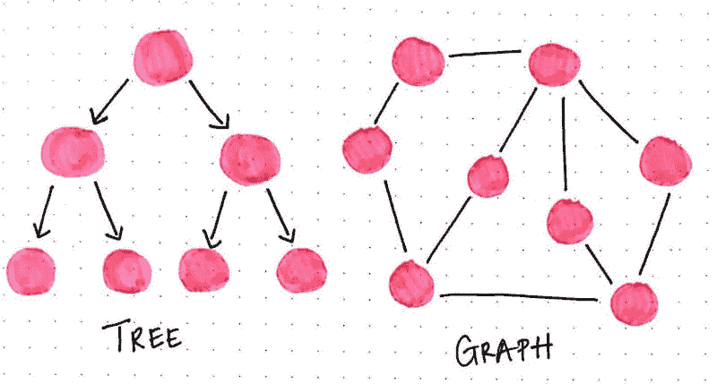
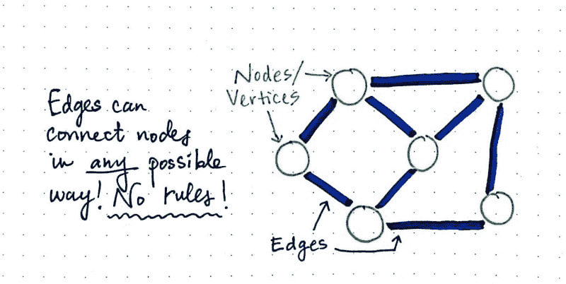
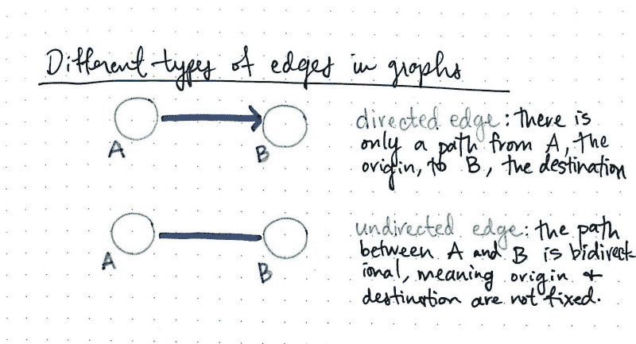
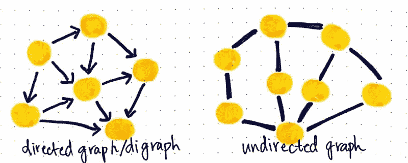
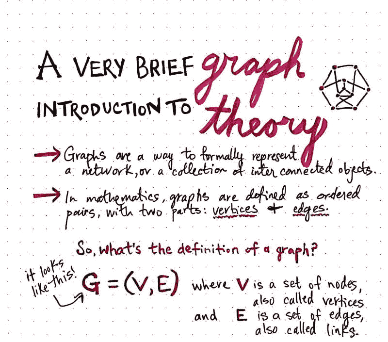
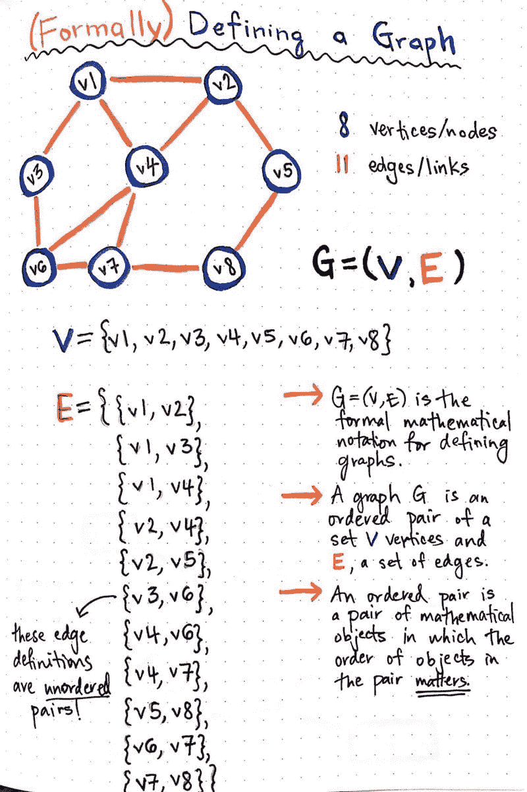
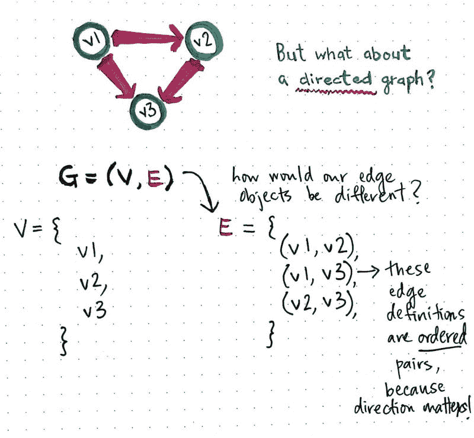
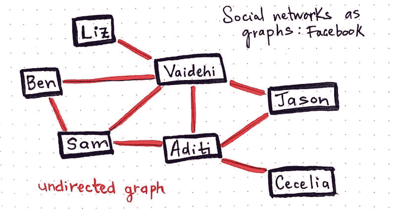
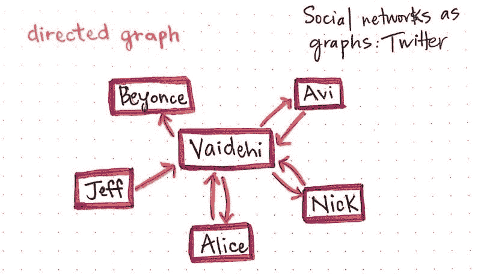

# 图论的简明介绍

> 原文：<https://dev.to/vaidehijoshi/a-gentle-introduction-to-graph-theory>

如果没有一个需要解决的问题，世界上那么多的东西都不会存在。这个道理适用于一切，但是*男孩，这在计算机科学的世界里是显而易见的*。

有人需要一种方法来跟踪事物的顺序，所以他们尝试并创建了不同的数据结构，直到他们找到最适合他们试图解决的特定问题的数据结构。其他人需要一种存储数据的好方法，所以他们尝试了[不同的数字系统](https://dev.to/vaidehijoshi/hexes-and-other-magical-numbers)，直到他们找到一种最适合他们想要包含的信息的系统。人们需要一种标记和处理任务的好方法，所以他们找到了一种方法[在他们拥有的工具](https://dev.to/vaidehijoshi/to-queue-or-not-to-queue)上构建，并且创造了一种在任何给定时间处理一个单一系统需要做的所有事情的方法。

当然，计算机科学并不是唯一一个在前人的基础上进行创新和建设的领域，但我确实认为它在一个方面是独一无二的:*计算机科学的创新依赖并建立在它自己的抽象之上。*

我在这个系列中已经谈了很多抽象，因为最终，这就是这个系列的内容:在我们每天都在使用的东西下面找到抽象的乐趣。值得一提的是，当我说“我们”时，我只是部分地谈论作为程序员、技术生产者的*我们*——我也指作为用户、技术消费者的*我们*。

那么，接下来我们要学习哪种令人惊奇的抽象呢？好吧，现在我们是树数据结构的专家，理解树从何而来似乎是正确的。树实际上是你可能已经听说过的东西的子集:**图**。但是为了真正知道我们为什么使用图表以及它们是什么，我们需要深入到源于离散数学的东西的根源:**图论**。

如果这是你第一次涉足离散数学，不要害怕——这也是我的！让我们一起解决这个问题——在这个过程中不要失去理智。

### 松散–鹅状图形

当我们第一次开始研究非线性结构时，我们了解了它们最基本的特征:它们的数据不遵循顺序——至少不是明显的数字顺序，就像我们在数组或链表中看到的那样。正如我们所学的，树[从一个根节点开始，并可能连接到其他节点，这意味着其中可能包含子树。树是由一组特定的规则定义的:一个根节点可能与其他节点相连，也可能不相连，但最终，它都源于一个特定的位置。有些树甚至有*更多的*特定规则，像](https://medium.com/basecs/how-to-not-be-stumped-by-trees-5f36208f68a7#.hzdufmviz)[二分搜索法树](https://medium.com/basecs/leaf-it-up-to-binary-trees-11001aaf746d#.x8kftrftl)，在任何给定时间只能有*两个*链接到*两个*节点。

但是，如果我们做了一些疯狂的事情，只是…把这些规则扔出窗外呢？事实证明，我们完全可以做到这一点！只是我们将不再与树打交道——我们将与一种叫做**图**的东西打交道。

> 树只不过是受限类型的图，只是有更多的规则要遵循。树永远是图，但不是所有的图都是树。

那么，是什么使一棵树不同于图的大伞呢？

首先，树只能单向流动，从根节点到叶节点或子节点。树也只能有单向连接—子节点只能有一个父节点，并且树不能有任何循环或循环链接。

[T2】](https://res.cloudinary.com/practicaldev/image/fetch/s--hwHemmPa--/c_limit%2Cf_auto%2Cfl_progressive%2Cq_auto%2Cw_880/https://cdn-images-1.medium.com/max/800/1%2ArguQ2Y2Z920IYGkO0cHHtQ.jpeg)

有了图表，所有这些限制都直接消失了。图没有任何“根”节点的概念。他们为什么要这么做？节点可以用任何可能的方式连接，真的。一个节点可能会连接到其他五个节点！图也没有任何“单向”流动的概念——相反，它们可能有方向，也可能没有任何方向。或者，让事情更复杂的是，它们可能有一些有方向的链接，而另一些没有！但是我们今天不讨论这个。

让我们从简单的东西开始。

### 有方向的图和没有方向的图

好的，我们知道图表几乎打破了所有我们知道的规则。然而，有一个特征是每个图*必须具备的:每个图至少需要有一个单独的节点。正如树需要至少一个根节点才能被认为是“树”一样，图也需要至少一个节点才能被认为是“图”。只有一个节点的图通常被称为**单例图**，尽管我们不会真的处理这些。*

我们将要处理的大多数图表都有点复杂。但是，不要担心——我们今天不会一头扎进*超级复杂的*图表中。相信我，有些图表真的很复杂！

相反，让我们看看两种类型的图，它们很容易发现，在图论问题中也很常见:有向图和无向图。

众所周知，在图中，一个节点与另一个节点的连接方式没有真正的规则。边(有时被称为*链接*)可以以任何可能的方式*连接节点。*

[T2】](https://res.cloudinary.com/practicaldev/image/fetch/s--V23dz7gf--/c_limit%2Cf_auto%2Cfl_progressive%2Cq_auto%2Cw_880/https://cdn-images-1.medium.com/max/800/1%2AsdUlnmnwMcPQljH52HiYBQ.jpeg)

在识别和定义图形时，不同类型的边非常重要。事实上，这是一个图和另一个图之间最大和最明显的区别之一:它所拥有的边的类型。在大多数情况下(除了一个例外，我们今天不讨论它)，图可以有两种类型的边:有方向或流向的边，和没有方向或流向的边。我们分别将这些称为*有向*和*无向*边。

在**有向边**中，两个节点以非常特定的方式连接。在下面的例子中，节点 A 连接到节点 B；在这两个节点之间只有*一条*路可以走——只有一个*方向*我们可以去。将我们开始的节点称为*起点*，将我们行进的节点称为*目的地*是很常见的。在有向边中，我们只能**从起点** **行进到终点**，而不能反过来。

[T2】](https://res.cloudinary.com/practicaldev/image/fetch/s--JRrA6LDv--/c_limit%2Cf_auto%2Cfl_progressive%2Cq_auto%2Cw_880/https://cdn-images-1.medium.com/max/800/1%2AnXh55HVMJavGwzSB5jS_-Q.jpeg)

然而，这是一个完全不同的故事，没有方向的边缘。在一条**无向边**中，我们可以行进的路径是双向的。也就是说，两个节点之间的路径是*双向*，也就是说**的始发地和目的地节点并不固定**。

这种区别实际上非常重要，因为图中的边决定了图的名称。如果一个图中的所有边都是*有向*的，则称该图为**有向图**，也称为**有向图** *。*如果一个图中的所有边都是*无向图*，那么这个图就被称为**无向图**！去想想，对吧？

[T2】](https://res.cloudinary.com/practicaldev/image/fetch/s--LsDnJtAf--/c_limit%2Cf_auto%2Cfl_progressive%2Cq_auto%2Cw_880/https://cdn-images-1.medium.com/max/800/1%2AcS26jONjjQ5ACImJmHhtqg.jpeg)

这一切都很酷，但在这一点上，我想知道两件事——所有这些图表材料*到底是从哪里来的？还有…我们为什么要在乎？*

我们来调查一下。

### 小心行事:我们现在是在图表国家

计算机科学喜欢借东西。更确切地说，它借用了许多逻辑和数学中的概念。事实证明，图形就是这种情况。

我们所知的计算机科学中的图形数据结构实际上来自数学，以及对图形的研究，这被称为**图论**。

> 在数学中，图是一种正式表示网络的方式，网络基本上只是所有相互连接的对象的集合。

事实证明，当计算机科学家将图论应用于代码(并最终将图实现为数据结构)时，他们并没有改变太多。因此，我们用来描述和实现图形的许多术语，正是我们在图论的数学参考文献中找到的术语。

例如，在数学术语中，我们将图描述为**有序对**。还记得高中代数，我们学过 *(x，y)* 有序对坐标吗？这里的处理类似，但有一点不同:图的组成部分不是 *x* 和 *y* ，而是: ***v*** ，表示*顶点*，以及 ***e*** ，表示其*边*。

一个图的正式的数学定义是这样的: **G = (V，E)** 。就是这样！真的。我保证。

[T2】](https://res.cloudinary.com/practicaldev/image/fetch/s--QNK2rzAl--/c_limit%2Cf_auto%2Cfl_progressive%2Cq_auto%2Cw_880/https://cdn-images-1.medium.com/max/800/1%2AzAmHaDww1A31Esup-Rmr-w.jpeg)

但是等一下——如果我们的图有不止一个节点和不止一条边呢！事实上…如果它有一个以上的节点，它几乎总是有多条边。这个定义到底是怎么起作用的？

它之所以有效，是因为那个有序对——*(V，E)*——实际上是由**两个** **对象**组成的:一个*顶点集*，一个*边集*。

好吧，我现在明白了。但是，如果我有一个例子，并实际写出一个图的定义，那就清楚多了！所以我们就这么做。在下面的例子中，我们有一个无向图，有 8 个顶点和 11 条边。

[T2】](https://res.cloudinary.com/practicaldev/image/fetch/s---w72CVUa--/c_limit%2Cf_auto%2Cfl_progressive%2Cq_auto%2Cw_880/https://cdn-images-1.medium.com/max/800/1%2AgoT8sipQbDIoogV6Kc_3KA.jpeg)

这是怎么回事？

我们写出了有序对 *(V，E)* ，但是因为*中的每一个*项都是一个对象，所以我们也必须写出它们。我们将 *V* 定义为对我们的 8 个顶点的一组无序的引用。“无序”部分在这里非常重要，因为记住，与树不同，这里没有节点的层次结构！这意味着我们不需要订购它们，因为顺序在这里并不重要。

我们还必须将 *E* 定义为一个对象，其中包含一堆边缘对象。再次注意，我们的边缘对象也是*无序的*。为什么会这样？这是什么类型的图表？有什么方向或者流向吗？“原点”和“终点”有固定的意义吗？

不，没有！这是一个*无向图*，这意味着边是双向的，起点节点和终点节点是*而不是*固定的。所以，我们的每个边缘对象也是**无序对**。

当然，这种特殊性让我们想知道:如果这是一个**有向**图会怎么样？又是一个例子的时候了！这是一个有向图，有三个顶点和三条边:

[T2】](https://res.cloudinary.com/practicaldev/image/fetch/s--ZgCcSeIC--/c_limit%2Cf_auto%2Cfl_progressive%2Cq_auto%2Cw_880/https://cdn-images-1.medium.com/max/800/1%2AThD5bfLUyEx49s5S9qKKow.jpeg)

我们在这里定义顶点的方式看起来没有任何不同，但是让我们更仔细地看看我们的边定义。在这种情况下，我们的边缘对象是*有序的*对，因为方向在这种情况下确实很重要！因为我们只能从源节点行进到目的节点，所以我们的边*必须*排序，使得源节点是我们每个边定义中的两个节点中的第一个。

酷，这就是我们对图形的定义。但是…我们什么时候会真正使用图表呢？你今天可能用过一个。你可能还不知道！是时候改变了。

### 超级社交图

图表就在我们身边，只是我们并不总是看到它们的本来面目。

事实上，通过阅读这篇文章，你现在就在一张图表上。网络是一个庞大的图形结构！当我们在网站之间点击，在 URL 之间来回导航时，我们实际上只是在浏览一个图表。有时候，这些图的节点的边是无向的——我可以从一个网页到另一个网页来回移动——而其他的是有向的——我只能从网页 A 到网页 B，而不能从网页 B 到网页 A。

但是有一个更好的例子可以很好地说明我们日常与图形的互动:社交网络。

脸书，一个巨大的社交网络，是一种图形。如果我们更多地思考它的实际功能，我们就会开始更好地理解*如何定义*，以及它到底是什么*类型的*。在脸书上，如果我加你为好友，你必须接受我的请求。如果你不属于我，我不可能成为你的网络朋友。两个用户之间的关系(读作:图术语中的节点或顶点！)是*双向*。没有“起点”和“终点”的概念——相反，你是我的朋友，我是你的朋友。

你能猜出脸书是用什么类型的图实现的吗？

[T2】](https://res.cloudinary.com/practicaldev/image/fetch/s--M1ohZXAV--/c_limit%2Cf_auto%2Cfl_progressive%2Cq_auto%2Cw_880/https://cdn-images-1.medium.com/max/800/1%2AqxvZX-YRBsRrmM5ePvNAQA.jpeg)

如果你猜对了*无向图*，那么你就对了！干得好。关系是双向的，所以如果我们把脸书的朋友网络定义为一个图，当我们写出来的时候，它的边都是无序的。

另一方面，Twitter 的运作方式与脸书截然不同。我可以跟着你，但你可能不会跟着我回来。例证:我追随碧昂斯，但她肯定没有追随我回来(可悲)。

[T2】](https://res.cloudinary.com/practicaldev/image/fetch/s--JUaxhge3--/c_limit%2Cf_auto%2Cfl_progressive%2Cq_auto%2Cw_880/https://cdn-images-1.medium.com/max/800/1%2AurJTrfWn8aZdhb9A-HXZVg.jpeg)

我们可以将 Twitter 表示为一个*方向的*图。我们创建的每条边都代表一个*单向*关系。当你[在 Twitter](https://twitter.com/vaidehijoshi) 上关注我时，你在图中创建了一条边，以你的账户作为起点节点，以我的账户作为终点节点。

那我跟着你回去会怎么样？我改变了你跟随我时创造的优势了吗？是不是突然变成双向了？不，因为我可以在任何时候不跟随你。当我在 Twitter 上跟踪你*回到*时，我创建了第二条边，以*我的*账户作为起点，你的账户作为终点。

同样的模型也适用于 dev.to，它允许您关注和取消关注作者！其实这个网络模型就是*遍地*。一旦我们把所有的层都抽象出来，它就是一个图表。说真的，这是一件多么强大的事情。

### 资源

很多很多整本*书*都是关于图形的。我当然没有涵盖足够的信息来写一本书，但这并不意味着你不能继续学习图形！从下面的链接开始，让你的头脑充满更多图论的神奇。

1.  [树和图的区别](http://freefeast.info/difference-between/difference-between-trees-and-graphs-trees-vs-graphs/)，Poonam Dhanvani
2.  [数据结构树和图有什么区别？](http://stackoverflow.com/questions/7423401/whats-the-difference-between-the-data-structure-tree-and-graph)，StackOverflow
3.  图论在计算机科学中的应用:概述。艾尔。
4.  [图形遍历](http://www.cs.jhu.edu/~cohen/CS226/Lectures/GraphTraversal.pdf)，乔纳森·科恩教授
5.  [数据结构:图形介绍](https://www.youtube.com/watch?v=gXgEDyodOJU&t=319s)，我的描述