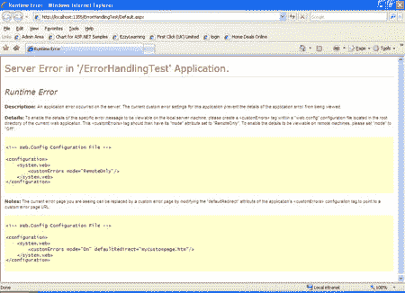
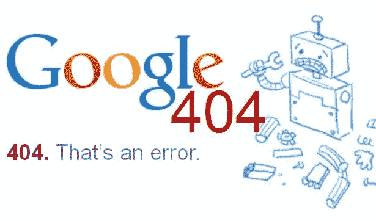
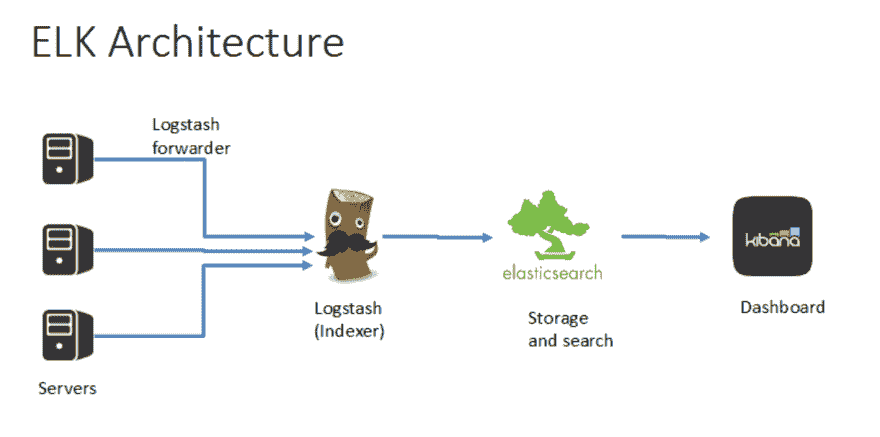
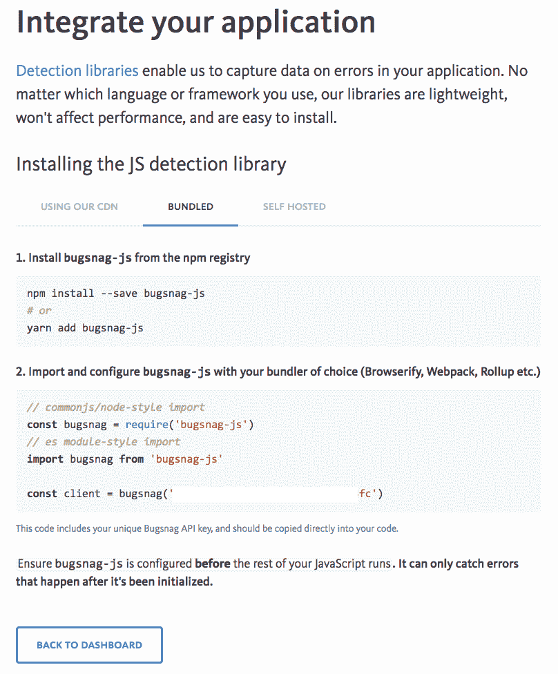
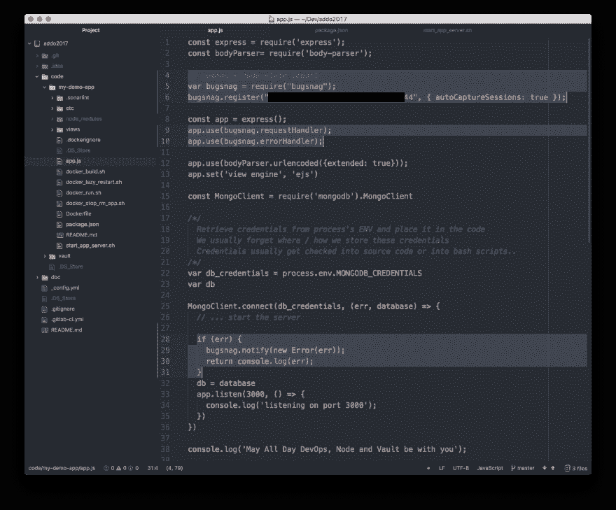
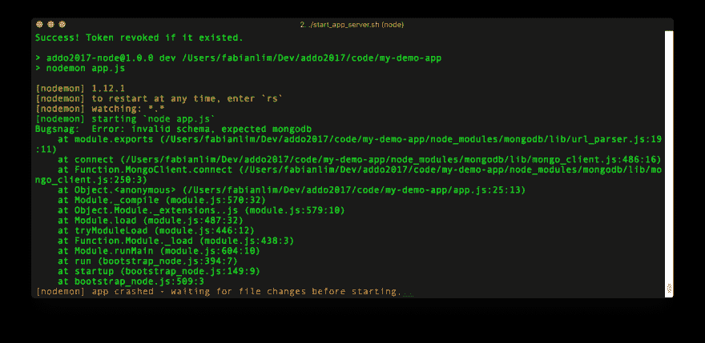
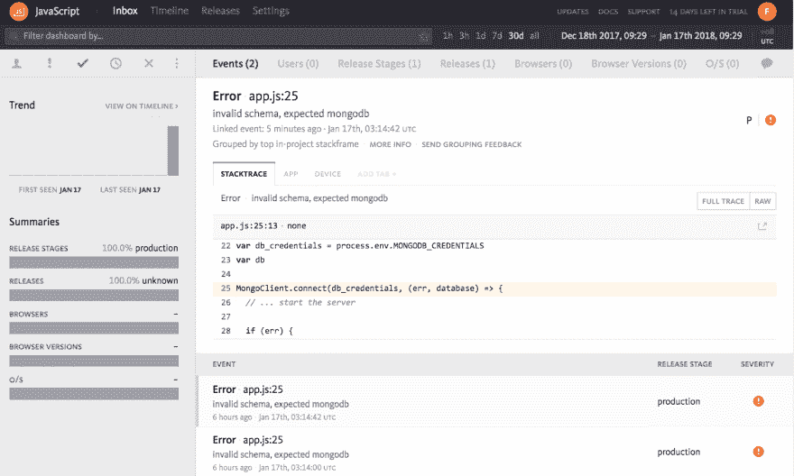

# 应用程序中错误处理和错误监控的整体方法

> 原文：<https://dev.to/3jmaster/a-holistic-approach-to-error-handling-in-and-error-monitoring-in-applications-37f1>

显示默认 400s 和 500s 错误的日子已经一去不复返了:

[T2】](https://res.cloudinary.com/practicaldev/image/fetch/s--0QUmRYu3--/c_limit%2Cf_auto%2Cfl_progressive%2Cq_auto%2Cw_880/http://www.ezzylearning.com/Tutorials_Daimg/client_error_page.jpg)

现代错误页面的一个例子:

[T2】](https://res.cloudinary.com/practicaldev/image/fetch/s--EH4Yw2hk--/c_limit%2Cf_auto%2Cfl_progressive%2Cq_auto%2Cw_880/https://i0.wp.com/www.betterhostreview.com/wp-content/uploads/google-404-error.jpg)

从客户的角度来看，他们得到了一个错误，无论如何这都不是件好事。错误监控和处理对客户服务有着巨大而直接的影响。在敏捷软件框架中使用错误监控和处理工具，有助于尽早识别和解决错误，最大限度地减少潜在的尴尬。

作为一名开发人员，我编写应用程序，天哪，它们会抛出很多错误！不管我喜不喜欢，这都是事实——有些错误很重要，有些不重要；有些得到了妥善处理，而另一些则是我错过的例外。

开发人员可能会发现监控关于这些错误的一切是很有用的，因为出于几个原因，这些知识是至关重要的(例如， [Bugsnag 是一个错误监控工具](https://www.bugsnag.com/product/)，我将在本文中对其进行回顾)。主要是，使用应用程序的客户可能已经面临错误并影响了他们的整体体验，这反过来会对企业及其声誉造成不利影响。其次，应用程序是安全漏洞的入口，错误可能是正在发生的可疑错误或事件的征兆。最后，这些错误是在运行时产生的，一些代码扫描工具无法检测到，需要不同种类的工具来填补这个空白。

应用程序日志可能非常短暂，有时不会在系统中持续存在。它可以快速旋转，以避免存储问题。另外，另一个例子是当使用 Docker 运行应用程序时，容器日志在容器被移除时被移除。几乎没有办法在删除后检索日志。因此，在今天的环境中，手动查看这些日志中的错误是不可行的。

## 这里有两种常用的收集日志的方法，及其利弊

方法一。将应用程序日志写入其本地文件系统，并依靠系统转发到日志聚合器

| 赞成的意见 | 骗局 |
| --- | --- |
| 日志集中系统 | 消化缓慢 |
| 日志分析可以通过关联网络日志和系统日志来讲述完整的故事 | 依靠系统进行日志转发 |
| - | 由于访问控制，开发人员可能无法获得这些系统级日志 |

方法 1 的例子:

方法二。通过 API 将应用程序日志直接从应用程序转发到错误监控服务器

| 赞成的意见 | 骗局 |
| --- | --- |
| 直接到 API | 仅仅对应用程序日志进行日志分析有时并不能说明全部情况 |
| 开发人员可以立即看到 | - |
| 开发人员对管理这些应用程序日志的控制 | - |

方法二的例子:

幸运的是，这两种方法并不详尽，也绝对不是相互排斥的。企业级应用程序通常会结合这两种方法来全面处理错误监控，因为这将提供最佳结果，而不是只使用其中一种方法。市场上有许多适合这些需求的错误监控工具，本文对不同工具之间的差异做了很好的比较。

## 以下是安装和使用“方法 2”的简单程度

[T2】](https://res.cloudinary.com/practicaldev/image/fetch/s--kWuu_3Oq--/c_limit%2Cf_auto%2Cfl_progressive%2Cq_auto%2Cw_880/https://thepracticaldev.s3.amazonaws.com/i/zzxha94879wsz4oznc3u.png)

我接受了 Bugsnag 的 3 分钟安装挑战，并成功通过。我用 Bugsnag 注册了一个账户，创建了一个新的 Javascript 项目。它给了我一个 API 密匙和安装他们软件包的指令。

[T2】](https://res.cloudinary.com/practicaldev/image/fetch/s--zQhWgZkA--/c_limit%2Cf_auto%2Cfl_progressive%2Cq_auto%2Cw_880/https://thepracticaldev.s3.amazonaws.com/i/oiw43il9wvtfz97n4bw8.png)

之后，我将他们文档中的代码片段粘贴到我的 NodeJS 应用程序中。

[T2】](https://res.cloudinary.com/practicaldev/image/fetch/s--cbqrd14f--/c_limit%2Cf_auto%2Cfl_progressive%2Cq_auto%2Cw_880/https://thepracticaldev.s3.amazonaws.com/i/b31sjh6iqe8fcprbvai0.png)

我在本地启动了我的应用程序，它抛出了一个错误。

[T2】](https://res.cloudinary.com/practicaldev/image/fetch/s--U0swi4Be--/c_limit%2Cf_auto%2Cfl_progressive%2Cq_auto%2Cw_880/https://thepracticaldev.s3.amazonaws.com/i/35cjroxqxh1eoz404bei.png)

Bugsnag 立即捕捉到错误，并显示在仪表板上。

[T2】](https://res.cloudinary.com/practicaldev/image/fetch/s--2lzu705r--/c_limit%2Cf_auto%2Cfl_progressive%2Cq_auto%2Cw_880/https://thepracticaldev.s3.amazonaws.com/i/me52efb6yh9t345u7yqz.png)

**日志可能包含敏感数据，在通过互联网发送给第三方软件之前，应始终对其进行清理。**

## 以下是设置错误监控后要做的事情

这就是错误监控工具为业务提供最大价值的地方。这些工具已经完成了捕捉错误并将它们组织成类别的工作。剩下的就要由项目团队来定义一个分析和处理不同类型错误的内部过程了。

如前所述，设置错误监控的主要目标是改善客户体验。因此，对客户影响最大的错误可以从这个工具中显现出来，项目团队将决定后续行动，例如与客户沟通以建立更密切的关系，在内部打开一个 bug 或功能标签以修复错误，等等。

其他一些错误可能是在监控工具上标记出来的安全警报，这些错误必须与安全团队单独沟通和处理。例如，一些用户输入可能导致内部服务器错误，但从系统接收的数据包在网络上被视为合法。在这种情况下，可能值得进行调查，安全团队可能需要更多信息。

## 下面是一个像样的错误监控工具的构成

*智能*

即使不是全部，大多数错误监控工具都足够智能，可以帮助用户分析错误。这些工具知道错误的环境、优先级和类别。它还保留了历史记录，并对错误进行趋势分析，以找出对业务影响最大的错误。

*整合*

错误监控工具很容易与市场上的其他 DevOps 工具集成，如吉拉(用于开罚单)、寻呼责任(用于待命的寻呼操作人员)。此外，各种各样的集成绝对是一个优势。它可以像安装包和提供 API 密钥一样简单。这种与其他工具轻松集成的能力有助于在业务工作流程中更轻松、更快速地跟进。

这里有一些东西值得思考。

虽然一个应用程序可以提供许多优秀的服务，并专注于构建更多的功能，但一个更全面、更有价值的方法包括处理和监控错误。这有助于管理人员了解应用程序的好与坏，清理技术债务，以及交付更好的客户体验。你想过如何处理你的错误吗？