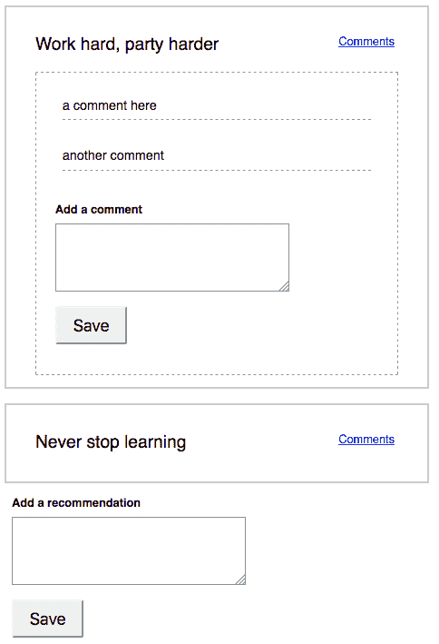
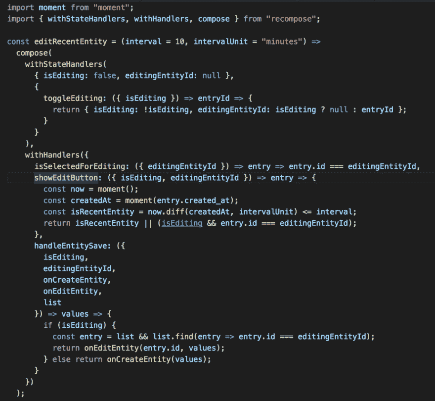
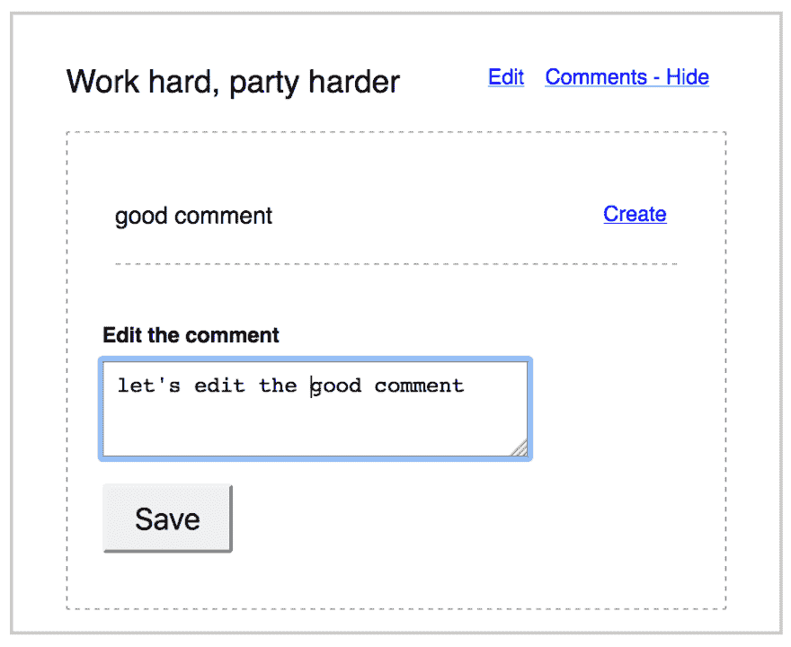
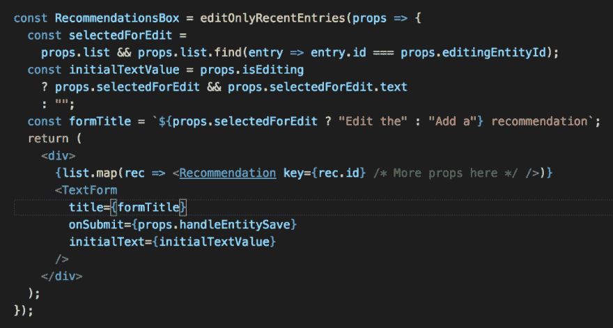
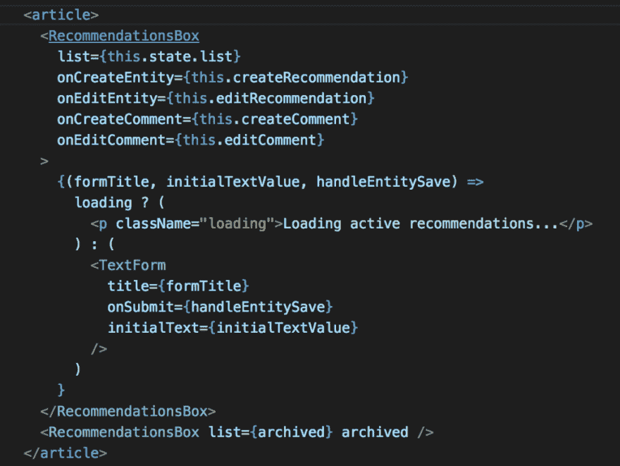

# 高阶组件和渲染道具的故事

> 原文：<https://dev.to/pepesenaris/a-tale-of-higher-order-components--render-props-3229>

在过去的几个月里，react 社区中就高阶组件[与](https://reactjs.org/docs/higher-order-components.html)[渲染道具](https://reactjs.org/docs/render-props.html)作为组件间共享关注点和重用公共逻辑的技术展开了无休止的争论。有大量的教程和课程解释它们的优点和缺点。如果您还没有看到任何这些资源，请阅读 React 文档，其中有对这两个术语的简短而集中的介绍。

在[intelligent](http://ingenious.agency/)这里，我们在不同的团队中分享了各种规模的 React 项目。到目前为止，我们一直在使用高阶组件(简称为 HOC ),主要是通过像 [recompose](https://github.com/acdlite/recompose) 这样的库来实现我们自己的“重用这个逻辑”组件，或者作为像 [react-redux](https://github.com/reactjs/react-redux) 这样的流行库的直接客户端，这些库的主要特性是通过 HOC 公开的。就在几天前，我们有机会“加入”这场辩论，并从实现新功能的两种方法中选择一种。故事是这样的。

我们建立了一个产品，用户需要给其他用户留下推荐，每个推荐可以有一个评论列表。想象一下为竞赛的“参与者”提供建议的“裁判”，在竞赛中，任何人，无论是裁判还是参与者，都可以对给定的建议给出多次反馈。

我们全力以赴，提出了一个漂亮的 UI，看起来类似于 [this](https://github.com/pepesenaris/hoc-and-render-props-example/tree/create-only) :

 

<figcaption>建议与嵌套评论</figcaption>

一切进展顺利，客户很高兴，博客结束。

* * *

实际上，在某些时候，客户要求推荐和他们的评论在创建的前 10 分钟内都是可编辑的。用户可以使用建议和评论执行的最终预期操作集有很大不同，但是两个实体的编辑工作流几乎是相同的。我们想让版本与用户已经知道的相似，这意味着尽可能多地重用我们已经拥有的 UI。现在的目标是添加一种选择推荐或评论的方法，填充用于创建它的相同输入，并保存修改。

我们从注释开始，构建了一个特设来允许编辑它们。时间快进，在重构了公共位之后，我们最终得到了一个组件，它允许我们使用相同的逻辑来创建/编辑推荐和评论。类似于[这个](https://github.com/pepesenaris/hoc-and-render-props-example/tree/edit-hoc):

[T2】](https://res.cloudinary.com/practicaldev/image/fetch/s--iqBuSOBl--/c_limit%2Cf_auto%2Cfl_progressive%2Cq_auto%2Cw_880/https://cdn-images-1.medium.com/max/1024/1%2AAg10snUKWqjglH3N_lPBaQ.png)

通过用 editRecentEntity 包装推荐和评论列表，我们只需要在实体和已解决问题中切换编辑模式:-)

 

<figcaption>编辑/创建链接切换推荐或评论的编辑模式</figcaption>

* * *

几天后，另一个客户请求来了。现在，我们需要显示*“归档”*建议，它们是三个月前的只读条目，并显示一个*加载*指示器，而不是输入表单，同时从服务器检索更近的*“活动”*建议。

到目前为止，我们只是呈现了一个推荐列表，后面跟着一个表单组件，所有这些都用 editRecentEntity HOC 封装起来。注释清单也使用了相同的模式。

[T2】](https://res.cloudinary.com/practicaldev/image/fetch/s---zlD6r2E--/c_limit%2Cf_auto%2Cfl_progressive%2Cq_auto%2Cw_880/https://cdn-images-1.medium.com/max/1024/1%2AvOjJwgzlVqmJp8QtzfSZKw.png)

隐藏存档条目的表单有一个简单的解决方案，但是问题是添加更多的代码来显示加载微调器，而不是表单，看起来有点笨拙，因为它只对一种类型的推荐是必要的。

这里一个干净的解决方案是，通过使用特殊的 React 子属性，将何时以及如何显示表单的责任转移给父组件。这种思想与 Render Props 模式相结合，允许将必要的道具传递给表单，因此我们可以继续支持推荐的创建和编辑。

 

<figcaption>渲染道具营救……</figcaption>

这里，Render Props 模式为父组件和子组件之间的通信提供了一个显式 API。传递给表单的所有三个属性都依赖于 editRecentEntity 中已经实现的逻辑，同时,*【神奇】*加载组件只能在需要的地方使用。去玩最后的[代码](https://github.com/pepesenaris/hoc-and-render-props-example)，如果那是你的事情。

这里的主要教训，至少是我们在构建这个特性时学到的教训，是最重要的是解决手头的问题，而不是在关于哪个模式比另一个更好的炒作导向的战斗中偏袒任何一方。如果客户端停止了创建/编辑功能，我们的代码将和最终版本一样有价值。无论是高阶组件还是渲染道具，总是尝试选择任何模式、工具、库来帮助你尽可能清晰地解决问题。

这就是所有的人…快乐编码。

* * *

*PS:如果你喜欢，或者更好，不喜欢你在这里读到的东西请* [*滴我们一行*](http://ingenious.agency/contact/) *。我们喜欢谈论技术，并一直在寻找那些喜欢和我们一起学习并教我们如何解决人际问题的优秀人才。*