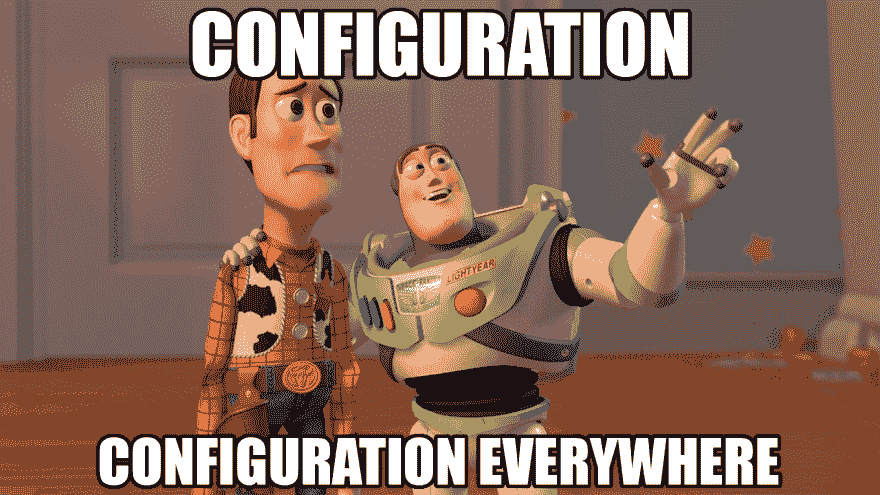
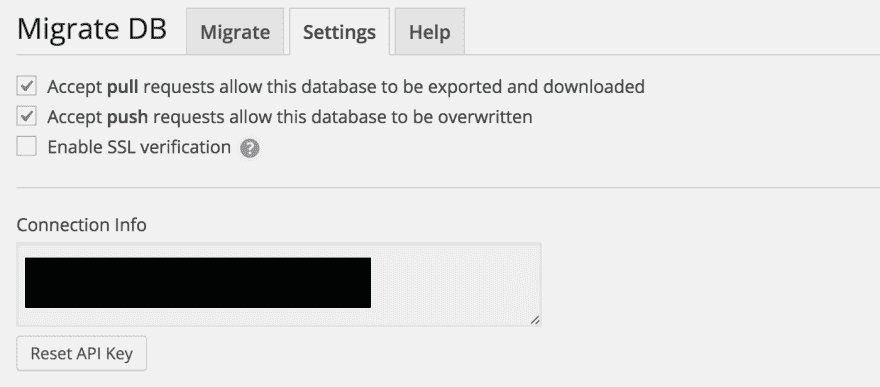
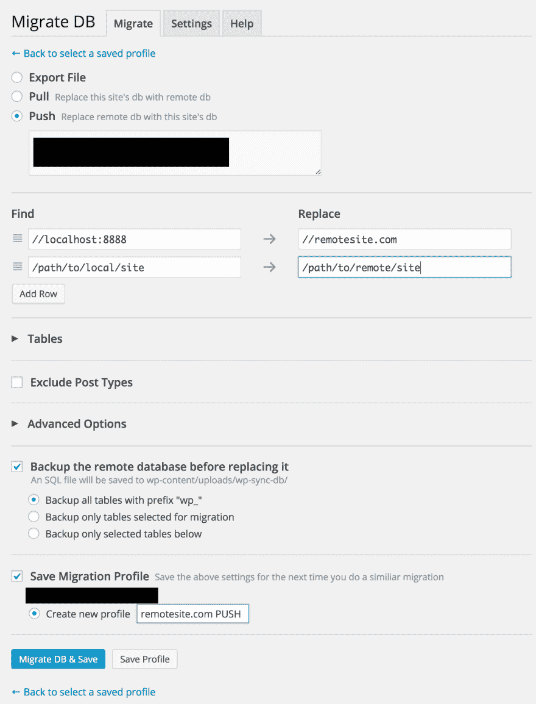
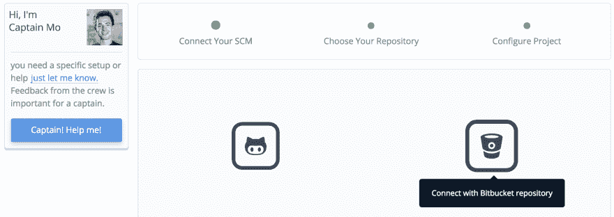
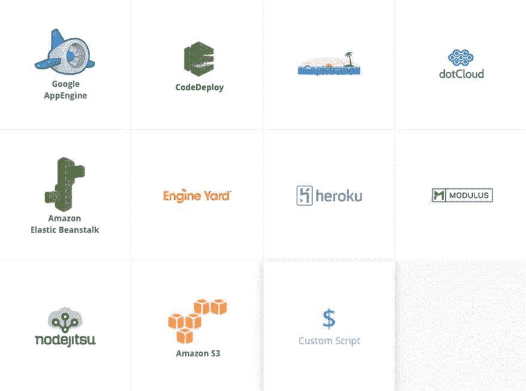

# 2015 年小型团队的 WordPress 开发工作流程

> 原文：<https://dev.to/zackphilipps/a-wordpress-development-workflow-for-small-teams-in-2015>

[T2】](https://res.cloudinary.com/practicaldev/image/fetch/s--az8p8fZp--/c_limit%2Cf_auto%2Cfl_progressive%2Cq_auto%2Cw_880/http://zackphilipps.com/conteimg/2015/07/19.jpg)

web 开发的未来就在这里，而且已经有一段时间了。我说的是加速工作流的前端工具，比如 Grunt 和 Sass。在 WordPress core 上工作的开发者知道这一点，并且他们正在利用它。WordPress 主题开发者甚至利用它。甚至可能是插件开发者。那么在开发 WordPress 网站时，为什么我们不能在每个项目的基础上利用它呢？

我们可以。我们**可以**在本地开发每一个 WordPress 网站。我们**可以**在每个项目中使用 Grunt、Sass 和 NPM。如果有必要，我们甚至可以与外界分享我们的本地网站，以供预览或合作。

我们**不需要**为我们想要使用的每个前端工具安装不同的 WordPress 插件。我们**不需要**在远程服务器上完成我们所有的开发工作。尽管这看起来更容易或更快，但并不理想。您需要有一种方法来存放一堆工作，而不影响已经存在的内容。

让事情变得复杂的一个 WordPress 基本原则是:**代码库和数据库是完全相互分离的。**因此，我们需要一种简单的方法将网站代码从本地迁移到开发服务器，然后再迁移到生产服务器。我们还需要一种单独的方法来处理数据库。

以下是帮助实现这一目标的工具列表:

*   [MAMP](https://www.mamp.info/en/)
*   [划痕](http://scratchtheme.com)
*   [Bitbucket](https://bitbucket.org/)
*   [数字海洋](https://www.digitalocean.com/)
*   [代码船](https://codeship.com)
*   [WP 同步数据库](https://github.com/wp-sync-db/wp-sync-db)

下面，我将更详细地解释这些工具。之后，我会解释如何使用它们。你可能想跟着教程继续阅读，但是学习并不需要跟着教程。你当然可以使用不同的工具。

* * *

#### MAMP

[MAMP](https://www.mamp.info/en/) 代表 Mac、Apache、MySQL 和 PHP。我们用它来开发本地的 WordPress 站点。你必须拥有它或类似的东西。我喜欢 MAMP 专业版，因为它很容易使用，设计也很好。

#### 刮痕

[Scratch](http://scratchtheme.com) 是世界上第一个[高级定制字段](http://advancedcustomfields.com/) -ready WordPress 主题。与其说它是一个主题，不如说它是一个构建你自己的完全定制的 WordPress 主题的跳板。

Scratch 有自己的 Gruntfile，负责 SCSS 和 JS 的编译、连接和缩小。它还可以优化上传到 WordPress 媒体库的图片。它使用 BrowserSync 进行实时重载和同步的跨浏览器/跨设备测试。

#### Bitbucket

Bitbucket 为团队提供 Git 和 Mercurial 代码管理。关于私有存储库，它有一个更加灵活的定价计划。通过 GitHub，您可以轻松地使用组织计划。

#### 数字海洋

[DigitalOcean](https://www.digitalocean.com/) 为开发者提供简单的云托管。我们< 3 it 是因为我们 100%控制我们所有的服务器(或者“水滴”，就像标签上写的那样)。DO 有一个很棒的网络应用程序来管理浏览器中的所有 droplets，但老实说，如果你使用 DO，你将在终端中完成大部分工作。我将在另一篇文章中谈论我们的 droplet 设置，但这不是你在浏览 DO 的无价教程和论坛时找不到的。

#### 代号船

[Codeship](https://codeship.com) 是一个持续的交付平台。这意味着您可以配置自动化测试和部署，以便在每次向存储库推送时运行。挺变态的。我会在文章中进一步解释。有很多 CI 和 CD 平台，但是我们觉得这个平台是最适合小团队的，因为它的易用性和价格结构。

#### WP 同步数据库

WP Sync DB 是一个 WordPress 插件，允许你通过自动查找和替换 URL 来拉和推你的数据库，只需点击一两个按钮。

* * *

## 流程–设置、推动和拉动

[T2】](https://res.cloudinary.com/practicaldev/image/fetch/s--gMdk962e--/c_limit%2Cf_auto%2Cfl_progressive%2Cq_auto%2Cw_880/http://zackphilipps.com/conteimg/2015/07/buzzlightyeareverywhere.png)

#### 本地设置

1.  安装 MAMP 或 MAMP 专业版。
2.  安装 WordPress。
3.  [按照步骤启动并运行 Scratch。](http://scratchtheme.com/docs/getting-started/)
4.  将最终代码库推送到新的位存储桶回购。

显然，你不必每次想在一个新的 WordPress 网站上工作时都安装 MAMP，但是你必须为每个项目安装 WordPress 和 Scratch，所以你要尽可能地简化这个过程。我们的方法是按照我们一直想要的方式安装所有东西，然后创建一个包含代码和数据库的 SQL 转储的 Bitbucket 存储库。我们称之为“完美设置”然后，当开始一个新项目时，我们只需克隆完美的设置，并将其推至一个全新的 Bitbucket repo。

但是，我决定更进一步。每次都要设置一个新的 DB 和 DB 用户，然后经历 WP 安装过程，链接到`wp-config.php`文件，这有点痛苦。所以我创造了`perfect_setup.sh`。[你可以在这里查看 GitHub 回购。](https://github.com/zackphilipps/new-wp-mamp-shell)它节省了几分钟的设置时间，这些时间累积起来。

我也想在这里与你分享完美的设置，但我们使用两个高级插件([高级定制字段 Pro](http://www.advancedcustomfields.com/pro/) 和[重力形式](http://www.gravityforms.com/)，这是非常值得的)，所以我们必须保持它的私密性。另外，你的完美设置可能并不完美。我鼓励你自己去做！

#### 远程设置

1.  通过在 DigitalOcean 中添加一个 Droplet 来设置一个开发服务器。
2.  在您的开发服务器上为该站点保留一个目录。
3.  为开发站点配置 DNS。
4.  将新的 Bitbucket repo 克隆到保留目录。
5.  使用 WP 同步数据库推送您的本地数据库。
6.  将您的 Bitbucket repo 和远程服务器与 Codeship 集成。

对于我们的 LEMP 堆栈和保留目录，我们使用一个名为 [EasyEngine](https://rtcamp.com/easyengine/) 的 CLI。您只需运行`sudo ee site create example.com --wpfc`，它就会创建站点目录，创建 Nginx 配置文件，并创建指向新创建目录的符号链接。它还创建 WordPress 数据库，安装 WordPress，并生成`wp-config.php`文件。有点像`perfect_setup.sh`(你可以看到我从哪里得到的灵感)。

一旦您保留了目录，您就可以将您的项目克隆到该目录。您将希望使用 SSH 进行克隆，以便您的 Codeship 部署能够工作。这里有一个在你的服务器上设置 Bitbucket/SSH 的指南。一旦你这样做了，你可以这样做:

```
cd /var/www/example.com/htdocs  
sudo rm -rf *  
git clone git@bitbucket.org:example-user/example-site.git . 
```

Enter fullscreen mode Exit fullscreen mode

> 除非你知道自己在做什么，否则不要跑。该命令递归地删除当前工作目录中的所有内容，没有办法恢复。

这就是 WP 同步数据库的用武之地。您需要将刚刚设置的新本地数据库与远程站点链接起来。现在，如果您已经配置了您的 DNS，当您访问您的开发网站时，您会看到一个空白的白色屏幕。这是因为活动数据库正在搜索 Twentyfifteen，当前默认的 WordPress 主题。但是，您安装了 Scratch。(你实际上可能会看到 215，这取决于你是否在 WordPress 安装中留下了主题目录。)

即使你在前端有一个空白的白屏，你仍然可以登录 WordPress。你需要激活 WP 同步数据库插件来使用它。然后，你必须去*工具>迁移数据库>设置*。选中复选框以允许推和拉请求，然后复制连接信息。

[T2】](https://res.cloudinary.com/practicaldev/image/fetch/s--B7kK1tYt--/c_limit%2Cf_auto%2Cfl_progressive%2Cq_auto%2Cw_880/http://zackphilipps.com/conteimg/2015/07/Screenshot-2015-07-28-21-56-58-copy.png)

回到你的本地机器，进入*工具>迁移数据库*，点击推送。粘贴您从开发网站复制的连接信息。我通常选择“在替换之前备份远程数据库”和“保存迁移配置文件”，根据我正在做的事情，在配置文件名称的末尾添加单词“PUSH”或“PULL”。这允许我下一次通过 2 次点击来推送数据库，并且如果我从开发站点添加一个拉配置文件，配置文件的名称将不会相同并使我困惑。

[T2】](https://res.cloudinary.com/practicaldev/image/fetch/s--DQQKDUc_--/c_limit%2Cf_auto%2Cfl_progressive%2Cq_auto%2Cw_880/http://zackphilipps.com/conteimg/2015/07/Screenshot-2015-07-28-22-05-00.png)

现在，假设您已经正确配置了 DNS，当您导航到您的开发网站时，您将看到您的完美设置！嗯，我希望就像在您的本地机器上一样。

是时候将我们的项目添加到 Codeship 中了。只需添加您的 Bitbucket repo，现在跳过测试配置。

[T2】](https://res.cloudinary.com/practicaldev/image/fetch/s--nbJF86RQ--/c_limit%2Cf_auto%2Cfl_progressive%2Cq_auto%2Cw_880/http://zackphilipps.com/conteimg/2015/07/Screenshot-2015-07-28-22-14-39.png)

> 注意:我们从未对 WordPress 网站使用自动化测试。有点矫枉过正。WordPress 核心和插件开发者已经在这么做了。不过，我确实用它来进行临时和完美的设置。只是为了测试声音文件。

要配置您的部署管道，请转到*项目设置>部署。*为`master`分支添加一条管道。你会注意到有一些第三方集成可以利用，比如亚马逊 S3 和 Heroku。我们使用的是 DigitalOcean，所以需要选择*自定义脚本。*

[T2】](https://res.cloudinary.com/practicaldev/image/fetch/s--b72M6L3u--/c_limit%2Cf_auto%2Cfl_progressive%2Cq_auto%2Cw_880/http://zackphilipps.com/conteimg/2015/07/Screenshot-2015-07-28-22-19-38.png)

您为此使用的脚本完全取决于您的开发服务器的配置，但是我们的脚本看起来像这样:

```
ssh user@example.com 'cd /var/www/example.com/htdocs && sudo git add . --ignore-removal && sudo git stash && sudo git pull origin master' 
```

Enter fullscreen mode Exit fullscreen mode

首先，我们以`user`的身份登录到我们的服务器。

> 这可能是一个伟大的想法添加一个用户只是为了代码。你可以称之为...`codeship`？在您的开发服务器上运行`sudo adduser codeship`,并将您分配的密码存储在某个地方。

然后，我们导航到我们的项目被克隆的目录。最后，我们添加所有未跟踪的文件，隐藏开发站点上发生的任何更改，并从`origin`遥控器的`master`分支获取任何更改。如果你认为开发网站和回购之间的任何差异都会被回购覆盖，那你绝对是正确的。如果你想保留其中的任何差异，重要的是**首先在开发服务器上手动提交它们，并将它们推送到你的 repo，然后将它们下载到你的本地机器。**

一旦保存了这个部署管道，您的定制脚本将在下一次成功的`git push origin master`时运行。这就是为什么使用 SSH 版本的`origin`遥控器很重要(你可以通过运行`git remote -v`来测试你的遥控器)，因为因为你的脚本是自动运行的，你不能输入密码，除非你以纯文本的形式存储在 Codeship 上。通过 SSH，Bitbucket 使用您设置的 SSH 密钥来认证`git pull`。

为了确保部署成功运行，您还需要做一些其他的事情。您需要将基于每个项目设置的 Codeship 公共 SSH 密钥添加到位于`/home/codeship/.ssh/authorized_keys`的`codeship`的`authorized_keys`文件中。该密钥位于*项目设置>通用> SSH 公共密钥中。*

最后，你需要确保`codeship`是`sudo` :
组的成员

```
sudo usermod -a -G sudo codeship 
```

Enter fullscreen mode Exit fullscreen mode

它可以使用`sudo`运行`git`命令，而无需输入密码。要做到这一点，从您的开发服务器运行`sudo visudo`并找到这一行:

```
# Allow members of group sudo to execute any command
%sudo ALL=(ALL:ALL) ALL 
```

Enter fullscreen mode Exit fullscreen mode

然后改成这样:

```
# Allow members of group sudo to execute any command
%sudo ALL=(ALL:ALL) ALL, NOPASSWD: /usr/bin/git 
```

Enter fullscreen mode Exit fullscreen mode

> **注:** `/usr/bin/git`可能因您而异。跑`which git`找出你的`git`指挥官住在哪里。

现在，您应该测试您的部署了！我总是喜欢在我的项目的`README.md`中添加代码状态徽章。看起来是这样的:

```
[](https://codeship.com/projects/<PROJECT_ID>) 
```

Enter fullscreen mode Exit fullscreen mode

并且在*项目设置>通知>状态画面>中找到复制降价语法。*

#### 工作工作工作

现在，您已经完成了配置，可以安心地工作了。享受代码库和数据库的无忧部署！

您需要注意开发服务器上的权限，因为每次运行部署时，这些权限都会被覆盖。我们在 Sublime 中使用了一个叫做`permissions`的[片段](http://sublimetext.info/docs/en/extensibility/snippets.html)，看起来像这样:

```
find * -type d -print0 | sudo xargs -0 chmod 0755 && find * -type f -print0 | sudo xargs -0 chmod 0644 && sudo chown -R www-data:www-data * 
```

Enter fullscreen mode Exit fullscreen mode

快速确定每个站点的所有权和权限。您可以从服务器上的单个站点的根目录运行它。您也可以将它添加到您的部署脚本中，但是这需要授予`codeship`用户特权，以便在不提示输入密码的情况下，在**的任何**命令上使用`sudo`。

#### 生产部署

当您准备好进入生产环境时，您将希望遵循与开发时相同的远程设置过程。然后，只需在 Codeship 中添加另一个部署。我们使用`production`分支进行生产部署。然后，在我们的本地机器上，我们切换到`production`分支，确保它包含与`master`相同的代码，并运行`git push origin production`。

最后，您只需使用 WP Sync DB 添加另一个名为`productionsite.com PUSH`的迁移配置文件。那就推！从现在开始，您的开发和生产部署将变得非常简单。

* * *

#### 用于行走提示

如果您的完美设置中没有`.gitignore`文件，您肯定想要一个。你至少要忽略掉`wp-config.php`文件和所有的`node_modules`。每个服务器上的`wp-config.php`文件本质上是不同的，所以没有理由在回购中使用它，NPM 模块有如此多的嵌套目录和文件，它们会在远程服务器上造成问题(我亲身经历过)。此外，只有在本地开发时才会运行 Grunt，所以没有理由在远程环境中使用它们。

这是我们的`.gitignore`的完整版本:

```
# Include your project-specific ignores in this file
# Read about how to use .gitignore: https://help.github.com/articles/ignoring-files

# Compiled source #
###################
*.com
*.class
*.dll
*.exe
*.o
*.so

# Packages #
############
# it's better to unpack these files and commit the raw source
# git has its own built in compression methods
*.7z
*.dmg
*.gz
*.iso
*.jar
*.rar
*.tar
*.zip

# Logs and databases #
######################
*.log

# OS generated files #
######################
.DS_Store
.DS_Store?
._*
.Spotlight-V100
.Trashes
ehthumbs.db  
Thumbs.db

# Gruntfile, gulpfile, Sass cache and node modules #
####################################################
Gruntfile.js  
gulpfile.js  
.sass-cache/
node_modules/

# Backups and Uploads #
#######################
wp-content/backup*/  
wp-content/uploads

# W3 Total Cache #
##################
wp-content/cache/  
wp-content/w3tc-config/*  
!wp-content/w3tc-config/master.php

# Ignore all WP themes except Scratch #
#######################################
wp-content/themes/*  
!wp-content/themes/scratch-theme

# WP Config #
#############
wp-config.php

# iThemes #
###########
nginx.conf

# InfiniteWP #
##############
wp-content/infinitewp 
```

Enter fullscreen mode Exit fullscreen mode

在您的远程环境中，您会希望为每个项目设置一些合理的`git`默认值，比如:

```
# Suppress long filename warnings/errors
sudo git config --system core.longpaths true

# Tell git to ignore changes in file ownership/permissions
sudo git config core.fileMode false

# Display the status in a pager so you can see the whole thing
sudo git config --global pager.status true

# Suppress moar warnings
sudo git config core.safecrlf false 
```

Enter fullscreen mode Exit fullscreen mode

我们对此也有一个精彩的片段，叫做`gitconfig`，扩展到这个:

```
sudo git config --system core.longpaths true && sudo git config core.fileMode false && sudo git config --global pager.status true && sudo git config core.safecrlf false 
```

Enter fullscreen mode Exit fullscreen mode

#### 限制访问开发网站

您可能不希望任何人都能访问您的开发网站。只有一种方法可以让你的网站 100%远离搜索引擎，那就是确保你的网站无论用户在哪里登陆都会弹出一个登录表单。

用 WordPress 完成这个非常容易。首先，你要确保 WordPress 功能`auth_redirect()`在你网站的前端工作。默认情况下，它只在后端工作。将此添加到您的`functions.php`文件:

```
/* MAKE AUTH_REDIRECT WORK ON FRONT END */
add_filter( 'auth_redirect_scheme', 'wpse16975_check_loggedin' );
function wpse16975_check_loggedin() {
    return 'logged_in';
} 
```

Enter fullscreen mode Exit fullscreen mode

现在，您可以将`<?php auth_redirect(); ?>`添加到`header.php`中。但仅限于开发网站！并且确保提交您的更改，以便它们在下次部署时不会被覆盖。

**更新:**你还应该告诉 Git 忽略`uploads`目录。尤其是如果你的网站有很多这样的网站。如果你的回购膨胀太多，Github 和 Bitbucket 会开始限制你对它的访问。此外，将媒体视为网站内容/数据库的一部分也是一个很好的做法。WP 同步数据库有一个[媒体文件插件](https://github.com/wp-sync-db/wp-sync-db-media-files)，用于在环境之间传输上传。

* * *

#### 相关岗位

*   [一个前端开发者的日常应用栈](http://zackphilipps.com/a-front-end-developers-daily-app-stack/)
*   [一个前端开发者的崇高文本设置](https://dev.to/zackphilipps/a-front-end-developers-sublime-text-setup-temp-slug-48528)
*   [我如何使用 Chrome 来经营网页设计业务](https://dev.to/zackphilipps/how-i-use-chrome-to-run-a-web-design-business-temp-slug-8442614)