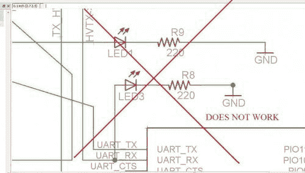
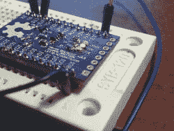
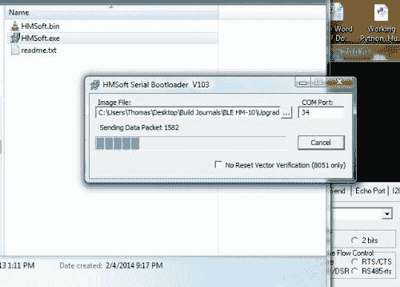
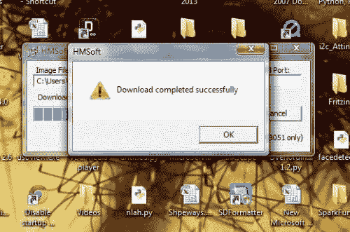
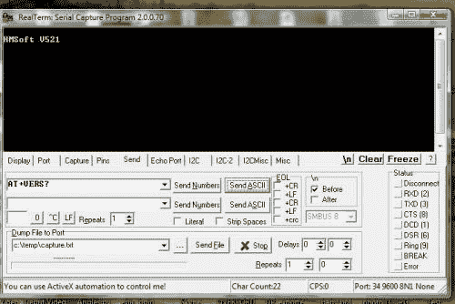

# 先进 HM-10

> 原文：<https://dev.to/ladvien/advancedish-hm-10-17m0>

[https://www.youtube.com/embed/zSp-vwzY-Pg](https://www.youtube.com/embed/zSp-vwzY-Pg)

这里有一些关于使用 HM-10 的随机笔记。

1.  **工作 RX/TX led**
2.  **如何升级 HM-10**
3.  **伪星联网 HM-10s**

**工作 RX/TX led**

我花了一些时间试图找到一种方法来创建 HM-10 突破的 RX/TX 交通指示灯。这对一些人来说可能很容易，但对我来说这是一个真正的思考者。HM-10 是 TTL，正如我所解释的，这意味着线路在空闲时为高电平，而在代表数据时为低电平。这里的问题是典型的 LED 设置不起作用。可悲的是，这是我在两个装配板中使用的设置。

[T2】](https://res.cloudinary.com/practicaldev/image/fetch/s--SCMoNs_7--/c_limit%2Cf_auto%2Cfl_progressive%2Cq_auto%2Cw_880/https://ladvien.cimg/HM-10_TX-RX_LED_01.jpg)

这个愚蠢的错误一直摆在我面前。尤其是有几个人订购了我的主板，并礼貌地提到，“它只有在大量数据通过时才会闪烁。”

经过询问，我被告知解决这个问题的最好方法是使用 PNP 晶体管。LMR 的人在这里给了我很多解决方案。这里的人都很聪明。(请不要告诉他们我不是，我想在他们发现我妈妈还在给我穿衣服之前，和那些酷孩子呆一会儿。)

但是在 LMR 帮助我的时候，我在他们的 Xbee 探索板上找到了 Sparkfun 的解决方案。本质上，led 从 3.3v 和 TX/RX 线之间连接，这允许它们在数据通过时充当接收器。只要 LED 为绿色、蓝色或其他具有 3.1v 压降的颜色，则吸收的电压不会干扰数据。

当然这是有风险的。CC2540 是一款漂亮的芯片，但它并不意味着是一款高电流 uC。我翻遍了数据手册，看看 RX/TX 引脚(2 & 3)的电流吸收额定值是多少。良好的...数据手册上没有！但是后来我看到了这个[的帖子](http://e2e.ti.com/support/low_power_rf/f/538/t/165364.aspx)。

所以，我查看了 [CC2540 用户指南](http://www.ti.com/lit/ug/swru191e/swru191e.pdf)的第 7.3 章。

[T2】](https://res.cloudinary.com/practicaldev/image/fetch/s--t6RDKmaj--/c_limit%2Cf_auto%2Cfl_progressive%2Cq_auto%2Cw_880/https://ladvien.cimg/HM-10_TX-RX_LED_02.jpg)

好了，我们走吧。所以，我试验了一个电路，发现它工作正常。但我只敢用 1k 的电阻。

最终[爽快地](http://letsmakerobots.com/user/21289)帮我解决了数学问题，

> 假设红色 LED 的正向偏压结两端的电压降约为 2 Vdc(我们称之为 Vf ),则通过 LED/电阻的总电流等于 Vsupply-Vf/R，或者在本例中为 3.3V-2V/1000=.0013A=1.3mA....如果他们足够聪明，那就不要担心。如果没有，那么您可以考虑使用 470 欧姆的电阻(2.7 毫安)，甚至 330 欧姆的电阻(3.9 毫安)。”

因此，我用这个 LED 设置制作了一个新版本的 HM-10 分线板(v.9.9)。我装了电线。而且，它似乎正在起作用。

[T2】](https://res.cloudinary.com/practicaldev/image/fetch/s--u99mdzdX--/c_limit%2Cf_auto%2Cfl_progressive%2Cq_auto%2Cw_880/https://ladvien.cimg/IMG_0356.png)

同样，不能在 RX/TX 线路上使用黄色或红色 led，因为它们不会产生足够高的压降来通知 CC2540 为低电平)。

**如何升级 HM-10**

**(注:**根据 Jnhuamoa，您只能升级 507 或更高版本)

1.  访问 HM-10 [网站](http://www.jnhuamao.cn/index_en.asp?ID=1)，了解*所有关于 HM-10 升级过程的*。 [](https://res.cloudinary.com/practicaldev/image/fetch/s--NBQTlO2w--/c_limit%2Cf_auto%2Cfl_progressive%2Cq_auto%2Cw_880/https://ladvien.cimg/HM-10_Upgrading_1_2.jpg)

2.  下载最新的固件版本文件。(确保您 HM-10 是 CC2540，如果是 CC2541，请使用该文件)。[T2】](https://res.cloudinary.com/practicaldev/image/fetch/s--zeQpSKFc--/c_limit%2Cf_auto%2Cfl_progressive%2Cq_auto%2Cw_880/https://ladvien.cimg/HM-10_Upgrading_2.jpg)

3.  在我们继续之前，这里是我的恶毒免责声明。重新阅读说明，你们都是试图上传固件的人，不要把问题归咎于我，比如你的 HM-10 :P _

4.  打开 [Realterm](http://realterm.sourceforge.net/) (或者你首选的串口终端)。

    1.  按照我之前的帖子中的描述连接你的 HM-10 的串行连接。
    2.  你就要越过不归路了。打开 HM-10 的串行连接，如果你做好了最坏的打算，输入:“AT+SBLUP”，模块应该会回复:“SBLUP+OK。”恭喜你，你已经把你的 HM-10 砌好了，至少在升级过程完成之前。
5.  现在，**在 Realterm 中关闭你的串行连接**。是的，我忘了自己关闭连接，并且很生气，因为我以为当我尝试下一步时，我已经用砖堵住了我的 HM-10。我是个黑客，用钢锯乱砍。

6.  将“HMSoft-10-2540-V522.zip”(或最新版本)解压缩到一个文件夹中。文件夹里应该有几个文件，**打开 HMSoft.exe**

7.  现在，**点击省略号并选择" HMSoft.bin"** 文件。然后，键入您的 com 端口号。除了数字之外，不需要包含任何内容(例如，COM34 变成 34)。【T2

10。祈祷(对于 HM-10 来说，如果去 [Nyarlathotep](http://en.wikipedia.org/wiki/Nyarlathotep) 效果最好)。

1.  点击“加载图像”上传过程应该会很快开始，大约需要一分半钟才能完成。**在看到以下内容之前，不要断开电源或拧接线:** [](https://res.cloudinary.com/practicaldev/image/fetch/s--_JwbKPHw--/c_limit%2Cf_auto%2Cfl_progressive%2Cq_auto%2Cw_880/https://ladvien.cimg/HM-10_Upgrading_Done.jpg)

2.  单击“确定”并打开 Realterm。调出一个串行连接并键入:“AT+VERS？”它应该会回应:“HMSoft v521。”这不是打印错误，即使我们上传了 V522 版本，它也回应说是 V521？你抓到我了。不过效果还行:)

[T2】](https://res.cloudinary.com/practicaldev/image/fetch/s--1nJBPwH2--/c_limit%2Cf_auto%2Cfl_progressive%2Cq_auto%2Cw_880/https://ladvien.cimg/HM-10_Upgrading_Check_Vers.jpg)

**伪星联网 HM-10s**

设置至少三个单元。

**1 号机组(“主”)**

1.  在+角色 2
2.  在+即时 1
3.  AT+con xxxslave # 1 xxxxx

**单元#2(从#A)**

1.  AT+ADDR？写下地址。我的回复:“好的+ADDR:883314DD8015”
2.  AT+模式 1

**单元#3(从#B)**

1.  AT+ADDR？写下地址。我的回复是“好的+ADDR:883314DD8016”

2.  AT+模式 1

哦，还有一点。您需要将 Arduino 上的第 4 针连接到 HM-10 主复位线上。因为实在没有办法同时复位从机和主机。这使我们避开了从机和主机的超时。

*   **复位 Arduino** 上的< - 1k 电阻- > D4

然后使用以下代码，分别更改您的地址。

```
// Crap code for HM-10 pseudo-Networking
// By the crappy code Thomas Brittain, aka, Ladvien.

String inputString = "";         // a string to hold incoming data
boolean stringComplete = false;  // whether the string is completeString inputString = "";         // a string to hold incoming data

float time;
float oldTime;

void setup() {
// initialize serial:
Serial.begin(9600);
pinMode(4, OUTPUT);
digitalWrite(4, LOW);
}

void HM10Reset(){
  Serial.print("AT+RESET");
  delay(220);
  digitalWrite(4, HIGH);
  delay(100);
  digitalWrite(4, LOW);
  delay(150);
}

void loop() {
  // print the string when a newline arrives:
  Serial.write("AT+CON883314DD8016");
  delay(150);
  Serial.print("From first node!  Seconds ago last here: ");
  time = millis();
  Serial.println((time-oldTime)/1000);
  oldTime = millis();
  delay(250);
  HM10Reset();
  Serial.write("AT+CON883314DD8015");
  delay(150);  
  Serial.println("From second node!");
  delay(150);
  HM10Reset();
}

void serialEvent() {
  while (Serial.available()) {
  // get the new byte:
  char inChar = (char)Serial.read();
  // add it to the inputString:
  delay(50);
  inputString += inChar;
  stringComplete = true;
}

} 
```

Enter fullscreen mode Exit fullscreen mode

不打算撒谎。我对固件使节点间切换变得如此复杂感到非常失望。虽然，我才开始玩高于 V303 的固件版本。

我在节点间切换的时间不超过 2.84 秒。这根本不适合我。当然，节点越多，这一比率越高。所以，用这种方式控制的一大群小机器人是无法管理的。

我试着调整代码中所有东西的时间。HM-10 没有。如果我降低 AT 命令后的延迟，命令就不会执行。这通常会导致节点停滞(等待超时、仍然连接等)。)此外，HM-10 上的硬件重置据说是 100 毫秒，但我发现它不到 250 毫秒就不高兴了。

无论如何，如果还有人想扛大旗，我的建议是提高 buad 速率，坚持硬件重置，就像我的 [ATtiny Bitsy Spider](http://letsmakerobots.com/node/39795) 板一样。