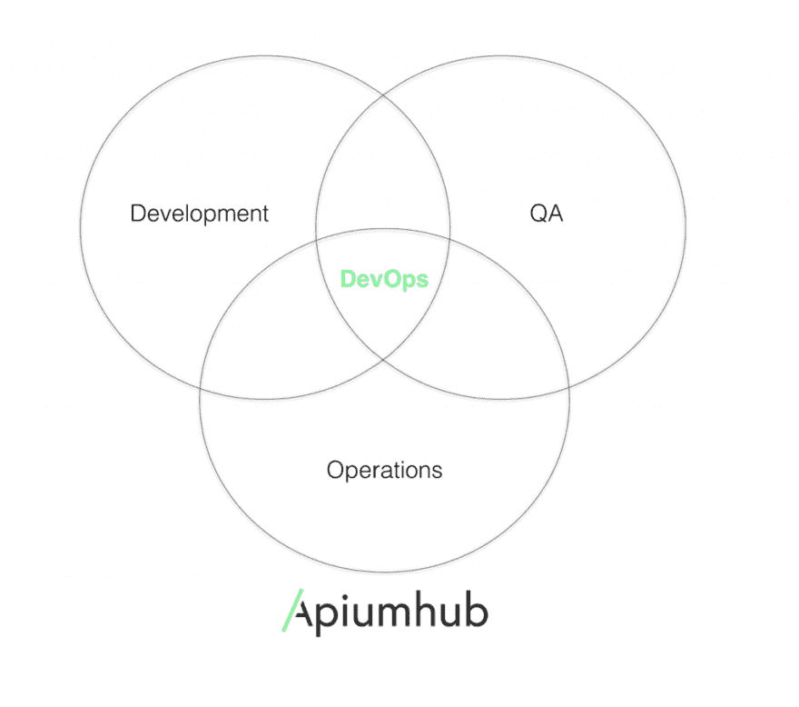

# 詹金斯的优势

> 原文：<https://dev.to/apium_hub/advantages-of-jenkins-12>

开发人员和运营人员不再是 IT 部门中相互独立的角色。如今，DevOps 工程师重塑了 IT 团队的运营方式；改善开发人员、系统管理员和测试人员之间的协作。

他们还提高了部署率、缺陷检测和特性交付。本质上，它植根于这样一个理念，即如果合适的专业团队一起工作，构建、测试和发布软件可以更顺利和自动地运行。你可以在这里找到更多关于[的信息。但是在这篇文章中，我们更想关注持续集成工具:JenkinsJenkins 的主要优势以及如何与 Jenkins 进行](https://apiumhub.com/tech-blog-barcelona/devops-technologies-benefits/)[持续整合](https://apiumhub.com/tech-blog-barcelona/benefits-of-continuous-integration/)！

## devo PS 的工具

但是没有正确的工具，软件开发过程就不能有效地工作。类似地，在 DevOps 的情况下，您总是可以从一组正确的工具中受益。这些工具有助于信息共享、流程自动化、减少部署时间、持续部署等。

[T2】](https://apiumhub.com/wp-content/uploads/2017/10/DevOps-Apiumhub.png)

根据 DevOps 工具在 DevOps 生命周期特定阶段的用途，可将其分为七类:

1.  代码(版本控制系统):Git
2.  构建(持续集成): [Jenkins](https://en.wikipedia.org/wiki/Jenkins_(software)) ，Travis，TeamCity
3.  测试(连续测试、检查):JMeter、Sonarqube
4.  包(工件存储库):Artifactory
5.  配置和发布(变更管理、容器化):Docker 编写
6.  基础设施(协调、云):坞站 Swarm、kubernetes、meus、AWS、Gcloud、Nexus
7.  监控(管理绩效):ELK，Grafana

## 那么，詹金斯是什么？

在今天的 DevOps 世界中，持续的交付和部署对于比以往任何时候都更快地交付高质量的软件产品是至关重要的。Jenkins 是一个用 Java 编写的开源持续集成服务器。到目前为止，它是管理持续集成构建和交付管道最广泛使用的工具。它帮助开发人员不断地构建和测试软件。它增加了自动化的规模，并在 DevOps 圈子里迅速流行起来。Jenkins 的主要优势之一是它几乎不需要维护，并且内置了 GUI 工具，便于更新。Jenkins 还提供定制的解决方案，因为有超过 400 个插件来支持构建和测试几乎任何项目。基本上，Jenkins 集成了所有类型的开发生命周期过程，包括构建、文档、测试、打包、登台、部署、静态分析等等。

使用 Jenkins，您可以通过多种方式配置警报，例如，您接收电子邮件通知，或弹出窗口等。并真正实现自动化。通过正确的配置，您可以获得快速的反馈。你永远都会知道，就在你破坏了构建之后。您将了解作业失败的原因是什么，并且您还可以了解如何将其恢复。

## 与詹金斯不断融合

让我们设想一个场景，其中构建了应用程序的完整源代码，然后部署在测试服务器上进行测试:

首先，开发人员将代码提交给源代码库。与此同时，Jenkins 服务器定期检查存储库是否有变化。

提交发生后不久，Jenkins 服务器检测到源代码库中发生的变化。詹金斯将完成这些变更，并开始准备新的版本。如果构建失败，那么相关的团队将被通知。

如果构建成功，那么 Jenkins 在测试服务器中部署构建好的。

您可以配置管道(要运行的脚本)来通过几个步骤创建构建:

准备、测试([单元和集成测试](https://apiumhub.com/tech-blog-barcelona/top-software-testing-techniques/))、打包、发布、部署。

运行它之后，Jenkins 生成一个反馈，如果这些约束是 ok 的，那么工件是有效的。然后 Jenkins 通知开发人员构建和测试结果。

它将继续检查源代码库中对源代码所做的更改，整个过程不断重复(功能测试)。

## 詹金斯有哪些优点？

*   它是开源的，用户友好，易于安装，不需要额外的安装或组件。
*   这是免费的。
*   易于配置。Jenkins 可以很容易地修改和扩展。它立即部署代码，生成测试报告。Jenkins 可以根据持续集成和持续交付的要求进行配置。
*   独立于平台。Jenkins 适用于所有平台和不同的操作系统，无论是 OS X、Windows 还是 Linux。
*   丰富的插件生态系统。大量的插件使得 Jenkins 非常灵活，允许跨各种平台进行构建、部署和自动化。
*   容易支持。因为它是开源的并且被广泛使用，所以不缺少来自大型在线社区[敏捷团队](https://dev.to/apium_hub/what-you-should-know-when-building-an-agile-team)的支持。
*   开发人员编写测试来尽可能快地检测他/她的代码中的错误。因此节省了开发人员的时间，而不用浪费在大规模的充满错误的集成上。
*   问题几乎可以立即被检测到并解决，这使得软件处于一种可以在任何时候安全发布的状态。
*   大多数集成工作都是自动化的。因此，集成问题较少。这在项目的生命周期中既节省了时间又节省了金钱。

Docker 与 Jenkins 的合作对开发团队产生了深远的影响。众所周知，Docker 简化了开发，使部署变得更加容易。

Docker、Jenkins 及其集成生态系统共同为敏捷开发提供协调的软件基础设施。

## 如果您觉得这篇关于 Jenkins 的关键优势的文章很有趣，您可能会喜欢…

[DevOps 技术&工具](https://apiumhub.com/tech-blog-barcelona/devops-technologies-benefits/)

[使用 Docker 的 10 大好处](https://apiumhub.com/tech-blog-barcelona/top-benefits-using-docker/)

[持续集成的主要优势](https://apiumhub.com/tech-blog-barcelona/benefits-of-continuous-integration/)

[测试驱动开发的优势](https://apiumhub.com/tech-blog-barcelona/advantages-of-test-driven-development/)

[敏捷项目管理的 5 大优势](https://apiumhub.com/tech-blog-barcelona/benefits-of-agile-project-management/)

[顶级软件测试技术](https://apiumhub.com/tech-blog-barcelona/top-software-testing-techniques/)

[单元测试的八大好处](https://apiumhub.com/tech-blog-barcelona/top-benefits-of-unit-testing/)

詹金斯的帖子[最早出现在](https://apiumhub.com/tech-blog-barcelona/advantages-of-jenkins/) [Apiumhub](https://apiumhub.com) 上。