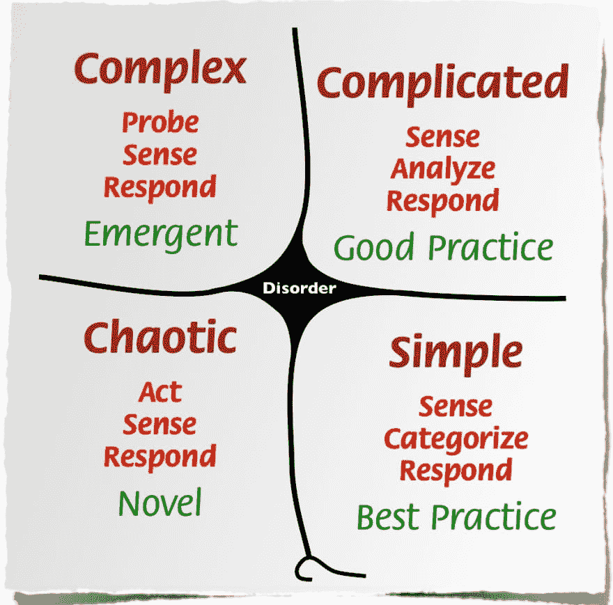

# 所有的问题！我是如何保持理智的

> 原文：<https://dev.to/yellowbrickcode/all-of-the-problems-how-i-stay-sane>

在初创企业的早期，作为一名架构师，我的大部分工作都处于无序状态。我们正处于真正触及我们正在努力解决的问题的核心的过程中，当我们定义这个问题时，我需要分析我们如何在技术上创造这些解决方案的选项。随着我解决这个问题，画面变得越来越清晰，渐渐地我有了一个可靠的计划，并且正在编写代码来实现它。有时候，在这个过程中会出现其他问题，我需要弄清楚它们在“WTF”的尺度上处于什么位置？!"到“哦，好的，没问题”。

几年前，有人向我展示了 Cynefin 框架。Cynefin 框架是在 21 世纪初由 IBM 开发的一个有意义的设备。作为旁注，很高兴在科技语言中看到一个威尔士语单词(cynefin 是威尔士语的栖息地)。对于那些不说威尔士语的人来说，它的发音是 kun-ev-in。无论如何，此刻我可能每天都在脑海中描绘这张图。每当我考虑一个问题或者一个新的问题出现时，我会考虑它在这个图上的位置。

 
[链接到原始文件](https://commons.wikimedia.org/wiki/File:Cynefin_framework_Feb_2011.jpeg)

我的思维过程倾向于顺时针方向，从**混乱**开始。第一步是，我们有一个问题。我们讨论它，理解它，定义它，并最终开始想出一个我们认为如何用我们正在构建的软件解决它的主意。

然后我进入**复杂的**域。我有一个解决这个问题的最终办法。我必须考虑如何在我们整个系统的大背景下从技术上解决这个问题。对我来说，这个领域通常涉及一些概念验证工作，最终我会提出一个技术实现计划，以帮助我们获得最终解决方案。

下一个领域是**复杂的**。对我来说，这是我真正开始把一些高层次的工作放到我们的架构中的地方，理解这个实现实际上是如何适应的。我把这一步看作是从我头脑中或纸上的想法变成实现的一部分。对我个人来说，这一部分可能会很慢，有点令人沮丧，但当解决方案成形时，它就成了过程中非常值得的一部分！

最终你会到达简单的领域。架构现在已经就位，所以我们在这里充实细节，并使用我以前多次使用的众所周知的解决方案和技术将所有实现就位。

***问题并不总是需要从混沌域*** 开始。

任何领域都可能出现问题。有时会出现一个直接进入简单领域的问题，这可能是因为您在解决类似问题时已经经历了其他三个领域。这可能只是你在开发生涯中已经解决了上百次的事情。

我个人认为这个框架在很多应用程序中都是有用的。绝对不只是对创业公司或者新项目有用。即使在成熟的软件项目中，这也是有帮助的。我也不认为它的用处仅限于技术领域。

所以使用这个框架是我如何在一个混乱的世界里保持理智。我不惊慌，我把问题分类，这有助于我保持冷静。当我看到一个问题而不知道如何解决时，我知道它没问题，因为它还不在简单域中。我只需要在它到达之前继续努力。

*[这是 2017 年 3 月在我的博客上最初发布的](https://www.yellowbrickcode.co.uk/all-of-the-problems-how-i-stay-sane/)*