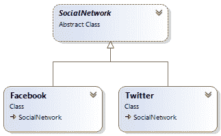
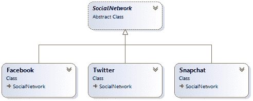
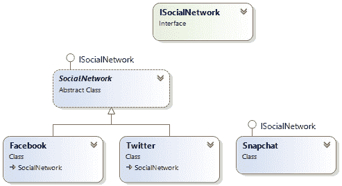
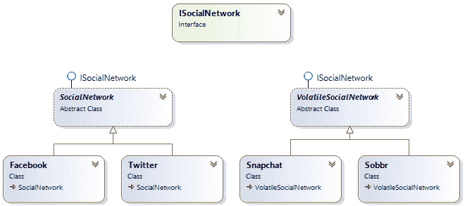

# 抽象类和接口之间一致性的一个例子

> 原文：<https://dev.to/foxhard/an-example-of-convivence-between-abstract-classes-and-interfaces-50o0>

几年前，有人问我什么时候使用接口，什么时候使用抽象类。答案取决于一些因素，比如常见的行为和可扩展性水平。我认为用一个例子来表达我的答案是一个好主意

### 举个例子

在这个例子中，我们将创建一个`imaginary concept of social network`,因此对我们来说，社交网络是一个可以发布带有图片的消息并保存所发布消息的历史记录的东西。

**创建 SocialNetwork 抽象类**

```
public abstract class SocialNetwork
{
    public List<string> History { get; private set; }

    protected SocialNetwork()
    {
        History = new List<string>();
    }

    public void Post(string comment, byte[] image)
    {
        DoPost(comment, image);
        History.Add(comment);
    }

    protected virtual void DoPost(string comment, byte[] image)
    {
    }
} 
```

Enter fullscreen mode Exit fullscreen mode

**添加脸书和推特社交网络**

```
public class Facebook : SocialNetwork
{
    protected override void DoPost(string comment, byte[] image)
    {
        //Logic to make a post on facebook
    }
}

public class Twitter : SocialNetwork
{
    protected override void DoPost(string comment, byte[] image)
    {
        //Logic to make a post on twitter
    }
} 
```

Enter fullscreen mode Exit fullscreen mode

图 1 示出了具有图 1 的类别关系 [](https://res.cloudinary.com/practicaldev/image/fetch/s--9Vv54a-Y--/c_limit%2Cf_auto%2Cfl_progressive%2Cq_auto%2Cw_880/https://streetcoder.dev/static/img/posts/2015-06-05-classes-interfaces/initial-design.png) 的图

现在想象一下，我们有一个可以向我们所有的社交网络发布消息的类:

```
public class SocialNetworkProcessor
{
    private readonly SocialNetwork[] _socialNetworks;

    public SocialNetworkProcessor(SocialNetwork[] socialNetworks)
    {
        _socialNetworks = socialNetworks;
    }

    public void Post(string message, byte[] image)
    {
        foreach (var socialNetwork in _socialNetworks)
        {
            socialNetwork.Post(message, image);
        }
    }
} 
```

Enter fullscreen mode Exit fullscreen mode

**把所有的放在一起**

```
class Program
{
    static void Main(string[] args)
    {
        var socialNetworks = new SocialNetwork[]
        {
            new Facebook(), 
            new Twitter()
        };

        var processor = new SocialNetworkProcessor(socialNetworks);

        var someImage = new byte[] {1, 2, 3};
        processor.Post(&quot;Hello&quot;, someImage);
    }
} 
```

Enter fullscreen mode Exit fullscreen mode

到目前为止还不错，但是我们上面刚刚写的代码有一个严重的设计问题。你看到问题了吗？。想象一下，我们必须处理一种完全不同的社交网络。例如，不存储消息历史的东西，比如`Snapchat`，所以我们的新类将被称为`Snapchat`。`Snapchat` class 只会跟踪最新发布的消息。当然，我们会通过我们的`SocialNetWorkProcessor`来传递我们的类，以便通过我们的新类来发布消息。让我展示给你看:

**创建 Snapchat 社交网络**

```
public class Snapchat : SocialNetwork
{
    private string _lastMessage;

    protected override void DoPost(string comment, byte[] image)
    {
        //Logic to make a post on snapchat
        _lastMessage = comment;
        ProcessLastMessage();
        History.Clear();
    }

    private void ProcessLastMessage()
    {
        //Some logic here.
    }
} 
```

Enter fullscreen mode Exit fullscreen mode

正如你在上面注意到的，`Snapchat`类继承了`SocialNetwork`类，所以`Snapchat`类也将存储帖子的历史。但是我们不想要它，所以我们必须清除历史列表

图 2 显示了包含新的`Snapchat`类的类图

[](https://res.cloudinary.com/practicaldev/image/fetch/s--Y-ZMVol8--/c_limit%2Cf_auto%2Cfl_progressive%2Cq_auto%2Cw_880/https://streetcoder.dev/static/img/posts/2015-06-05-classes-interfaces/next-design-1.png) 图 2

**接口开始动作**

上面显示的实现的问题是，`Snapchat`有一个他不需要的东西，即历史。想象一下，`SocialNetwork` class 会有很多东西，比如历史、图像历史、时间轴生成器或任何正常社交网络所必需的东西。我们想要实现的每一个新的社交网络都将被迫继承`SocialNetwork`基类中的所有当前职员。这就是为什么我们需要更高层次的抽象。`SocialNetwork`基类是我们所知道的一个普通的社交网络，但是我们需要一个超级抽象来定义一个`SocialNetwork`会做什么而不用为它定义任何行为，所以我们需要定义一个`interface`

```
public interface ISocialNetwork
{
    void Post(string message, byte[] image);
} 
```

Enter fullscreen mode Exit fullscreen mode

现在，我们将做`SocialNetwork`类来实现`ISocialNetwork`

```
public abstract class SocialNetwork : ISocialNetwork
{
    public List<string> History { get; private set; }

    protected SocialNetwork()
    {
        History = new List<string>();
    }

    public void Post(string comment, byte[] image)
    {
        DoPost(comment, image);
        History.Add(comment);
    }

    protected virtual void DoPost(string comment, byte[] image)
    {
    }
} 
```

Enter fullscreen mode Exit fullscreen mode

下面是新的`Snapchat`类:

```
public class Snapchat : ISocialNetwork
{
    private string _lastMessage;

    public void Post(string message, byte[] image)
    {
        //Logic to do a snapchat post
        _lastMessage = message;
        ProcessLastMessage();
    }

    private void ProcessLastMessage()
    {
        //Some logic here.
    }
} 
```

Enter fullscreen mode Exit fullscreen mode

图三。显示了实现`ISocialNetwork`的`SocialNetwork`和`Snapchat`类。

[](https://res.cloudinary.com/practicaldev/image/fetch/s--qOGqrcvH--/c_limit%2Cf_auto%2Cfl_progressive%2Cq_auto%2Cw_880/https://streetcoder.dev/static/img/posts/2015-06-05-classes-interfaces/next-design-2.png) 图 3

当然，我们需要通过用`ISocialNetwork`接口:
替换`SocialNetwork`类引用来更新我们的`SocialNetworkProcessor`类

```
public class SocialNetworkProcessor
{
    private readonly ISocialNetwork[] _socialNetworks;

    public SocialNetworkProcessor(ISocialNetwork[] socialNetworks)
    {
        _socialNetworks = socialNetworks;
    }

    public void Post(string message, byte[] image)
    {
        foreach (var socialNetwork in _socialNetworks)
        {
            socialNetwork.Post(message, image);
        }
    }
} 
```

Enter fullscreen mode Exit fullscreen mode

到目前为止，设计已经足够强大，`SocialNetworkProcessor`可以在任何实现了`ISocialNetwork`接口的社交网络中发帖。`Facebook`和`Twitter`共享来自`SocialNetwork`的共同行为，它实现`ISocialNetwork`。`Snapchat`类不与`Facebook`和`Twitter`共享任何行为，但它也是一个社会网络，所以它直接实现了`ISocialNetwork`接口

**一名新玩家加入游戏**

现在想象一下，我们需要创建一个新的社交网络，例如`Sobbr`。`Sobbr`是一个只按 24 小时存储你的帖子的社交网络。我们还需要一个逻辑来像处理`Snapchat`一样处理`Sobbr`的最后一个帖子。通过利用我们当前的设计，我们可以很容易地创建一个新的类来共享`Snapchat`和`Sobbr`之间的行为，因为它们是不稳定的社交网络，所以我们的新基类将被称为`VolatileSocialNetwork`，当然它将实现我们的`ISocialNetwork`接口

```
public abstract class VolatileSocialNetwork : ISocialNetwork
{
    private string _lastMessage;

    public void Post(string message, byte[] image)
    {
        //Logic to do a snapchat post
        _lastMessage = message;
        ProcessLastMessage();
    }

    private void ProcessLastMessage()
    {
        //Some logic here.
    }
} 
```

Enter fullscreen mode Exit fullscreen mode

**创建新类 Sobbr**

```
public class Sobbr : VolatileSocialNetwork
{
    private DateTime _creationTime;

    private void DestroySocialNetwork()
    {
        //Some logic here to destroy data after 24 hours.
    }
} 
```

Enter fullscreen mode Exit fullscreen mode

当然`Snapchat`也会从`VolatileSocialNetwork`继承

```
public class Snapchat : VolatileSocialNetwork
{
} 
```

Enter fullscreen mode Exit fullscreen mode

图 4。显示了从`SocialNetwork`基类继承的`Facebook`和`Twitter`，以及从`VolatileSocialNetwork`基类继承的`Snapchat`和`Sobbr`的最终设计。`SocialNetwork`和`VolatileSocialNetwork`实现`ISocialNetwork`接口

[](https://res.cloudinary.com/practicaldev/image/fetch/s--fOjoxp4e--/c_limit%2Cf_auto%2Cfl_progressive%2Cq_auto%2Cw_880/https://streetcoder.dev/static/img/posts/2015-06-05-classes-interfaces/next-design-3.png) 图 4

**决赛**

```
class Program
{
    static void Main(string[] args)
    {
        var socialNetworks = new ISocialNetwork[]
        {
            new Facebook(),
            new Twitter(),
            new Snapchat(),
            new Sobbr()
        };
        var processor = new SocialNetworkProcessor(socialNetworks);

        var someImage = new byte[] {1, 2, 3};
        processor.Post("Hello", someImage);
    }
} 
```

Enter fullscreen mode Exit fullscreen mode

按照这种设计，我们不需要修改代码的其他部分来包含更多的社交网络

感谢阅读