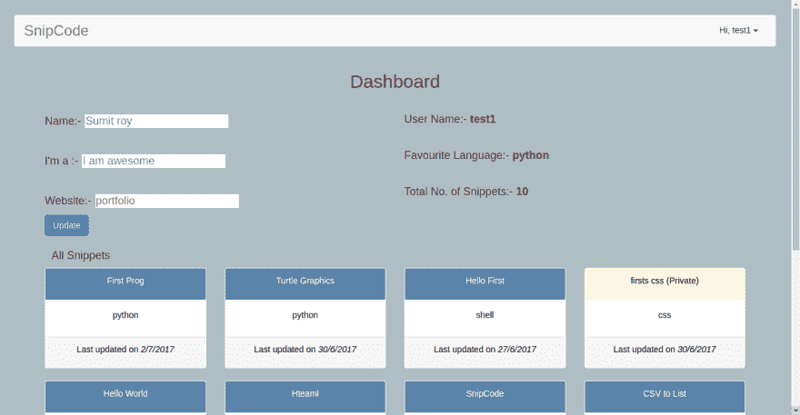
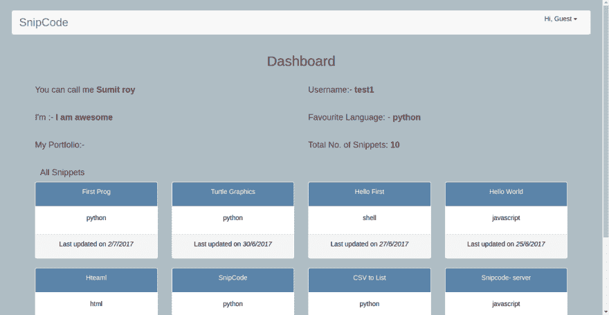

# 应用程序屏幕 2

> 原文：<https://dev.to/sroy8091/app-screen-2>

## 仪表板页面

随着我继续前进，我的下一个应用程序屏幕是一个仪表板页面。在这里，用户可以看到他提交的片段，包括私人的片段。用户可以更新他的简档。但是我想从我的角度加入一些东西，比如用户最喜欢的语言。

[T2】](https://res.cloudinary.com/practicaldev/image/fetch/s--S_Bv5_bZ--/c_limit%2Cf_auto%2Cfl_progressive%2Cq_auto%2Cw_880/https://thepracticaldev.s3.amazonaws.com/i/43w74el37q8n0b5wbtm4.png)

这里的所有代码片段都是编辑的链接，这些链接将再次带用户编辑代码片段页面。但是如果用户没有被授权编辑该截图，那么他只能查看该截图。嗯，我通过检查 cookies 实现了这一点，正如我在[之前的博客](https://dev.to/sroy8091/i-love-cookies-expressjscookies)中所描述的。如果用户被授权，将创建带有可编辑选项的[代码镜像](https://dev.to/sroy8091/i-built-it-with-codemirror)，否则它将处于只读模式。

正如你在图片中看到的，私人博客有不同的颜色，访问你的个人资料的人不会看到。如果我作为一个客人访问我的个人资料，我只会得到这些。

[T2】](https://res.cloudinary.com/practicaldev/image/fetch/s--od0nkxQp--/c_limit%2Cf_auto%2Cfl_progressive%2Cq_auto%2Cw_880/https://thepracticaldev.s3.amazonaws.com/i/v9zrey3hs5c8ouocvfqh.png)

因此，这也可以在朋友之间分享。正如我们可以看到其他人在访问你的个人资料时无法看到你创建的私人截图。

*这里是关于这一系列 snipcode 开发的所有帖子的索引*

[第一部分:App Idea](https://dev.to/sroy8091/app-idea-for-hasura-internship)
[第二部分:App 原型](https://dev.to/sroy8091/app-prototype)
[第三部分:本地开发](https://dev.to/sroy8091/hasura-local-development)
[第四部分:G for Git](https://dev.to/sroy8091/g-for-git)
[第五部分:数据建模](https://dev.to/sroy8091/its-modeling-time)
[第六部分:Data&Auth API](https://dev.to/sroy8091/postman-a-major-tool-for-developers)
[第七部分:基本功能](https://dev.to/sroy8091/i-love-cookies-expressjscookies)
[第八部分:App 屏幕 1](https://dev.to/sroy8091/i-built-it-with-codemirror)
[第九部分](https://dev.to/sroy8091/app-screen-2)

| 喜欢我的帖子吗？ |
| --- |
| [T2】](https://ko-fi.com/A0A5WBC1) |