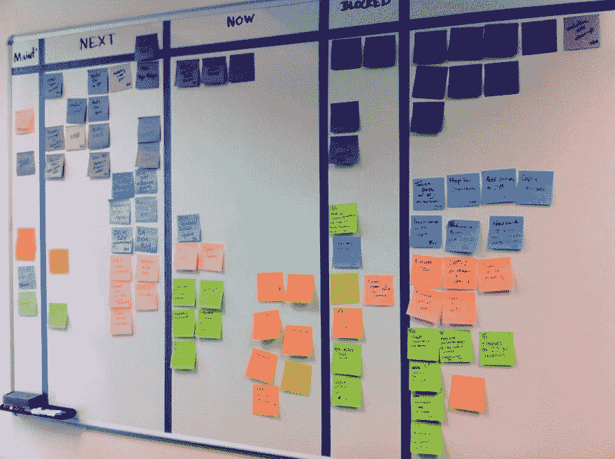

# 避免杀害其他团队成员

> 原文：<https://dev.to/terceranexus6/avoiding-to-kill-other-team-members-3hl>

## 这是战争

大多数开发人员应该在团队中工作，我们都知道这可能很棒(知道项目的一部分延误了其他人，并且你对团队的其他人很有用)或者是一场彻底的灾难(想要**杀死你周围的所有人**，**严重毁坏你的电脑**，在工作场所放一把**火**)但是幸运的是，你可以使用一些技巧来组织自己，避免暗杀和混乱。这篇文章是基于我过去几个月和几年在课堂上和工作中的亲身经历。

[T2】](https://res.cloudinary.com/practicaldev/image/fetch/s--WPDQFl7u--/c_limit%2Cf_auto%2Cfl_progressive%2Cq_auto%2Cw_880/https://i.ytimg.com/vi/Egjn3B8OkbM/maxresdefault.jpg)

## 方法论

首先，您可能想要一个适合您项目的有效方法。有很多，在课堂上我们有时使用 SCRUM(我在工作中也用过一次),但是我个人不喜欢它。对于班级项目来说很方便，因为它让跟踪每小时的工作*变得很容易*。但是我个人更喜欢**看板**。除了作为日本人的事实，我喜欢它是因为它简单、清晰，github 项目可以使用它。看板可以被想象成一个有不同栏目的白板，开发人员可以在一个栏目到另一个栏目的问题上使用便利贴，这样每个问题都被分配给一个开发人员，避免了混淆。
[](https://res.cloudinary.com/practicaldev/image/fetch/s--_aBTHfnr--/c_limit%2Cf_auto%2Cfl_progressive%2Cq_auto%2Cw_880/http://rynmelberg.com/wp-content/uploads/2016/01/Kanban-Board.jpg)

Github 允许我们在功能问题上使用它。顺便说一下，我强烈推荐使用 github 进行协作，这让我想到了下一点: **GIT**

## 去吧

使用 git 可以让我们从终端高效地工作(我将从 linux 的角度来说，我不知道它在 windows 上是如何工作的),并且应该提醒一些健康的提示:

*   使用**分支**，至少一个分支用于**开发**，主用于**生产**。 ***这救人一命*** 。
*   使用 **SSH** 进行安全 git 练习。所有步骤都在 [github](https://help.github.com/articles/connecting-to-github-with-ssh/) 上。
*   非常小心，始终检查您是否在正确的部门工作:

    ```
    git status 
    ```

如果没有，请将其更改为您的分支。此外，如果您不确定，可以直接使用:

```
 git checkout yourbranch 
```

Enter fullscreen mode Exit fullscreen mode

即使没有地位。当然，不管你有多急，都要承诺和推动。这里有一个很好的提示，如果你多次使用相同的 git 命令，你可以节省时间来创建你自己的命令，[正如其他开发者已经向用户解释过的](https://dev.to/shobhitpuri/git-refresh-4hn)。

## JITSI 和博彩

除了使用看板，另一个选择是使用 JITSI 进行在线会议。 [JITSI](https://jitsi.org/) 允许团队在不登录的情况下在线使用加密视频会议。

有时，即使你们组织得很好，团队成员也会争论或不说话，造成紧张的局面。我建议至少和其他团队成员出去玩一次合作游戏，以便在工作环境中建立一种纽带，减少紧张。当不涉及代码时，有时更容易聊天！一些可怕的想法是边境，L4D 或反恐精英。杀害他人是美丽的纽带。:)

## 自我防御

除此之外，我建议把枪放在你的办公桌附近。仅仅...*以防*。**祝你好运！**