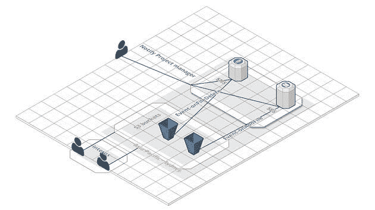
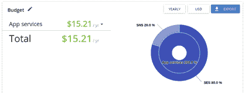
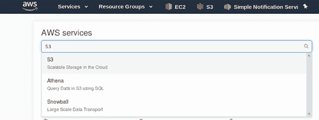
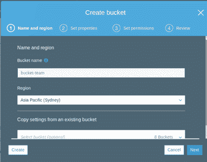
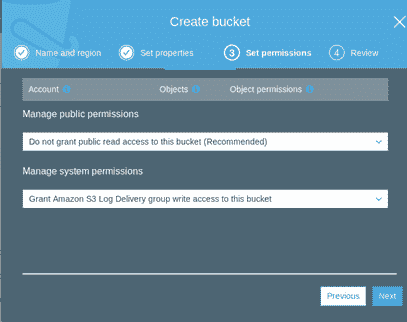
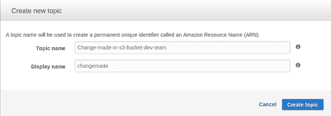
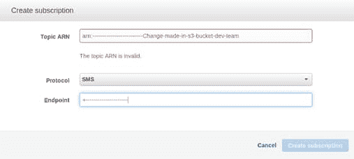
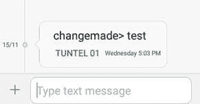
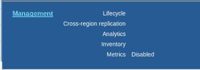
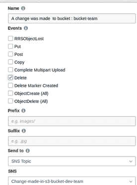

# AWS:通过事件和 SNS 监控 S3

> 原文：<https://dev.to/hbibzdeploy/aws--monitoring-s3-with-events-and-sns-c44>

[T2】](https://res.cloudinary.com/practicaldev/image/fetch/s--mWiQxYVb--/c_limit%2Cf_auto%2Cfl_progressive%2Cq_auto%2Cw_880/http://csharpcorner.mindcrackerinc.netdna-cdn.com/article/monitoring-s3-with-events-and-simg/image001.png)

大家好！这是 Muhammad Habib Jawady 在一个新的 DevOps 实践教程。在我的第一篇 Amazon Web Services 教程中，我将向您展示如何利用 S3 事件特性和简单的通知服务来监控对某些资产采取的操作。

这将是一个没有先决技能的实践指南，即使需要拥有允许使用 S3 和产品升级和技术支持服务的 AWS 帐户。在深入细节之前，让我们先了解一下 AWS 及其优势，以及我们将要使用的服务。

**AWS 简介**

亚马逊网络服务是 Amazon.com 公司在 2006 年提供的一个可扩展的云计算平台。由于其相对低廉的价格和多个领域服务的多样性(例如存储、物联网、计算...)和详细的文档，被认为是 Azure 的重要竞争对手。在本指南中，您将了解使用的基本知识:

*   简单通知服务(SNS 短信)
*   简单存储服务(S3)

**客户需求**

不可否认，实践是学习的关键。因此，我精心制作了一个客户需求的场景，在本文中，我们将满足他的蓝图想法，并尽量不超过他为此目的的年度专用预算:

一个项目经理雇佣了实习生，并分配到两个 S3 桶中记录项目的进展，一个与记录开发团队的贡献有关，另一个用于记录拉动请求。然而，他似乎对存储在桶中的信息不够信任。他要求您准备一份蓝图，允许在第一个存储桶中发送任何文件下载的短信通知，在第二个存储桶中发送任何文件删除的电子邮件通知。你的预算不能超过 20 美元/年！

你打算怎么处理这件事？

1.  *蓝图准备*你需要做的第一件事就是准备一份整洁清晰的蓝图。成功蓝图的关键肯定取决于你对 Amazon 基本概念的理解，比如可用性区域。显然，如果事先不了解所使用的服务以及对事件做出自动响应的方式，也无法实现这一点…

[T2】](https://res.cloudinary.com/practicaldev/image/fetch/s--uXZdVpQa--/c_limit%2Cf_auto%2Cfl_progressive%2Cq_auto%2Cw_880/http://csharpcorner.mindcrackerinc.netdna-cdn.com/article/monitoring-s3-with-events-and-simg/image002.png)

我会推荐使用 [CloudCraft](https://cloudcraft.co/) 作为一个工具来帮助你制作一个可靠的 BP。在下一步中，我会涵盖你所需要的关于所使用的服务的所有知识，但是现在你的蓝图应该是这样的:

[T2】](https://res.cloudinary.com/practicaldev/image/fetch/s--hihk3ub2--/c_limit%2Cf_auto%2Cfl_progressive%2Cq_auto%2Cw_880/http://csharpcorner.mindcrackerinc.netdna-cdn.com/article/monitoring-s3-with-events-and-simg/image003.jpg)

大约 16 美元/年的费用。

[T2】](https://res.cloudinary.com/practicaldev/image/fetch/s--CjnzWtrb--/c_limit%2Cf_auto%2Cfl_progressive%2Cq_auto%2Cw_880/http://csharpcorner.mindcrackerinc.netdna-cdn.com/article/monitoring-s3-with-events-and-simg/image004.png)

现在有了完整的血压，我们可以开始了。

1.  _ 创建资源/实例……_
    *   *创建 S3 存储桶*简单存储服务(SNS)是一种存储静态文件的解决方案，旨在通过足够的权限随时随地保存和检索数据。S3 的一个实例被称为一个桶。它是一个目录，可以存储包含任意数量数据的子目录或文件，条件是它不受策略的[限制。我们将地区设置为亚太/悉尼(ap-southeast-2)，然后从控制台中选择 S3。](https://stackoverflow.com/questions/37617844/restricting-file-types-on-amazon-s3-bucket-with-a-policy)

[T2】](https://res.cloudinary.com/practicaldev/image/fetch/s--VMJmy4TZ--/c_limit%2Cf_auto%2Cfl_progressive%2Cq_auto%2Cw_880/http://csharpcorner.mindcrackerinc.netdna-cdn.com/article/monitoring-s3-with-events-and-simg/image005.png)

然后，我们将创建两个名为“bucket-team”和“pull-bucket”的桶

[T2】](https://res.cloudinary.com/practicaldev/image/fetch/s--LG6qWsx4--/c_limit%2Cf_auto%2Cfl_progressive%2Cq_auto%2Cw_880/http://csharpcorner.mindcrackerinc.netdna-cdn.com/article/monitoring-s3-with-events-and-simg/image006.png)

在“设置权限”中，我们将选择“管理公共权限”中的建议，并“授予亚马逊 S3 日志交付组对此存储桶的写访问权限”。

[T2】](https://res.cloudinary.com/practicaldev/image/fetch/s--ASKI0q3c--/c_limit%2Cf_auto%2Cfl_progressive%2Cq_auto%2Cw_880/http://csharpcorner.mindcrackerinc.netdna-cdn.com/article/monitoring-s3-with-events-and-simg/image007.png)

```
- _Creation of SNS topics: _ Simple Notification Service (SNS) is a fully managed pub/sub messaging service which allows sending [SMS](https://en.wikipedia.org/wiki/SMS) notifications to single/multiple targets. A 'topic' is a subject you create in order to group subscriptions and push messages to multiple recipients. 'Subscriptions' is from where you group targets and signs them up for a topic. From your AWS console (region is also Sydney), choose SNS. 
```

Enter fullscreen mode Exit fullscreen mode

[T2】](https://res.cloudinary.com/practicaldev/image/fetch/s--fyGYh-8O--/c_limit%2Cf_auto%2Cfl_progressive%2Cq_auto%2Cw_880/http://csharpcorner.mindcrackerinc.netdna-cdn.com/article/monitoring-s3-with-events-and-simg/image009.png)

然后，我们将创建一个主题，

[T2】](https://res.cloudinary.com/practicaldev/image/fetch/s--lf_msgyc--/c_limit%2Cf_auto%2Cfl_progressive%2Cq_auto%2Cw_880/http://csharpcorner.mindcrackerinc.netdna-cdn.com/article/monitoring-s3-with-events-and-simg/image010.png)

然后，在复制 ARN 后，在订阅中添加项目经理编号。

[T2】](https://res.cloudinary.com/practicaldev/image/fetch/s--LsBGUZvU--/c_limit%2Cf_auto%2Cfl_progressive%2Cq_auto%2Cw_880/http://csharpcorner.mindcrackerinc.netdna-cdn.com/article/monitoring-s3-with-events-and-simg/image011.jpg)

为了测试订阅/主题创建是否成功，您可以访问主题页面并向主题发布一条测试消息，

[T2】](https://res.cloudinary.com/practicaldev/image/fetch/s--yT7Bur1C--/c_limit%2Cf_auto%2Cfl_progressive%2Cq_auto%2Cw_880/http://csharpcorner.mindcrackerinc.netdna-cdn.com/article/monitoring-s3-with-events-and-simg/image012.png)

_ Note _ 在本教程中，我将使用一个单独的铲斗。第二种是同样的方法，将协议改为电子邮件而不是短信。

1.  *事件的创建*为了创建事件，我将返回到属性>事件下我的 S3 存储桶>{存储桶名称管理}:选择“添加通知”

[T2】](https://res.cloudinary.com/practicaldev/image/fetch/s--8t46hOeY--/c_limit%2Cf_auto%2Cfl_progressive%2Cq_auto%2Cw_880/http://csharpcorner.mindcrackerinc.netdna-cdn.com/article/monitoring-s3-with-events-and-simg/image014.png)

选择将触发您的通知的事件类型和有意义的名称。

[T2】](https://res.cloudinary.com/practicaldev/image/fetch/s--S4NjN8Zn--/c_limit%2Cf_auto%2Cfl_progressive%2Cq_auto%2Cw_880/http://csharpcorner.mindcrackerinc.netdna-cdn.com/article/monitoring-s3-with-events-and-simg/image015.png)

现在，点击“删除”,项目经理将自动收到一条包含活动详情的短信。

**结论**

在这个实际操作的场景教程中，我们学习了如何创建 S3 桶事件，以便使用 SNS 服务触发通知，并管理 SNS 主题和订阅。