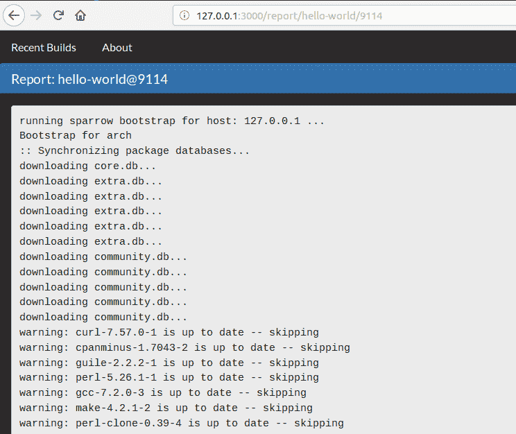

# 使用 Sparrowdo、Sparky 和 Docker 在 5 分钟内备份您自己的配置项

> 原文：<https://dev.to/melezhik/backing-your-own-ci-in-5-minutes-by-using-sparrowdo-sparky-and-docker-3ap>

我经常需要的是在不同的环境下测试我的代码。在这篇小博文中，我将展示如何通过使用 [Sparrowdo](https://github.com/melezhik/sparrowdo) 和 [Sparky](https://github.com/melezhik/sparky) 来构建托管解决方案，以在运行 Docker 容器中测试你的源代码。

写在 [Perl6](https://perl6.org/) 上的命令式部署场景、漂亮的 web UI 和异步任务执行是你将免费得到的！

# Part1 /旋转起一个 docker 容器

这一步很简单，因为我们提取所需的 docker 图像并将其作为容器运行:

```
$ git pull docker pull base/archlinux
$ docker run -itd base/archlinux sh 
```

Enter fullscreen mode Exit fullscreen mode

正如我们可能猜到的，我想在 Arch Linux 服务器上测试我的代码。如果您需要针对不同的环境进行测试，也可以应用相同的模式，只需更改 docker 映像。

# 第二部分/这是我的代码

比方说，我把我的源代码保存在 GitHub 仓库的某个地方-[https://GitHub . com/mele zhik/hello-world/blob/master/hello . Bash](https://github.com/melezhik/hello-world/blob/master/hello.bash)-例如，它就像“hello world”Bash 脚本一样简单:

```
#!bash
echo "Hello World!" 
```

Enter fullscreen mode Exit fullscreen mode

当然，现实生活中应用要复杂得多，但是这并不限制我们的方法。

# 第三部分/部署场景

我将使用 [Sparrowdo](https://github.com/melezhik/sparrowdo) 来部署一个应用程序代码，因为代码非常简单，所以这应该像从 GitHub 获取源代码并运行“主”脚本一样简单:

```
#!perl6
git-scm "https://github.com/melezhik/hello-world.git";
bash "bash ./hello.bash"; 
```

Enter fullscreen mode Exit fullscreen mode

# 第四部分/火花项目

让我们创建一个 [Sparky](https://github.com/melezhik/sparky) 项目，在正在运行的 docker 容器上部署上述 Sparrowdo 场景。火花轮廓`sparky.yaml`将是:

```
 crontab: "*/10  *  *  *  *"
sparrowdo:
  docker: elastic_sinoussi
  no_sudo: true 
```

Enter fullscreen mode Exit fullscreen mode

这里，我们要求 Sparky 每 10 分钟在名为`elastic_sinoussi`的 docker 容器上运行一次我们的部署场景(容器的名称可以由命令`docker ps`给出)。

所以我们 Sparky 项目的最终结构将是:

```
$ tree hello-world/
hello-world/
├── sparky.yaml
└── sparrowfile 
```

Enter fullscreen mode Exit fullscreen mode

其中`sparrowfile`文件包含一个 Sparrow 部署场景，而`sparky.yaml`包含一个 Sparky 设置(比如调度器参数、docker 实例名等等)。

# Part5 / Sparky Web UI

Sparky 需要一段时间来构建一个项目，同时我们可以通过访问漂亮的 Sparky web UI 来观察项目的构建，下面是几个屏幕截图:

*   最近构建页面: [](https://res.cloudinary.com/practicaldev/image/fetch/s--lJ7H8qEY--/c_limit%2Cf_auto%2Cfl_progressive%2Cq_auto%2Cw_880/https://raw.githubusercontent.com/melezhik/stuff/master/sparky1.png)

*   和某个建筑细节:

[T2】](https://res.cloudinary.com/practicaldev/image/fetch/s--Bm2Xkq1W--/c_limit%2Cf_auto%2Cfl_progressive%2Cq_auto%2Cw_880/https://raw.githubusercontent.com/melezhik/stuff/master/sparky2.png)

最后，我们可能会注意到项目成功构建:

```
running sparrow tasks on 127.0.0.1 ... 
target OS is - archlinux
push [task] fetch from git source: https://github.com/melezhik ... OK
push [task] run bash: bash ./hello.bash ... OK
SPL file /opt/sparky-sparrowdo/hello-world/sparrow.list is empty
get index updates from SparrowHub ... OK
set up task box file - /home/melezhik/.sparrowdo//opt/sparky-sparrowdo/hello-world/task-box.json - OK
public@bash is uptodate (0.1.7)
running task box from /opt/sparky-sparrowdo/hello-world/sparrow-cache/task-box.json ... 
2017-12-04 14:13:34 : [task] fetch from git source: https://github.com/melezhik ... [path] modules/bash-command/ [params] envvars:
2017-12-04 14:13:35 : [task] run bash: bash ./hello.bash ... [path] modules/bash-command/ [params] envvars: 
```

Enter fullscreen mode Exit fullscreen mode

# 结论

Sparky 是一个基于 Sparrowdo 框架的轻量级 CI 服务器。只需几分钟，就可以在各种环境下进行集成测试，并与 Docker 容器或 ssh 访问的主机一起顺利工作。