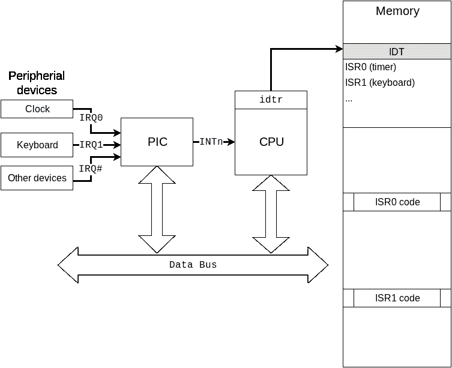
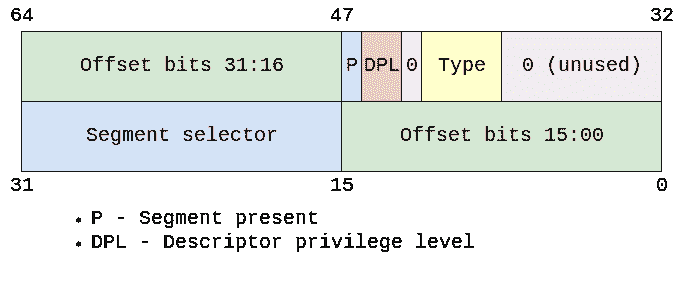
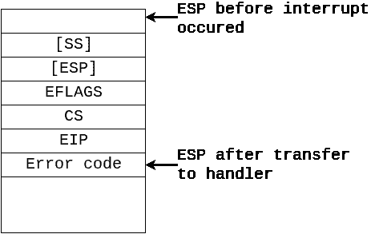

# 基本 x86 中断

> 原文：<https://dev.to/dzeban/basic-x86-interrupts-4f1c>

从我关于多引导内核的文章中，我们看到了如何加载一个简单的内核，打印文本和永久停止。然而，为了使它可用，我需要键盘输入，我输入的东西会打印在屏幕上。

工作比您最初想象的要多，因为它需要初始化 x86 中断:这是 40 年来遗留下来的古怪而棘手的 x86 例程。

## x86 中断

中断是从设备到 CPU 的事件，表示设备有事情要告诉，如用户在键盘上的输入或网络数据包到达。在没有中断的情况下，你应该轮询所有的外围设备，这样会浪费 CPU 时间，引入延迟，并且是一个可怕的人。

中断有 3 种来源或类型:

1.  硬件中断——来自硬件设备，如键盘或网卡。
2.  软件中断-由软件`int`指令产生。在引入`SYSENTER/SYSEXIT`之前，系统调用是通过软件中断`int $0x80`实现的。
3.  异常——由 CPU 自身生成，以响应一些错误，如“被零除”或“页面错误”。

x86 中断系统是三部分的，它包括三个部分共同工作:

1.  **可编程中断控制器(PIC)** 必须配置为接收来自设备的中断请求(IRQ)并将它们发送给 CPU。
2.  CPU 必须配置为从 PIC 接收 IRQ，并通过**中断描述符表(IDT)** 中描述的门调用正确的中断处理程序。
3.  操作系统内核必须提供**中断服务例程(ISR)**来处理中断，并准备好被中断抢占。它还必须配置 PIC 和 CPU 来启用中断。

这是参考数字，通读这篇文章时核对一下

[T2】](https://res.cloudinary.com/practicaldev/image/fetch/s--RCGZ2smu--/c_limit%2Cf_auto%2Cfl_progressive%2Cq_auto%2Cw_880/https://alex.dzyoba.com/img/interrupts.png)

在继续配置中断之前，我们必须像在之前[所做的那样设置 GDT。](https://dev.to/blog/os-segmentation/)

## 可编程中断控制器(PIC)

PIC 是连接各种外围设备而不是 CPU 的硬件。本质上作为一个多路复用器/代理，它节省了 CPU 引脚并提供了几个很好的特性:

*   通过 PIC 链接提供更多中断线(2 张图片提供 15 条中断线)
*   屏蔽特定中断行而不是所有中断行的能力(`cli`)
*   中断排队，即命令中断传送到 CPU。当某个中断被禁用时，PIC 会将其排队等待以后发送，而不是丢弃。

最初 IBM 个人电脑有独立的 8259 PIC 芯片。后来，它被整合为南桥/ICH/PCH 的一部分。现代 PC 系统拥有 APIC(高级可编程中断控制器),可以解决多核/处理器机器的中断路由问题。但是为了向后兼容，APIC 模仿好 ol' 8259 PIC。因此，如果你不是在一个古老的硬件上，你实际上有一个由你或 BIOS 以某种方式配置的 APIC。在这篇文章中，我将依靠 BIOS 配置，不会配置 PIC，原因有二。首先，这是一大堆奇怪的事情，理智的人不可能搞清楚，其次，稍后我们将为 SMP 配置 APIC 模式。BIOS 将把 APIC 配置为 IBM PC 中的机器，即 2 张 15 行的图片。

除了用于在 CPU 中产生中断的线路，PIC 还连接到 CPU 数据总线。该总线用于从 PIC 向 CPU 发送 IRQ 号，以及从 CPU 向 PIC 发送配置命令。配置命令包括 PIC 初始化(同样，现在不会这么做)，IRQ 屏蔽，中断结束(EOI)命令等等。

## 中断描述符表(IDT)

中断描述符表(IDT)是一个 x86 系统表，保存中断服务例程(ISR)或简单的中断处理程序的描述符。

在实模式下，有一个 IVT(中断向量表),它由固定地址`0x0`定位，包含 CS 和 IP 寄存器值形式的“中断处理程序指针”。这是非常不灵活的，并且依赖于分段内存管理，自 80286 以来，有一个保护模式的 IDT。

IDT 是内存中的表，由加载了`lidt`指令的`idtr`系统寄存器指向的 OS 创建和填充。您只能在保护模式下使用 IDT。IDT 条目包含门描述符——不仅有 32 位形式的中断处理程序(ISR)的地址，还有标志和保护级别。IDT 条目是描述中断门的描述符，因此在这个意义上，它类似于 GDT 及其段描述符。看看他们:

[T2】](https://res.cloudinary.com/practicaldev/image/fetch/s--zMv2RU-X--/c_limit%2Cf_auto%2Cfl_progressive%2Cq_auto%2Cw_880/https://alex.dzyoba.com/img/idt-descriptor.png)

描述符的主要部分是 offset——本质上是一个指针，指向由段选择器选择的代码段内的 ISR。后者由 GDT 表中的索引、表指示符(GDT 或 LDT)和请求特权级别(RPL)组成。对于中断门，选择器总是用于 GDT 的内核代码段，也就是说，第一个 GDT 条目(每个都是 8 字节)是 0x08，RPL 是 0，GDT 是 0。

类型指定门类型-任务、陷阱或中断。对于中断处理程序，我们将使用中断门，因为对于中断门，与陷阱门相反，CPU 将清除 IF 标志，而与任务门相反，不会使用 TSS(我们还没有任务门)。

所以基本上，你只需要用描述符填充 IDT，描述符只有偏移量不同，这里你放 ISR 函数的地址。

## 中断服务程序(ISR)

IDT 的主要目的是存储指向 ISR 的指针，这些指针将在收到中断时由 CPU 自动调用。这里重要的一点是，您不能控制中断处理程序的调用。一旦你配置了 IDT 并启用了中断(`sti`)，在幕后工作之后，CPU 将最终把控制权交给你的处理程序。了解“幕后工作”很重要。

如果一个中断发生在用户空间(实际上是在一个不同的特权级别)，CPU 执行以下操作:

1.  暂时(内部)保存 SS、ESP、EFLAGS、CS 和 EIP 寄存器的当前内容。
2.  将段选择器和新堆栈的堆栈指针(即被调用的特权级别的堆栈)从 TSS 加载到 SS 和 ESP 寄存器，并切换到新堆栈。
3.  将临时保存的被中断过程堆栈的 SS、ESP、EFLAGS、CS 和 EIP 值推送到新堆栈上。
4.  将错误代码推送到新堆栈上(如果适用)。
5.  将新代码段的段选择器和新指令指针(来自中断门或陷阱门)分别加载到 CS 和 EIP 寄存器。
6.  如果调用是通过中断门进行的，则清除 EFLAGS 寄存器中的 If 标志。
7.  以新的特权级别开始执行处理程序过程。

如果中断发生在内核空间，CPU 不会切换堆栈，这意味着在内核空间中断没有自己的堆栈，而是使用被中断过程的堆栈。在 x64 上，由于红色区域，它可能会导致堆栈损坏，这就是为什么内核代码必须用`-mno-red-zone`编译。我有一个关于这个 T2 的有趣故事。

当内核模式发生中断时，CPU 将:

1.  将 EFLAGS、CS 和 EIP 寄存器的当前内容(按此顺序)压入堆栈。
2.  将一个错误代码(如果合适的话)压入堆栈。
3.  将新代码段的段选择器和新指令指针(来自中断门或陷阱门)分别加载到 CS 和 EIP 寄存器。
4.  如果调用是通过中断门进行的，则清除 EFLAGS 中的 IF 标志。
5.  开始执行处理程序。

请注意，这两种情况的不同之处在于压入堆栈的内容。EFLAGS、CS 和 EIP 总是被推送，而用户空间模式下的中断将另外推送旧的 SS 和 ESP。

这意味着当中断处理程序开始时，它有以下堆栈:

[T2】](https://res.cloudinary.com/practicaldev/image/fetch/s--yjuITu0k--/c_limit%2Cf_auto%2Cfl_progressive%2Cq_auto%2Cw_880/https://alex.dzyoba.com/img/isr-stack.png)

现在，当控制权传递给中断处理程序时，它应该做什么？

记住，中断发生在用户空间甚至内核空间中的一些代码中间，所以首先要做的是在进行中断处理之前保存被中断过程的状态。过程状态由其寄存器定义，有一个特殊的指令`pusha`将通用寄存器保存到堆栈中。

接下来的事情是通过段寄存器的方式完全切换中断处理程序的环境。CPU 自动切换 CS，所以中断处理程序必须重载 4 个数据段寄存器 DS、FS、es 和 GS。不要忘记保存并在以后恢复以前的值。

在状态保存和环境准备就绪后，中断处理程序应该完成它的工作，但首先也是最重要的是通过向 PIC 发送特殊的 EOI 命令来确认中断。

最后，在完成所有工作后，应该有一个干净的中断返回，这将恢复中断程序的状态(恢复数据段寄存器，`popa`)，启用在进入 ISR(CPU 工作的倒数第二步)之前被 CPU 禁用的中断(`sti`)，并调用`iret`。

下面是基本的 ISR 算法:

1.  保存中断程序的状态
2.  保存以前的数据段
3.  用内核数据描述符重新加载数据段寄存器
4.  通过向 PIC 发送 EOI 来确认中断
5.  做工作
6.  恢复数据段
7.  恢复中断程序的状态
8.  启用中断
9.  用`iret`退出中断处理程序

## 把所有的东西放在一起

现在，让我们来看看键盘按压是如何处理的，以完成这张图片:

1.  设置中断:
    1.  创建 IDT 表
    2.  设置 IDT 条目#9，中断门指向键盘 ISR
    3.  用`lidt`加载 IDT 地址
    4.  向 PIC1 发送中断屏蔽`0xfd` ( `11111101`)以解除屏蔽(使能)IRQ1
    5.  使用`sti`启用中断
2.  人类点击键盘按钮
3.  键盘控制器提高图 1 中的中断线路 IRQ1
4.  PIC 检查该行是否未被屏蔽(没有屏蔽),并向 CPU 发送中断号 9
5.  CPU 通过检查是否在 EFLAGS 中(不是)来检查中断是否被禁用
6.  (假设目前我们正在内核模式下执行)
7.  将 EFLAGS、CS 和 EIP 压入堆栈
8.  将 PIC 中的错误代码(如果合适的话)压入堆栈
9.  查看由`idtr`指向的 IDT，并从 IDT 描述符 9 中获取段选择器。
10.  检查特权级别，并将段选择器和 ISR 地址加载到 CS:EIP 中
11.  清除 IF 标志，因为 IDT 条目是中断门
12.  将控制权交给 ISR
13.  在 ISR 中接收中断:
    1.  用`cli`禁用中断(以防万一)
    2.  用`pusha`保存中断的程序状态
    3.  将当前 DS 值压入堆栈
    4.  从内核数据段重新加载 DS、ES、FS、GS
14.  通过向主 PIC (I/O 端口`0x20`)发送 EOI ( `0x20`)来确认中断
15.  从键盘控制器(I/O 端口`0x64`)读取键盘状态
16.  如果状态为 1，则从键盘控制器(I/O 端口`0x60`)读取键码
17.  最后，通过 VGA 缓冲区打印 char 或将其发送到 TTY
18.  从中断返回:
    1.  从堆栈弹出并恢复 DS
    2.  用`popa`恢复中断的程序状态
    3.  使用`sti`启用中断
    4.  `iret`

请注意，这种情况会在您每次按键盘键时发生。不要忘记，有几十个其他中断，如时钟、网络数据包等，它们被无缝处理，而您甚至不会注意到这一点。你能想象你的硬件有多快吗？你能想象你的操作系统写得有多好吗？现在想想，给 OS 写手和硬件设计师一个好赞。