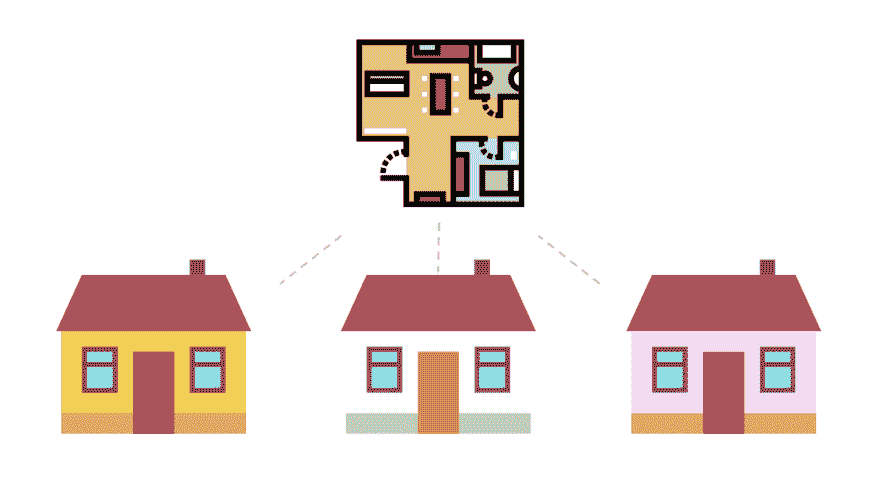
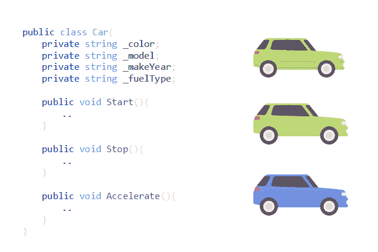
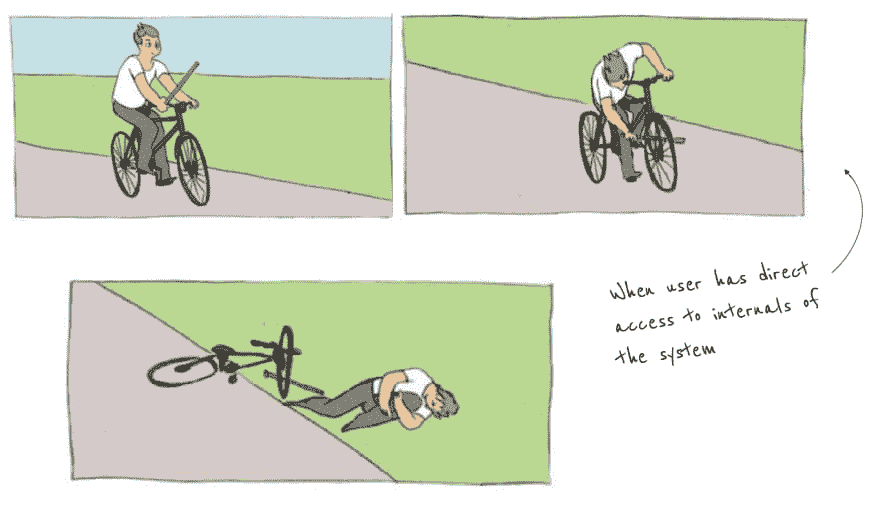
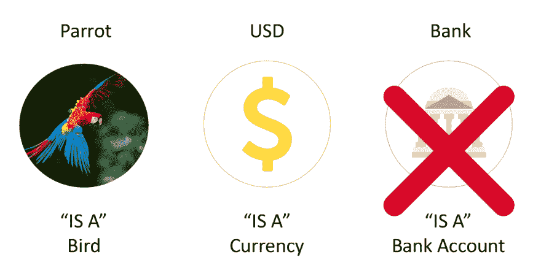
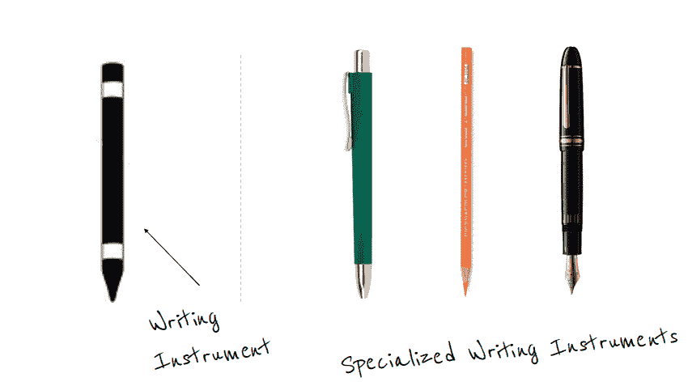
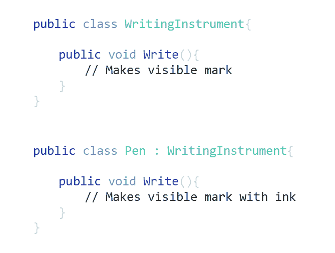
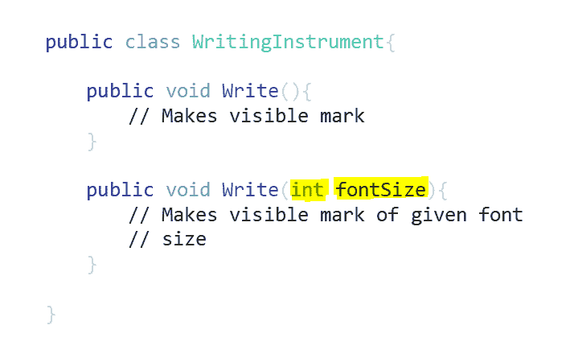

# 初学者指南-面向对象编程

> 原文：<https://dev.to/charanrajgolla/beginners-guide---object-oriented-programming>

复杂的现实生活需求需要被模型化成计算机能够理解的指令。我们有一些范例，如过程编程、面向对象编程、函数编程等。这有助于将业务需求建模到计算机程序中。我们将学习一种叫做面向对象编程的范例。OOP 是一种哲学，是语言中立的。

我们将着眼于作为面向对象编程支柱的四个概念。

*   抽象
*   包装
*   遗产
*   多态性

[跳过视频继续阅读文章](#concepts)

[https://www.youtube.com/embed/C4IoECB-grU](https://www.youtube.com/embed/C4IoECB-grU)

## 什么是面向对象编程？

像 COBOL 和 C 这样的老编程语言遵循过程化编程方法。使用这些语言编写的程序曾经是一系列逐步的指令。他们利用程序/子程序使程序模块化。这种编程范式更关注逻辑而不是数据，以及用于将两者结合在一起的程序。

像 Java、C#等现代编程语言。遵循面向对象的方法。在面向对象编程中，数据比仅仅编写指令来完成任务更重要。对象是你想在你的程序中建模的东西或想法。对象可以是任何东西，例如，雇员、银行账户、汽车等。

## 类，对象..那是什么？

为了开始面向对象编程，我们必须知道什么是类和对象，以及它们之间的区别。类是创建对象的蓝图。它类似于房屋的蓝图。
 
一个类定义了*属性和行为*。如果我们要在我们的应用程序中建模一辆汽车，那么我们可以定义汽车的属性，如型号、燃料、品牌和行为，如启动、刹车、加速等..如果您注意到了，我们指定的属性和行为并不仅仅针对一种汽车型号。我们试图通过说明我们在程序中要建模的汽车将具有这些数量的属性和行为来概括汽车。可能还有其他属性，但是我们对业务需求的范围和兴趣仅限于这些属性。这有助于我们创建汽车的蓝图，稍后当我们使用这个类创建对象时，我们创建具有特定细节的汽车对象。  
例如，使用同一个类“Car ”,我们可以创建不同的对象，这些对象具有不同的型号、燃料类型和制造年份，同时具有相同的共同行为。

| 

&#124; 对象 1 &#124;
&#124; 车型 &#124; 大众 Polo &#124;
&#124; 燃料 &#124; 汽油 &#124;
&#124; 制造 &#124; 2017 &#124;
&#124; 启动()
中断()
加速() &#124;

 | 

&#124; 对象 2 &#124;
&#124; 车型 &#124; 大众 Vento &#124;
&#124; 燃油 &#124; 柴油 &#124;
&#124; 制造 &#124; 2017 &#124;
&#124; 启动()
中断()
加速() &#124;

 |

通过这种方式，面向对象编程允许您轻松地对真实世界的复杂系统行为进行建模。使用 OOP，数据和函数(属性和方法)在对象中捆绑在一起。这使得 OOP 不再需要任何共享或全局数据，这是面向对象和过程化方法之间的核心区别。

## 抽象

抽象让你专注于对象做什么，而不是它是如何完成的。抽象背后的思想是在高层次上理解一件事情。抽象有助于构建独立的模块，这些模块可以通过某种方式相互交互。独立模块也便于维护。

> 抽象是指在不详述后台实现或内部工作细节的情况下表示基本特性。

我们试图有选择地只关注那些对我们重要的事情，或者在编程的情况下，关注我们的模块。修改一个独立模块不会影响其他模块。一个人需要知道的唯一知识就是模块给了你什么。使用该模块的人不需要担心任务是如何完成的，或者后台到底发生了什么。

抽象无处不在。我们日常使用的物品都有不同层次的抽象概念。一个例子是在你的汽车或自行车上使用刹车。制动系统是抽象的，你有一个桨来停止你的车辆。对加速系统进行更改不会影响制动系统，它们是独立的。你也不必担心刹车的内部工作，你只需要踩下刹车踏板，不管是盘式刹车还是鼓式刹车，车辆都会停下来。

## 封装

第二个概念封装与抽象密切相关。封装就是将一个解决方案暴露给一个问题，而不需要消费者完全理解问题域。封装是将数据和行为绑定在一个单元中。这阻止了客户或模块的用户了解实现抽象行为的内部视图。
 不直接存取数据。它是通过公开的函数访问的。隐藏对象的内部可以防止用户将组件的内部数据设置为无效或不一致的状态，从而保护其完整性。

> 封装不仅仅是隐藏复杂性，而是以一种防故障的方式暴露复杂性。

## 继承

继承是面向对象编程语言的一个强大特性。继承有助于将类组织成层次结构，并使这些类能够从层次结构中的上面的类继承属性和行为。
继承描述的是一种关系。这是我们在现实世界中的谈话方式。举例。鹦鹉是一种鸟。美元是一种货币。但是“银行是银行账户”这句话是不正确的。当你试图在给定的业务/问题陈述中描述某个实体时，这种关系是显而易见的。
 
通过继承，你可以定义一个通用的实现/行为，以后对于专门化的类，你可以修改或改变它使之专门化。
继承不向后工作。父类没有派生类的属性。

> 继承是代码重用的一种机制，有助于减少代码的重复。

不要强行继承。你只是在编写不必要的代码。重要的是要注意，当试图对需求建模时，不要增加多层次的继承。这个不需要。您需要尝试识别您所建模的实体中的公共属性和行为，并在此基础上，您可以继续重构代码以定义合适的父类。然后可以将通用实现移到这个类中。

## 多态性

多态性的概念是，一个可执行单元可以有许多不同的实现，差异都发生在幕后，而调用者不知道。多形态——允许计算机系统通过创建新的专用对象进行扩展，同时允许系统的当前部分与新对象进行交互，而无需考虑新对象的特定属性。
 
例如，如果你需要在一张纸上写一条信息，你可以用钢笔、铅笔、记号笔甚至蜡笔。你只需要你用的东西能放在你的手里，并且当压在纸上时能做一个标记。所以书写的动作会帮助你在纸上做一个标记，使用什么标记或书写工具是一个决定的问题。另一个例子是飞机和航天飞机都可以被称为飞行物体。但是两者的飞行方式是不同的，也就是说，在实现上是不同的。但是从观察者的角度来看，这两个物体都可以飞行。

继承是实现多态性的一种方式，在这种方式下，可以通过编写方法的自定义实现来重写继承类中定义的行为。这被称为方法覆盖，也称为运行时多态性。
 
还有一种多态形式叫做方法重载，它不涉及继承。方法名称相同，但方法中的参数不同。
[T8】](https://res.cloudinary.com/practicaldev/image/fetch/s--Iu8bItt6--/c_limit%2Cf_auto%2Cfl_progressive%2Cq_auto%2Cw_880/https://thepracticaldev.s3.amazonaws.com/i/cr5eig6ibhfhgnebepdx.png)

需要帮助理解任何技术主题吗？使用以下链接发送您的请求，我将尝试为它制作一个帖子/视频。
【http://bit.ly/RequestCourse】T2

参考资料:

*   https://stackoverflow.com/questions/16014290/simple-way-to-understand-encapsulation-and-abstraction
*   http://www.adobe.com/devnet/actionscript/learning/oop-concepts/polymorphism-and-interfaces.html
*   https://stackoverflow.com/questions/3322318/explain-polymorphism?rq=1

致谢:
图标来自[http://www.freepik.com/](http://www.freepik.com/)