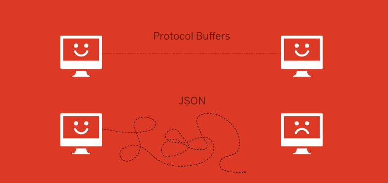

# Go 中 gRPC+Protobuf 与 JSON+HTTP 的基准比较

> 原文：<https://dev.to/plutov/benchmarking-grpc-and-rest-in-go-565>

[T2】](https://res.cloudinary.com/practicaldev/image/fetch/s--RLniHHvh--/c_limit%2Cf_auto%2Cfl_progressive%2Cq_auto%2Cw_880/http://pliutau.com/grpc-json.png)

服务间通信的最简单的可能解决方案是在 HTTP 上使用 JSON。尽管 JSON 有许多明显的优点——它可读性强，容易理解，并且通常执行得很好——但它也有自己的问题。就内部服务而言，结构化格式，如 Google 的协议缓冲区，是比 JSON 更好的数据编码选择。

gRPC 默认使用 protobuf，因为它是二进制的并且是类型安全的，所以速度更快。我编写了一个[演示项目](https://github.com/plutov/benchmark-grpc-protobuf-vs-http-json),使用 JSON over HTTP 对经典 REST API 进行基准测试，而不是使用 Go 对 gRPC 中的相同 API 进行基准测试。

这个库包含两个相同的 API:使用 Protobuf 的 gRPC 和基于 HTTP 的 JSON。目标是运行两种方法的基准并比较它们。API 有 1 个端点来创建用户，包含请求的验证。请求、验证和响应在 2 个包中是相同的，所以我们只对机制本身进行基准测试。基准测试还包括响应解析。

我使用 Go 1.9，结果显示 gRPC 比我的 API
的快 **10 倍**

```
BenchmarkGRPCProtobuf-8        10000        197919 ns/op
BenchmarkJSONHTTP-8             1000       1720124 ns/op 
```

Enter fullscreen mode Exit fullscreen mode

### CPU 使用率对比

重启应用程序，然后在 30 秒内使用分析工具`pprof`,此时客户端使用以下命令与服务器对话:

```
go tool pprof http://localhost:6060/debug/pprof/profile
go tool pprof http://localhost:6061/debug/pprof/profile 
```

Enter fullscreen mode Exit fullscreen mode

运行测试以获取客户端连接。然后在每个`pprof`中运行`top`来查看 CPU 的使用情况。
我的结果显示 Protobuf 消耗的资源更少，**减少 30%**。

### 自己测试一下

如果您想自己测试它，您可以克隆这个[库](https://github.com/plutov/benchmark-grpc-protobuf-vs-http-json)并运行以下命令:

```
glide i
go run grpc/main.go
go run json/main.go
go test -bench=. 
```

Enter fullscreen mode Exit fullscreen mode

### 结论

很明显，对于仅限内部的通信来说，使用 gRPC 更好，您的客户端调用会更干净，您不必处理类型和序列化，因为 gRPC 为您做了这些。

[我博客中的原帖](http://pliutau.com/benchmark-grpc-protobuf-vs-http-json/)