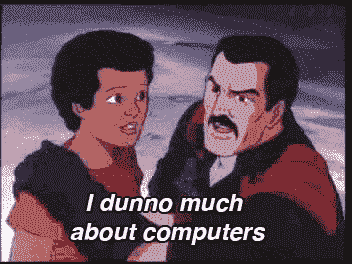
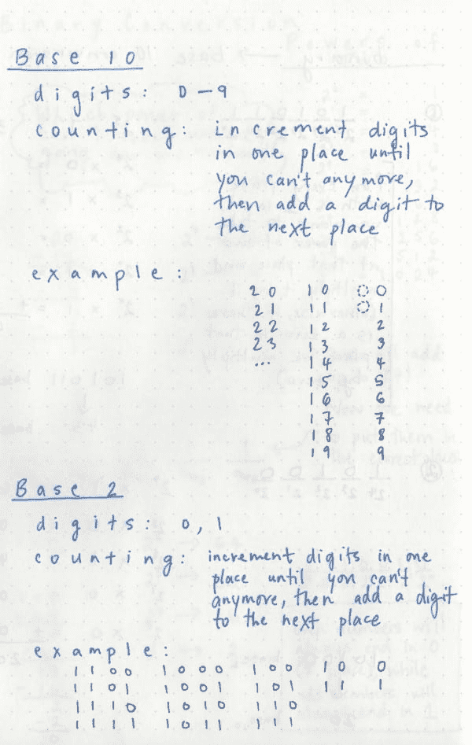
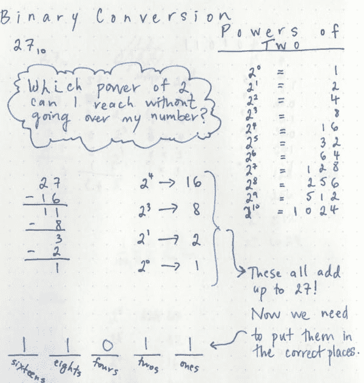
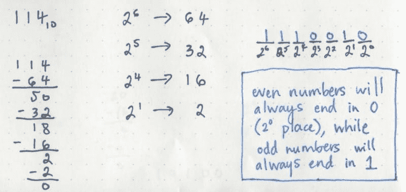
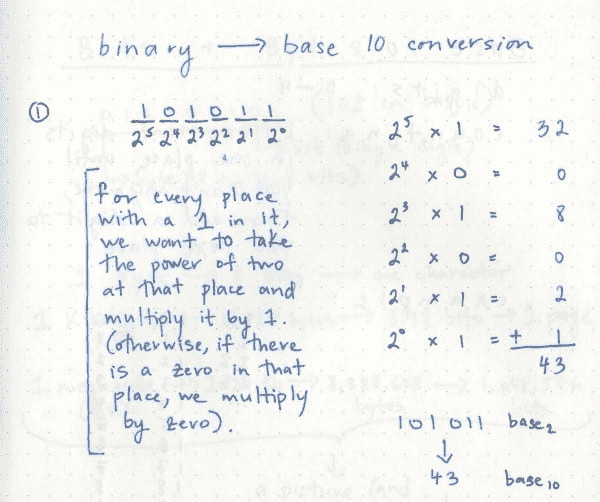
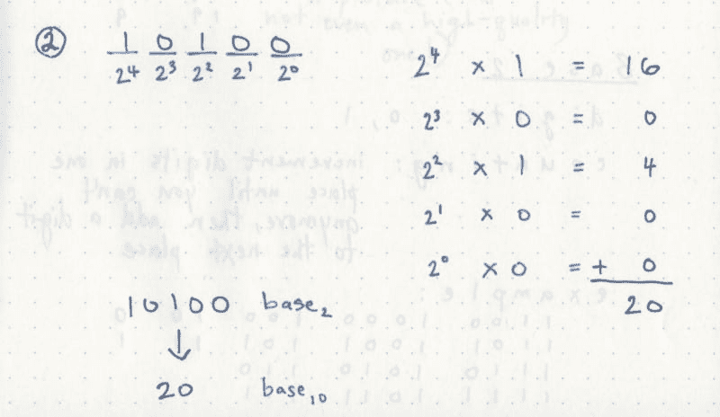
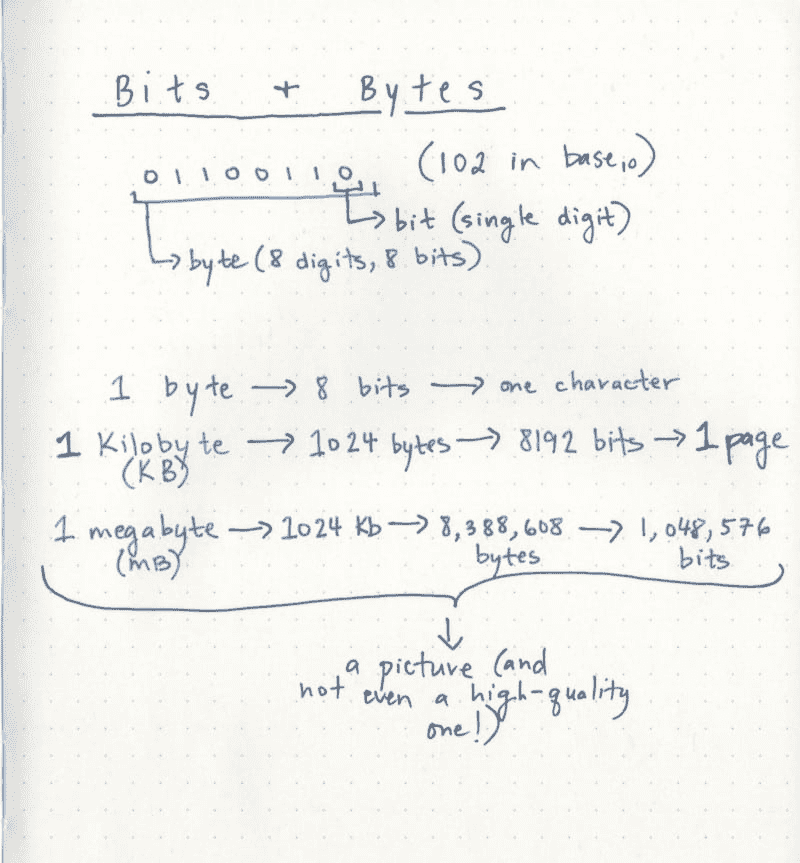
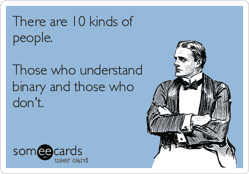

# 位，字节，用二进制构建

> 原文：<https://dev.to/vaidehijoshi/bits-bytes-building-with-binary>

如果你用电脑工作(或者即使你不用！)，很有可能你已经听人们说过计算机只是“一堆 1 和 0”。这是我进入软件行业之前所知道的关于计算机的少数几件事情之一:*全是 1 和 0*。直到我学会了编码并开始专业编程后，我才意识到那真正意味着什么。是的，计算机靠 1 和 0 运行。肯定比那个复杂一点，但也没复杂到我们看不懂！

让我们先给我们的问题起个名字。计算机是由那些 1 和 0 组成的？这些都是基于一种叫做二进制的数字系统。二进制数字系统基于一个简单的想法，即你可以只用两位数来计数，而不是像我们在幼儿园学的那样用 10 位数来计数。今天计算机中使用的二进制数字系统是戈特弗里德·威廉·莱布尼茨在 1679 年发明的，但是这种计数方式在 T2 有着更悠久的历史，可以追溯到古埃及。

好的，那么，如果二进制只有两位数，你如何计算超过…两位？

### 二进制计数

[T2】](https://res.cloudinary.com/practicaldev/image/fetch/s--V0HRuZdz--/c_limit%2Cf_auto%2Cfl_progressive%2Cq_66%2Cw_880/https://cdn-images-1.medium.com/max/800/1%2Aroy6kFtM0p6CmJFR4bFrOg.gif)

在我们现代的计数系统中，每个位置有十个可能的数字。这就是为什么我们有时会听到人们称我们的计数系统为*基数 10*；它的另一个名字是*十进制*。在二进制数系统中，我们每一位都有*两个*可能的数字，所以我们可以称之为以*为基数 2* 计数(二进制有时缩写为 *bin* )。每一位可能的位数是我们以 2 为基数和以 10 为基数计数的唯一真正区别。

[T2】](https://res.cloudinary.com/practicaldev/image/fetch/s--RoE129GT--/c_limit%2Cf_auto%2Cfl_progressive%2Cq_auto%2Cw_880/https://cdn-images-1.medium.com/max/600/1%2Ax6IfVQZVS2ANcBsIfco_Ww.jpeg)

在左边的例子中，我们可以看到，我们开始计数的方式与以 10 为基数的方式相同。先用 0，再用 1。但是当我们数到 2 的时候，你怎么继续数下去呢？！

好吧，让我们想想我们用 10 进制做什么。当我们到达数字 9 时，我们做什么？我们重新设置单位，从数字 0 开始，并将十位数增加到数字 1。当我们遍历完 10-19 之间的所有可能性后，我们将单位位重置为 0，并将十位递增到数字 2。我们这样做，直到达到 90–99 之间的数字，然后我们添加另一个位置:百位。

同样的逻辑也适用于二进制计数。从 0 和 1 开始。为了表示数字 2，我们将第一位重置为 0，并在左侧添加另一个数字:10。然后我们再次递增第一位:11。如果我们继续这样做，我们会看到二进制的前 10 个数字是这样的:

`0
1
10
11
100
101
110
111
1000
1001
1010
1011
1100
1101
1110
1111`

*(Pssst——每位数字可能的排列/组合数量有一个模式！但是如果你还没有看到，不要担心。后面应该会变得稍微明显一点)。*

### 用二进制书写

我们知道计算机是以二进制运行的。然而我们没有一个人在键盘上输入二进制！这将使我们相信，不知何故，我们输入到机器中的东西会被转换(编译)成二进制。这是通过几个抽象层发生的，我们不会一一介绍。

虽然了解所有层并不重要，但我确实认为稍微了解一下转换是如何工作的是有价值的。我们将保持它的简单性，并专注于将基数为 10 的数字(整数)转换为二进制。

还记得在小学的时候，我们都必须学习乘法表吗？然后还记得在中学时我们开始学习指数并意识到那些乘法表是多么有用吗？好吧，准备好再次认识到这一点吧！在过去的一周里，我一直在练习二进制和二进制之间的转换，我已经意识到学习二进制时你能做的最重要的事情就是温习你的二进制幂。(但是万一你需要一点帮助，我在下面的例子中包含了 2 的幂。)

#### 转换成二进制

让我们来看几个例子。首先，让我们尝试将数字 27(以 10 为基数)转换为二进制(以 2 为基数)。

我们要做的是把这个数分解成 2 的幂。所以我们可以问自己:*在不超过我要转换的数的情况下，我可以达到 2 的哪个幂？*

一旦我们找到那个数字，我们就想从我们的总量中减去它，然后重复这个过程，直到我们剩下零。需要记住的一件重要事情(我似乎总是忘记):2 的 0 次方总是等于 1！

这在一个例子中可能更有意义:

[T2】](https://res.cloudinary.com/practicaldev/image/fetch/s--m-TVxfXx--/c_limit%2Cf_auto%2Cfl_progressive%2Cq_auto%2Cw_880/https://cdn-images-1.medium.com/max/600/1%2AJr-TFbkkpSnfWiUNvAEh1g.jpeg)

一旦我们把数字分解成 2 的幂，我们需要把它们放到正确的位置。以 10 为基数，我们有*个单位*、*十个*、*百个*、*千个*等等。在二进制中，我们我们的位置来自——你猜对了——2 的幂。我们的位置将是:一，二，四，八，十六；换句话说，2 的 0 次方，2 的 1 次方，2 的 2 次方，以此类推。

我们可以看到，我们的值为 16，值为 8，值为 2，值为 1。这正是我们如何知道这些数字属于哪个地方！我们希望在这些位置中的每一个位置放置一个 1，并且任何在我们的数字分解中没有值的位置/2 的幂将得到一个 0。因为我们的数字 27 中没有任何东西可以分解成 2 的幂(也就是说，在我们的数字分解中没有任何 4)，我们将在那个地方放一个零。

就是这样！数字 27 可以从十进制转换成二进制，如: **11011。**

好吧，再举一个例子。这次让我们大一点——数字 114。

我们不经过*超过*所能得到的 2 的最高次方是 64，或者 2 的 6 次方(2 的 7 次方是 128，这太大了，因为它超过了我们的数字！).我们立即知道，我们将在“64”的位置上有一个 1，或者“2 的 6 次方”。

让我们继续把数字 114 分解成 2 的幂:

[T2】](https://res.cloudinary.com/practicaldev/image/fetch/s--tOaU_sL5--/c_limit%2Cf_auto%2Cfl_progressive%2Cq_auto%2Cw_880/https://cdn-images-1.medium.com/max/800/1%2A502cf-gX4g88uW_T-BPncg.jpeg)

好吧，我们最后得到了 64 分，32 分，16 分和 2 分。一旦我们将 1 放入适当的位置设置，我们最终得到这个数字:

**1110010**

就是这样！相当于 114 的二进制数！

如果我们做了足够多的二进制转换，我们会开始注意到十进制的偶数在转换成二进制时总是以 0 结尾。相反，以十为基数的奇数在写成二进制时总是以 1 结尾。还记得我之前提到的规则吗？ ***2 的 0 次方永远等于 1*！**

这就是发挥作用规则。偶数能被 2 整除，这意味着当你把一个数分解成 2 的幂时，你永远不会有 1 的余数。

#### 转换出二进制

一旦你知道如何用二进制数书写，从二进制数中解读数字就容易多了。当我们从十进制转换成二进制时，我们把东西分解成 2 的幂，对吗？但是我们*真正*做的是 ***除以两个*** *的幂。*

基于这个逻辑，如果我们想把二进制的*转换成基数为 10 的*，我们将做与相反的事情。也就是说:我们将*乘以 2 的幂*。

让我们来看看那会是什么样子；我们将把 **101011** 转换为基数 10:

[T2】](https://res.cloudinary.com/practicaldev/image/fetch/s--vH7wYNBq--/c_limit%2Cf_auto%2Cfl_progressive%2Cq_auto%2Cw_880/https://cdn-images-1.medium.com/max/600/1%2A5NRzL6gEg6EKOOCVC4Yrfg.jpeg)

首先，我们将看看每个地方都有什么，并记住这个地方与 2 的哪个幂相关联。我们可以从左到右开始:我们看到在 32 的位置上有一个 1(2 的 5 次方)，这意味着我们知道这个数的 10 进制版本可以分解(读作:除以)为 32。

我们会把它写在旁边，然后继续前进。在 2 的 4 次方的位置上有一个零(我们也可以称之为 16 的位置)，所以我们不是用 1 乘以 is，而是用 0 乘以它。

当从二进制转换出来时，一个很好的经验法则是:*如果一个地方有一个 1，将这个地方的 2 的幂乘以 1(然后继续这样做，直到你遍历完所有的地方！).*

最终，我们得到最后一位数字，最终得到这些数字:32、8、2 和 1(这与 2 的 5 次方、2 的 3 次方、2 的 1 次方、2 的 0 次方相同)。所有这些数字加起来就是 101011 的十进制转换:数字 **43** 。

再举一个简单的例子——这次，让我们尝试一个更小的数字。下面是我们如何将 **10100** 转换为基数 10:

[T2】](https://res.cloudinary.com/practicaldev/image/fetch/s--XSlOB1rV--/c_limit%2Cf_auto%2Cfl_progressive%2Cq_auto%2Cw_880/https://cdn-images-1.medium.com/max/800/1%2AyFoOo0rYz1luZX41uJ4nNw.jpeg)

希望这个更容易理解一点！我们甚至可以在脑子里算出来(取决于我们对 2 的幂的了解程度)。我们知道，我们要对 2 的 4 次幂和 2 的 2 次幂求和。

嗯，通过 know，我们可以很快地算出来:2 的 4 次方是 16，而 2 的 2 次方是 4。16 + 4 是多少？20.

现在你知道了！10100 与基数 10 中的 **20** 相同。很简单！

### 计算机如何读取二进制？

好了，算够了。这跟电脑有什么关系？

在它的核心，计算机是由开关组成的。我们已经知道计算机解释二进制。但是我们可能没有意识到的是，今天构成计算机的开关和电路实际上是二进制的表示。

一台计算机有数十亿个(超级微小的)数字电路，这些电路极其简单。它们由开关组成。一个开关只能有两种状态:**开**或**关**。另一种思考方式是**真**或**假**。我们可以用另一种方式来表示开/关二进制:1 和 0。

> 二进制是计算机用来表示开和关的计数系统。**开是 1** ，**关是 0** 。

更酷的是，计算机中的一切(和计算机科学，在那！)在最基本的层面上是基于这种开/关范例的。小股电流通过或不通过取决于某些东西是打开还是关闭。

[T2】](https://res.cloudinary.com/practicaldev/image/fetch/s--C7f4Tk3Y--/c_limit%2Cf_auto%2Cfl_progressive%2Cq_66%2Cw_880/https://cdn-images-1.medium.com/max/800/1%2ANBq0oc9C1QNI11o9E-HZyw.gif)

那么，计算机是如何解释复杂的事物(比如这篇博文)并将其分解成 1 和 0 的呢？它使用不同的测量单位，这些单位都可以转换成二进制。

二进制中的一位数称为 ***bi*** *二进制 digi* ***t*** 。但是，你可能知道它是一个**位。_ * *因为我们知道二进制是以 2 为基数的，并且一个数字只能是 0 或 1，所以我们还可以推导出* *位**只能由 *0 或 1* 组成。

这意味着我们的计算机必须通过构建二进制数来做所有事情，这意味着只使用 0 和 1 并将它们串在一起。这似乎有点疯狂！但是它可以在其他比特的基础上构建比特。这正是它所做的。它将 8 位(8 位数)串成一个**字节** *。_ 我们可能已经听说过“byte through around”这个术语，或者可能在堆栈溢出中见过它。一个**字节**在计算机解释二进制的方式中如此常见，以至于它被认为是计算机内存的一个单位*。

我认为字节特别有趣，因为一个字节可以代表 [256 种不同的组合](http://cs.stackexchange.com/questions/19568/how-can-one-byte-hold-256-possibilities)。(*还记得 2 的幂吗？2 的 8 次方是 256。*)如果你有两个字节呢？两个字节代表 16 位(二进制数字)，也就是说你可以代表 65536 种不同的组合(2 的 16 次方)！这是一大堆不同的排列，你可以用两个字节来表示！如果你考虑一个单电路(通常称为*晶体管*)处理一个数字的开/关开关，仅仅 16 个晶体管就可以处理和解释一吨的信息！

比特是字节的组成部分，非常基础，值得理解。它们很重要，因为不同的计算机一次可以处理不同数量的比特。例如，一台 8 位机器一次分解和处理 8 位。一台 16 位的机器会分解并一次处理 16 位。一次处理的位数被称为一个计算机字，所以我们可以把*位*看作“组成一个计算机字的字母”。现在大多数计算机的字长是 32 或 64 位。现在你知道这意味着什么:你的机器一次处理 32 或 64 位。换句话说，您的计算机处理 32 或 64 位数的二进制字符串！

这些计算机内存单元就是人们通常所说的“一切都只是 1 和 0”。因为，真的，它是。

让我们以一个单词的单个字符为例。该字符需要 8 位(或 1 字节)来表示。那么，更长的呢？一页大约 1000 字长的文本呢？那将需要更多的字节！

[T2】](https://res.cloudinary.com/practicaldev/image/fetch/s--69NWMIfp--/c_limit%2Cf_auto%2Cfl_progressive%2Cq_auto%2Cw_880/https://cdn-images-1.medium.com/max/800/1%2AAh7p9-M1U3eit-cyptrKAg.jpeg)

也许我一直盯着太多的 1 和 0，但似乎一旦你开始思考比特的规模以及它们串在一起、构造和使用的方式…嗯，一切都开始看起来像二进制！

### 二的力量

如今，很少有程序员会考虑二进制。在内心深处，我们知道这很重要，值得去了解，但它看起来是如此的强大，似乎没有必要去思考。

但是如果你回想一下计算机曾经占据整个房间的时候(想象一下当时的电路和晶体管有多大！)而从那以后他们进步了多少，改变了多少，就相当让人瞠目结舌了。

其核心是二进制语言，这是一种每台计算机都能使用和理解的语言。因此，如果你对计算机感兴趣或从事计算机工作，二进制的基础知识是值得了解一点的。毕竟，尽管只是两个数字，但最终，我们周围的世界就是用这个数字书写的。

[T2】](https://res.cloudinary.com/practicaldev/image/fetch/s--1BwL4ZVT--/c_limit%2Cf_auto%2Cfl_progressive%2Cq_auto%2Cw_880/https://cdn-images-1.medium.com/max/800/1%2Ar5OQCTTT0CfPkqnjZ7Aa8A.png)

如果你现在开始做梦，先道歉！

#### 资源

如果你觉得这篇文章有趣，看看下面的资源。我发现这些对学习二进制非常有帮助，所以也许你也会喜欢！快乐学习。

1.  波士顿大学二进制编程课程简介
2.  [关于二进制转换的数学课](https://www.khanacademy.org/math/algebra-home/alg-intro-to-algebra/algebra-alternate-number-bases/v/large-number-decimal-to-binary)，可汗学院
3.  [两个](http://www.vaughns-1-pagers.com/computer/powers-of-2.htm)的幂，沃恩·奥布雄
4.  [第 256 章](http://256stuff.com/256.html)的故事，格雷·沃森

*本文原载于我的[媒体刊物](https://medium.com/basecs/bits-bytes-building-with-binary-13cb4289aafa#.rdmakpev8)*