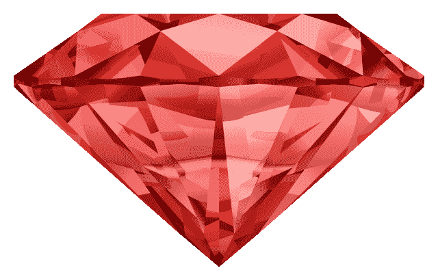

# Ruby 中的冒泡排序

> 原文：<https://dev.to/wilsontov/bubble-sort-in-ruby>

[T2】](https://res.cloudinary.com/practicaldev/image/fetch/s--uZiuzD7g--/c_limit%2Cf_auto%2Cfl_progressive%2Cq_auto%2Cw_880/https://cdn-images-1.medium.com/max/800/1%2Am7BLDQIGM7QZNJLJWk-PoA.png)

*原创发布:[Seis algorithmos en Ruby](https://medium.com/@kinduff/seis-algoritmos-fundamentales-en-ruby-520bbef8a6f3)-[@ Kinduff](https://medium.com/@kinduff)*

这是最基本的收藏整理方式。它对每个值进行迭代，并与下一个值进行比较，它们在必要时进行交换，迭代不断重复，直到所有的值都不可交换。

```
def sort(values)
  length = values.size - 2
  swapped = true

  while swapped
    swapped = false

    0.upto(length) do |i|
      if values[i] > values[i+1]
        values[i], values[i+1] = values[i+1], values[i]
        swapped = true
      end
    end
  end

  return values
end

sort([7, 4, 5, 2, 9, 1])

# =>
# 7, 4, 5, 2, 9, 1
# 4, 5, 2, 7, 1, 9
# 4, 2, 5, 1, 7, 9
# 2, 4, 1, 5, 7, 9
# 2, 1, 4, 5, 7, 9
# 1, 2, 4, 5, 7, 9 
```

Enter fullscreen mode Exit fullscreen mode

### ；)

[https://www.youtube.com/embed/lyZQPjUT5B4](https://www.youtube.com/embed/lyZQPjUT5B4)