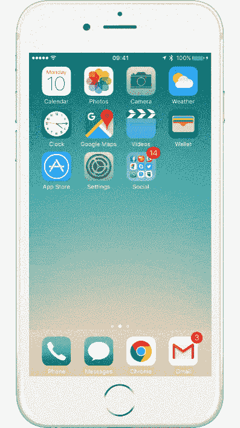
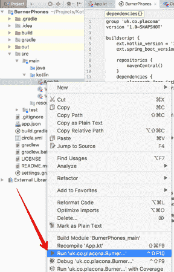
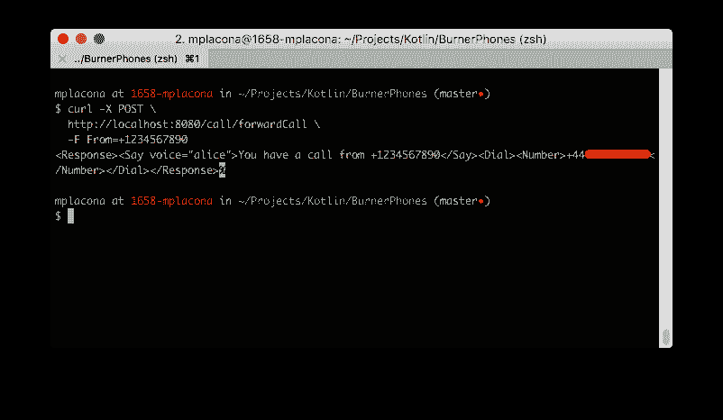
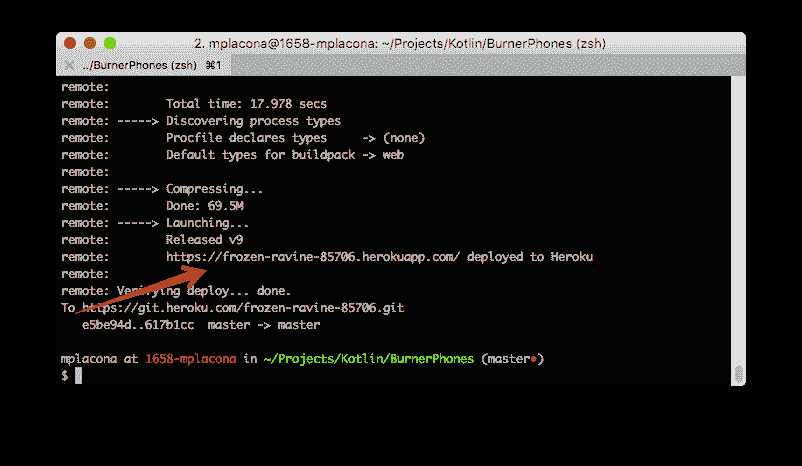
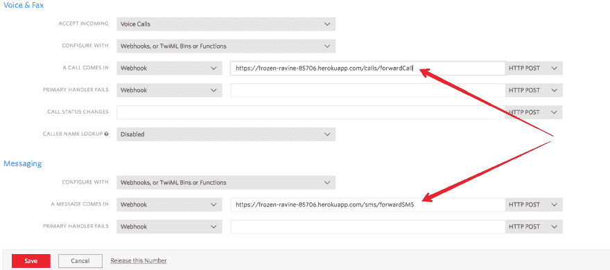
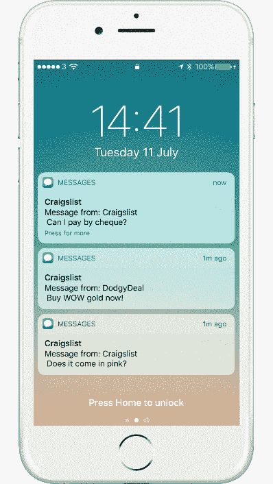

# 用 Kotlin 打造全功能一次性手机

> 原文：<https://dev.to/mplacona/building-a-fully-featured-burner-phone-with-kotlin>

你走进你最喜欢的咖啡店，今天他们问你是否想注册一张会员卡。他们只需要你的名字和电话号码。

回来的路上，你停下来去买杂货，收银员问你是否愿意参加抽奖。他们只需要你的名字和电话号码。

终于到了把你多年不用的割草机放在 Craigslist 上的时候了，但在广告的最后，它要求你输入你的电话号码，以便买家可以直接联系你。

[T2】](https://res.cloudinary.com/practicaldev/image/fetch/s--SM5vncWP--/c_limit%2Cf_auto%2Cfl_progressive%2Cq_auto%2Cw_880/https://www.twilio.com/blog/wp-content/uploads/2017/07/tAczNU_xh6czYFKDxwC2smcRLRUQwjL6IehMlfIZw1wSgDz0Zw-UU-gZ83CtTFQJNVBePv0zHyG5ykkYZMleGb6zQ0597kI1AsJurCTwHsiQtFyoYiWH1yzIq8WJVvbI9rRLauFt.png)

## 你需要一部一次性手机！

让我们看看如何使用 Kotlin 和 Twilio 来构建和部署一次性手机应用程序，以便在这些情况下使用多个电话号码。如果你只是想下载代码，你可以看看[这个 repo](https://github.com/mplacona/BurnerPhones) 或者使用下面的按钮把它部署到 Heroku。

[T2】](https://heroku.com/deploy?template=https://github.com/mplacona/BurnerPhones/tree/master)

## 我们的工具

*   我将使用 IntelliJ IDEA 的代码，但只要它能很好地与 Gradle 一起工作，你可以随意使用你喜欢的 IDE。
*   一个或多个 Twilio 电话号码，用于创建各种一次性电话。你可以在这里得到它们。

## 项目

让我们首先在 IntelliJ 中创建新的 Gradle 项目，并添加 Kotlin (Java)作为库。

我已经在第一部分[中描述了用 Kotlin](https://www.twilio.com/blog/2017/05/send-and-receive-sms-messages-with-kotlin.html) 收发短信的整个过程。你可以跟着它[这里](https://www.twilio.com/blog/2017/05/send-and-receive-sms-messages-with-kotlin.html#kotlin-get-started)。或者，您可以像下面这样克隆存储库。

```
git clone git@github.com:mplacona/BurnerPhones.git
cd BurnerPhones
git checkout starter-application 
```

在 IntelliJ 上打开项目，右键单击`App.kt`并选择“Run”。

[T2】](https://res.cloudinary.com/practicaldev/image/fetch/s--7LR-uLgU--/c_limit%2Cf_auto%2Cfl_progressive%2Cq_auto%2Cw_880/https://www.twilio.com/blog/wp-content/uploads/2017/07/s1zKnoqIiSRnbhRZeD8XMv0draOzy3uZ4H5xyIplW7ycTzzHodnSB86ODBWbPDk36u8ZwKTLPMdWJb_bew_ZPPgOWMHlrXK3oNvmlEGFTskKSaxfYAAJAD_34IugyViAF8RRZzPS.png)

在你的浏览器中进入[http://localhost:8080/SMS/](http://localhost:8080/sms/)，你会看到默认的控制器显示出来。
让我们更改`App.kt`中的一个配置，这样应用程序就知道将 SMS 消息和呼叫转发到哪里。在`main`函数中添加以下内容:

```
fun main(args: Array<String>) {
    System.setProperty("MY_NUMBER", System.getenv("MY_NUMBER"))
    SpringApplication.run(App::class.java, *args)
} 
```

我在电脑上把我的电话号码设置为一个环境变量。我的同事张秀坤写了一篇很好的文章，解释了[如何在 Mac、Windows 和 Linux 上设置环境变量](https://www.twilio.com/blog/2017/01/how-to-set-environment-variables.html)。

一旦您为自己的环境正确设置了“MY_NUMBER”变量和您自己的电话号码，我们就可以开始构建应用程序了。

## 转发短信

我们仍然希望收到发送到一次性手机的每条短信，但我们希望它们被重定向到我们自己的号码。这样做的好处是，如果我们厌倦了收到某个号码发来的垃圾邮件，我们可以在 Twilio 控制台上丢弃那个号码，然后一劳永逸。

打开`SMSController.kt`并在已经存在的映射下创建一个名为`forwardSMS`的新映射。

```
import com.twilio.twiml.Body
import com.twilio.twiml.Message
import com.twilio.twiml.MessagingResponse
import org.springframework.web.bind.annotation.RequestMapping
import org.springframework.web.bind.annotation.RequestParam
import org.springframework.web.bind.annotation.RestController

@RequestMapping("/sms")
@RestController class SMSController {
    @RequestMapping(value = "/")
    fun helloSpringBoot() = "A nice looking sms controller"

    @RequestMapping(value = "/forwardSMS", produces = arrayOf("text/xml"))
    fun forwardSMS(@RequestParam(value = "From") from: String, @RequestParam(value = "Body") body: String): String{
        val message = Message.Builder()
                .to(System.getProperty("MY_NUMBER"))
                .body(Body("Message from: $from \n $body")).build()
        return MessagingResponse.Builder().message(message).build().toXml()
    }
} 
```

这个新的映射将告诉 Twilio 将任何入站短信转发到我们自己的号码。它会转发消息，所以我们仍然知道最初是谁的号码发送的。

知道谁发送了消息是很有用的，这样您就可以在需要时做出响应，或者在映射的顶部添加一个条件来阻止来自该特定发件人的任何消息。

重启应用程序，并通过用 [cURL](https://curl.haxx.se/) 向其发送`POST`请求进行测试，例如:

```
curl -X POST 
  http://localhost:8080/sms/forwardSMS 
  -F From=+1234567890 
  -F 'Body=Checking my TwiML works' 
```

结果应该是告诉 Twilio 转发消息的 [TwiML](https://www.twilio.com/docs/api/twiml) 。

在我们配置 Twilio 号码之前，让我们将呼叫转移添加到我们的应用程序中。

## 转移来电

为了转移呼叫，我们将使用与上面相同的原理，但是将在不同的控制器中使用，以保持整洁。如果您克隆了 starter 应用程序，那么您应该已经拥有了那个控制器。

创建一个名为`CallController.kt`的新 Kotlin 控制器，如果你还没有的话。

在那个控制器中添加高亮显示的代码，或者如果你还有一个空的控制器，就复制所有的代码。

```
import com.twilio.twiml.*
import com.twilio.twiml.Number
import org.springframework.web.bind.annotation.RequestMapping
import org.springframework.web.bind.annotation.RequestParam
import org.springframework.web.bind.annotation.RestController

@RequestMapping("/call")
@RestController class CallController {
    @RequestMapping(value = "/")
    fun helloSpringBoot() = "A nice looking call controller"

    @RequestMapping(value = "/forwardCall", produces = arrayOf("text/xml"))
    fun forwardCall(@RequestParam(value = "From") from: String): String{
        val call = Dial.Builder().number(Number.Builder(System.getProperty("MY_NUMBER")).build()).build()
        return VoiceResponse.Builder()
                .dial(call).say(Say.Builder("You have a call from $from").voice(Say.Voice.ALICE).build())
                .build().toXml()
    }
} 
```

就像以前一样，当呼叫被转移时，我们添加关于呼叫者的信息。因此，当您接到这个 Twilio 号码的来电时，您会听到一条消息，告诉您来电的号码。

您还可以通过向它发出 POST 请求并检查返回的 [TwiML](https://www.twilio.com/docs/api/twiml) 看起来是否正确来测试它是否正常工作。

[T2】](https://res.cloudinary.com/practicaldev/image/fetch/s--n9DdKbNW--/c_limit%2Cf_auto%2Cfl_progressive%2Cq_auto%2Cw_880/https://www.twilio.com/blog/wp-content/uploads/2017/07/9mv1RiAvhqGQ18XbZ9mTqU9EXnkx46MGg3kxZ9G8rnHblvAW7KKS9rhu_b7jyHzF4BLaow63BXeV9GZoJSOrgieiwnCynkQYjbyk0QrtVlkR62rNwNzeeQETNJZIb-bjKe5gZnds.png)

在我们配置 Twilio numbers 以使用应用程序之前，我们需要将其部署到某个地方。让我们看看如何用 [Heroku](https://www.heroku.com/) 做到这一点。

## 将 Kotlin 应用程序部署到 Heroku

如果你还没有在 Heroku 上创建帐户。一旦你有了一个账号并安装了 [heroku toolbelt](https://devcenter.heroku.com/articles/heroku-cli) ，去你的终端并从那里登录。

```
heroku login
Enter your Heroku credentials.
Email: me@example.com
Password: 
```

仍然在终端创建一个新的 Heroku 应用程序。

```
heroku create 
```

如果您没有从头开始创建这个应用程序，而是克隆了`starter-application`存储库，那么您现在需要将它合并到 master 中，如下所示:

```
git commit -am "complete tutorial"
git checkout master
git merge starter-application 
```

如果你是从零开始创建这个项目，你可以跳过上面的步骤，只要确保你是主人，我们准备好把这个推给 Heroku。

```
git push heroku master 
```

这将需要几秒钟的时间，完成后，您应该会在终端上看到类似这样的消息。

[T2】](https://res.cloudinary.com/practicaldev/image/fetch/s--8uhF4bwX--/c_limit%2Cf_auto%2Cfl_progressive%2Cq_auto%2Cw_880/https://www.twilio.com/blog/wp-content/uploads/2017/07/NPbry1_yi4TU-__rUGzkTEWJj-tNodFdlopvlrnzKUfbll3fhvGJiG-l2966nyDb1-5ZTX9skrjQ4QFMUYzR_-kDjhdT-EnI9oD-73BbNC48S5S9yIEMYkmsTHbNFjrtJpkIt7uS.png)

复制此 URL，因为我们稍后将使用它来配置我们的 Twilio 号码。就像在我们的本地环境中一样，我们需要设置一个电话号码作为这个部署的环境变量。您可以通过在终端上运行以下命令来实现这一点:

```
heroku config:set MY_NUMBER=+441234567890 
```

确保使用您自己的电话号码作为`MY_NUMBER`的值。现在我们准备配置我们的燃烧器编号。

## 创建燃烧器编号

这个应用程序的美妙之处在于，因为我们没有在应用程序本身中硬编码任何东西，所以它可以用于我们想要的任意多的 Twilio 数。在我们的例子中，我们可以有一个号码用于会员卡，一个号码用于抽奖，一个号码用于网上销售。

前往 [Twilio 控制台](https://www.twilio.com/console/phone-numbers/incoming)获取尽可能多的号码，然后按如下方式配置并保存它们:

[T2】](https://res.cloudinary.com/practicaldev/image/fetch/s--mHC9NhCw--/c_limit%2Cf_auto%2Cfl_progressive%2Cq_auto%2Cw_880/https://www.twilio.com/blog/wp-content/uploads/2017/07/JiXCHuCdXGU4ZtcjAa3e1UuAT2f2AQB9ptBC8rCSpBTAPVqeZG2hNS51566XXhEerg7DffyKtw6MIlJlHwlTTiH7spCohyYRX000RbbM3WXuSYBAqIgkhX5HzwiNadr4vEPVlq5j.png)

确保您更改了应用程序 URL，以匹配您之前将应用程序部署到 Heroku 时复制的内容。现在就把那些号码而不是你自己的号码给别人，然后等待所有的信息和电话进来。

[T2】](https://res.cloudinary.com/practicaldev/image/fetch/s--75kysdpX--/c_limit%2Cf_auto%2Cfl_progressive%2Cq_auto%2Cw_880/https://www.twilio.com/blog/wp-content/uploads/2017/07/E54orG-nolK-BzTAftsdIFK9ESQh38608oRoZ-HOgNME99AH8sJddfljQMoOro6BNkUVGUuwalXGli0ub2zQCgXHK9GgvUzNNaJddpT-u-RGdRJehvBa62lljM65iEfw99OBn8C.png)

## 烧吧！

[T2】](https://res.cloudinary.com/practicaldev/image/fetch/s--8i15A2-l--/c_limit%2Cf_auto%2Cfl_progressive%2Cq_auto%2Cw_880/https://www.twilio.com/blog/wp-content/uploads/2017/07/yIc_arxv5GJCxXWGqLO_1ruyfD48xh8Yo00m0RDw_0NQYEOoahehBDEzf1B76dH2hMwppC_zmww86Mkcocz_0S4WuqD5Rfase6d1yhb68fuYVl9hUCuY8oYnrT_RBjbRnYZZ70MJ.png)

拥有一次性手机变得前所未有的简单，人们可以在不再需要的时候就把它们扔掉。我个人把我的每一个一次性号码都添加到了我的联系人列表中，这样当我接到电话或短信时，它们会很好地显示出来，我大概知道会发生什么。

这个应用程序的一个很好的补充是，在消息或电话转发给我们之前，添加一个阻止发件人的方法，或者为某些号码添加一个语音邮件系统，以确保我们不会错过任何电话。

我很想看看你给它增加了什么新功能。请在 twitter [@marcos_placona](https://twitter.com/marcos_placona?lang=en) 上联系我，或者在下面的评论中留言告诉我更多相关信息。

* * *

*[用科特林](https://www.twilio.com/blog/2017/07/building-a-fully-featured-burner-phone-with-kotlin.html)打造一款全功能一次性手机最初发表于 2017 年 7 月 12 日 [Twilio 博客](https://www.twilio.com/blog)。*