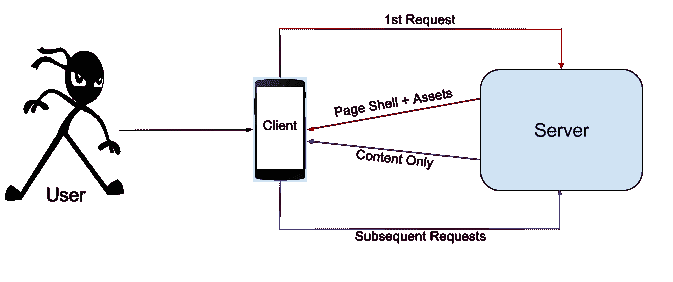

# 用普通 js 构建单页应用程序

> 原文：<https://dev.to/vinay20045/building-a-single-page-application-with-vanilla-js>

我经常遇到这个框架和那个框架的辩论。多次作为观察员，有时作为参与者，偶尔作为**咳** 发起辩论**咳** 的人。在这些争论中最常见的争论是围绕*相对简单的做事方式*或者*需要编写较少代码的*点。我没有看到人们谈论的是编写普通的 js 并更好地组织你的项目，而不是使用框架。让我感到震惊的是，许多开发人员除了他们喜欢的框架之外，什么都不知道，并且害怕编写普通的 js 代码。如果你决定以编码为生，你怎么可能不知道你所使用的插件的构建模块呢？？

过去很多好人都讨论过这个问题。我最喜欢的几本书是[零框架宣言](http://bitworking.org/news/2014/05/zero_framework_manifesto)和[看马，没有框架](http://codeofrob.com/entries/look-ma,-no-frameworks.html)。这些框架中的许多都有很好的营销方式，通过在他们的网站上或通过开发者的博客展示他们的顶级特性或使用的感知好处，然而，我没有看到多少人展示用 vanilla js 构建 SPA 的方式。因此，我决定在不使用任何框架的情况下，将我的个人网站重构为 SPA。我希望这篇文章能为你在不使用任何框架的情况下自己开发应用提供一个良好的开端。这里引用的所有代码都可以在 [vinay20045.github.io repo](https://github.com/vinay20045/vinay20045.github.io) 和[获得，这个网站](http://askvinay.com/)本身就是一个现场演示。

在重构之前，我的网站是一个典型的用 PHP 编写的博客。每一个页面请求都是为了所有的 html 内容和资源往返于服务器，它有一个管理控制台等等。在重构过程中，我的一些考虑是...

*   没有每个帖子的页面加载，即它应该是一个温泉
*   使用 markdown 语法编写的帖子。
*   博客应该只写在 HTML+CSS+JS
*   托管将在 github 页面或 AWS S3 完成
*   它必须是移动友好的

考虑到这些因素，博客的高级设计如下所示...

[T4】](https://res.cloudinary.com/practicaldev/image/fetch/s--7AO8ihbO--/c_limit%2Cf_auto%2Cfl_progressive%2Cq_auto%2Cw_880/https://askvinay.com/uploads/vanilla-js-spa-design.png)

基本结构
在开发任何应用程序时，你应该关注的一个主要问题是代码的组织。这包括从文件夹结构和命名约定到声明和定义的所有内容。我见过的许多开发人员争论 2 个换行符还是 1 个换行符，但是他们对视图或模板中的业务逻辑没有意见。无论如何，一旦你为一个项目这样做了，它就像一个样板文件，很容易在你未来的项目中复制和扩展。

博客应用程序的基本结构如下所示...

```
|-- assets
|   |-- css -- All site styles go here
|   |-- images -- All images used in the templates or page shell go here
|   `-- js
|       |-- config.js -- Environment specific config file
|       |-- init.js -- Contains all instructions on load
|       |-- controllers -- Business logic and view manipulation functions
|       |-- templates -- context based reusable snippets of HTML
|       |-- utils -- All internal and 3rd party libraries
|       `-- views -- Views exposed to the user
|-- index.html -- Page shell. Acts like a container. Actual content is populated based on route
|-- posts -- All posts markdown files go here
`-- uploads -- All assets used in posts go here 
```

Enter fullscreen mode Exit fullscreen mode

**路由**
为了促进深度链接、图书标记和更好的 SEO，适当的路由变得非常重要。许多技术可以用于路由，但是基于散列的路由工作得非常好，并且易于实现。在加载应用程序时，根据 hashchange 事件注册一个路由函数。

路由函数是 [utils 库](https://github.com/vinay20045/vinay20045.github.io/blob/master/assets/js/utils/utils.js)的一部分，如下所示...

```
router: function(route, data){
    route = route || location.hash.slice(1) || 'home';

    var temp = route.split('?');
    var route_split = temp.length;
    var function_to_invoke = temp[0] || false;

    if(route_split > 1){
        var params  = extract_params(temp[1]);
    }

    //fire away...
    if(function_to_invoke){
        views[function_to_invoke](data, params);
    }
} 
```

Enter fullscreen mode Exit fullscreen mode

`extract_params`功能看起来是这样的...

```
var extract_params = function(params_string){
    var params = {};
    var raw_params = params_string.split('&');

    var j = 0;
    for(var i = raw_params.length - 1; i >= 0; i--){
        var url_params = raw_params[i].split('=');
        if(url_params.length == 2){
            params[url_params[0]] = url_params[1];
        }
        else if(url_params.length == 1){
            params[j] = url_params[0];
            j += 1;
        }
        else{
            //param not readable. pass.
        }
    }

    return params;
}; 
```

Enter fullscreen mode Exit fullscreen mode

事件侦听器在 init.js 中注册...

```
window.addEventListener(
    "hashchange", 
    function(){utils.router()}  // the router is part of the utils library
); 
```

Enter fullscreen mode Exit fullscreen mode

**解剖控制员**
控制员掌握着业务逻辑。您可以使用这里的功能来操作您的视图。这些功能不会直接暴露给用户。他们只能访问模板和 utils 中可用的库。它们可以被视图或另一个控制器调用。

负责主页的控制器如下所示...

```
controllers.home_page = function(data, params){
    var all_posts = JSON.parse(data);

    var posts_to_show = 3;
    var template_context = [];
    for (var i = 0; i < posts_to_show; i++){
        var post = all_posts[i];
        var item = {
            'link': '#post?'+post.post,
            'title': post.post.replace(/-/g, '  '),
            'snippet': post.snippet,
            'published_on': post.added_on,
        };
        template_context.push(item);
    }

    //get recent posts
    var recent_posts = templates.recent_posts(template_context);

    //get hello text
    var hello_text = templates.hello_text();

    var final_content = hello_text + recent_posts;
    utils.render(
        'page-content',
        final_content
    );    
}; 
```

Enter fullscreen mode Exit fullscreen mode

**剖析模板**
模板保存实际页面内容的 HTML 标记。当您可以让函数根据传递的某些上下文生成您想要的 HTML 时，它有助于提高可重用性。模板的所有功能都必须由调用它的控制器通过使用数据绑定和事件注册技术来提供。我唯一允许的例外是 hrefs。

主页 hello 部分的模板是...

```
templates.hello_text = function(data){
    var content = `
        <div id="hello_text">
            <h2>Hello...</h2>
            
            <p>
                Thank you for visiting my blog. I am Vinay Kumar NP. I am a passionate techie...
            </p>
            <p>
                I am currently working on a <a href="http://www.int.ai/" target = "_BLANK">startup</a> of my own. I have previously worked in various engineering leadership positions at...
            </p>
        </div>
    `;

    return content;
}; 
```

Enter fullscreen mode Exit fullscreen mode

**剖析视图**
视图是直接暴露给用户的功能。即它们由路由器调用并且是 url 的一部分。视图功能和控制器之间没有其他区别。您也可以公开控制器，但是这可能会损害模块化。

所有帖子页面的视图如下所示。它只是在发出 ajax 调用以获取 posts 索引文件后，传递加载`show_posts`控制器的请求。

```
views.all_posts = function(data, params){
    var api_stub = 'posts/index.json';

    utils.request(
        api_stub,
        'show_all_posts',
        'show_all_posts_error'
    );
}; 
```

Enter fullscreen mode Exit fullscreen mode

**提出 API 请求**
这是任何 SPA 的圣杯(原文如此)。虽然我的博客不需要一种机制来进行外部 api 调用，因为我的所有帖子都托管在其中，但我写它是为了说明这个概念。请求方法接受 api 存根、回调函数、参数并发出请求。这也是 [utils 库](https://github.com/vinay20045/vinay20045.github.io/blob/master/assets/js/utils/utils.js)的一部分。(在这里请小心 CORS)。

进行 api 调用的函数如下所示...

```
request: function(api_stub, success_callback, error_callback, callback_params){
    api_stub = api_stub || '';
    callback_params = callback_params || {};

    controllers.show_loader('page-content');

    var url = config.api_server + api_stub;

    var x = new XMLHttpRequest();
    x.onreadystatechange = function(){
        if (x.readyState == XMLHttpRequest.DONE) {
            if(x.status == 200){
                controllers[success_callback](
                    x.responseText, 
                    callback_params
                );
            }
            else{
                controllers[error_callback](
                    x.status, 
                    callback_params
                );
            }
        }
    };
    //other methods can be implemented here
    x.open('GET', url, true);
    x.send();
} 
```

Enter fullscreen mode Exit fullscreen mode

我还没有机会做一个比较基准标记，但乍一看，我所有的重画都很快完成，很少或没有 jank。对于第一次加载时太多网络调用的问题，我计划为我的其他项目之一建立一个基于 python 的站点打包程序，一旦完成，我将发布它。

这就对了，不是很容易吗？？如果你仍然不相信，打开浏览器，克隆我的 [repo](https://github.com/vinay20045/vinay20045.github.io) ，进行必要的修改(配置、模板等。)而且玩的团团转。我非常肯定，你不仅会开始构建自己的 js 应用程序，而且是免费的框架；你也将为开源世界贡献更多的库...世界需要更多分享的人:)

我已经在所有现代浏览器上测试了代码(除了 IE ),它似乎没有任何故障。在构建自己的应用程序时，注意 JS api 的兼容性(例如，我使用了与旧浏览器不兼容的反勾号)。如果您发现代码有任何错误或问题，请告诉我。

*这篇文章最初发表在我的[博客](https://askvinay.com/post/building-a-single-page-application-with-vanilla-js-7-december-2015.html)T3 上*