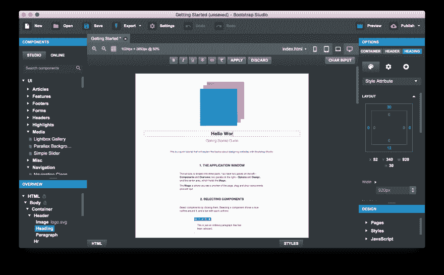

# 用 Bootstrap Studio 构建 React 组件

> 原文：<https://dev.to/thorstenhirsch/building-react-components-with-bootstrap-studio-a19>

你知道 [Bootstrap Studio](https://bootstrapstudio.io) 吗？这是一个图形化的 HTML/引导生成器。最新版本支持 Bootstrap 4，并包括将 Bootstrap 3 项目转换为 Bootstrap 4 的迁移功能。它不是免费的，但至少价格不是很高。看起来是这样的:

[T2】](https://res.cloudinary.com/practicaldev/image/fetch/s--lbiHXZ3e--/c_limit%2Cf_auto%2Cfl_progressive%2Cq_auto%2Cw_880/https://thepracticaldev.s3.amazonaws.com/i/0idh4he1rj8qi2zlc6l9.png)

因为我喜欢用它来构建我的 Rails web 应用程序，所以我想知道是否有比从 BSS 的导出中手工复制和粘贴 HTML 和 CSS 代码更好的方法来使用它。剧透预警:**有，有！**

我最近将 react 集成到我的 Rails 应用程序中，这几乎是正确的决定，因为一家名为 WIX 的公司已经编写了 [react-templates](https://github.com/wix/react-templates) ，它提供了一种将 BSS 导出打包到 React 组件中的方法。**因此，我们的想法是将 BSS 页面导出到 html，将其转换为 React 模板，这是一个 Javascript 函数，并在组件中使用该函数作为 React 的渲染函数。**由于 BSS 可以在我每次点击导出按钮时运行一个定制的导出脚本，所以这个过程可以自动化。

这里有一个分步指南:

1.  将 react-rails 添加到您的 rails 应用程序中，详情请参见 [github page](https://github.com/reactjs/react-rails) 。
2.  在 rails 应用程序的`app/assets/javascripts`下为模板文件创建一个额外的目录`components_rt`。您还需要在`app/assets/javascripts/application.js.coffee` :
    中组件目录的导入行之前为其添加一个导入行

    ```
    #= require_tree ./components_rt
    #= require_tree ./components 
    ```

3.  从 react-templates:
    安装 rt 命令

    ```
    npm install react-templates -g 
    ```

4.  在 BSS 中，您可以提供一个导出脚本。使用这个并根据您的需要更改目标:

    ```
    #!/bin/sh
    TARGET=~/path/to/rails/app/assets/javascripts/components_rt
    [[ -z $1 ]]          && echo "argument error: bss export directory required" && exit 1
    [[ ! -d $1 ]]        && echo "bss export directory does not exist" && exit 1
    [[ ! -d ${TARGET} ]] && echo "target does not exist: ${TARGET}" && exit 1
    # is rt installed?
    which rt >/dev/null 2>&1
    [[ $? -ne 0 ]]       && echo "rt (react-template compiler) is not installed" && exit 1
    # main
    RC=0
    for f in "$1"/*.html; do RTFILE="${f%.html}.rt"
        xmllint --html --xpath '/html/body/*' "$f" | tee ${RTFILE}
        sed -i 's|<script .*script>||g' "${RTFILE}"
        sed -i 's|%7B|{|g' "${RTFILE}" # fix due to xmllint/xpath bug 788398
        sed -i 's|%7D|}|g' "${RTFILE}" # fix due to xmllint/xpath bug 788398
        mv "${RTFILE}" "${TARGET}/"
        rt "${TARGET}/$(basename ${RTFILE})"
        RC=$(($RC+$?))
    done exit $RC 
    ```

5.  写一个 React 组件，姑且称之为“Hello”:

    ```
    class Hello extends React.Component {
        render: helloRT
    } 
    ```

6.  现在您可以在 BSS 中构建您的组件了。将 html 文件重命名为“hello.html”。当你点击导出时，它将被转换成 Javascript 函数“helloRT”。

7.  在 rails 项目的任何视图中使用该组件:

```
<%= react_component 'Hello' %> 
```

Enter fullscreen mode Exit fullscreen mode

将您的元素放在 BSS 中的/html/body 下。在/html/body 下只允许有一个元素，所以把你的东西包装在一个容器元素中。并在 BSS 中为每个 React 组件使用 1 个 HTML 文件。

玩得开心！

附注:您可能希望扩展导出脚本，将 CSS 文件从 BSS 导出导入 Rails。