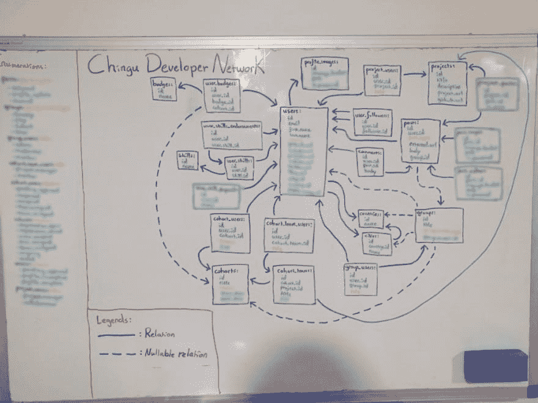
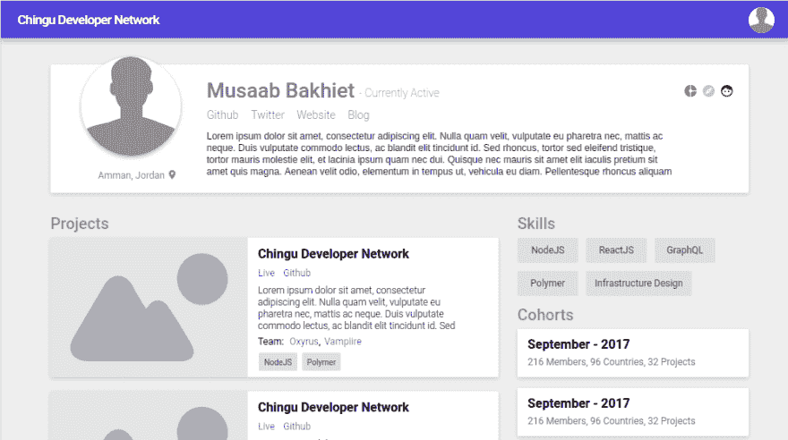

# 构建 Chingu 开发者网络，第 1 部分:决策

> 原文：<https://dev.to/chingu/building-the-chingu-developer-network-part-1-decisions-kpe>

#### 协作促成更多的协作。

[T2】](https://res.cloudinary.com/practicaldev/image/fetch/s--89e1REp2--/c_limit%2Cf_auto%2Cfl_progressive%2Cq_auto%2Cw_880/https://cdn-images-1.medium.com/max/505/1%2Ae1FMzKXvdfPn5OJrKdK7hA.png)

### 前言

在浏览媒体时，我看到了[这篇](https://medium.freecodecamp.org/the-freecodecamp-alumni-network-a-homegrown-mentorship-network-for-fcc-alumni-529e4531c34f)介绍 [FCC 校友网络](https://www.fcc-alumni.com/)的文章。我对它产生了兴趣(尽管我从未使用过 [FCC](http://freecodecamp.org) ，所以我打开它，注意到 [peterWeinberg](https://medium.com/u/5fdd9f72821d) 提到了一个叫做*“Chingu coalts”*的东西，据说它有助于促进团队项目。尽管我甚至还不完全确定这是什么，但我发现自己报名参加了下一个名为*“Voyage-2”*的*队列*。

所有这些单词是什么意思？

简而言之， **Chingu** 是一个开发者社区，他们不断努力提高自己。**群组**是志同道合的人与处于相似水平的其他人组成的团队，一起做一些有趣的事情来提高他们的技能。我加入的这支队伍碰巧被称为**航次-2** ，因为这支队伍有时也被称为航次。

这个想法很简单，但其实施方式却意义深远。

这不像那些你总是开始又永远完成不了的兼职项目。拥有一个团队意味着你要对你做(或没做)的任何工作负责，这是你投入时间和精力的动力。如果你在做一个单独的学习项目，你会选择你想学的任何语言/框架，而在团队中，你会先讨论它。这样，你不仅更有可能挑选一些有用的东西(比如当前有上升趋势的框架)，而且你还可以从讨论本身中获得经验，这对初学者尤其有用。

Chingu 团队还有许多其他的好处，我会在将来的某个时候在一篇单独的文章中介绍它们。

### 项目

好吧，如果 Chingu 已经存在，我们到底在做什么？我们试图解决什么问题？

#### 到目前为止，这到底是怎么回事？

Chingu 目前由[手动*管理*使用谷歌表格、电子表格和电子邮件](https://medium.com/u/b0f009f22115)。如果你被一个团队接受，Chance *会手动*给你发一封电子邮件，解释如何运作，接下来的步骤是什么，并给你一些有用的链接。过了一会儿，Chance *手动*发送更多的电子邮件给通过*手动*评估过程选择的 PM。再来几张*手动*邮件。群组开始，Chance 创建了一个松散的团队，每个人都被手动邀请加入。团队被手动分割*并且每个团队被分配一个 PM，之后团队频道也被手动创建*。吉斯还必须*手动*将每个人添加到 Github 上的 [Chingu Org](https://github.com/chingu-coders) 中，并*手动*为每个团队创建存储库，然后*手动*添加每个人，并给他们适当的权限。**

 **你抓住它了吗？是的……确实有改进的空间。

<figure> 

<figcaption>准确的描绘出偶然工作上的同路人。</figcaption>

</figure>

#### 调集队伍

我对这个问题的解决方案很感兴趣，所以我联系了吉斯，他让我联系了已经在研究解决方案的安德烈斯·佩雷斯，但是他是一个人在研究(由于某种原因，他使用了没有框架的 Go ),所以他没有取得太大进展。你可以在这里阅读他的挣扎。

我们联系了一直在开发一个名为“[汽车人](https://github.com/Chingu-Core-Components/AutoBot)的系统的[瓦姆皮雷](https://medium.com/u/b64c193af9)，以监控团队进度，并通过与松弛状态下的 Chingu 团队自动互动来调节进度。这是在他的航次 1 项目“ [Chingu Chimp](https://github.com/Chingu-Core-Components/ChinguChimp) ”之后，这是一个机器人，让 Chingu 用户能够在 Slack 内更新和分享他们的 Chingu 个人资料。Vampiire 的最终愿景是将 Chance 一直在做的所有手工工作(从最初的应用到项目完成)转化为自动化的工作流程，允许 Chingu 使用一个跨 GitHub 和 Slack 工作的集成机器人系统，远远超出其当前(人力有限)的能力。他对 Slack 不健康的痴迷导致 Chingu 尝试“Slack 前端”,而现实是 Chingu 需要一个合适的 web 客户端，就像 Andrés 提出的那样。Vampiire 表示有兴趣与我们一起开发这个平台，所以我们将他加入了这个团队。

我们准备好出发了。

[T2】](https://res.cloudinary.com/practicaldev/image/fetch/s--C96b_B_r--/c_limit%2Cf_auto%2Cfl_progressive%2Cq_66%2Cw_880/http://giphygifs.s3.amazonaws.com/media/mSK26uXsLMwwg/giphy.gif)

### 艰难抉择

现在团队已经准备好了，我们需要弄清楚我们将要使用的技术，我们将要实现的特性，以及它们看起来会是什么样子。

#### 堆栈

经过一些讨论和研究，我们最终得到了这个堆栈:

*   一种数据库系统
*   NodeJS (ExpressJS)
*   GraphQL(阿波罗)
*   反应

我们决定使用 SQL 而不是 NoSQL，因为我们预计，基于我们预想的特性，我们将需要能够利用有些复杂的关系来查询数据，这对于 NoSQL 来说是繁琐的(但可能的)。将来我们可能会在 NoSQL 数据库中存储一些数据，但现在我们将主要使用 PostgreSQL。

NodeJS 是有意义的，因为除了你在其他地方可以很容易读到的所有好处之外，它是 FCC 教授的框架，我们认为如果我们使用它并记录我们的过程，它将有益于我们的社区(主要由 FCC 露营者组成)。我们出于同样的原因选择了 React，尽管我们都没有使用它的实际经验。

你不应该总是选择你最有经验的框架。相反，您应该尝试通过评估堆栈的其余部分、问题、期望的结果和当前趋势来做出决定。还有许多其他因素也会影响决策。话虽如此，也不要过度强调。

我们选择基于 GraphQL 来设计我们的 API，因为我们相信它是 REST 的更好的替代方案，并且它可以作为向 Chingu 社区介绍它的好方法，因为它很可能最终会被广泛采用。安德烈斯是这个决定背后的天才。)

#### 数据库

完成堆栈决策后，我们进入下一步，即设计数据库。

我接下了提出一个基本方案的任务，然后我们将一起审查和修改这个方案。我们每个人都在不同的时区，所以这是我们能想到的最好的方法。

我也碰巧让那两个人相信我知道我在做什么，所以他们决定让我来处理这件事。

傻瓜。

<figure> 

<figcaption>第一个数据库草案。也许我有点过火了？</figcaption>

</figure>

在我完成初稿后，我们一起审阅了它，并在最终定稿前做了一些修改(很明显)。

首先这样做是一个很好的选择，因为它非常清楚我们需要在我们的应用程序中创建什么模型，以及我们将如何设计我们的 GraphQL 模式。

像这样可视化数据库也有助于我们想出一些很酷的功能，然后将它们包含在设计中。

#### 最有价值球员

一次性实现所有这些功能将是一个巨大的错误，并且需要很长时间，所以我们缩小了规模，并决定先做几件事情。

我们选择从用户档案开始，一旦我们从我们的社区成员那里得到他们真正想要的反馈，我们就从那里向外工作。

唯一剩下的事情就是设计这个东西。

问题是，我们都不擅长设计。如果你对设计有所了解，并且有兴趣提供帮助，请联系我们！

不管怎样，感谢上帝给了我们。

<figure> 

<figcaption>不作判断。我们从没说过会好看。</figcaption>

</figure>

是的，它不是最好看的界面，但它是一个开始。我们希望有一个真正的设计师来看看它，并根据 MVP 的反馈来改进它。

### 下一步

既然我们已经弄清楚了我们想要做什么，我们将使用哪些技术来完成它，以及我们希望它看起来是什么样子，那么是时候开始实际编码了。

这将是一个系列，所以请确保您遵循 [Chingu](https://medium.com/chingu) 出版物，以获得未来添加的部分的更新！

如果你认为我分享数据库模式的早期草案是一个白痴，或者如果你想告诉我们在设计中少用一点蓝色，请在下面留下评论。

* * ***