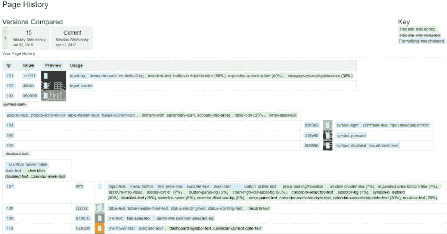
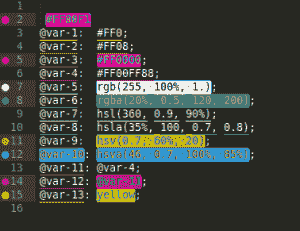
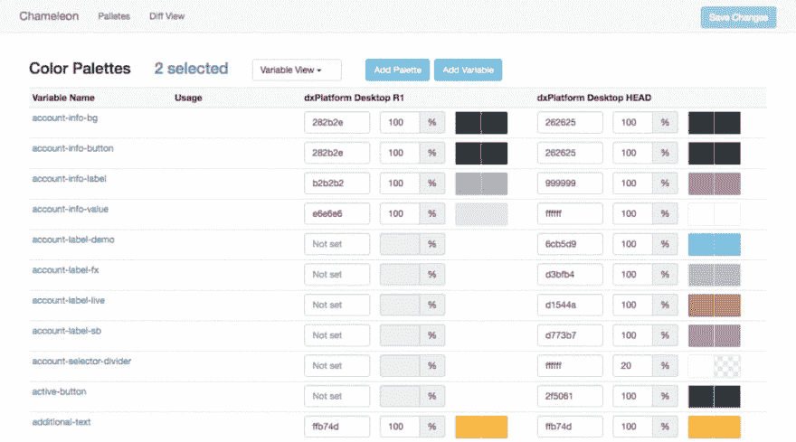
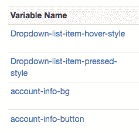
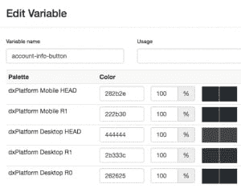
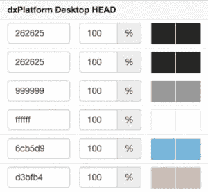
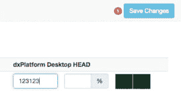
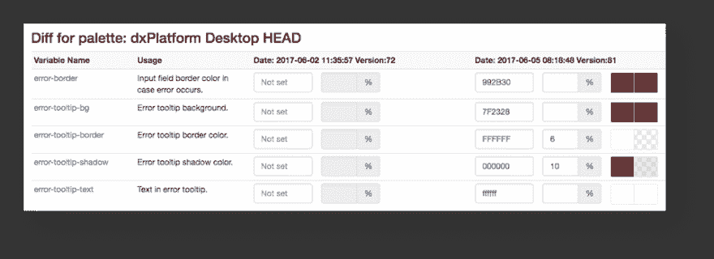
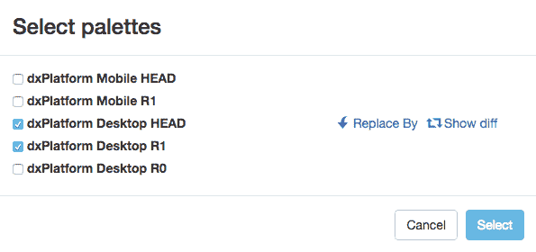
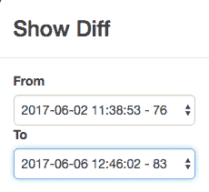

# 变色龙:一个舒适的调色板管理工具

> 原文：<https://dev.to/devexperts/chameleon-a-cozy-palette-management-tool-5h4a>

当一个产品系列不断发展时，保持对颜色组合爆炸的控制是一个挑战；尤其是当您必须维护大量相关产品时。本文描述了这些挑战，探索了不同的方法，并揭示了我们的 UI 设计人员和开发人员在定制 Devexperts 交易应用程序时发现的解决方案。

# 问题

在 Devexperts，我们开发桌面、网络和移动用户界面交易应用程序。这些应用程序看起来很像，有着相似的皮肤。它们可以根据客户的要求进行定制，这导致了定制皮肤的开发。一般来说，针对每个客户的定制皮肤的第一次发布是基于最初的产品，并在产品生命周期中略有发展，这可能会持续许多年。

现在让我们来看看这个案例。

任何交易应用程序都是一个复杂的界面，由多种颜色组成。为桌面、平板和移动屏幕分配不同的像素完美版本将使这一数字增加两倍。此外，设计师还会处理一些皮肤，如“白天”和“夜晚”主题或无数白色标签。这使得这种情况难以管理，并可能导致设计师玩弄数千种颜色。

典型的使用案例有:

*   检查所有应用程序、版本及其白色标签的控件中使用的颜色
*   控制元素的不透明度
*   调整任何元素的颜色外观
*   比较
*   找到过时的颜色，然后在一个产品系列中同步更新和重新着色

上面概述的劳动密集型工作是通过重复代码中出现的每一种颜色来实现的。我们对这些事件使用语义名称，称之为变量。可以想象，色彩管理过程中需要一定程度的自动化和自律。但是我们如何嵌入自动化呢？对于设计师来说，什么是控制和管理变更的好工具，对于开发人员来说，什么是应用变更的好工具？

# 我们的目标

我们为自己设定的目标是改进导航，并简化(对于参与开发的各方)一次一个或多个调色板的管理。

这个问题是由我们的一个设计师在 Confluence wiki 的调色板页面中发现的。他们发现变量的数量变得数不清。

# 可能的解决方案

首先，我们转向一些众所周知的应用。

## 1)合流或另一个企业维基

这实际上是我们被困了相当长一段时间的地方。这就是我们放弃合流页面的原因:

*   **比较问题:**

当使用 Confluence 页面时，单个皮肤的一个调色板占据整个页面。当你的手机应用有五个皮肤时，这意味着你有五个独立的标签，需要在它们之间切换。当然，您可以将所有的皮肤放入一个带有聚合调色板的 Confluence 页面中——只需为所有五个皮肤创建一个列。这样可以解决一段时间的问题。但是为了正确跟踪变更，您需要为调色板的每个“版本”创建一个新列。因此，列数急剧增加，结果是降低了浏览器的整体页面性能，并使数据更难用肉眼扫描。此外，如果没有奇怪的鼠标点击，就不可能比较两个或更多不同项目的调色板。

*   **耗时的变更搜索:**

第二个例子:在一个白色标签的项目中，一个设计师对一个 UI 元素进行了修改，将它涂成红色，然后通知开发人员应用它。一般来说，调色板在不同阶段之间不会经常改变。它们在不同的版本中也保持一致，任何变化通常只涉及一小部分变量。尽管如此，开发者不得不手动上下滚动页面，或者，如果足够幸运的话，使用搜索字段，来找到发生了什么变化。如果变量看起来令人困惑，有时他们甚至不得不查看多年前发布的页面历史。

设计人员和开发人员都必须检查几个调色板上的变量是否对齐，验证这些差异是有意的，并且没有发生人为错误。Confluence 有一个特殊的 diff 函数，可以用来比较调色板的版本。但它是为代码或纯文本设计的。带有颜色和变量的表结构即使在试图检查很小的变化时，也经常会出现错位。

上图显示了一个重新分配的变量。

请注意，此外，您不能命名历史中的任何更改。因此，如果您想将新的调色板与某个以前的版本进行比较，您需要记住该版本的确切日期和时间。

## 2)电子表格/类似 Excel 的软件

Google Sheets 可能首先浮现在脑海中。对于拥有 2-3 个应用程序或网站的小公司来说，这可能很好。特别是，如果你不希望同时处理多个版本，或者在未来需要大量扩展主题、白色标签和皮肤。

然而，它也有和维基一样的弱点。让我们想象一下下面的情况:你有一个由 100 种颜色组成的产品调色板。在收到 10 个白色标签和 4 个应用程序版本(桌面、网络、平板电脑、智能手机)的订单后，您将获得 4k 颜色。乘以开发，质量保证和生产阶段，你会得到 12k 的颜色。

所有基于网络的表格/电子表格软件上传存储的调色板的所有列。您可以使用隐藏/取消隐藏选项来选择调色板的特定子集，但这对于最常见的情况来说并不方便，因为您只需要 10 个或 20 多个调色板中的两个。虽然 Excel 是一个强大的工具，但它需要您执行额外的鼠标点击，并使您的眼睛疲劳。

此外，当您在创建另一个面板的过程中，您还需要遵守规则并遵循相同的结构，这是您为预先存在的皮肤定义的。

Google Sheets 中的修订历史功能以类似于 Confluence 页面的方式工作，并且不能可视化调色板的两个确切版本(发布)之间的有用差异数据。为了比较当前版本和以前版本的区别，有一整类软件叫做 VCS。

## 3)版本控制系统

VCS 是一个很棒的文本文件工具。但是这里出现了两个主要问题:

*   **比较问题:**

VCS 帮助我们处理一个文件的多个版本。但是工程师经常需要比较两个不同的调色板，不同的调色板用不同的文件表示。VCS 在这里帮不上什么忙，因为它不认为这些文件是相关的。

*   **颜色预览:**

VCS 不能准确地描绘色彩，而这对于设计师来说是必不可少的。没有一个好的预览，你必须记住文本颜色代码，并每次都检查它们，这增加了认知负荷。一些代码突出显示系统中的基本颜色表示可以更好地理解一列文本的情况，但是与具有多列和大的彩色单元格的表格结构相比，它是失败的。

[T2】](https://blog.devexperts.com/wp-content/uploads/2017/06/Color_codes_in_VCS.png)

*VCS 的颜色代码*

考虑到所有这些问题和用例，在彻底探索了每一个可能的选项之后，我们开发了一个叫做变色龙的工具。

# 变色龙

这是一个色彩管理的网络工具，可用于白色标签、发布和新产品的所有生产阶段。

[T2】](https://blog.devexperts.com/wp-content/uploads/2017/06/Inspect-colors-in-Chameleon.png)

*检查变色龙的颜色*

**设计团队的特点:**

*   观察变量列表，看看它是如何在不同项目的不同调色板中使用的。

[T2】](https://blog.devexperts.com/wp-content/uploads/2017/06/variables-names.png)

*变量名称*

[T2】](https://blog.devexperts.com/wp-content/uploads/2017/06/edit-Variables-in-Chameleon.png)

*变量比较*

*   观察特定项目涉及的所有变量的颜色。

[T2】](https://blog.devexperts.com/wp-content/uploads/2017/06/list-of-colors-for-a-particular-project.png)

*特定项目的颜色列表*

*   控制和查看当前编辑会话期间的更改。

[T2】](https://blog.devexperts.com/wp-content/uploads/2017/06/save-changes.png)

*保存更改*

*   将当前调色板中的更改与该调色板过去的任何版本进行比较。

[T2】](https://blog.devexperts.com/wp-content/uploads/2017/06/Diff-view-in-Chameleon.png)

*显示新“错误工具提示”对象的附加颜色的调色板的两个版本之间的差异视图*

**开发团队的特点:**

*   生产版本中的设计更新:成功的业务项目经历了在生产环境中部署的里程碑(版本)。在这种情况下，主项目和发布项目的配色方案必须分开。有时，开发团队会收到在已经发布的版本中进行新开发的请求。如果设计人员和开发人员能够加载已发布配色方案的快照并对其稍作更改，而不是使用主版本的配色方案，则可以节省大量时间，因为主版本的配色方案可能会在发布进入生产阶段后悄悄更改。

[T2】](https://blog.devexperts.com/wp-content/uploads/2017/06/Snapshots.png)

*已发布(R0，R1)和当前(头部)配色方案的快照*

*   增量设计更新:开发团队成员应该能够得到已经应用的配色方案版本之间的差异，以及他们 UI 组件的每个版本的当前版本。

[T2】](https://blog.devexperts.com/wp-content/uploads/2017/06/Diff-function.png)

*差动功能*

**简单介绍一下我们使用的技术:**

由于这是一个典型的小型企业 web 应用程序，我们决定使用我们最熟悉的工具，这些工具将帮助我们快速实现解决方案。对于那些对这个例子感兴趣的人，我们使用:

弹簧靴

H2 数据库引擎

jsoup

朱尼特

WebJars

安古斯

引导程序

昂首阔步。

我们在 GitHub 上为所有人开放了变色龙。如果你有关于如何改进变色龙的想法，我们很高兴收到你的来信——请在下面留言！

色彩管理过程对你来说是一场噩梦吗？