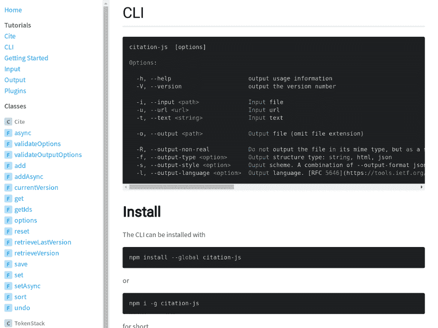

# Citation.js 测试版:新文档和输入插件

> 原文：<https://dev.to/citation-js/citationjs-version-04-beta-new-docs-and-input-plugins-3a0j>

Citation.js Version 0.4 Beta: New Docs and Input Plugins

有一段时间了。[真的](https://github.com/larsgw/citation.js/graphs/contributors?from=2017-09-08&to=2017-12-19&type=c)。但是现在它又回来了，有了新的版本:`v0.4.0-0`，`v0.4`测试版。下面我解释一下这个版本的一些变化，然后是`v0.4`和`v0.5`的 [Citation.js](https://citation.js.org) 的路线图。另外，Citation.js 现在有一个 DOI:

[T2】](https://doi.org/10.5281/zenodo.1005176)

> Citation.js 现在在 [@ZENODO_ORG](https://twitter.com/ZENODO_ORG?ref_src=twsrc%5Etfw) 上，有 DOI！https://t.co/X2ThPA2S1I
> 
> ——Lars 同意 Hagen(@ larswinghagen)[2017 年 10 月 11 日](https://twitter.com/larswillighagen/status/918033807156137985?ref_src=twsrc%5Etfw)

还有， [@jsterlibs](https://twitter.com/jsterlibs) [发了](https://twitter.com/jsterlibs/status/935436869764046849)关于 Citation.js 的推文

## 发布

### 输入插件

这个版本的主要变化是增加了输入插件。这是释放`v0.4`的第一步，如下所述。尽管这里有具体的文档和，我还是在这里举一个例子，因为 API 可能会令人困惑。

> 注册输入插件的 API 会在`v0.4`发布前更改一两次，一次是为了让它不那么复杂和怪异，第二次可能是为了融入输出插件。

#### 添加格式

假设您想要添加 [RIS](https://en.wikipedia.org/wiki/RIS_(file_format)) 格式(我可能会在某个时候添加)。首先，让我们定义一个类型，作为开始。

```
const type = '@ris/text' 
```

这里我不能真正定义实际的解析器，但是我会在示例代码中添加一个变量。

```
const parse = data => { /* return CSL-JSON or some format supported by any other parser */ } 
```

测试一个给定的字符串是否是 RIS 格式，我们将使用 regex。如果任何一行以两个字母数字字符、两个空格和一个连字符开头，这个正则表达式就匹配。这是一个非常模糊的匹配。所有的行都应该以这个顺序开始。然而，这只是一个例子，适当的正则表达式可能不够优雅。

```
const risRegex = /^\w{2}\ {2}-/gm 
```

现在，让我们定义 RIS 输入的`dataType`。当使用正则表达式测试输入时，`dataType`无论如何都会被自动确定为`'String'`，但是为了清楚起见:

```
const dataType = 'String' 
```

现在，综合一下:

```
Cite.parse.add(type, {
  parse,
  parseType: risRegex,
  dataType
}) 
```

#### 改变解析器

现在，假设上面的代码是别人写的，而你*需要*在不修改它的情况下使用它，但是你想要一个更好的正则表达式？可以这样安排:

```
Cite.parse.add(type, {
  dataType: 'String',
  parseType: /^(?:\w{2}\ {2}-.*\n)+(\w{2}\ {2}-.*)?$/g
}) 
```

因为选项`dataType`、`parseType`、`elementConstraint`和`propertyConstraint`都被视为一件事，所以在替换类型检查器时，您需要通过所有这些选项。`dataType`在这个例子中实际上仍然不是强制的，但是被传递来演示这一点。

#### 禁用一种格式

> 目前[没有办法删除格式](https://github.com/larsgw/citation.js/issues/108)。

在这个场景中，一些插件注册了一种新的格式来从`github.com`URL 获取引用数据。可惜行不通。该 URL 不是 GitHub 特有的 URL，而是通用 URL 类型`@else/url`。这是因为通用版本注册较早，还没有通用类型的类别(见 [#104](https://github.com/larsgw/citation.js/issues/104) )。如果你不使用`@else/url`类型检查器，你可以像这样禁用它:

```
Cite.parse.add('@else/url', {dataType: 'String', parseType: () => false}) 
```

> 我不确定为什么这里需要`dataType`,因为无论如何你都要禁用解析器，但是没有它它似乎不能工作。

### 文档

[T2】](https://res.cloudinary.com/practicaldev/image/fetch/s--3TUFf4or--/c_limit%2Cf_auto%2Cfl_progressive%2Cq_auto%2Cw_880/https://4.bp.blogspot.com/-BCbRZekDsN0/Wj0jlBOna0I/AAAAAAAAQpU/VwXpzWhWyx0Ol_oFkXluveRPJNmva_YdACLcBGAs/s1600/citation.js.org_api_tutorial-cli.html%252B%2525281%252529.png)

最近，我一直在更新 [Citation.js](https://citation.js.org) 上的[文档](https://citation.js.org/api)，这是一次愉快的经历，尽管文档引擎出现了一些小问题。现在有教程了，很多 JSDoc 的注释都得到了改进。我仍然想改善主题中的一些东西，如可点击的标题链接(类似于 GitHub 和 NPM 的行为)，并在导航中显示子教程。

### 向后兼容

这个版本应该在很大程度上向后兼容。如果有任何回归，请在错误跟踪器中报告它们[。](https://github.com/larsgw/citation.js/issues)

## 路线图

### `v0.4`

这个想法是允许所有类型的插件，包括输入解析和输出格式化，在`Cite`对象上注册，并且对所有内部解析器和格式化器一视同仁。目前，输入解析器插件是可能的(见上文)，尽管它们将在`v0.4`之前得到改进。由于输出选项格式的变化，输出解析器也将很快推出，并且将是向后不兼容的。

### `v0.5`

目前的计划是在 [`v0.5`](https://github.com/larsgw/citation.js/projects/5) 中使用 JSON-LD 作为内部格式，同时仍然保留 CSL-JSON 作为内部方案。然后，任何输入都应该被转换为字段列表(或对象)，这些字段将被添加到内部数据存储中。每个字段都应该单独转换成 CSL-JSON 格式，并作为副本添加。因此，当某些字段在 CSL-JSON 中不可用，但在输入和输出方案中时，不会有数据丢失。它还应该使得为 BibJSON 等编写解析器变得更加容易。

当然，要注意边缘情况。例如，CSL-JSON 字段`original-title`没有[维基数据](https://wikidata.org)属性，但是该信息仍然可以从与`P364`(原始语言)属性结合的标签中获得。