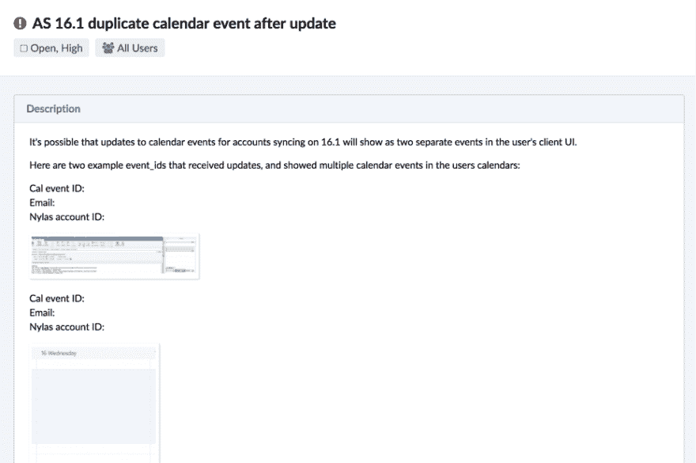
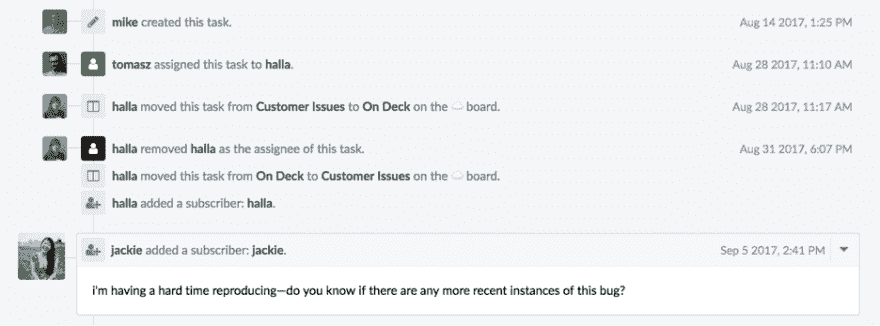
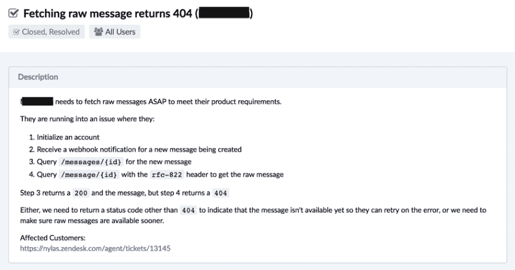
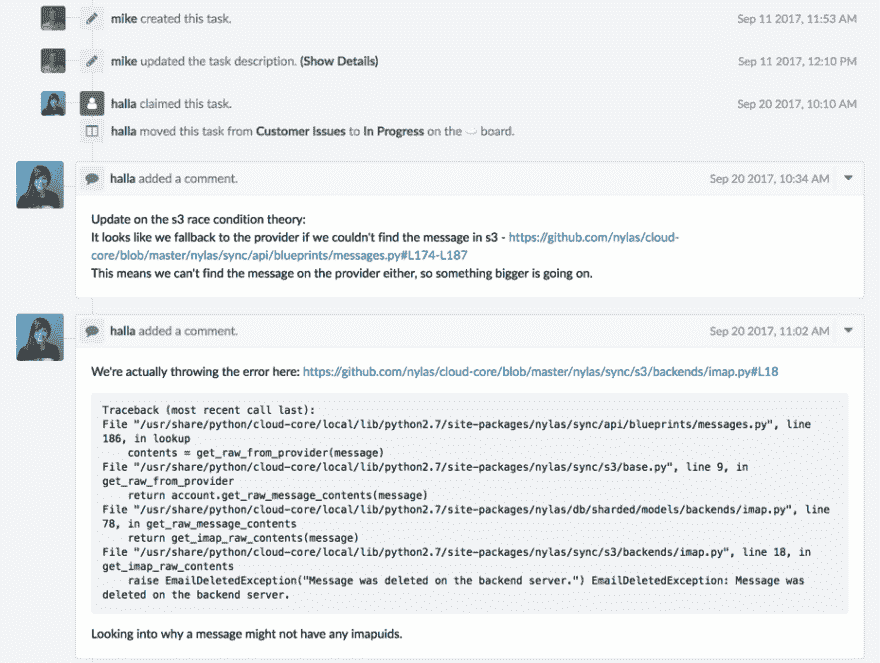
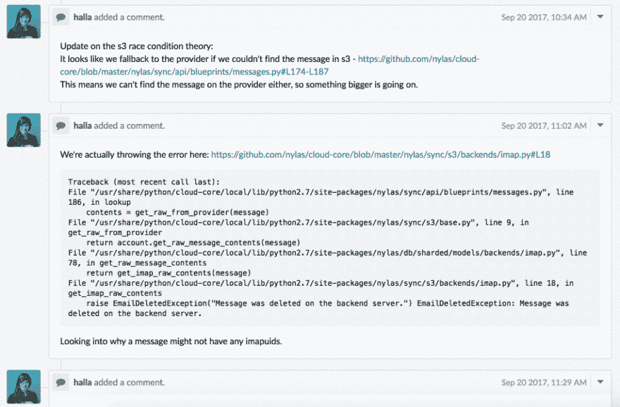

# 协作调试:两个错误的故事

> 原文：<https://dev.to/nylas/collaborative-debugging-a-tale-of-two-bugs-1eph>

在解决技术问题时，工程师通常默认只看技术问题。但有时问题本质上不是技术性的，而是以人为中心的。在 Nylas，我们在调试过程中学到了这个教训。这里有一个关于两种不同的 bug 以及我们如何以不同的方式处理它们的故事。

## TL；dr:调试是艰难的

像大多数公司一样，我们保留了一份由使用我们 API 的开发人员报告的客户问题的运行列表。我们使用 [Phabricator](https://www.phacility.com/phabricator/) ，一个用于任务管理和代码审查的开源工具，来跟踪我们的 bug，这个列表有时会很长。

调试代码很难。我不知道你工作的地方的工程师对它有什么感觉，但是，在 Nylas，它经常是我们必须在特性开发和代码重构之间做的痛苦但必要的工作。我很喜欢这句话:

> "调试比一开始写代码难两倍."布莱恩·w·克尼根和 p·j·普劳格尔

当我第一次进入工程领域时，我认为编写代码是“真正的工作”但是有经验的工程师知道，这是不正确的。当然，你必须写代码。但是，可以说，这项工作最难的部分是重构和删除代码，思考和编写正确的测试用例，当然还有调试代码的问题。Nylas 报告的许多 bug 很少或根本没有关于用户如何遇到它们的数据，作为工程师，我们有责任收集零碎信息并确定根本问题，这可能需要几天甚至几周的时间。

然而，我们了解到有比我们正在做的更好的方法来调试问题。这里是我们的协作调试的故事，以及它如何帮助我们。

## 故事时间

### Bug #1

一位客户报告说他们遇到了一个问题:用户 A 将向用户 B 发送一个日历邀请的更新，突然用户 B 的日历上显示了重复的事件。

[T2】](https://res.cloudinary.com/practicaldev/image/fetch/s--8GZVinKK--/c_limit%2Cf_auto%2Cfl_progressive%2Cq_auto%2Cw_880/https://d2mxuefqeaa7sj.cloudfront.net/s_251ABB705F07754F15B0F78682B71F5CE2F099096DED2DBED65FC71D4E69F2C8_1512601757086_image.png)

以下是我们创建的 Phabricator 任务:

[T2】](https://res.cloudinary.com/practicaldev/image/fetch/s--ebDxtWtM--/c_limit%2Cf_auto%2Cfl_progressive%2Cq_auto%2Cw_880/https://d2mxuefqeaa7sj.cloudfront.net/s_251ABB705F07754F15B0F78682B71F5CE2F099096DED2DBED65FC71D4E69F2C8_1512601726041_image.png)

我们有两个关于这个 bug 的报告和一个重复事件的某人日历的截图。因为对于使用我们 API 的公司来说，这是一个非常严重的问题，所以我们对它进行了优先排序，把它放在我们“客户问题”列表的首位。

让我们来看看任务中的活动:

[T2】](https://res.cloudinary.com/practicaldev/image/fetch/s--1gvIuY8B--/c_limit%2Cf_auto%2Cfl_progressive%2Cq_auto%2Cw_880/https://d2mxuefqeaa7sj.cloudfront.net/s_251ABB705F07754F15B0F78682B71F5CE2F099096DED2DBED65FC71D4E69F2C8_1512601802345_image.png)

*   我们可以看到有人在 8 月 14 日报告错误时创建了它。
*   两周后(8 月 28 日)，一名工程师被派去调查此事。她调查了几天，没有找到解决办法。
*   接下来的一周(9 月 5 日)，我负责修复漏洞，并决定研究一下。

我从日志开始，一无所获。这是第一个问题:我们只保留两周的日志，而这个错误在一个月前就被报告了。接下来，我花了一天的大部分时间看我是否能重现这个 bug，但是没有任何运气。

我回复了，让我们的支持团队知道我不能复制这个 bug，需要它的最近实例或者更多的信息来进一步调查。

然后，我继续修复其他一些 bug，然后在下一周开始另一个项目的工作。可悲的是，到目前为止，重复事件错误仍在发生。

[T2】](https://res.cloudinary.com/practicaldev/image/fetch/s--aSR78I17--/c_limit%2Cf_auto%2Cfl_progressive%2Cq_66%2Cw_880/https://d2mxuefqeaa7sj.cloudfront.net/s_251ABB705F07754F15B0F78682B71F5CE2F099096DED2DBED65FC71D4E69F2C8_1513145619850_sad-panda.gif)

### 这个流程怎么了？

首先，关于用户遇到 bug 时在做什么的信息太少。我们需要更多的数据点才能重现问题。

下一个问题是我们错过了检查日志的窗口。因为我们只存储两周的日志，所以在这 14 天内解决一个问题以确保我们能找到错误发生的位置是至关重要的。

最后一个问题——也是我认为最大的问题——是我们重复工作。怎么会？另一个工程师花了三天时间研究这个问题。即使她没有找到解决办法，她仍然调查，测试她的一些假设，并找出哪些是错误的。但是当我开始调查的时候，我没有这些信息。

后来，当我在全体会议上提出这个问题时，我们了解到又有一个工程师研究了这个 bug，但从未要求 Phabricator 任务，因为她没有找到它的来源。我们没有合作，更糟糕的是，我们没有分享我们收集的数据，因为我们认为这些数据没有用。

## 进入协同调试

这意味着什么呢？

我们是在这样的假设下运作的，即每个人都应该声明一个 bug 并一次性修复它。但这是一个错误的假设，原因有很多。许多最难的 bug 并不是这样工作的。它们需要更长时间的调查，需要对代码库有不同了解的多个人来研究问题。

此外，连续几天不停地研究一个 bug 却没有取得明显的进展，这确实令人沮丧。将工作分开可以让人们休息一会儿去做其他项目，并让其他人以全新的视角参与进来。

如果我们一直在协作调试，每个人都会给下一个人留下面包屑，以确保过程不会丢失。

### 我们本可以做得更好的是什么？

这个问题的第一个答案是最明显的:我们需要从报告错误的用户那里获得更多信息。协作调试不仅仅适用于工程师——你也需要与支持人员协作。

接下来，我们需要在两周的时间内从日志中提取堆栈跟踪。该步骤可以作为票证创建过程的一部分由支持人员处理。如果他们一收到错误报告就查看日志，并将错误的堆栈跟踪放到他们创建的任务中，那么工程师就有更多的上下文来开始他们的调查。

最后，最后一部分是记录我们在调查中的进展——好的和坏的。我们有这样一种普遍的想法，即只有当我们的调查发现导致了根本问题时，它们才是有价值的。但事实证明，人们在诊断问题时通常有相似的思维过程，因此，他们遵循许多相同的路径。即使你的假设是错的，让下一个人知道也是有用的，这样他们就不会试图再次验证了。

### Bug 2

在第二个 bug 中，用户将通过我们的 API 发送一封电子邮件，然后请求原始 MIME 消息，该消息存储在 S3。他们得到的不是 MIME，而是一个 404 状态码。

这是我们创建的 Phabricator 任务:

[T2】](https://res.cloudinary.com/practicaldev/image/fetch/s--s5nYBVeT--/c_limit%2Cf_auto%2Cfl_progressive%2Cq_auto%2Cw_880/https://d2mxuefqeaa7sj.cloudfront.net/s_251ABB705F07754F15B0F78682B71F5CE2F099096DED2DBED65FC71D4E69F2C8_1513191427417_phab-ticket2.png)

首先，我们从用户那里获得了正确的信息。重现这个 bug 有一个非常清晰的四步流程。我们确切地知道他们到达了哪些终点，以及他们到达时发生了什么，这很好。

以下是任务的初始活动:

[T2】](https://res.cloudinary.com/practicaldev/image/fetch/s--HA4pMHy0--/c_limit%2Cf_auto%2Cfl_progressive%2Cq_auto%2Cw_880/https://d2mxuefqeaa7sj.cloudfront.net/s_251ABB705F07754F15B0F78682B71F5CE2F099096DED2DBED65FC71D4E69F2C8_1512602221901_image.png)

我们在 9 月 11 日创建了标签，一名工程师在十天内就完成了，所以我们仍然有日志，可以找到我们抛出错误的地方。她开始调查并记录她的进展。她最初认为这可能是 S3 的一个种族条件，但事实并非如此。因为她记录了那个假设，并解释了为什么它是错误的，它阻止了任何人在未来走进死胡同。

她的调查过程是这样的:

[T2】](https://res.cloudinary.com/practicaldev/image/fetch/s--rL8702iQ--/c_limit%2Cf_auto%2Cfl_progressive%2Cq_66%2Cw_880/http://g.recordit.co/Xl9oZkMkd7.gif)

这花了几天时间，她记录了她所有的思考过程——她尝试了什么，什么没有用，以及最终的问题是什么。几天后，她对接下来的步骤有了一个粗略的想法，但她去度假了，所以我接手了调查。

我相信你现在已经明白了，除了浪费时间，重走她发现的所有死胡同，这种移交通常会导致一些(阅读:很多)挫折。然而，因为我有所有必要的上下文，所以我能够完成调查的最后一部分，实现修复并部署它，没有任何问题。

协作调试使我们能够修复第二个 bug，而我们无法修复第一个 bug。此外，我们能够轻松地在多人之间转移工作。报告错误的客户很高兴，我们对我们在这个问题上取得的进展感到非常高兴。

## 外卖

从这个故事中可以看出，并不是每个问题本质上都是技术性的。像大多数问题一样，我们倾向于认为这是一个可以通过技术解决方案来解决的问题。我们讨论了将日志存储更长时间或者改变我们的工具，但是最终，这个问题是人和过程的问题。改变我们思考调试的方式，积极思考 bug 修复，作为长期的合作努力，让每个人的体验变得更好。

*更新:我们已经修复了第一个 bug！🎉

* * *

这篇文章最初发表在 Nylas 工程博客上。