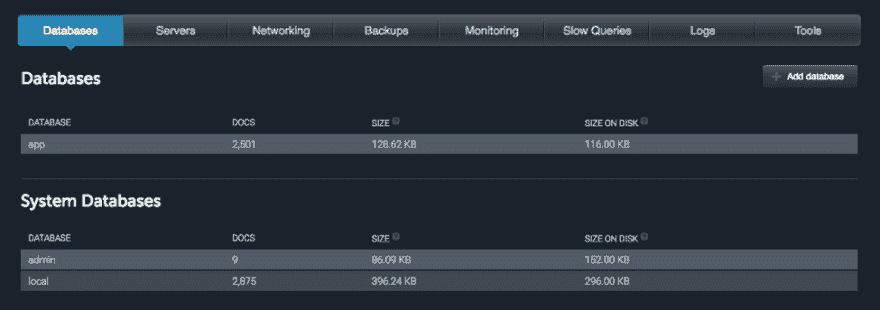
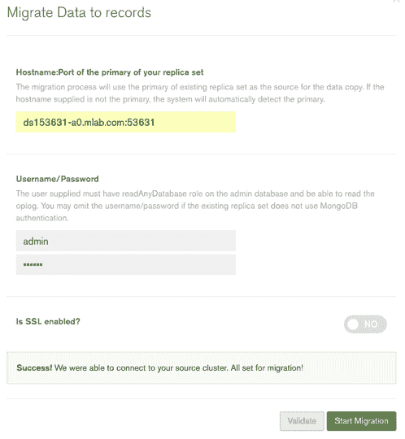
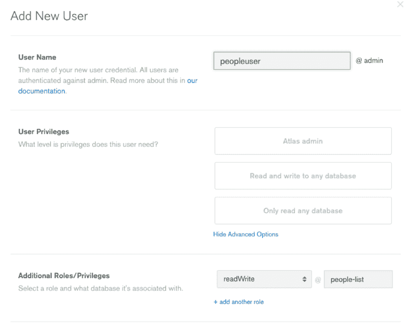

# 比较云 MongoDB 服务:MongoDB Atlas 与 mLab

> 原文：<https://dev.to/mongodb/comparing-cloud-mongodb-services-mongodb-atlas-vs-mlab-2c4c>

选择一个数据库服务提供商来运行您的 MongoDB 部署不是一个轻率的决定。您需要一个值得信赖的合作伙伴来保证您的数据库可用、安全，并按照最佳实践运行。对于您确实想要控制的集群方面，服务提供商应该提供强大而直观的工具集，使您能够轻松地触发更新和修改。最后，支持不仅应该快速响应问题，还应该能够提供及时的解决方案。理想情况下，您的数据库服务可以满足所有这些需求，让您的团队专注于构建应用程序，而不是管理数据库。

在接下来的章节中，我们将从几个不同的参数上比较 [MongoDB Atlas](https://www.mongodb.com/cloud/atlas) (由构建底层数据库的工程师提供的数据库即服务)和 mLab(由第三方提供商提供的服务)。MongoDB Atlas 和 mLab 都可以在亚马逊网络服务、微软 Azure 和谷歌云平台上使用。然后，我们将提供一个分步示例，说明如何将现有的 MongoDB 数据库从 mLab 迁移到 MongoDB Atlas。此外，我们将向您展示当您从 mLab 切换过来时，如何获得 3 个月的 Atlas 免费使用资格。

让我们从比较这两种数据库服务的一些关键操作方面开始。

### 安全

MongoDB Atlas 开箱即用，非常安全。免费提供网络隔离、TLS/SSL 和静态数据加密等功能。如果您在 AWS 上部署，MongoDB Atlas 还支持 VPC 对等，允许您的云数据库与您的应用程序实例通信，就好像它们在同一个网络中一样。

* * *

mLab 提供额外收费的 SSL。此外，虽然静态数据加密可用于运行在 AWS 和 GCP 上的 mLab 数据库，但它还不可用于 Microsoft Azure。

| **安全** | **蒙戈布地图集** | **mLab** |
| --- | --- | --- |
| 加密套接字协议层 | 包括 | 额外费用 |
| 静态数据的加密 | 在 GCP Azure 的 AWS 上提供 | 在 GCP AWS 上提供 |
| VPC 对等 | 在 AWS 上提供 | 在 AWS 上提供 |

### 备份&恢复

如果您将数据库服务用于生产应用程序，那么业务连续性规划和相关术语(如恢复点目标(RPO)、数据丢失容忍度和恢复时间目标(RTO)以及恢复速度)可能是您最关心的问题。

MongoDB Atlas 允许您访问副本集和分片集群的连续备份。这种完全托管的备份服务允许您恢复到任一时间点，因此您甚至可以满足企业最苛刻的 RPO。

为了满足严格的 RTOs，MongoDB Atlas 简化了直接从平台 GUI 启动恢复的过程。MongoDB Atlas 备份是可查询的，允许您在几分钟内执行文档级的粒度恢复。在部分数据丢失或损坏的情况下，这将为您节省时间、金钱和精力。

请注意，使用 MongoDB Atlas 的完全托管备份是单独定价的。您可以为每个副本集获得第一个 GB 的空闲空间。如果您决定使用 [mongodump 实用程序](https://docs.mongodb.com/manual/reference/program/mongodump/)来执行备份，这不需要额外的成本，但是您无法使用 MongoDB Atlas 备份提供的丰富功能。

* * *

mLab 的备份解决方案不支持连续备份，因此更难满足 RPO 要求。最多可以存储 8 个快照。还缺少一种为分片集群执行备份或恢复的简单方法。

mLab 不支持可查询备份，这意味着任何恢复事件都必须是完整数据库恢复，这可能需要几个小时或更长时间。

| **备份&恢复** | **蒙戈布地图集** | **mLab** |
| --- | --- | --- |
| 具有时间点恢复的连续备份 | 是 | 不 |
| 共享集群的自动化备份和恢复 | 是 | 不 |
| 可查询的备份快照 | 是 | 不 |

### 配置自由

MongoDB Atlas 让您可以控制想要的位置。例如，您可以选择一个实例大小，然后单独添加存储、I/O 和副本集成员；您甚至可以直接从 Atlas UI 中将副本集更改为分片集群。所有这些参数都可以由您根据需要进行修改，因此您可以在您的应用程序可能需要的任何情况下随时扩展并保持灵活性。

* * *

有了 mLab，你的选择就更有限了。您可以选择不同的实例大小，但是您的底层部署的所有质量都是固定的。虽然 mLab 确实支持 AWS 和谷歌云平台上的分片集群，但它们在微软 Azure 上还不可用。

| **配置自由度** | **蒙戈布地图集** | **mLab** |
| --- | --- | --- |
| 实例配置的选择 | 是 | 部分的 |

可以选择不同的实例大小，但是对于每个实例大小，CPU、内存、存储和 I/O 是固定的|
|分片集群|在 AWS、GCP、Azure 上可用

可以在启动时或稍后启用分片。|在 GCP AWS 上提供|

### 总是最新的

使用 MongoDB Atlas，数据库的维护版本更新(例如从 MongoDB 3.4.4 到 3.4.5)在后台自动进行，因此您不必担心自己应用最新版本。这意味着您总是拥有 MongoDB 的最新错误修复、安全补丁和任何其他关键更新。

MongoDB Atlas 还使升级到数据库的最新版本变得很容易，该版本在数据库服务平台上一发布就可以使用。通过观看关于使用 MongoDB Atlas 升级[的视频教程，您可以了解如何触发这些自动化升级。](https://www.youtube.com/watch?v=RjPtKmlQcAY&t)

* * *

有了 mLab，MongoDB 的新版本通常会在几个季度后在平台中推出。这意味着新的 MongoDB 特性——您可能已经在开发版本中试验过了——在其他组织已经在使用它们之后的几个月内都不可用。

| **更新** | **蒙戈布地图集** | **mLab** |
| --- | --- | --- |
| MongoDB 最新版本立即可用 | 是 | 不 |

新版本通常在数据库发布后的 1-2 个季度推出|

### 来自 MongoDB 工程师的支持

MongoDB Atlas 是唯一一个由构建数据库的工程师提供支持的 MongoDB 服务。没有比这更好的团队来帮助您为不同的应用程序设计、部署和扩展 MongoDB。我们的专家团队也是最有能力及时解决问题的团队。

使用 MongoDB Atlas，服务背后的团队通过使用 MongoDB Atlas 收集的操作指标来检测、诊断和排除潜在问题，以免它们成为您部署的问题，从而充当您团队的扩展。如果我们发现潜在的问题，我们将代表您在我们的支持门户网站上开罚单，并与我们的全球技术支持团队合作，检查和解决任何异常。

* * *

虽然 mLab 为专门的 MongoDB 集群提供电子邮件支持和 24x7 紧急热线，但他们的支持团队并不直接隶属于设计数据库的团队，也没有正式的关系。

| **支持** | **蒙戈布地图集** | **mLab** |
| --- | --- | --- |
| 从设计数据库的团队获得支持 | 是 | 不 |
| 获得主动问题检测、诊断和故障排除 | 是 | 不 |

### 与 Stitch 集成:后端即服务

MongoDB Atlas 直接与 MongoDB Stitch 后端即服务(BaaS)集成。MongoDB Stitch 让开发人员专注于构建应用程序，而不是管理数据操作代码、服务集成或后端基础设施。无论您是刚刚起步，想要一个完全托管的后端即服务，还是您是企业的一部分，想要向新的应用程序公开现有的 MongoDB 数据，Stitch 都可以让您专注于构建用户想要的应用程序，而不是编写样板后端逻辑。

Stitch 为开发人员提供了对 MongoDB 的完全访问权限、声明细粒度数据访问控制的能力以及与其他服务的可组合性。最初 Stitch 可用于 AWS 上的 MongoDB Atlas，目前处于测试版。

### 从 mLab 迁移到 MongoDB Atlas

到目前为止，我们已经讨论了 MongoDB Atlas 和 mLab 之间的一些主要差异。如果你正在考虑从一个数据库服务提供商开始，你可以从一个免费的 MongoDB Atlas 集群开始，它为你的开发和早期原型设计提供 512 MB 的存储空间。

如果您碰巧是现有的 mLab 客户，您现在可以将您的集群迁移到 MongoDB Atlas，并有资格免费使用 3 个月。填写此处的表格，了解更多信息。

下面我们将介绍如何使用 MongoDB Atlas 中的嵌入式实时迁移服务从 mLab 导入数据，同时尽量减少对应用程序的干扰。

### 先决条件

您需要确保您的 MongoDB Atlas 集群已经创建，并且适合您的应用程序的大小和用例。请注意，免费的 M0 沙盒不支持我们的实时导入工具。您将需要使用我们的付费定制实例大小之一。

[T2】](https://res.cloudinary.com/practicaldev/image/fetch/s--2FlaeDAw--/c_limit%2Cf_auto%2Cfl_progressive%2Cq_auto%2Cw_880/https://webassets.mongodb.com/_com_assets/cms/Atlas-vs-mLab-img1-741xxq3kjp.png)

将数据导入 Atlas 时，请确保 mLab 端的集群满足版本兼容性要求。Atlas 实时迁移支持以下迁移路径:

| **源副本集版本** | **目的集群版本** |
| --- | --- |
| Three | Three point two |
| Three point two | Three point two |
| Three point four | Three point four |

### mLab 源集群入门

在 mLab 源服务器上，您需要为您的迁移创建一个“admin”用户。您可以在 mLab 控制面板中进入您的集群，然后单击“admin”数据库。

[T2】](https://res.cloudinary.com/practicaldev/image/fetch/s--u0_5ncrd--/c_limit%2Cf_auto%2Cfl_progressive%2Cq_auto%2Cw_880/https://webassets.mongodb.com/_com_assets/cms/Atlas-mLab-img2-6zquypx2id.png)

进入这一部分后，您需要用管理数据库创建一个用户。继续点击“用户”，然后找到“添加管理员用户”按钮您可以随意命名，但是为了简单起见，我们在截图中将用户命名为“admin ”;请务必保管好您的密码。您需要确保“admin”用户的“Read Only”标志设置为 false，以确保您拥有所有集合的权限。

[T2】](https://res.cloudinary.com/practicaldev/image/fetch/s--slXbidGf--/c_limit%2Cf_auto%2Cfl_progressive%2Cq_auto%2Cw_880/https://webassets.mongodb.com/_com_assets/cms/Atlas-mLab-img3-w8d8zji9ny.png)

一旦你设置了用户名，确保你也能到达防火墙。您可以添加 Atlas 中的两个管理 IP，以确保服务可以到达您的集群。

*   4.71.186.128/25
*   4.35.16.128/25

一旦添加了这些 IP，就可以在 MongoDB Atlas 上设置目标了。

### 在 MongoDB Atlas 中配置目标集群

在 Atlas 中创建了新集群之后，在开始迁移之前，只需要几个步骤。首先，打开 Atlas 控制面板，找到集群详细信息旁边的“将数据迁移到该集群”按钮。

[T2】](https://res.cloudinary.com/practicaldev/image/fetch/s--TUsaXgYm--/c_limit%2Cf_auto%2Cfl_progressive%2Cq_auto%2Cw_880/https://webassets.mongodb.com/_com_assets/cms/Atlas-mLab-img4-br0ggeu4ug.png)

接下来会出现一个新窗口，为您提供所需操作的详细信息。如果您在源副本集上使用 SSL，该窗口将详细说明一些要求，如身份验证细节、主要主机名和一个 CAFile。此证书由 mLab 端的 DigiCert 全球根 CA 签名。

请注意，如果您使用的系统无法访问此根 CA，您可以按照这些[说明下载 mLab 根 SSL 证书](http://docs.mlab.com/ssl-db-connections/#downloading-and-using-mlabs-root-certificate)。

现在我们已经做好了一切准备，是时候点击“我准备好迁移”了。

[T2】](https://res.cloudinary.com/practicaldev/image/fetch/s--Gqm7Zwmm--/c_limit%2Cf_auto%2Cfl_progressive%2Cq_auto%2Cw_880/https://webassets.mongodb.com/_com_assets/cms/Atlas-mLab-img5-pocj3apg1b.png)

### 开始迁移

您将进入一个窗口，询问您有关源集群的信息。这是我们需要来自 mLab 的“管理员”用户的地方。如果您将 SSL 与 mLab 一起使用，请确保在输入您的其余凭据时将它作为配置的一部分启用。

在我们的例子中，我们只有一个节点，所以默认情况下，这个节点将是我们提供给对话框的主节点。单击“Validate”后，我们将看到一个绿色窗口，说明可以从导入服务中读取操作日志，并且我们已经准备好迁移数据。

[T2】](https://res.cloudinary.com/practicaldev/image/fetch/s--OCFLZtgP--/c_limit%2Cf_auto%2Cfl_progressive%2Cq_auto%2Cw_880/https://webassets.mongodb.com/_com_assets/cms/Update-Atlas-mLab-img6-2gugnlftzd.png)

如果您已经完成了这一步，现在您可以点击“开始迁移”开始迁移过程。

在数据迁移过程中，我们将看到 MongoDB Atlas 集群中的进度条不断更新，直到我们收到从“mLab”副本集到新 MongoDB Atlas 集群的初始同步完成的指示。

[T2】](https://res.cloudinary.com/practicaldev/image/fetch/s--5_Qy4CKO--/c_limit%2Cf_auto%2Cfl_progressive%2Cq_auto%2Cw_880/https://webassets.mongodb.com/_com_assets/cms/Atlas-mLab-img7-usfqb8qmf5.png)

### 设置数据库用户

利用 MongoDB Atlas 的用户管理功能，我们可以为我们的应用程序配置一个“最低特权访问控制”。在我们的示例中，我们将转到 Security → MongoDB Users，为我们的 webapp 创建一个用户，该用户只能访问数据库“people-list ”,新写入的内容将存储在该数据库中。

```
myapp:PRIMARY> show databases
admin 0.000GB
local 0.000GB
people-list 0.163GB 
```

Enter fullscreen mode Exit fullscreen mode

[T2】](https://res.cloudinary.com/practicaldev/image/fetch/s--0emP5aSU--/c_limit%2Cf_auto%2Cfl_progressive%2Cq_auto%2Cw_880/https://webassets.mongodb.com/_com_assets/cms/Atlas-mLab-img8-07lg2fcc7v.png)

现在，我们可以从 MongoDB Atlas 中获取这些用户信息和连接字符串，并开始在我们的应用程序中进行切换。我们可以单击“cluster”窗口窗格上的“CONNECTION”按钮，获得我们的群集的默认登录。在将用户名、密码和数据库插入到您的应用程序中时，一定要更新它们的默认值。

### 切换并更新连接字符串

是时候完成我们的迁移了。我们现在可以单击“开始转换”按钮，这将为我们提供如何完成导入 Atlas 的详细信息。将向您提供停止应用程序的说明；在我们的例子中，我们可以停止 NodeJS。接下来，我们将等待窗口中的最佳间隙达到零；这意味着我们的同步是对操作日志的最新更改:

[T2】](https://res.cloudinary.com/practicaldev/image/fetch/s--V4ZWty1i--/c_limit%2Cf_auto%2Cfl_progressive%2Cq_auto%2Cw_880/https://webassets.mongodb.com/_com_assets/cms/Atlas-mLab-img9-gqpfidmkqj.png)

我们现在可以修改应用程序的连接字符串，以反映我们的 MongoDB Atlas 集群。

最后，我们可以在导入窗口中单击“我完成了”。完成后，我们只需重启应用程序。

[T2】](https://res.cloudinary.com/practicaldev/image/fetch/s--vegIhuJy--/c_limit%2Cf_auto%2Cfl_progressive%2Cq_auto%2Cw_880/https://webassets.mongodb.com/_com_assets/cms/mLab-10-8axkkn5l34.png)

### 结论

对于宁愿花时间构建应用程序而不是管理数据库的组织，MongoDB Atlas 提供了超越第三方 MongoDB 服务提供商的独特优势。

如果你是 MongoDB 托管服务的新手，我们鼓励你从我们的免费层开始。对于第三方服务提供商的现有客户，请务必查看我们的迁移服务，并[了解如何获得 3 个月的免费服务](https://www.mongodb.com/cloud/atlas/lp/compare/mlab)。