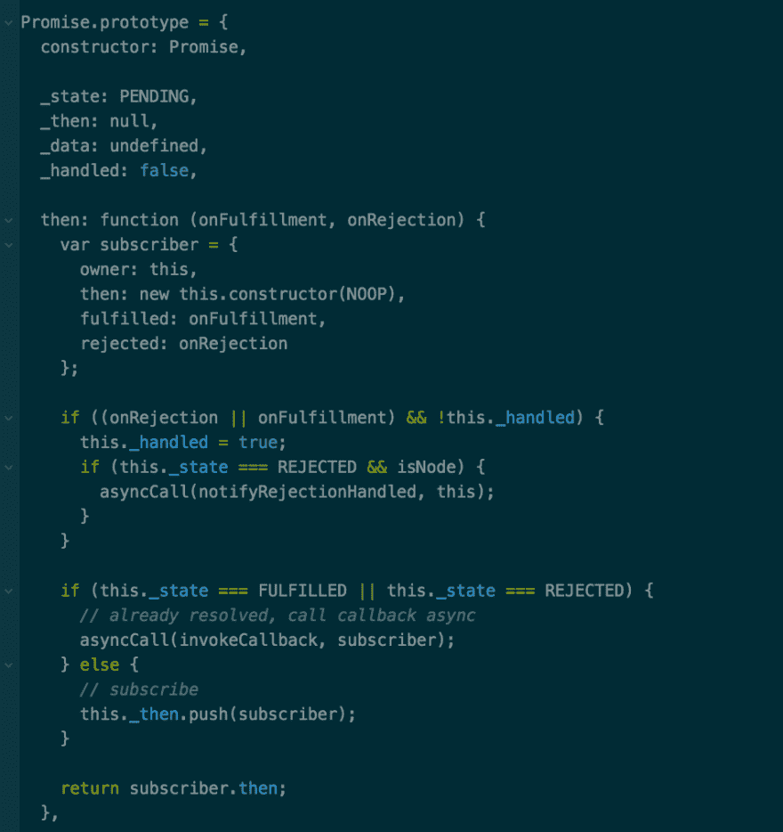

# 概念到实现:承诺

> 原文：<https://dev.to/theopensourceu/concepts-to-implementations-promise-46d8>

> [T2】](https://res.cloudinary.com/practicaldev/image/fetch/s--O4-9Ij7c--/c_limit%2Cf_auto%2Cfl_progressive%2Cq_auto%2Cw_880/https://theopensourceu.org/conteimg/2017/08/Screen-Shot-2017-08-23-at-9.23.31-PM.png)
> 
> Promise 对象表示异步操作的最终完成(或失败)及其结果值。

-MDN

简单来说<sup>[【1】](#fn1)</sup>，它是一种重组异步(并发执行)代码的手段，以减少嵌套等原因。

在接下来的几篇文章中，我将简要介绍什么是 promise 以及如何使用它，但是这篇文章的主要目的是理解 Promise 库是如何实现的。不久前，我翻阅了 [Pinkie](https://github.com/floatdrop/pinkie) 的源代码，它似乎是一篇很好的文章候选。

## [为什么用一个？](https://theopensourceu.org/concepts-to-implementations-promise/#whyuseone)

不涉及太多细节，它们用于避免“[回调地狱](http://callbackhell.com/)”以及创建一个更熟悉的代码流(`try/catch`)。模式。这里有一个虚构但伪真实的例子:

```
// require statements omitted for readability and brevity.
function processData( startingData, cbResult ) {
  //
  // Do something with startingData and ultimatly set result to finalizedResult.
  // ...
  var finalizedResult = startingData;
  cbResult(finalizedResult);
} 

function parentMethod() {
  fs.readFile('/my/made/up/file.txt', function callback1(err, data) {
    if(err) throw err;
    processData( data, function callback2(results) {
      sendResultToServer(result, function callback3(response) {
        executionOrderGetsConfusing(response);
      });
    });
  });
} 
```

一个承诺允许我们像这样重组代码:

```
//
// require statements omitted for readability and brevity.
var readFile = Promise.promisify(require("fs").readFile); //See http://bluebirdjs.com/docs/api/promise.promisify.html

function processData( startData ) {
  //Return a promise which impl will use "then" to implement what was "cbResult"
  return new Promise( function(resolve) {
    //
    // Do something with startingData and ultimatly set result to finalizedResult.
    // ...
    var finalizedResult = startingData;
    return finalizedResult; //Returning something makes it available in chained 'then' statements.
  } );
}

function parentMethod() {
  readFile('/my/made/up/file.txt')
    .then(function callback1(data) {    //Note that (data) => {} is a newer way of defining a function in JS. 
      return processData( data );       //Not available everywhere yet though. Equiv. to function(data) {}
    })
    .then(function callback2(results) {
      return sendResultsToServer(result);
    })
    .then(function callback3(response) {
      executionOrderIsClearer(); //as well as where each method starts and ends.
    })
    .catch(function(err) {
      // Handle errors from the readFile to callback3\. 
      // Like wraping the above in a try/catch
    });
} 
```

在更高的版本中似乎有更多的代码，因为，我想，确实有。使用承诺不会减少代码。它使流动更加明显。我相信这一点在这里已经实现了。您现在可以更清楚地看到执行的顺序。每个`then`语句必须在前一个`then`语句之前完成，如果出现错误，`catch(function(er){})`会出面调解，让您优雅地处理错误。

## 更多例子

JavaScript 中的承诺已经变得非常普遍。如果你想看更多的例子或承诺的实际应用，pg-promise 库有很好的最新例子，既清晰又真实。库本身是节点的 PostgreSQL 接口。

### 接下来

在下一篇文章中，我们将通过剖析名为 Pinkie 的 Floatdrop 的实现来看看 promise 库是如何实现的。小型 ES2015 有望实现。

* * *

1.  过于简单，但适合我们的目的。 [↩︎](#fnref1)