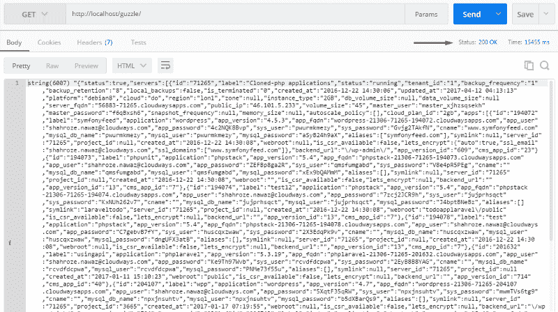

# 用 Guzzle 在 PHP 中使用 Restful API

> 原文：<https://dev.to/_shahroznawaz/consuming-restful-api-in-php-with-guzzle>

*最初发布于[HackerNoon.com](https://hackernoon.com/creating-rest-api-in-php-using-guzzle-d6a890499b02)2017 年 4 月 18 日*

如果您熟悉 Rest API，那么您一定知道为从客户机获取数据和向服务器发送数据而创建的 HTTP 调用。如果您希望用 PHP 创建一个 REST API 客户端，该怎么办？你的答案是用旋度。CURL 是最广泛使用的进行 HTTP 调用的方法，但是它包含几个复杂的步骤。

让我们看看 PHP 中一个简单的 CURL 请求:

```
$url = “https://api.cloudways.com/api/v1”
$resource = curl_init($url);
curl_setopt($ch, CURLOPT_HTTPHEADER, [‘Accept:application/json, Content-Type:application/json’]);
curl_setopt($ch, CURLOPT_CUSTOMREQUEST, ‘GET’); 
```

您需要调用 curl_setopt()方法来定义头部和特定的 HTTP 动词，如 GET、POST、PUT 等。看起来确实很复杂。那么，什么是更好、更强大的替代方案呢？

狂饮者来了。

让我们看看 Guzzle 是如何创建请求的:

```
$client = new GuzzleHttp\Client();
$res = $client->request(‘GET’, ‘https://api.cloudways.com/api/v1’, [
‘headers’ => [
‘Accept’ => ‘application/json’,
‘Content-type’ => ‘application/json’
]]) 
```

忘记 BFCM 吧！今年夏天节省、扩展并赢得 Cloudways 赠品！(赠品)

你会发现这很简单。您只需要初始化 Guzzle 客户端，并给出 HTTP 动词和一个 URL。之后，传递头部数组和其他选项。

## 了解狂饮客户

Guzzle 是一个简单 PHP HTTP 客户端，它提供了一个创建调用和集成 web 服务的简单方法。它是 API 用来通过服务器发送消息的标准抽象层。Guzzle 的几个突出特点是:

*   Guzzle 可以发送同步和异步请求。
*   它提供了一个简单的接口来构建查询字符串、POST 请求
*   流式大规模上传和下载，上传 JSON 数据等。
*   允许使用与 Guzzle 兼容的其他 PSR7 库。
*   允许您编写与环境和传输无关的代码。
*   中间件系统允许您增加和组合客户端行为。

## 在 PHP 中安装 Guzzle

安装 Guzzle 的首选方式是 Composer。如果您还没有安装 Composer，请从这里下载。现在要安装 Guzzle，请在 SSH 终端中运行以下命令:

`composer require guzzlehttp/guzzle`

这个命令将在你的 PHP 项目中安装最新版本的 Guzzle。或者，您也可以在 composer.json 文件中将其定义为一个依赖项，并在其中添加以下代码。

```
{
 “require”: {
 “guzzlehttp/guzzle”: “~6.0”
 }
} 
```

之后，运行 composer install 命令。最后，您需要要求自动加载程序，并添加一些更多的文件来使用 Guzzle:

```
require ‘vendor/autoload.php’;
use GuzzleHttp\Client;
use GuzzleHttp\Exception\RequestException;
use GuzzleHttp\Psr7\Request; 
```

安装过程已经结束，现在是时候使用一个用 API 创建 HTTP 调用的真实例子了。出于本文的目的，我将使用 [Cloudways API](https://developers.cloudways.com/) 。

## 你能用 Cloudways API 做什么

Cloudways 是 PHP、Magento、WordPress 和许多其他框架和 CMS 的托管提供商。它有一个 API，可以用来在服务器和应用程序上执行 CRUD 操作。查看 Cloudways API 的流行用例，看看如何将它集成到您的项目中。

在本文中，我将创建 HTTP 调用来在 Cloudways 服务器上使用 Guzzle 执行特定的操作。

## 在 Guzzle 中创建 HTTP 请求

正如我前面提到的，在 Guzzle 中创建 HTTP 请求非常容易；您只需要传递基本 URI、HTTP 谓词和头。如果外部 API 中有认证层，也可以在 Guzzle 中传递这些参数。类似地，Cloudways API 需要电子邮件和 API 密钥来认证用户并发送响应。你需要[注册一个 Cloudways 账户](https://platform.cloudways.com/)来获得你的 API 证书。

让我们首先创建一个 CloudwaysAPIClient.php 文件来设置用于进行 HTTP 调用的 Guzzle。我还将创建一个类和几个使用 HTTP 调用的方法。

API 的 URL 没有改变，所以我将对它使用 const 数据类型。稍后，我将把它与其他 URL 后缀连接起来以获得响应。此外，我还声明了变量$auth_key，$auth_email，它将保存身份验证电子邮件和 API 密钥。$accessToken 将保存临时令牌，该令牌将在每次更新。

```
Class CloudwaysAPIClient
{
private $client = null;
const API_URL = “https://api.cloudways.com/api/v1";
var $auth_key;
var $auth_email;
var $accessToken;
public function __construct($email,$key)
{
$this->auth_email = $email;
$this->auth_key = $key;
$this->client = new Client();
}
} 
```

## 创建 Post 请求以获取访问令牌

每次我访问 API 时，都会从这个 URL:**[【https://api.cloudways.com/api/v1/oauth/access_token】](https://api.cloudways.com/api/v1/oauth/access_token)**生成访问令牌。这将在$url 中设置，并带有保存身份验证凭证的附加数据数组。后来，我用基本 URL 和查询字符串创建了一个 POST 请求。将对响应进行解码，并保存访问令牌以在方法中使用。

```
public function prepare_access_token()
{
try
{
$url = self::API_URL . “/oauth/access_token”;
$data = [‘email’ => $this->auth_email,’api_key’ => $this->auth_key];
$response = $this->client->post($url, [‘query’ => $data]);
$result = json_decode($response->getBody()->getContents());
$this->accessToken = $result->access_token;
}
catch (RequestException $e)
{
$response = $this->StatusCodeHandling($e);
return $response;
}
} 
```

这里完成了获取访问令牌的 POST 请求。此外，如果您在异常处理中观察到，我声明了一个方法 StatusCodeHandling($e)，它将处理响应代码(HTTP 代码，如 404、401、200 等)，并抛出一个相关的异常。

```
public function StatusCodeHandling($e)
{
if ($e->getResponse()->getStatusCode() == ‘400’)
{
$this->prepare_access_token();
}
elseif ($e->getResponse()->getStatusCode() == ‘422’)
{
$response = json_decode($e->getResponse()->getBody(true)->getContents());
return $response;
}
elseif ($e->getResponse()->getStatusCode() == ‘500’)
{
$response = json_decode($e->getResponse()->getBody(true)->getContents());
return $response;
}
elseif ($e->getResponse()->getStatusCode() == ‘401’)
{
$response = json_decode($e->getResponse()->getBody(true)->getContents());
return $response;
}
elseif ($e->getResponse()->getStatusCode() == ‘403’)
{
$response = json_decode($e->getResponse()->getBody(true)->getContents());
return $response;
}
else
{
$response = json_decode($e->getResponse()->getBody(true)->getContents());
return $response;
}
} 
```

主客户端类现在已经完成。我将扩展它，为不同的情况创建更多的 HTTP 请求。

## 创建一个获取请求来获取所有服务器

一旦用户通过身份验证，我就可以从 Cloudways 获取我所有的服务器和应用程序。/server 是与基本 URI 连接的后缀。这一次，我将在 Guzzle 头中附加带有授权字符串的 accessToken，以获取 JSON 响应中的所有服务器。为此，创建一个新方法:

```
Public function get_servers()
{
try
{
$url = self::API_URL . “/server”;
$option = array(‘exceptions’ => false);
$header = array(‘Authorization’=>’Bearer ‘ . $this->accessToken);
$response = $this->client->get($url, array(‘headers’ => $header));
$result = $response->getBody()->getContents();
return $result;
}
catch (RequestException $e)
{
$response = $this->StatusCodeHandling($e);
return $response;
}
} 
```

现在创建**index.php**文件，并在顶部包含**CloudwaysAPIClient.php**。接下来，我将声明我的 API 键和电子邮件，将其传递给类构造函数，以最终获得服务器。

```
include ‘CloudwaysAPIClient.php’;
$api_key = ‘W9bqKxxxxxxxxxxxxxxxxxxxjEfY0’;
$email = ‘shahroze.nawaz@cloudways.com’;
$cw_api = new CloudwaysAPIClient($email,$api_key);
$servers = $cw_api->get_servers();
echo ‘<pre>’;
var_dump($servers);
echo ‘</pre>’; 
```

让我们在 Postman 中测试它，以验证信息和正确的响应代码正在被获取。

[T2】](https://res.cloudinary.com/practicaldev/image/fetch/s--BEj_XQFJ--/c_limit%2Cf_auto%2Cfl_progressive%2Cq_auto%2Cw_880/https://cdn-images-1.medium.com/max/800/1%2A67IO8OPa2CqVN_XOBdff8Q.png)

因此，我托管在 Cloudways 平台上的所有服务器都将被获取。类似地，您可以使用 HTTP 调用创建新的方法来获取应用程序、服务器设置、服务等。

让我们创建一个 PUT 调用来改变当前被克隆的服务器——PHP 应用程序的标签。但是首先，我需要获得服务器 ID & label，因为这个信息将被用作参数。要获取服务器 ID，请在 index.php 文件中创建一个 foreach 循环:

```
foreach($servers->servers as $server){
echo $server->id;
echo $server->label;
} 
```

现在，如果我点击 API，它将获取服务器 id 和标签。

[T2】](https://res.cloudinary.com/practicaldev/image/fetch/s--LEAZL6W8--/c_limit%2Cf_auto%2Cfl_progressive%2Cq_auto%2Cw_880/https://cdn-images-1.medium.com/max/800/1%2A-lpI1dadZj_Q51Hs2Y2NrA.png)

## 创建一个 PUT 请求来改变服务器标签

现在要更改服务器标签，我需要在 Guzzle 中创建一个 PUT 调用。我将用一个新方法扩展这个类。记住，服务器 id 和标签是将在方法中传递的两个必要参数。

```
public function changelabel($serverid,$label)
{
try
{
$url = self::API_URL . “/server/$serverid”;
$data = [‘server_id’ => $serverid,’label’ => $label];
$header = array(‘Authorization’=>’Bearer ‘ . $this->accessToken);
$response = $this->client->put($url, array(‘query’ => $data,’headers’ => $header));
return json_decode($response->getBody()->getContents());
}
catch (RequestException $e)
{
$response = $this->StatusCodeHandling($e);
return $response;
}
} 
```

现在在**index.php**中，把这个条件放在 **foreach** 循环下面。

```
if($server->id == ‘71265’ && $server->label == ‘Cloned-php applications’){
$label = ‘Cloudways Server’;
$changelabel = $cw_api->changelabel($server->id,$label);
} 
```

当在 Postman 中测试时，我将获得更新的服务器标签。

[T2】](https://res.cloudinary.com/practicaldev/image/fetch/s--qTAsAIyE--/c_limit%2Cf_auto%2Cfl_progressive%2Cq_auto%2Cw_880/https://cdn-images-1.medium.com/max/800/1%2A3ZDP0TnRK57UEb1SW2oETA.png)

## 创建删除请求以删除服务器

要使用 Cloudways API 删除服务器，我需要通过下面的方法在 Guzzle 中创建一个 **Delete** 请求。这与上面的方法非常相似，因为它也需要两个参数，服务器 id 和标签。

```
public function deleteServer($serverid,$label)
{
try
{
$url = self::API_URL . “/server/$serverid”;
$data = [‘server_id’ => $serverid,’label’ => $label];
$header = array(‘Authorization’=>’Bearer ‘ . $this->accessToken);
$response = $this->client->delete($url, array(‘query’ => $data,’headers’ => $header));
return json_decode($response->getBody()->getContents());
}
catch (RequestException $e)
{
$response = $this->StatusCodeHandling($e);
return $response;
}
} 
```

在 Postman 中尝试一下，或者刷新页面。该服务器将被删除。

## 最后的话

Guzzle 是一个灵活的 HTTP 客户端，您可以根据自己的需求进行扩展。您还可以尝试上传数据、表单域、cookies、重定向和异常的新想法。您还可以为身份验证层创建中间件(如果需要)。总而言之，Guzzle 是在 PHP 中创建 REST API 的一个很好的选择，不需要使用任何框架。

如果您有任何问题或疑问，可以在下面评论。